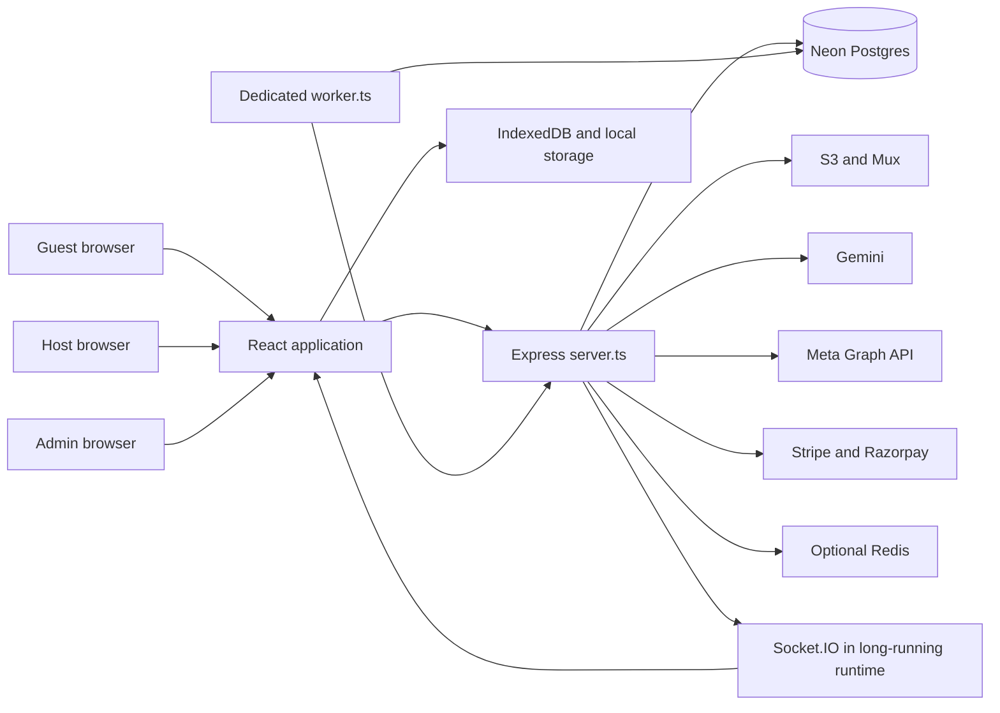

# HARVO

**Encho's living project understanding and boardroom blueprint**

Version 0.15 · Updated 13 September 2026 · Owner: Founder · Maintainer: project engineering assistant

**Phase: 3 — Execution, explicitly authorized by the founder in discussion 010, with continuous execution authorized in discussion 011.** Current marketing track: [HARVO marketing execution plan](docs/implementation/HARVO_MARKETING_EXECUTION_PLAN.md). M1, M2, M3, M7 and M8 are locally verified: 50% by milestone count. M4, M5, M6 and M9 remain partial; M10 has not run. The earlier one-milestone-per-response restriction was superseded by HARVO-013. This does not clear legal/provider gates, accept guest milestones or certify live advertising. Historical ratings remain in sections 29–31; current execution evidence is recorded in section 32.

## 1. Read this first

Encho's intended product is an India-first stays marketplace with one account for guests and hosts, supported by an optional managed advertising service. The host supplies the accommodation; Encho helps customers discover, book, pay, communicate, and resolve problems. Encho earns host booking commission or a property subscription, plus a separately disclosed advertising management fee.

**The local project is not presently demonstrated ready for a public paid-stays launch.** There is substantial implementation, including relational room/media work, transactional inventory holds, campaign publishing/reconciliation, and detailed host/admin surfaces. The continuous marketing execution corrected scoped identity, financial-boundary and delivery-truth defects. Remaining integration, deployment, provider, checkout and operating acceptance dependencies are recorded in [CONTINUOUS_EXECUTION_VERIFICATION.md](docs/harvo/CONTINUOUS_EXECUTION_VERIFICATION.md). Earlier guest test failures and unreviewed legacy areas are not silently accepted by the marketing suite. No production incident or live success is inferred.

**Historical paid-funnel assessment:** Section 29 evaluated the earlier GitHub → Vercel deployment snapshot at **2/10 launch readiness**, a provisional engineering judgment. Required database tables were absent in the last configured-database inspection; the current Vercel configuration does not start the required marketing worker; live configuration, settlement, conversion and pilot evidence remain incomplete. Discussion 007's [paid campaign audit](docs/harvo/PAID_CAMPAIGN_AUDIT.md) is historical defect evidence. Its synthetic analytics and approval/payment bypass observations must not be attributed to the replacement v2 workflow without checking the current remediation record.

**Latest acquisition strategy:** [Booking growth research](docs/harvo/BOOKING_GROWTH_RESEARCH.md), discussion 008, develops Google Search/Hotel distribution, Meta creative, bounded AI optimization, causal measurement and host/admin experience. Centralized operation does not automatically permit combining independent advertisers in one Google ad-serving account. New Google source findings H-048–H-052 further qualify readiness. No booking-lift guarantee, implementation approval or phase transition is implied.

**Conditional readiness target:** Discussion 009 estimates approximately 8/10 for a bounded first production launch after full implementation and independent pre-release verification, and approximately 9/10 only after representative controlled production evidence. These are proposed engineering judgments, not achieved ratings, success probabilities or booking forecasts. This historical rating is not a new score for later source changes. Unresolved critical money/security/provider/booking gates prevent launch regardless of other scores.

**Previous verified implementation snapshot:** Continuous execution connected revision-bound host/admin studios, AI/human review, cost-plus finance, genuine Meta/Google transports, separate paused creation/activation, durable fenced workers and truthful observations. The final scoped suite passed 591 tests and browser verification passed 29 checks; client/server builds and project typechecking passed within their documented limits. All provider/payment success evidence is isolated local fixture evidence; no live ad was created. See [CONTINUOUS_EXECUTION_VERIFICATION.md](docs/harvo/CONTINUOUS_EXECUTION_VERIFICATION.md). Historical source observations below retain their original snapshot context.

**Hosting:** Section 30 proposed Render web/API plus a separate HARVO worker, retaining Neon and S3. The founder now reports hosting/configuration completed; the deployed artifact and environment have not been observed in this execution. Packaging defects were corrected in [deployment hardening](docs/harvo/DEPLOYMENT_HARDENING.md); Linux/container and deployed acceptance remain separate from local builds.

**Conditional post-hosting assessment:** Section 31 estimates approximately 5/10 if hosting, packaging, migrations/roles and configuration are correctly completed while recorded functional/acceptance gaps remain; approximately 8/10 is a conditional limited-launch target only after the remaining critical integrations and live acceptance pass. These hypothetical judgments do not change verified milestone status or establish that a deployment occurred.

**Review honesty:** This is a detailed architecture and critical-flow baseline, not a completed semantic review of every line. The initial structural inventory covered 948 selected first-party files and 148,590 lines, including 146 application files / 93,087 lines. Every included text file was processed for its inventory; selected critical paths were read in detail. Hundreds of maintenance scripts, large UI branches, and substantial service/test code remain structurally indexed rather than fully reviewed. The exact limits and next review batches are in [REVIEW_COVERAGE.md](docs/harvo/REVIEW_COVERAGE.md). Do not describe HARVO v0.1 as a complete line-by-line audit.

This workspace has no discoverable Git repository at its root. File hashes identify the inspected snapshots; a commit/deployed-version match is unknown. A read-only configured-database schema/role inspection was completed during continuous execution; no customer rows, secret values, live payment success or live delivery evidence were inspected. No remote schema or data was changed. The initial audit was read-only; subsequent authorized execution changed scoped application code. The final 91-file source manifest and verification report identify the locally verified implementation.

### Evidence labels

| Label | Meaning |
|---|---|
| APPROVED | An existing controlling document or explicit founder decision establishes intent. It does not prove implementation. |
| SOURCE VERIFIED | Behavior or structure is visible in the inspected source at the linked location. |
| TEST OBSERVED | An explicitly identified local test/build was run and its result recorded. |
| HISTORICAL CLAIM | A prior document says something was completed/certified. Its scope and current applicability still require verification. |
| PROPOSED | A boardroom recommendation awaiting a decision. |
| UNKNOWN | Evidence was unavailable or the relevant work has not been inspected. |
| BLOCKED | An existing legal, provider, or founder gate prevents execution. |

## 2. HARVO's role and maintenance rules

Read the [Engineering Constitution](docs/ENCHO_ENGINEERING_CONSTITUTION.md) first, then HARVO and the controlling domain decision register. HARVO is the cross-project understanding layer. It does not silently supersede the Constitution or the [Guest Booking Decision Register](docs/blueprints/GUEST_BOOKING_DECISION_REGISTER.md).

The founder explicitly authorized HARVO to evolve with new evidence and discussion. Update its current understanding when facts change. Preserve why the understanding changed in [DECISIONS.md](docs/harvo/DECISIONS.md); mark previous positions superseded instead of erasing decision history. Record disagreement and open questions without treating them as approval. Update approved architecture documents through the existing operating protocol when an architectural change is actually authorized and implemented.

For each meaningful discussion or finding:

1. Record the concrete statement, evidence/date, status, and affected customer/host/admin flows.
2. Distinguish a founder decision from an assistant recommendation or hypothesis.
3. Update the relevant HARVO section and decision/assumption register.
4. Recheck source evidence before using an old finding to prescribe a code change.
5. Record validation and remaining uncertainty. Close findings only with relevant verification.

No automatic background maintenance is implied. Update HARVO during active work and discussions in this workspace. The startup instruction in `AGENTS.md` makes it discoverable in future sessions.

### Boardroom working agreement — reaffirmed by founder

Throughout discussion and the eventual authorized production upgrade, evaluate Encho Space through business strategy, investment, marketing, operations, engineering and customer/host behavior. Challenge weak assumptions directly; explain disagreements with evidence and practical alternatives. Critique ideas rather than the founder. Humor is welcome, but harshness is not evidence. Ratings, when useful, must state their criteria and uncertainties; do not invent precision or validate an idea because the founder likes it.

Maintain HARVO as the evolving discussion record, preserving approved decisions, proposals, open questions and superseded reasoning. Correct the assistant's own claims when evidence changes. These analytical perspectives do not imply actual professional credentials or replace existing specialist sign-off gates. The renewed role instruction does not change the current Boardroom phase or authorize production implementation. The advertising percentage base was resolved in discussion 006: markup on defined campaign costs. Exact cost/tax scope remains open.

## 3. Goal, customer promise, and product boundaries

### Approved direction

- Public brand: **Encho Stays**; initial geography: **India domestic stays**.
- One account can book as a guest and manage listings as a host. Admin is a privileged authority, not a separate host account model.
- Host remains the accommodation supplier; Encho is the disclosed marketplace/collection agent.
- Guests pay neither Encho booking commission nor a gateway surcharge.
- Hosts choose Flex or Growth under the approved commercial rules below.
- Advertising is optional and separate from booking charges.
- Actual accommodation, approved media, truthful reviews, location privacy, captured-payment evidence, and accountable refunds/payouts are core promises.
- Experiences, international guest checkout, Google Ads expansion, and advanced retargeting are outside the active India stays transformation.

### Proposed outcome to optimize

**Guests should receive the stay they understood they were buying, at the accepted total, with reliable help when something goes wrong. Hosts should receive profitable, fulfilled bookings, accurate availability, and explainable payouts.**

Proposed north-star metric: completed, undisputed stay nights with reconciled payment and payout, accompanied by positive host and platform contribution. Booking count alone encourages low-quality supply; ad clicks alone reward spend without proving a stay happened. Track both volume and economics rather than compressing them into one score.

### Scope reality

The repository also contains experiences, a traveler lobby, social publishing, SEO tooling, marketing campaigns, lead scoring, payment wallets, custom media experiences, and several generations of listing/checkout code. Their presence does not put them inside the launch scope. Shipping all visible surfaces would create a much wider business and support obligation than the accepted India stays plan.

The correct strategic question is which guest need and host segment Encho can serve reliably in one market. This has not been answered by current traction evidence. Wayanad/Kerala appears frequently in UI examples; that is not proof of a founder-approved launch market or live supply.

## 4. Commercial model and unresolved arithmetic

| Product | Approved intent | Implementation status in this review |
|---|---|---|
| Flex | Default 15% host booking commission, admin-configurable and snapshotted at booking confirmation | Decision approved; canonical settlement/quote engine remains M5-blocked. Legacy payment settings and guest fee code conflict. |
| Growth | ₹4,999 plus applicable GST per property per rolling 30 days; 0% commission for bookings confirmed during an active term | Decision approved; end-to-end billing, snapshot, and settlement behavior not established by this review. |
| Growth extension | Active term extends by 30 days from its expiration; otherwise starts at successful activation | Approved decision, not proof of a shipped subscription lifecycle. |
| Advertising | Recover defined campaign costs C plus admin-selected profit markup p on those costs: profit = C × p; charge = C × (1 + p). Intended introductory rate 3–5%; exact cost/tax treatment still to specify | Replaces the fixed 15% advertising-fee direction prospectively. Existing code/contracts/live rates unchanged. See section 23. |
| Standard payout | Initiation 24 hours after verified check-in, subject to the approved verification/payout mechanisms | Mechanism and payout rail remain gated; no claim of actual banking timing. |
| Risk reserve | Default 10% for 30 days for designated high-risk hosts; configurable; deficit recovery rules apply | Approved commercial intent, not a certified production reserve ledger. |

**Advertising arithmetic conflict, excluding tax:** With media spend `A = ₹10,000`, the approved additive fee is `0.15 × A = ₹1,500`, giving a charge of `₹11,500`. At the same gross charge, the current 15%-of-gross split yields `₹1,725` in fees and `₹9,775` in media. Equivalently, taking ₹15 out of a ₹100 deposit is a 17.647% markup on the ₹85 of media. These descriptions cannot be used interchangeably. Evidence: `server.ts:getOrEstablishFinancialContract` around line 8490 and the older strategy document's $100 example.

The preceding arithmetic documents the historical additive-versus-gross-split conflict. Discussion 005 now selects a different future business direction: expense recovery plus an admin-selected campaign profit target. Historical contracts, top-ups, taxes, refunds and displayed budgets still need an explicit migration decision before implementation; the new direction does not retroactively change them.

**Current founder decision (discussion 006):** The 3–5% is profit calculated on defined campaign costs, after recovering those costs. It is a markup on costs, not a margin on the total charge. Separate Flex booking commission remains. Exact recognized cost/tax scope still needs specification. Sections 21–22 preserve discussion history; section 23 states the selected formula.

### Illustrative economics, not forecasts

Let `G` be the approved commissionable booking base, `c` the snapshotted Flex rate, `A` media spend, `n` bookings serviced for a Growth property during its term, and `K` the platform's variable costs per serviced booking.

| Measure | Simplified pre-tax expression |
|---|---|
| Flex booking revenue | `c × G` |
| Historical advertising management revenue | `0.15 × A`; superseded as the future pricing direction by discussion 005, whose final formula remains to be selected |
| Growth revenue per serviced booking | `4999 / n` |
| Platform contribution | Commission + recognized subscription revenue + ad management fee − gateway fees − support/moderation − AI/media − refund/fraud losses − acquisition costs borne by Encho |
| Host contribution | Accommodation proceeds − platform commission/subscription allocation − ad spend and ad fee − property variable fulfillment costs − refunds/other host costs |

Growth's simple host fee break-even against 15% Flex is `4999 / 0.15 = ₹33,326.67` of commissionable booking value per term, ignoring taxes and different service costs. This is arithmetic, not a financial recommendation or a final tax-inclusive comparison. The approved definition of commissionable value must remain explicit.

The business risk is selection: higher-volume properties have the strongest incentive to buy Growth, while Encho continues to bear gateway, support, fraud and refund costs. A ₹4,999 subscription is not automatically sustainable for unlimited booking volume. Model volume bands before promoting it aggressively; any pricing alteration requires a founder decision.

Host-funded ads can produce two Encho charges: ad management and Flex booking commission. Explain both before funding. Host ROAS must be based on actual attributed accommodation revenue, clearly separated from estimated lead value and net contribution. Attribution does not establish incrementality; some attributed customers would have booked anyway.

## 5. Current business reality

### What is known

There is a large local implementation and extensive historical documentation. The active stays plan is incomplete. The production stay-checkout compliance gate is present in the newer checkout paths. Targeted current tests fail. The old strategy document's assertion that all components are synced and production-verified cannot be carried forward as current fact.

### What remains unknown

| Required founder/business evidence | Current status | Why it changes decisions |
|---|---|---|
| Actual launch/deployment status and source version | UNKNOWN | Determines whether findings are local debt or urgent live exposure. |
| Number of contracted, verified, bookable properties/room types | UNKNOWN | Determines real supply and whether marketplace choice exists. |
| Active hosts and fulfilled paid bookings | UNKNOWN | Separates implementation from demand and operational traction. |
| GMV, recognized revenue, refunds, cancellations and disputes | UNKNOWN | Required to assess contribution and trust. |
| Monthly burn, available runway and founder/team capacity | UNKNOWN | Determines how much scope is affordable. |
| First destination and guest segment | UNKNOWN | Needed for supply quality, acquisition channels and support design. |
| Live ad spend, captured funding and incremental booking return | UNKNOWN | Needed to justify the marketing engine. |
| Merchant approvals, payout rails and tax/legal sign-off | UNKNOWN here; documented gates remain BLOCKED | Needed before booking-money activation. |
| Support coverage and property check-in escalation owner | UNKNOWN | A hospitality product requires someone accountable when arrival fails. |

The founder was asked for these business inputs during the initial review. No figures have been inferred from seeds, examples, test fixtures, historical ad IDs, or screenshots mentioned by old documents.

The earlier “6.5/10 idea” and survival probabilities (15–20%, then 75% with safeguards) have no validated model in the inspected materials. Treat them as historical opinions, not investment evidence. HARVO does not assign a new numerical business rating without data.

### Competitive reality checked 13 September 2026

- Airbnb already documents host-only fee structures; “no guest platform fee” alone is not a unique advantage. Fee structures vary, so do not advertise a universal competitor rate. [Airbnb service fees](https://www.airbnb.com/help/article/1857).
- Guesty markets direct booking websites, a booking engine, guest communication and Google Vacation Rentals distribution. Encho competes with the host's existing distribution and operations workflow, not merely a website builder. [Guesty direct reservations](https://www.guesty.com/features/direct-reservations/).
- StayFi offers managed email marketing intended to turn guest data into direct bookings. The earlier description of it as only Wi-Fi capture understates its current marketing offering. [StayFi managed email marketing](https://stayfi.com/vrm-insider/2026/05/19/meet-stayfi-managed-email-marketing/).

**Inference:** Encho's possible advantage is the combined service—trusted local supply, useful guest discovery, dependable reservation operations, and measurable profitable demand generation. AI copy, luxury graphics and an ad dashboard are individually reproducible. This inference requires customer interviews and real cohort results; current sources do not prove product-market fit.

## 6. Existing system map

This is a source dependency picture, not a verified deployment topology. The worker imports functions from the large server module; it is not an independent service boundary. Vercel and container configurations coexist. There is no `.openai/hosting.json` identifying this checkout as a registered Site. Sites was inspected for applicability; no new Site or deployment was created.

| Layer | Source and role | Important qualification |
|---|---|---|
| Entry | `index.tsx`, `App.tsx`, contexts and error boundaries | React/Vite application with custom view state/history; no conventional route framework establishes all flows. |
| Guest presentation | `ListingCard`, `FilterBar`, `MapSidebar`, `ListingDetailsNew`, gallery/video components | Large cinematic surface; current fabricated fallbacks violate truth contract. |
| Legacy presentation | `ListingDetails`, `BookingPage`, older checkout paths | Still present, imported/bundled; retirement needs reachable-flow evidence. |
| Host | `HostDashboard`, `HostForm`, `HostCalendar`, inbox and marketing components | Stays and experiences both exist; eight-step builder and multiple save paths. |
| Admin | `AdminDashboard`, ops/control/financial/trace panels | Property moderation and ad operations coexist; authorization must be server-enforced. |
| API | `server.ts` — 20,678 lines at baseline | Auth, schemas, business workflows, integrations and background tasks in one file; `@ts-nocheck` suppresses important checking. |
| Stays domain | `src/lib/stayProjection.ts`, `src/services/inventoryHoldService.ts`, migrations 001–007 | Newer privacy and relational inventory mechanisms coexist with older paths. |
| Advertising domain | Canonical truth, delivery reducer, control plane, external sync, telemetry, DCO, provider modules | More developed decomposition; integration truth is inconsistent across adjacent legacy services. |
| Persistence | `pg` main/read pools; some services create their own pools | Declared SQL is not evidence of deployed schema/RLS. |
| Media | S3 uploads, Sharp processing, Mux video; FFmpeg dependencies | Real adapters exist; upload ownership, limits, remote-fetch safety and takedown require deeper audit. |
| Offline/PWA | `lib/syncService.ts`, `src/lib/syncService.ts`, `lib/syncHandlers.ts`, Vite Workbox | Multiple cache/queue implementations; broad POST replay is unsuitable as booking authority. |
| Operations | `worker.ts`, `Dockerfile.worker`, Vercel routes/cron, health/metrics/log services | Worker activation, import side effects, single ownership and deployed cutover status remain unverified. |

Initial structural map: 232 Express route registrations, including array-based aliases. Duplicate `GET /api/admin/metrics` and `POST /api/admin/marketing/campaigns/:id/resync-meta` registrations need handler-order analysis. These are registration counts, not unique endpoints. [Complete extracted API map](docs/harvo/API_MAP.md).

## 7. Guest journey: present vs required

| Stage | Current implementation | Required customer truth |
|---|---|---|
| Discover | Search/filter/map/catalogue cards; custom App state and fetch/caching | Relevant available stays, honest location/price/media, clear room vs whole-property offer. |
| Inspect | `/stay/:slug` loads `/api/v2/stays/:slug`; canonical component additionally fetches older listing/calendar routes | One public projection; approved room-specific photos; no invented amenities, prices, ratings or trust labels. |
| Choose | Client room tiers, guest counts, dates and calendar occupancy calculations | Canonical room identity; valid occupancy/minimum stay; dates expressed as occupied nights. |
| Hold | M4 API/service provides principal-bound transactional holds | UI must bind a real server-issued hold; no fake countdown/availability assurance. |
| Quote | Current component calculates fee/tax locally | M5 stored immutable quote after legal sign-off; guest accepts final amount explicitly. |
| Identity | Password, Google-profile and OTP paths exist | Verified identity before payment; server-validated identity proof and secure privilege assignment. |
| Pay | Newer production stay checkout blocks; older code remains | Razorpay order bound to quote, hold, principal, amount/currency and attempt. |
| Confirm | Legacy App path updates optimistically; BookingPage invents reference/access details | Server confirmation after authoritative captured payment and transactional inventory allocation. |
| Arrive | UI makes check-in/escrow promises | Actual verified arrival procedure, private directions only for authorized bookings, reachable support. |
| Manage/refund | Legacy status/cancellation handlers exist; canonical lifecycle not accepted | Versioned policy, durable refund obligation, reconciled execution and transparent timeline. |
| Review | Review APIs and display components exist | Reviews tied to eligible completed stays; zero reviews means “New on Encho Stays.” |

Razorpay distinguishes payment authorization from capture; possession of a checkout signature is not a substitute for the approved fulfillment checks. [Razorpay Payments APIs](https://razorpay.com/docs/api/payments/). This supports the existing captured-payment requirement; it does not approve Encho's unimplemented order/quote lifecycle.

### Particularly consequential customer contradictions

1. `ListingDetailsNew` adds a 15% guest-facing fee and 18% tax estimate, despite the zero-guest-commission decision and legal tax gate.
2. It appends stock images, creates fallback room tiers, shows invented verified reviews and unconditional host trust claims.
3. It fetches a public calendar response containing private booking details.
4. The legacy booking UI can present success before server success. The old server insert itself has 16 parameter positions and only 14 supplied values, so this review does **not** claim that route currently completes a real insertion.
5. A visually polished “instant confirmation” promise conflicts with the intentionally unavailable production stays checkout.

## 8. Host journey and admin parity

### Host listing workflow

The actual eight builder steps are Identity → Location → Rooms → Media → Amenities → Policies → SEO → Launch (`HostForm.tsx:28`). Hosts enter property/brand identity, exact private location, room pricing/capacity, media and safety/amenities, guidelines and pricing configuration, discovery metadata, and AI-assisted review.

Media upload uses presigned S3 URLs, a base64 fallback, and Mux upload/polling for video. Submission builds property-wide and room-specific photos, then posts/updates listings and separately saves draft data. The server has relational room/media writes, publication validation and admin media moderation. This is a valuable foundation, but its parallel representations and approval paths must agree.

Current pain points visible in source:

- New form defaults include sample luxury rooms and stock photos, so the product can manufacture listing content before the host provides evidence.
- Required nearby-POI behavior in step navigation increases onboarding work; the approved presentation contract treats nearby information as optional.
- `HostDashboard` combines reservation operations, experiences, calendar, messaging and marketing; some empty/error states collapse to empty arrays.
- The host calendar's private operational view is also used publicly by the guest component.
- The form and API mix mutable room tier strings with relational room IDs; labels must not become inventory identity.
- Draft save, live listing save and moderation outcomes need a visible, durable state that distinguishes saved from approved/published.

### Property feature parity register

| Data | Host surface | Guest surface | Admin surface | Review conclusion |
|---|---|---|---|---|
| Identity/description/brand | HostForm | ListingDetailsNew/cards | Admin listing editor | All surfaces exist; default content and projection correctness require remediation. |
| Room type, capacity, price | HostForm room builder | Room slides/cards and checkout handoff | Listing editor and rooms endpoint | Relational authority partially implemented; legacy room tiers persist. |
| Room-specific approved photos | Host upload/classification | Gallery and room slides | Media moderation endpoint/panels | M3 publication gate exists; current public fallback/visual tests expose gaps. |
| Exact address | Host location step | Must remain private; coarse location public | Admin operational access | Public projection protects some fields; calendar and free-text surfaces need full privacy tracing. |
| Amenities/safety/POIs/rules | Builder steps | Property details | Admin editing | Presence is not validation of claims; moderation and omission of unknowns needed. |
| Availability | HostCalendar and block routes | Current browser capacity calculation | Reservation operations | Canonical holds exist but cross-path consistency not demonstrated. |
| Quotes/taxes/payout terms | Future accepted financial configuration | Future M5/M6B disclosures | Future audit/settlement control | Blocked/unfinished, not an additional UI-only field. |

Any new property feature must still update guest, host, and admin areas. HARVO does not waive this rule.

### Proposed host-first improvement priorities

Make the next required action clear: finish missing photos, resolve moderation notes, update real availability, answer an inquiry, or inspect a payout. Show net proceeds and evidence-backed campaign outcomes. Let hosts pause optional spending easily and understand unspent balances. Explain errors as actions they can take; expose integration details in admin operations, not guest-facing flows.

Admin work should be prioritized by harm and time sensitivity: arrival failure, captured payment without inventory, refund overdue, private-data exposure, dangerous/misleading listing, then ad-quality improvements. Moderation throughput alone is not the operational objective.

## 9. Inventory, database and API understanding

### Existing canonical stays tables

| Table/domain | Intended authority |
|---|---|
| `listings` | Property ownership/content/publication and canonical slug. |
| `room_types` | Relational room identity, base price, occupancy, inventory and minimum stay. |
| `media_assets` | Room/property association, ordering, hero flag, moderation and sleeping-area evidence. |
| `backfill_conflict_records` | Durable problems converting legacy JSON into relational content. |
| `inventory_days` | One room type/date capacity: total, held, booked and blocked units. |
| `booking_holds` | Principal/idempotency/fingerprint-bound reservation hold with expiry. |
| `booking_hold_nights` | Per-night allocation for a hold. |
| `legacy_block_conflict_ledger` | Ambiguous/unmapped legacy calendar blocks requiring investigation. |
| `schema_migrations` | Ordered migration history with checksums. |

The hold service uses strict `[check_in, check_out)` semantics, ordered inventory locking, all-night capacity checks, a configured 10-minute default TTL, and owner/admin release logic. These are important mechanisms to preserve. Its presence does not prove the older booking routes or public UI participate in those same transactions.

There are source concerns even inside the accepted baseline: legacy block reconciliation can update rows before the advertised ordered lock; mapped blocks use `GREATEST(blocked_units,1)` rather than a demonstrated total allocation model; a conflict insert's `ON CONFLICT (dedupe_key)` does not express the predicate of the migration's partial unique index. These need real Postgres checks, not conclusions drawn from a mock suite. See findings H-018/H-019.

Migrations 001–007 add slugs, draft publication, relational room/media authority, constraints, inventory/holds and legacy mapping/dedupe. They assume pre-existing base tables; they are not a complete fresh-database schema. Several `NOT VALID` constraints require a later validation operation. The runner warns on checksum drift and skips an already-recorded migration rather than refusing drift.

The approved protocol prohibits runtime DDL, but `ensureListingsTable`, numerous handlers, and services still create/alter tables. A single-column fast check marks multiple schema groups initialized; this is not proof the whole database is migrated.

### Other database domains

- Identity and messaging: `users`, `threads`, `messages`, reviews and wishlists.
- Legacy stays/experiences: `bookings`, `room_calendar_blocks`, `calendar_prices`, `experiences`, `experience_bookings`.
- Marketing: `host_marketing_campaigns`, draft/social-post data, publishing transactions/events/traces, external truth, variants and optimization records.
- Money: `host_wallets`, `wallet_transactions`, `wallet_accounts`, `ledger_entries`, `ledger_lines`, campaign financial contracts and processed payment references.
- Async/operations: inbound/async webhook queues, DLQs, lead notification intents, worker leases, reconciliation incidents and metrics rollups.

Some helpers instead query `marketing_campaigns` or `campaigns`. Treat similarly named tables as separate until mappings, migrations and production usage are proven. They are not interchangeable aliases.

Planned `booking_quotes`, canonical payment-attempt/refund/payout obligations and associated immutable financial snapshots remain target architecture under the stays plan. Do not mark them implemented based on document headings or unrelated advertising ledgers.

### API contract map

The [full extracted API register](docs/harvo/API_MAP.md) preserves source locations and inline middleware. Main families are authentication, listings/drafts/rooms/media, canonical stays/holds, calendar/reservations, threads/messages, wishlists/reviews, experiences/lobby, AI content/targeting, campaigns/social posts/controls, payment/wallet/webhooks, admin operations, health/cron and tracking. Input/response contracts remain distributed across route code, TypeScript types, Zod schemas, tests and blueprints rather than a single OpenAPI document.

## 10. Marketing engine: what exists and what is not proven

The intended lifecycle is host draft → AI evaluation → human moderation → verified funding/escrow → safe external creation → explicit activation → externally verified delivery → metrics/leads → booking conversion and reconciliation.

The implementation has distinct kinds of state that must not be collapsed:

| State domain | Meaning |
|---|---|
| Local campaign FSM | Host/admin workflow: draft, pending, approval, escrow, publish, active, paused, failures and terminal states. |
| Publishing transaction | Progress/recovery around provider calls, unknown outcomes, rollback and quarantine. |
| External delivery reducer | What Meta currently reports about campaign/ad set/ad hierarchy, review and freshness. |
| Funding/escrow/contract | Captured host funding, authorized provider spend, fee and release permission. |
| DCO optimization | Whether sufficient measured evidence authorizes a creative change. |
| Lead lifecycle | Ingestion, prioritization, thread creation, response and conversion. |

Useful existing design: approval hashes, financial limits in minor units, trace/correlation IDs, safe paused object creation, explicit activation, reconciliation for uncertain external outcomes, host/admin projections, telemetry freshness, pause-source ownership and DCO threshold logic. These are assets to preserve, not grounds to rewrite the whole project.

Critical qualifications:

- The local campaign FSM allows an admin actor to bypass its transition table and catches event-write failure. Existing control-plane checks do not automatically make every caller safe.
- AI evaluation has a favorable static default that can remain after AI failure. A score must not be represented as an actual AI/policy pass when the evaluator did not complete.
- Notification intents use fabricated destinations; the default dispatcher logs and marks delivered without a real transport acknowledgement.
- Dynamic pricing “sync” writes local audit data but does not itself update and verify remote ad copy.
- The retargeting service labels dispatch based on credential presence without performing the advertised external send in that method.
- Calendar auto-pause compares the count of bookings with total room inventory without evaluating occupancy across the campaign's target nights. That is not the promised date-aware circuit breaker.
- Some services have durable leases; others leave crash/claim recovery or separate SELECT/UPDATE transaction boundaries unresolved.
- Google provider code exists but the server's Google dispatch path is explicitly contained. Presence of its adapter must not be advertised as a supported live product.

### Strategic interpretation of the master account

One managed account reduces host setup friction and centralizes operations. It also concentrates platform dependency and enforcement risk. Saying it “prevents one bad host from affecting everyone” reverses that tradeoff. AI and human checks can reduce the chance of bad content; they cannot guarantee an external platform will not restrict Encho. Retain the approved architecture while validating provider permission, operational limits, liability, monitoring and recovery in a separately authorized integration review.

The historical assumption that every hospitality campaign is governed by the same HOUSING category/targeting rules needs fresh, product/jurisdiction-specific Meta verification before live expansion. HARVO neither endorses nor changes that policy mapping.

## 11. Security and trust priorities

The detailed evidence is in [FINDINGS.md](docs/harvo/FINDINGS.md). These are source findings and local test results; they are not a claim that an attack occurred.

**Release blockers:** server-verified identity, privileged admin authorization, socket-room membership, private calendar data, honest property presentation, and canonical payment/booking containment. The most severe source findings include browser-trusted Google login, an OTP bypass, weak privileged payment checks, and public guest information in the room-calendar endpoint.

RLS needs database-role evidence. The source contains a permissive outreach policy, no demonstrated FORCE RLS on the inspected policies, a wrapped main pool but unwrapped transactional/read/service paths, and context reset to bypass. Application ownership checks are still necessary. A pg-mem test that intercepts `set_config` cannot certify production tenant isolation.

Secret-handling gaps include a hardcoded JWT fallback, different guest-session environment naming in code vs the environment specification, and a process-random PII encryption-key fallback. A process restart or multiple instances can therefore make ciphertext unreadable when the persistent key is missing. No secret values belong in HARVO.

## 12. Customer and host experience proposals

These are discussion proposals, not approved new milestones.

### Customer experience

1. Prioritize the buying decision: real property identity, room configuration, occupied nights, capacity, relevant amenities, approximate location and transparent price status.
2. Use real approved media only. A smaller honest gallery is preferable to content representing facilities the property may not have.
3. Show known uncertainty early. If payment cannot proceed, the primary action should explain availability of the service before customers invest in checkout.
4. Use verified reviews and clearly defined verification badges. Never substitute host response-time or quality claims for evidence.
5. Give a recoverable payment experience: pending/reconciling/confirmed/refund status must survive refresh and sign-in on another device.
6. Preserve a reliable arrival/support path and a clear cancellation policy. Masking private details must not prevent necessary fulfillment or support.
7. Test mobile readability, reduced motion, keyboard access, media controls and slow connections. Luxurious imagery should not make the task difficult.

### Host experience

1. Keep onboarding centered on publishable truth. Save drafts durably, show precise missing requirements, and let hosts complete optional editorial content later.
2. Separate daily operations, booking money, and optional advertising money in the UI. An advertising wallet is not a payout balance.
3. Display net economics with spend, fees, source, attribution window and freshness. Clearly label unavailable metrics.
4. Promote refueling only after evidence suggests available inventory and sensible returns. Budget exhaustion is not evidence that more spend will be profitable.
5. Give hosts reliable notifications and predictable response workflows. A notification outbox is useful only when it reaches a real destination.
6. Provide a plain refund/unspent-funds policy. Retention should come from value; involuntary liquidity restriction creates trust and support costs. Any change to the existing wallet policy requires founder/legal review.

### Operational experience

Create a single view of unresolved customer harm: arrival issues, booking/payment mismatches, overbooked nights, refunds due and payout delays. Keep campaign failures and listing moderation accessible with evidence and ownership. Do not let a campaign dashboard's polish obscure unresolved stay operations.

## 13. Validation observed in this review

| Check | Result | What it establishes |
|---|---|---|
| Type checking | PASS | Configured TypeScript checks completed; `@ts-nocheck` means this does not cover all server logic. |
| Production build | PASS with warnings | Assets/server compile; not proof of deployed runtime or behavioral correctness. |
| Three privacy/presentation suites | 38 passed / 19 failed, 57 total | Current M2 public-component consumption and M6A truth/interaction gaps are observable. |
| Other selected domain suites | See [VALIDATION.md](docs/harvo/VALIDATION.md) | Recorded separately, with mock-vs-real-DB limitations. |
| Production/Postgres isolation/concurrency | NOT RUN | No current certification of real locks, RLS, migration state, booking fulfillment or provider behavior. |
| Browser visual/accessibility end-to-end | NOT RUN | DOM/SSR tests are not device/browser QA. |

Build output reported a circular vendor chunk and large chunks, including approximately 740 kB minified / 222 kB gzip for ListingDetailsNew, 1.44 MB / 414 kB gzip for vendor-react, and 4.93 MiB PWA precache. These are artifact sizes, not measured page performance; test actual mobile network/CPU before claiming a latency score.

Some tests assert style/text markers rather than commercial behavior. At least one “no unauthorized fees” assertion misses the current UI's changed wording despite the prohibited calculation still being present. Passing assertions must be interpreted in context.

## 14. Milestone status preserved

| Existing milestone | Controlling declared status | HARVO interpretation |
|---|---|---|
| M1 | ACCEPTED — architectural baseline | Preserve historical acceptance. |
| M2 | ACCEPTED — public projection/routing/privacy baseline | Current public-component fetch regression is observed; acceptance does not certify this snapshot. |
| M3 | ACCEPTED — relational room/media authority | Source exists; failures/fallbacks need targeted review; no re-certification granted. |
| M4 | ACCEPTED — inventory days/atomic holds | Source exists; real PostgreSQL and all legacy integration paths remain unverified here. |
| M5 | NOT STARTED; legally blocked | Written Indian CA/tax-lawyer sign-off required. |
| M6A | AWAITING INDEPENDENT ACCEPTANCE | Current local tests fail; must not be accepted on this evidence. |
| M6B | NOT STARTED; blocked by M5/legal sign-off | Preserve gate. |
| M7–M15 | NOT STARTED | Future gallery, identity/checkout, payment fulfillment, confirmation, refunds/payouts, parity, attribution, certification and cutover. |

The implementation-plan header, some detailed milestone statuses and guest blueprint header disagree with later progress tables and Constitution/AGENTS. Record that drift; do not invent a new completion percentage. The marketing engine's separately named M1–M15 work is not the stays milestone sequence.

## 15. Proposed boardroom agenda and decision order

This is a business discussion order, not a Phase 2 implementation plan.

1. Establish reality: deployed state, team/runway, real properties, real fulfilled bookings and first market.
2. Choose the launch proposition: the guest trip we solve, the host we serve, the minimum service promise and exclusions.
3. Decide release-risk response using the verified findings; clarify whether the inspected source is live. Do not expand guest-paid/ad-funded access on an unverified foundation.
4. Resolve commercial language: additive advertising fee, Flex base, Growth economics and transparent host cost disclosures, while preserving existing approved decisions until explicitly changed.
5. Define hospitality operations: verification, support, arrival disputes, cancellations, refunds, payout/reserve policy and owner accountability.
6. Specify the pilot measurement: profitable fulfilled stays, conversion drop-offs, cancellations, refund/payout delays, repeat intent, and incremental marketing contribution.
7. Move to Phase 2 only on the founder's explicit command. Convert accepted decisions and blockers into bounded milestones; execute only the authorized milestone in Phase 3.

Proposed pilot logic: start with enough real properties to satisfy one destination/guest use case and enough operating capacity to handle every arrival. Set numbers only after founder supply, staffing and budget evidence. Do not choose a national rollout merely because the interface supports many cities.

## 16. Measures required before claiming the project is “best”

| Audience | Outcome measures | Failure signals |
|---|---|---|
| Guest | Relevant search-to-detail rate, date availability, accepted-quote-to-capture conversion, fulfilled stays, repeat intent | Misleading content, surprise total, failed arrival, cancellation, payment ambiguity, refund delay |
| Host | Publishable-listing completion, net revenue per available room-night, response time, payout accuracy, repeat usage | Unanswered leads, paid clicks without contribution, calendar drift, double booking, unexplained deductions |
| Encho | Contribution after variable costs, cohort retention, support minutes/stay, moderation time, reconciliation backlog | Growth costs exceeding subscription income, unprofitable acquisition, fraud loss, aging obligations |
| Engineering | Error/latency by journey, queue age, unknown external outcomes, inventory drift, ledger imbalance | Silent fallback success, missed alert delivery, stale metrics presented as live, repeated manual patches |

Before setting KPI targets, define event sources, identifiers, attribution windows, ownership, exclusions and reconciliation. Seeded users, requested bookings, payment attempts and captured/fulfilled bookings must be separate populations.

## 17. Open decision and risk registers

- [Decisions, assumptions and discussion history](docs/harvo/DECISIONS.md)
- [Evidence-backed findings and verification needed](docs/harvo/FINDINGS.md)
- [Review coverage and remaining line-by-line work](docs/harvo/REVIEW_COVERAGE.md)
- [Local validation results](docs/harvo/VALIDATION.md)
- [File inventory](docs/harvo/SOURCE_INVENTORY.md) and [machine-readable symbol/import/route/table index](docs/harvo/SOURCE_INVENTORY.json)
- [API route map](docs/harvo/API_MAP.md)

## 18. Initial revision record

| Date | Revision | Reason |
|---|---|---|
| 2026-09-13 | v0.1 — boardroom evidence baseline | Founder requested a persistent project understanding named HARVO. Established source inventory, traced critical journeys, checked current competitors and local validation, recorded blockers and proposals without changing application behavior. |
| 2026-09-13 | v0.2 — first Boardroom discussion | Recorded founder's integrated host-marketing-to-guest-booking vision and transparency requirement; corrected four hardening diagnoses against source; preserved fee conflict and phase gates. See discussion below. |
| 2026-09-13 | v0.3 — Boardroom working agreement | Founder requested candid multidisciplinary challenge throughout the upgrade and reaffirmed continuous HARVO maintenance. Recorded this preference without changing product decisions or phase. |
| 2026-09-13 | v0.4 — marketplace strategy and precedents | Checked Etsy/Slice claims; developed guest/host/admin outcome proposals, host economics and a pilot learning plan; added targeted source findings H-032/H-033. |
| 2026-09-13 | v0.5 — introductory advertising pricing proposal | Recorded founder's 3–5% idea, fee-versus-profit distinction, scenario calculations, admin scope and unresolved cost allocation; no price/code change. |
| 2026-09-13 | v0.6 — founder clarifies profit after campaign expenses | Selected expense recovery plus configurable 3–5% campaign profit target; superseded the fee-includes-costs interpretation. Margin base and final costing rules still open; no implementation. |
| 2026-09-13 | v0.7 — founder selects markup on campaign costs | Resolved denominator: profit = costs × admin rate. At 5%, ₹10,000 costs yields ₹500 profit. Cost/tax specification remains pending; no code/live-rate change. |
| 2026-09-13 | v0.8 — paid-funnel source audit | Traced host creation/AI/funding/admin publication/reporting/DCO/CRM paths; reproduced simulated analytics offline; added H-034–H-047 and a 2/10 readiness assessment. No implementation or phase switch. |
| 2026-09-13 | v0.9 — booking growth research and experience direction | Researched current Google/Meta capabilities and measurement; added Google source findings H-048–H-052, account/feed constraints and an interactive Boardroom concept. Research/design authorized; production decisions remain proposed. |
| 2026-09-13 | v0.10 — conditional readiness expectations | Distinguished implemented code, independently verified launch readiness and demonstrated production operation; retained current 2/10 and all release gates. |
| 2026-09-13 | v0.11 — execution authorized, M1 locally verified | Added ten numbered marketing milestones; implemented Google paused Search foundation and isolated acceptance tests. Recorded independent review fixes and preserved live-release/guest gates. |

Next meaningful update should incorporate founder business reality and verified remaining source review. Do not turn unknowns into facts to make this blueprint appear complete.

## 19. Boardroom discussion 001 — Production excellence

**Founder intent, reaffirmed:** Hosts list rooms and manage availability/pricing/media inside Encho, fund and manage advertising without visiting external ad managers, and receive guests on ListingDetailsNew and its room galleries for an easy nightly booking journey. The founder requires comprehensive, prompt transparency into their campaigns' provider state. HARVO must be updated as discussion and evidence change.

**Scope interpretation:** The current explicit request is to enter the Boardroom and discuss readiness. The included recommendation to enter Phase 4 is recorded as the proposed next direction, not an instruction to start implementation in this turn. No code change, launch, Google reactivation, financial-policy amendment, or milestone acceptance follows from this discussion.

### Product boundaries and success

The three domains are a useful framing: property/inventory management, advertising orchestration, and financial accounting/reconciliation. Calling them a full PMS, an independent bidding engine, or a micro-bank overstates what is established. Encho configures campaigns while the networks run their auctions; ledger account names do not prove actual bank custody or legally established escrow. Full PMS operational coverage and actual funds settlement remain unverified.

Source presence is evidence of implementation effort, not a complete functional lifecycle. Existing false-success paths and failing guest tests show that correctness and integration completeness are missing in addition to stress-testing. The labels “10/10,” “release candidate,” and “ready to print money” are not adopted as evidence-backed conclusions. No profitable acquisition/retention data was supplied.

**Assistant proposal:** Retention should come from fulfilled stays, net host returns, trustworthy money records, support and convenient operations. Keeping leads and bookings on-platform is compatible with that objective; making hosts feel trapped is not a useful success metric. Optimize creative experiments toward qualified/fulfilled booking contribution, with click cost as a diagnostic. Do not automatically declare a winner from a short or statistically weak sample.

### Financial example — conflict remains open

The founder supplied a $1,000 total → $150 fee + $850 media example. That describes the older gross-split model, while the Constitution specifies media spend plus 15%. Under the approved additive interpretation, $1,000 media implies $1,150 before taxes; a fixed $1,000 all-in pre-tax allowance implies approximately $869.57 media and $130.43 fee, subject to an explicit currency-rounding rule. No fee policy is silently changed. The founder must explicitly choose a replacement before the approved rule changes.

Payment authorization, capture, processor clearing, bank settlement, wallet credit, spend reservation, incurred provider spend and fee recognition are distinct events. A database posting does not prove cash reached Encho's bank. “Pure SaaS revenue” must not be read as pure profit or automatic recognition on activation: gateway, service, fraud, refunds, AI and operations costs still matter, and recognition/refund treatment remains subject to approved accounting terms. Flex/Growth booking income remains part of the model alongside advertising fees.

### Four technical diagnoses checked

| Submitted diagnosis | Verified current understanding | Proposed acceptance direction |
|---|---|---|
| Google production engine uses v16; migrate to v25 and launch | `server.ts:8219–8249` explicitly disables dispatch for initial launch. Residual GoogleAdsClient calls reference v17/v18 at lines 144/202/267. Google's current documentation lists v25; choosing a supported version alone cannot establish a working integration. | Preserve containment. A future authorized milestone must validate current version, account permissions/authentication, payloads, conversions, budgets and reconciliation. |
| `balance = balance + $1` proves a race without SERIALIZABLE | PostgreSQL serializes conflicting row updates even at Read Committed; this expression alone is not proof of lost updates. The ledger accepts either Pool or PoolClient and does not own a transaction, so caller transaction scope, conditional spend authorization, currency handling and idempotency need proof. pg-mem tests cannot establish production concurrency. | Prove one reservation for competing spends, no partial journal/cached-balance state after a crash, per-currency conservation and safe retries with real isolated Postgres. Choose locking/isolation for the actual invariant; SERIALIZABLE also requires retry handling. |
| Synchronous webhook dedup necessarily causes a retry storm | Meta handler already performs durable inbox insertion before 200. Persistence before acknowledgement is desirable. The key includes Date.now(), undermining replay deduplication. The normal handler enqueues `meta_event`, while the worker's dedicated lead path expects `leadgen`/`new_lead`; unsupported events can be warned about and marked completed. | Stable event identity, correct batched-envelope expansion, bounded durable acceptance, idempotent processing, crash recovery, measured latency/backpressure and explicit unsupported-event handling. Do not acknowledge before any durable copy exists. |
| All workers rely on Redis EX 30, so they double-bill after 31 seconds | The Redis helper exists and has no renewal/fencing, but a repository TS/TSX search found no call sites outside its definition. Actual inspected workers use PostgreSQL claims/leases in several forms. The claimed duplicate charge is not reproduced. | Trace each active worker. Test pause beyond lease expiry, stale completion, duplicate claim and crash after remote success. Enforce claim ownership at writes. Database fencing alone cannot prevent an external API accepting a stale request; use provider-supported idempotency or persisted intent plus reconciliation/unknown-outcome containment. |

Primary references checked on 13 September 2026: [Google Ads version schedule](https://developers.google.com/google-ads/api/docs/sunset-dates), [PostgreSQL isolation semantics](https://www.postgresql.org/docs/18/transaction-iso.html). These corrections do not close existing financial/worker findings or certify the integration.

### Host transparency — founder requirement, proposed contract

Comprehensive transparency means all relevant information available to Encho about **that host's** campaign, without exposing other tenants' data, master credentials or unrelated master-account transactions. Encho cannot promise to expose provider-internal information the API does not supply.

The proposed UI separates requested action, confirmed provider state, effective delivery, provider-reported provisional spend and reconciled financial spend. Show provider IDs where useful, rejection reasons, creative/targeting/budget changes, campaign pause/activation history, fees, held/available funds, attributed bookings and an auditable host statement. Display provider event time when available, Encho observation time, last successful sync, pending changes and stale/unknown status. Never turn missing updates into zero spend or an invented LIVE badge.

Use supported provider notifications and scheduled reconciliation together. Prompt propagation after Encho receives evidence is controllable; zero-delay completeness of provider statistics is not. Google explicitly documents metric-dependent reporting delays and later revisions: [data freshness](https://support.google.com/google-ads/answer/2544985?hl=en). Freshness targets need a field-by-field provider capability and quota assessment before a customer SLA is promised.

### Production performance — proposed discussion order

1. Correctness and tenant safety: authenticated identity, private data, truthful rooms/media/prices, authoritative inventory and payment-confirmed bookings.
2. Financial safety: validated fee contract, per-currency atomic postings, available/reserved/incurred balances, duplicate capture/funding/retry behavior and provider reconciliation.
3. Reliable execution: durable commands/events, recoverable claims, remote unknown outcomes, inventory-aware spend controls, alerts and accountable operations.
4. Measured speed and resilience: mobile ad-landing performance, gallery loading, search/availability latency, webhook acceptance latency, queue lag and metric freshness under a defined workload.
5. Release evidence: isolated real Postgres adversarial tests, controlled provider sandbox evidence where available, restore drill, observability, operational runbooks, bounded rollout and explicit acceptance of the launch scope.

These are Boardroom quality dimensions, not numbered execution milestones. No specific concurrency number, 99.99% uptime claim, or “all micro-updates instantly” promise is approved without traffic, budget, staffing and provider evidence. Slow dependencies, duplicate/out-of-order events, process death, last-room competition and delayed payment capture belong in the acceptance model.

**First business decision to discuss:** the public launch promise and its minimum complete guest/host lifecycle. Proposed: truthful, reliably bookable India stays with controllable, measurable Meta acquisition once independently accepted; Google remains deferred under its existing gate. This is a proposal, not a newly approved launch plan.

## 20. Boardroom discussion 003 — Can this become a successful marketplace?

**Founder intent:** Integrated host property operations and managed acquisition, a compelling direct-to-property guest booking journey, and admin control of users/properties/operations. The labels “Phase 2: Guests” and “Phase 3: Admin” in the founder's business narrative describe product areas here; they do not supersede the project's four-phase governance. Advertising fee interpretation remains unresolved despite the repeated gross-split example.

### Precedents checked, not accepted by analogy

| Claim | Primary evidence and corrected understanding | Implication for Encho |
|---|---|---|
| Etsy Offsite Ads is the same funding model | Etsy pays upfront media costs and charges for qualifying attributed orders within a 30-day click window. The seller fee is 12% or 15%, with conditions and a per-order cap. [Policy](https://www.etsy.com/legal/advertising/), [seller explanation](https://help.etsy.com/hc/en-us/articles/360000338367-How-Etsy-s-Offsite-Ads-Work). | The managed-execution analogy is useful; host-prepaid Encho advertising assigns performance risk differently. Etsy's company scale does not prove Encho's campaign profit or unit economics. |
| One documented Etsy master account and every checkout must redirect to Etsy | Reviewed policies establish platform-managed buying, not a particular account topology. Etsy's policy also permits partner checkout through Etsy Payments on third-party platforms. [Policy](https://www.etsy.com/legal/advertising/). | Do not claim a specific corporate account architecture or zero external checkout as verified precedent. |
| Slice proves app-only ordering, a fixed three-mile radius and one @slice advertiser identity | Slice's 2022 article describes managed digital ads leading to online ordering. Its current site promotes merchant-branded sites and merchant ownership/export of customer lists. The exact radius and account identity were not established. [Historical advertising offer](https://blog.slicelife.com/holiday-pizza-orders/), [current product](https://slice.com/). | Slice supports simplifying merchant operations and demand generation; it does not support the proposed “trapped host” rationale. |

“One of the world's most profitable models” is unverified: no comparable segment margins, acquisition costs, retention or host results were provided. Calling this a “Walled-Garden Master Account DSP” does not establish a recognized category or independent bidding capability. Use **managed advertising for a stays marketplace** as the precise product description unless broader capabilities are demonstrated. This is terminology clarification, not an architectural change.

### What Encho must prove

**Proposed thesis:** A focused set of independent properties can receive incremental, profitable stay bookings through Encho because it combines trustworthy room information, current inventory, an easy purchase, reliable fulfillment and accountable acquisition.

The master account reduces setup friction but concentrates provider dependency. AI scoring and human moderation can reduce mistakes, not guarantee approval or immunity from restrictions. An 8/10 creative score is neither a profitability forecast nor assurance that a property is real. Encho's editorial brand may eventually help conversion, but its current trust/recognition is unknown. Hosts' willingness to pay for that association is a hypothesis to test.

Routing an ad to the property page is the intended entry path; it does not guarantee zero leakage, attribution, availability or conversion. Guests can still abandon, compare prices, search the property's name, or book through another channel. Keep the Encho transaction valuable through reliable support, clear terms and trustworthy fulfillment. Necessary arrival communication must remain possible under approved disclosure rules.

The existing documentation includes lead-form acquisition while the reviewed publish code also has a website BOOK_TRAVEL creative (`server.ts:10030`). Trace actual routing and select the intended pilot objective. Direct booking and inquiry-assisted booking need different conversion definitions; do not silently treat a lead as a paid stay. No ad objective/payload change is approved here.

### Economics before dashboard psychology

Illustrative pre-tax Flex scenario using the currently approved additive management fee, not a forecast:

| Item | Amount |
|---|---:|
| Media spend | ₹10,000 |
| Advertising management fee, 15% of media | ₹1,500 |
| Attributed fulfilled booking value | ₹20,000 |
| Host Flex commission, assumed base equals that value | ₹3,000 |
| Assumed variable property fulfillment cost, 40% of value | ₹8,000 |
| Host contribution after these items | **−₹2,500** |

That campaign reports **2× revenue/media ROAS and still loses host contribution** under these assumptions. If all attributed revenue were incremental and those cost percentages applied, simplified break-even ROAS is `1.15 / (1 − 0.15 − 0.40) ≈ 2.56×`, before taxes, fixed costs, other losses and desired host profit. Real host costs, commission base, cancellations and displaced organic/OTA bookings must replace these assumptions. Growth requires its own subscription allocation. Never use this example as a universal campaign threshold.

Encho would show ₹4,500 in combined ad-fee and commission revenue in that example before its own costs. Positive platform revenue while hosts lose money is not sustainable retention. Price and media-budget disclosures must explain both charges. Paid media can buy attributed bookings that would have happened anyway; attribution reports alone cannot establish incremental value.

**Proposed control:** Define a host-specific allowable acquisition cost, bounded learning budget and review conditions. A weak campaign should prompt investigation or pause, not automatic pressure to refuel. Creative optimization should consider qualified bookings and contribution, while acknowledging delayed conversions and insufficient data. Do not promise a profitable winner after a fixed 24-hour test.

### Product ideas grounded in the three user journeys

All items below are proposals, not authorized implementation milestones. Any new property field must cover host input, admin management and guest display under the existing parity rule.

| Area | Proposed product behavior | Why it matters / required proof |
|---|---|---|
| Host onboarding | Assisted first-listing setup, recoverable drafts, clear room-type/capacity/media requirements and honest readiness checklist | A form submission must result in an accurate, publishable, bookable product. Measure time to first usable listing and moderator corrections. |
| Host inventory | Show which nights and room types need demand; define source of truth for external/OTA bookings before promoting availability | A last room cannot be sold twice. Existing-channel coexistence and calendar freshness are discovery questions, not assumed integration support. |
| Host campaign | Let the host choose a commercial outcome such as filling eligible weekday nights, then show a reviewable audience/creative/budget proposal | Reduce effort without concealing risk or automatically inventing a return forecast. Verify inventory and permitted provider controls. |
| Host money | Separate booking payout, ad funds, reservations, provisional spend, reconciled spend and management fees | A host should understand every deduction and pending balance without reading ledger terminology. Clear cancellation/unspent-funds terms remain necessary. |
| Host results | Lead with completed/confirmed bookings, net economics, attribution limitations and freshness; retain clicks/CTR as diagnostics | Measure whether hosts voluntarily purchase again after receiving a reconciled statement and fulfilled stays. |
| Guest ad landing | Preserve advertised property/room context and any valid dates/occupancy; make date selection, room choice and total-price status obvious | The customer should not need to browse a cinematic gallery before discovering whether the stay is suitable. |
| Guest gallery | Keep spatial storytelling, but make each image's room/common-area ownership clear; progressive loading and optional motion/video | Premium presentation should increase understanding and remain usable on low-end mobile devices and slow connections. |
| Guest checkout/aftercare | Server-authoritative total and inventory, recoverable payment status, honest confirmation, arrival support and visible refund progress | Completion includes the actual stay and resolution of problems, not only a successful payment animation. Existing M5/M6B gates remain intact. |
| Admin operations | Prioritized queue for imminent arrivals, capture-without-confirmation, inventory conflicts, overdue refunds/payouts and unsafe campaigns | Admin is the operational control surface. Each issue needs evidence, an accountable owner, urgency and an audited recovery action. |
| Admin business health | Separate live/test data; expose booking contribution, host repeat funding, unresolved money obligations and support effort | Vanity growth can hide losses and operational debt. Existing tabs do not establish a complete hospitality operations workflow. |

### Production engineering direction to debate

Start by proving one complete vertical journey: real host → approved rooms/media → available dates → valid ad destination → guest selection → accepted quote/payment → confirmed stay → support/refund/payout as applicable. Ad funding, publishing and reconciliation need their own linked transaction evidence. Existing implemented modules cannot be assumed to form this complete path.

Favor clear domain boundaries within the existing application before introducing infrastructure complexity. Candidate boundaries are identity/access, catalog/media, inventory, reservations/quotes, payments/ledger, advertising and operational events. A modular monolith with independently operated workers is a proposal to evaluate, not a rewrite decision. Preserve tested authority, audit and transaction mechanisms while eliminating contradictory legacy paths through explicitly planned cutover.

Define production workload before promising scale: public reads, availability searches, competing last-room holds, concurrent wallet spends, provider callbacks, media traffic and staff workflows. Verify real isolated Postgres behavior, duplicate/out-of-order events, crashed workers, stale provider states, provider success followed by network timeout, and restoring backups. Measure p95/p99 journey latency and queue age under that workload. Set performance/error budgets from the actual pilot and operational capacity; no arbitrary “10,000 hosts supported” claim.

### Pilot and decision order

**Proposed learning sequence:** select one destination and trip type; recruit a small supportable cohort of verified hosts with real unsold inventory; establish their existing booking economics and operational workflow; complete the booking/support path; then run bounded, opt-in marketing experiments after readiness/legal/provider gates are satisfied. Do not spend merely to test an unready checkout.

Track cost per incremental fulfilled booking, host contribution, host repeat purchase of advertising, guest cancellation/refund experience, time to resolution, and Encho contribution including manual onboarding/moderation/support. Pilot size/budget is not selected without founder resources and supply evidence. Interviews and test bookings are distinct from paid customer validation.

Continue only if the end-to-end service works and there is credible demand/retention evidence; revise positioning or acquisition if hosts lose money or customers reject the offering. Stop/contain the relevant flow immediately when inventory, identity or money correctness fails. A polished pilot presentation does not substitute for these outcomes.

**Next founder inputs:** first destination, target guest trip, and verified properties/hosts actually available there. Live/deployment status, team/support capacity and budget remain unknown. OPEN-FEE-001 still needs an explicit decision. The proposed roadmap cannot responsibly be sized until these facts are supplied.

### Source exploration added during this discussion

- `App.tsx:307–380`: inspected search request construction and client filters. This handler does not transmit stay dates; acoustic/crowding filters derive numbers from categorical privacy heuristics. No claim is made about every other search path.
- `components/ListingCard.tsx:155–215,245–285,570–640` and symbol references: inspected inferred property structure, category-based privacy percentages and their display. Added H-032.
- `server.ts:5950–5983`: inspected landing-page validation that supplies a synthetic 120 ms success for strings containing `encho.com`. Added H-033.
- `server.ts:10005–10048`: inspected image-variant creative construction and website BOOK_TRAVEL destination. Full provider lifecycle remains outside this targeted increment.
- `components/HostMarketing.tsx:340–450`: inspected lead-booking form state, explicit sandbox social data, simulated-webhook handler and wallet fetch. Their presence alone is not proof of unlabelled production display.
- `components/AdminDashboard.tsx`: searched tab/action declarations and moderation/payment references; structural/targeted review only, not full semantic acceptance.

Documentation-only update: no API/schema/UI changes, tests rerun, live advertising, database mutation or deployment. Existing source findings and prior validation remain open. Full line-by-line coverage remains incomplete.

## 21. Boardroom discussion 004 — Lower introductory advertising charges

**Historical discussion, updated by section 22:** The founder has now rejected interpretation A as the intended model. Retain its calculations as sensitivity analysis only. The assistant's suggested 5% fee inclusive of operating costs is not the selected direction.

**Founder proposal:** Let admin control Encho's own advertising profit percentage separately from taxes/fees, initially around 3–5%, while retaining a separate 15% booking commission. Founder expects lower introductory pricing to improve host adoption. This is a proposal being evaluated, not an instruction to modify live rates. HARVO must revise obsolete ideas while preserving the rationale and history of replacements.

**Correction to possible interpretation of discussion 003:** The ₹2,500 host loss was an illustrative scenario with assumed 40% property variable costs and 2× media ROAS. It was not measured Encho performance, proof that all hosts lose money, or proof the entire business model is broken. It demonstrates why a campaign cannot be judged from revenue/media ROAS alone.

### Fee is configurable; realized profit is an outcome

There are two different readings of the proposal:

- **A — Management fee:** Host pays media plus a 3–5% fee on media plus approved applicable taxes. Encho pays its payment-processing, AI, moderation/support and other costs out of revenue. This is a simple introductory price, not a guaranteed 3–5% profit.
- **B — Cost recovery plus markup:** Host pays media, defined and disclosed recoverable costs, a 3–5% markup on an explicitly defined base, and approved applicable taxes. A 5% markup on ₹10,000 media contributes ₹500 before costs omitted from recovery. It is not automatically a 5% margin on the host's total payment, nor net profit after overhead, losses and income tax.

Founder was asked which interpretation is intended. Until answered, both remain alternatives; no cost pass-through has been approved. Cost lines need a defined payer/base, clear quote, caps or agreed adjustment terms and reconciliation. Do not bill hosts arbitrary overhead under an opaque “fees” label or assume all tax amounts have identical economic treatment. Legal/accounting gates remain in place.

Actual payment settlements can include processor fee/tax deductions; gross funds received are not realized margin. [Razorpay's pricing explanation](https://razorpay.com/pricing/) confirms such deductions. No provider rate, tax rate or settlement schedule is assumed in the calculations below. Fees based on the total payment may require solving for the gross collection rather than simply adding an estimated percentage of media.

### Same host scenario, different Encho advertising fee

Keep media ₹10,000, fulfilled booking value ₹20,000, assumed Flex base ₹20,000, commission ₹3,000 and assumed property variable cost ₹8,000. Model interpretation A; taxes, extra pass-through costs, fixed costs and other losses excluded.

| Advertising fee on media | Advertising fee | Host contribution | Encho ad + booking revenue before own costs | Simplified host break-even media ROAS |
|---|---:|---:|---:|---:|
| 15% | ₹1,500 | −₹2,500 | ₹4,500 | 2.56× |
| 5% | ₹500 | −₹1,500 | ₹3,500 | 2.33× |
| 3% | ₹300 | −₹1,300 | ₹3,300 | 2.29× |
| 0% | ₹0 | −₹1,000 | ₹3,000 | 2.22× |

Lower pricing improves the example by ₹1,000–₹1,200 but does not make it profitable. Under interpretation B, separately charged costs reduce host contribution further relative to the same markup with costs absorbed by Encho. These are not universal thresholds: actual cost structure, seasonality, attribution/incrementality, cancellation losses and Growth subscription allocation change them.

At 5%, the host pays Encho ₹3,500 in fees on ₹20,000 of booking value in this example, or 17.5%, plus media and applicable taxes. At 3%, the comparable fee burden is 16.5%. Therefore “only 15% after a booking” is true for the booking commission line, not the host's total cost when advertising is purchased. Advertising must remain optional and separately explained.

### Assistant recommendation — conditional introductory offer

Consider testing a transparent **5% introductory advertising management fee on media**, with the existing separate Flex commission, only after modelling whether Encho can afford it. This is a candidate, not an evidence-backed optimal rate or accepted policy. If operating costs exceed the fee, record the subsidy and put limits on pilot duration, eligible properties, supported spend and manual service effort. A zero-booking campaign must have an affordable maximum downside for both parties; hoped-for future booking commission cannot guarantee recovery.

Evaluate combined Encho contribution across the host relationship while showing advertising and booking economics separately. Do not use Flex commission to justify the same ad subsidy for Growth hosts who retain zero qualifying booking commission under the approved plan. Refunds, cancellations, abandoned campaigns and existing customer acquisition all affect the business case.

Use evidence of host profitable bookings and voluntary repeat funding to decide whether to continue the offer. Start/end dates, future pricing, fee earning/refund treatment, paused/underdelivered spend and top-up rules need disclosure. A later rate increase must apply prospectively under agreed terms rather than rewriting accepted financial contracts.

### Admin product scope if this direction is later approved

Proposed controls: separate advertising fee and booking commission policies; explicit fee base; introductory eligibility/effective dates; permitted cost-recovery rules; preview of host payable amounts and estimated Encho contribution; bounded, authorized changes with reason/audit; immutable policy snapshots for accepted transactions; actual cost/revenue reconciliation. Tax rules must come from the approved tax engine and specialist decisions, not a discretionary profit slider. Guest booking commission/gateway surcharge prohibition remains unchanged.

**Current source check:** `components/AdminDashboard.tsx:1970–2020` shows legacy platform commission, tax and flat system-fee settings; its wording says commission is added to the base price. That is not a demonstrated after-cost profit policy and conflicts with the approved host-paid guest-fee-free direction. `server.ts:getOrEstablishFinancialContract` around 8480 still computes 15% of gross; other paths at 11987, 12293, 18641 and 18704 expose or calculate the 85/15 split. Changing a single admin field would not reliably change the advertising contract throughout the system. No production edits were made.

**Open decisions:** fee versus costs-plus-markup; percentage base; cost payer; actual introduction rate and budget; Flex/Growth eligibility; when fees are earned/refunded; prospective policy changes and agreed host disclosures. OPEN-FEE-001 remains open with a more specific candidate replacement. Preserve the old rule as the current approved policy until the founder explicitly replaces it; then mark the historical rule superseded with the exact new terms and effective scope.

## 22. Boardroom discussion 005 — Selected cost-recovery direction

**Historical clarification:** Discussion 006 resolves the denominator in favor of markup on costs. The margin-on-charge alternative below and the assistant's preference for it are superseded.

**Founder clarification, current understanding:** After all campaign expenses, including Meta/Google expenses and applicable taxes, Encho should retain a campaign profit target of 3–5%, selected by admin. This selects expense recovery before the intended profit. It supersedes interpretation A and the earlier fixed 15% advertising-fee direction for future design. The separate Flex booking commission remains, with existing Growth rules unchanged. The Constitution's business-model paragraph is synchronized to this direction; no architecture, code, accepted financial contract, live price or legal gate changed.

Do not repeat the already answered question of whether operating expenses must come out of a 3–5% management fee. The remaining numerical issue is **what amount the percentage measures**:

| Definition | Simplified formula | Example at 5%, costs C = ₹10,000 |
|---|---|---|
| Profit margin on campaign charge R | `(R − C) / R = p`, hence `R = C / (1 − p)` | R = ₹10,526.32; profit approximately ₹526.32 |
| Profit markup on costs C | `(R − C) / C = p`, hence `R = C × (1 + p)` | R = ₹10,500; profit ₹500; margin on charge approximately 4.76% |

Both leave a positive amount after the specified costs, but they are not the same percentage. These are simplified arithmetic examples with a fixed known cost total, no separate pass-through tax line or charge-dependent fee, and rounded display amounts; not tax-inclusive invoices or production formulas. Assistant recommendation is to use explicit campaign-margin terminology and a defined tax-exclusive recovered campaign charge as the base, but the founder has not yet approved that denominator or accounting presentation.

The final cost model must distinguish media spend, payment processing, campaign-serving/AI/media/moderation/support costs, applicable nonrecoverable taxes and any approved allocation of shared expenses. Tax collected for remittance must be tracked separately rather than counted as profit; exact tax treatment needs the existing written specialist sign-off. A margin after direct campaign costs alone is campaign contribution, not company-wide net profit after salaries, overhead and income tax. The founder's stated “all expenses” intent must not be weakened to media costs alone.

At quotation time, some costs are estimates; charges dependent on the final collected amount must be solved within the quote. Record expected costs and target profit separately from actual costs and realized profit. Define host-approved limits and who absorbs adverse variance; no silent extra charge may be assumed to preserve Encho's target. Actual provider costs and corrections must reconcile before claiming the target was achieved. A target is not a guaranteed result.

**Commercial implication:** This is a clearer method for pricing Encho's service costs and desired contribution. It does not establish host campaign profitability. Hosts still need sufficient incremental accommodation contribution to cover advertising's total charge and booking commission. Adoption and sustainable cost recovery require real campaign economics, not just a lower profit setting.

**Status:** Business direction selected; final formula/cost taxonomy and rollout terms pending. The earlier “only 15% after booking” claim remains incomplete for hosts who also buy advertising. Future changes must preserve host disclosure, prospective rate snapshots, admin authorization/audit, and accepted financial obligations. No production tests were necessary for this documentation-only clarification; arithmetic was checked separately.

## 23. Boardroom discussion 006 — Profit percentage base decided

**HARVO-009 — APPROVED founder decision:** “Admin’s 5% mean profit on campaign costs.” The denominator is the defined campaign cost total. Do not reopen fee-versus-profit or cost-versus-charge questions without a new founder instruction or materially conflicting evidence.

Let C be the complete recognized campaign cost base and p the admin-selected markup rate:

- Encho campaign profit target = C × p.
- Campaign charge for that cost base = C + C × p = C × (1 + p).
- Example: C = ₹10,000, p = 5%; profit = ₹500; charge = ₹10,500. At 3%, profit = ₹300; charge = ₹10,300.

This is a cost-plus commercial formula, not a 5% margin on the host's total charge. Separate 15% Flex booking commission and approved Growth exceptions remain unchanged. The intended introductory 3–5% range is not a decision to set a particular live rate or permanent admin bounds today.

**Remaining specification:** Exactly which costs enter C; treatment of recoverable taxes versus actual expenses and taxes collected for remittance; fees dependent on the collected amount; allocation of campaign/shared operating expenses; currency rounding; estimated versus actual cost reconciliation; host-approved limits and variance/refund treatment. The numerical example assumes C is already complete and fixed; it is not a production tax invoice. Do not double-count tax or add undisclosed costs later to protect Encho's markup.

Admin should display the cost estimate, selected markup, profit target and host total separately, with final realized results after reconciliation. No implementation, contract repricing, funds movement or legal-gate clearance occurred. Constitution and decision register are synchronized with this approved formula direction.

## 24. Boardroom discussion 007 — Host dashboard and paid marketing audit

**HARVO-010 — Founder-requested analysis completed for the critical paid funnel, with explicit coverage limits:** the detailed [PAID_CAMPAIGN_AUDIT.md](docs/harvo/PAID_CAMPAIGN_AUDIT.md) is the controlling evidence summary for this discussion. It extends earlier structural and selected source review; it does not certify every line of every host/admin component or the entire project.

**Current understanding:** the architecture includes useful ownership/schema checks, admin row locks and audit records, financial contracts, publishing/recovery records, external hierarchy reducers, telemetry and statistical DCO routines. However, the main paid flow violates several of those intended boundaries. Overall production readiness is **2/10**, an explained engineering judgment capped by money/trust failures, not a completion percentage or commercial valuation.

- Admin Approve & Launch marks payment paid and escrow released without verifying capture; it can announce live success despite dispatch failure.
- Publication creates active provider entities and treats total media authorization as daily budget; verification can default to active and stamp a fresh success time after a failed fetch.
- Campaign GET calls simulate and persist spend/impressions/clicks/conversions from elapsed time. The isolated ten-minute diagnostic produced ₹72, 900 impressions and 20 clicks without provider data; no real DB was touched.
- Host/admin charts use fixed demographic, geographic, placement and device percentages. The authenticity badge uses a constructed string rather than verified provider evidence. CTR units, reach/click/lead meanings and missing-data behavior need correction.
- Wallet launch references an undefined variable; the campaign Razorpay order response is treated as payment success by its UI handler; the manual telemetry route and service signature disagree.
- AI can return passing default scores without successful evaluation. DCO's local optimized state can precede a confirmed provider action, and queued action states do not match the inspected reconciler.
- CRM lead conversion inserts a legacy confirmed booking outside the canonical hold/capture authority. Host list polling performs repeated detailed queries and simulated writes.

**Validation:** five selected suites collected 44 tests: 22 passed and 22 skipped, with three setup failures. Eight of nine passing transparency tests are tautologies; the ninth tests a locally constructed object. Extracted-source diagnostics reproduced the unsupported reporting claims. [VALIDATION.md](docs/harvo/VALIDATION.md) records exact limits and [FINDINGS.md](docs/harvo/FINDINGS.md) tracks H-034–H-047; all remain open.

**Proposed direction, not founder-approved implementation:** distinguish content approval, captured/reserved funds, fraud clearance, provider acceptance, activation and observed delivery. Bind immutable campaign/quote revisions to authorization; create provider objects paused; verify activation; use one evidence-based metric contract; preserve unavailable/stale states; reconcile external actions before declaring optimization; hand leads into canonical booking/payment flows. Prioritize truthful statements and host budget control before expanding acquisition or visual features.

**Business decision preserved:** C × admin markup is target campaign profit, C × (1 + markup) is the defined charge; separate Flex booking commission remains 15%. Application code still uses legacy 15%/85% campaign arithmetic. Lower pricing alone does not establish positive host returns. A trustworthy fulfilled-booking contribution statement should guide recommendations and repeat spend.

No code fix, rate change, provider request, production data inspection, migration, phase transition or milestone acceptance occurred. Existing legal/provider restrictions remain unchanged.

## 25. Boardroom discussion 008 — Genuine acquisition engine and experience

**HARVO-011 — APPROVED research/design scope:** the founder authorizes deeper study of maximizing genuine booking conversion from Google and Meta using listed property media/data and AI guidance, plus an interactive, polished host/admin campaign experience. Permission includes considering Motion, GSAP or Three.js where useful. It does not command a phase switch or authorize live spend/account creation.

The [research report](docs/harvo/BOOKING_GROWTH_RESEARCH.md) is the detailed record, with 24 source notes linking primary provider documentation and original research. Read it alongside the existing audit; hardening is necessary but not sufficient for growth. The target is incremental fulfilled booking contribution subject to host budget/availability constraints. Clicks, attributed purchases and visual engagement are intermediate measures. No lift magnitude can be promised from code or a Gemini score.

**New understanding:**

- Preserve no host-managed setup. Google's third-party policy may require separate end-advertiser accounts; a manager/client arrangement can retain an Encho-only host experience. Whether Encho qualifies as one marketplace advertiser remains a provider classification question. A master brand/domain is not sufficient evidence by itself.
- Test high-intent Google Search with property-specific destinations; add eligible Hotel Ads/free booking links through accurate feeds. Hotels and vacation rentals have distinct eligibility. Google's third-party-rate feature ends September 30, 2026; do not build around that shortcut.
- Evaluate PMax/AI Max as controlled expansion. Automatic URL expansion must not route one host's paid traffic to another host's listing without an explicitly agreed marketplace acquisition model.
- Use real room/setting media for Meta Reels/posts; distinguish direct-booking and qualified-lead goals. AI may suggest edits, crops and experiments, but must preserve accommodation facts and rights. Meta's provider creative studies are not Encho booking-lift forecasts.
- Use verified captured bookings for timely optimization where appropriate, with cancellation/fulfillment reconciliation and deduplicated measurement. Evaluate incrementality with adequately designed experiments; do not declare every 24-hour difference a statistical winner.
- Encho AI governs the offer, evidence, content and experiment. Provider bidding systems handle auctions. Automation needs explicit authority bounds and the ability to recommend no additional spend.
- Premium UI means clear progress, exact previews, recoverable edits, cost understanding and purposeful micro-motion. Existing Motion is a reasonable starting point. GSAP/Three.js remain optional choices justified by experience/performance, not a requirement to add dependencies.

**Additional source evidence:** Google hierarchy creation fabricates local resource names and returns success without a create mutation; missing refresh-token configuration enables simulation outside tests; transport uses v17/v18; offline uploads mark all rows uploaded without checking partial failures; Google DCO declares rotation/pinning from local updates. H-048–H-052 remain open. Google API release/onboarding guidance was checked on this research date; some official summaries retain older developer-token instructions despite the September 2026 migration notice. Verify actual project access at implementation.

**Interactive concept:** a local Boardroom-only campaign studio explores illustrative cost/CPC/conversion assumptions, creative storyboard formats and separate admin content/funding/risk gates. It is not a connected account, production UI or forecast. Interaction and light/dark layout checks are recorded in VALIDATION.md. Source is in the task-owned visualization directory; no application source changed.

**Proposals awaiting later decisions:** initial market/cohort, exact channel allocation, account identity classification, feed provider/direct eligibility, financial cost/variance specification, permitted optimization mutations, experiment loss caps and measurable UI acceptance. Existing C × p advertising markup and Flex/Growth booking rules are unchanged. Current readiness remains 2/10 until defects are fixed and independently verified.

## 26. Boardroom discussion 009 — Expected readiness after implementation

**REVIEW-005 — CONDITIONAL assistant assessment:** The founder asks what production-readiness rating to expect if the documented plan is implemented. Approximately **8/10** is a reasonable target for a bounded first production launch only after implementation and independent pre-release verification. Approximately **9/10** requires representative controlled production evidence across the chosen channels and booking/payment lifecycle. Neither figure is earned today, a numerical probability, a guarantee or a formal certification. Current inspected paid-funnel readiness remains **2/10**.

Implementation alone does not establish a new readiness score. Pre-release evidence must close in-scope critical findings and prove real provider execution, correct captured funding/reservations and reconciliation, authoritative inventory/booking/checkout, truthful tenant-scoped reporting, bounded AI actions, real PostgreSQL concurrency/crash recovery, measured load and operational recovery. Applicable legal/provider gates and complete cost/refund rules must be resolved. A security, funding or booking blocker cannot be averaged away by excellent UI or passing unrelated tests.

The later production assessment needs reconciled real campaign costs and booking outcomes, monitored service targets under representative use, refunds/cancellations and incident recovery evidence, plus an operationally workable host/admin journey. Exact load targets, pilot cohort and observation period remain to be defined from intended launch scale and conversion/settlement delays; no arbitrary duration or test count guarantees the rating. Unreviewed paths or newly discovered defects can lower the assessment.

Production readiness is distinct from profitable acquisition: a reliable service may still deliver unprofitable campaigns. Booking lift and host contribution require separate evidence. A blanket 10/10 promise is unwarranted. This discussion updates expectations only; it changes no phase, approved architecture, application code, launch authorization or existing finding status.

## 27. Execution discussion 010 — Marketing implementation authorized; M1

**HARVO-012 — APPROVED founder instruction:** move forward into execution of the documented paid-marketing plan, implement and verify Meta/Google integration, and deliver engaging, interactive host/admin campaign setup. The instruction explicitly authorizes Phase 3; no extra phase confirmation is required. AGENTS.md still limits each response to one implementation milestone. The numbered track and per-milestone evidence are recorded in [the execution plan](docs/implementation/HARVO_MARKETING_EXECUTION_PLAN.md).

**M1 implemented and locally verified:** Google v25 transport has no implicit simulation or default credentials. The server-owned serving customer and trusted landing origin are explicit. Paused Search creation requires a published property owned by the campaign host, its exact canonical destination, a valid explicit Search plan and a matching financial ceiling. That ceiling is not proof of capture or activation permission. Semantic fingerprints and short real-Postgres transactions prevent duplicate creation across keys; abandoned or ambiguous requests require reconciliation. Existing Google entities without publishing evidence also block re-creation.

Creation persists only provider-returned resource identities after paused hierarchy/daily-budget readback. Local configured PAUSED and unobserved effective UNKNOWN remain separate. No successful optimization or controls are fabricated; activation, pause and budget mutation explicitly remain unavailable in this adapter until their control-plane milestone. Google reads now fetch actual provider data; missing/malformed metrics are unavailable, and campaign eligibility alone never becomes a LIVE claim. Structural reconciliation checks child relationships/statuses and budget association/amount. It is not full creative, targeting or delivery certification.

**Verification:** 207 tests passed across six selected suites, including 64 tests using isolated local PostgreSQL; no pg-mem in these suites. Full application typechecks, Vite production build and server compilation passed. Independent source review found destination, parentage, child-status, legacy-entity and integer-precision issues; fixes and regression tests were completed. [M1 verification](docs/harvo/M1_VERIFICATION.md) records scope, commands and limitations. No app server, production DB, account creation, live provider call, spend, payment or deployment was operated.

**Further source understanding:** MetaAdProvider's generic creation method also fabricates identifiers; Google worker methods only import the provider before returning success; the control-center transaction lookup is not provider-scoped. These remain M3/M4 integration prerequisites, not fixed by the Google adapter. Existing server-side Google dispatch containment remains unconditional. Legacy Google conversion uploads are disabled by default because their canonical booking lineage is not repaired.

**Progress:** 1 of 10 marketing milestones implemented and locally verified (10% by milestone count, not by effort or readiness). Current overall launch assessment remains 2/10 with critical financial/security/guest/provider issues open. The host/admin visual redesign remains M7/M8; the previous concept is not production UI. Existing cost-plus direction, Flex/Growth contracts and guest legal gates are unchanged. M2 addresses funding, financial contracts and approval separation; unresolved tax/cost/variance inputs cannot be invented.

## 28. Execution discussion 011 — Continuous completion authorized

**HARVO-013 — APPROVED founder instruction, 13 September 2026:** Continue the entire documented marketing upgrade without asking for routine permission between milestones. This explicitly supersedes the earlier one-milestone-per-response workflow. Implementation and verification proceed concurrently where independent; progress remains evidence-based. A claim of 100% still requires all ten milestone acceptance criteria, including the controlled real-provider pilot. Missing external credentials, commercial policy or legal evidence cannot be invented to raise a percentage.

Implementation begins by separating revision-bound content approval from captured funding and release, replacing synthetic provider behavior, and connecting a new host/admin campaign experience to truthful APIs. Cost-plus advertising follows C × (1 + p), with admin-selected markup on defined costs; booking commission remains separate. No live campaign, budget, tax ruling or paid-provider acceptance is inferred from the execution authorization.

### Continuous implementation findings — source and local evidence

The implementation now separates content review from immutable cost quotes, captured gateway funds, a 24-hour risk hold, reserved authorization, paused provider creation and verified control. M2 introduces new integer-money accounts/journals; existing legacy wallet balances are deliberately not converted into proven captures. Initial integration suite passed 318 tests; additional regression and UI suites are in progress. This is local evidence, not a completed live pilot.

Independent reviews found and corrected reservation-before-preflight, repeated media-cost allocation, misleading settled/refunded-funds presentation, and a failed telemetry job overwriting a queued host pause. Workflow operations now carry a job ID as well as a lease fence and revision. Irreversible remote ambiguity cannot be fixed by Redis/SQL fencing alone; uncertain provider writes remain quarantined.

Identity review found passwordless local-admin login, an OTP override, email-based admin promotion, known-password bootstrap, client-asserted Google identity and a fixed JWT-secret fallback. These affected marketing authorization and were removed or replaced with signed identity verification and persisted-role checks. No account compromise is asserted; existing sessions/roles require operator audit before launch. Simulated pacing on reads and legacy paid approval/dispatch were retired.

**New provider evidence:** Google's current official budget guide (updated 10 September 2026) supports Search campaign total budgets using CUSTOM_PERIOD + totalAmountMicros with explicit flight dates. New v2 Search publication is being updated to this bounded model; daily-budget compatibility remains for existing M1 records. This supersedes the provisional v2 daily-budget/headroom approach and improves the provider billing boundary. See https://developers.google.com/google-ads/api/docs/campaigns/budgets/create-budgets and https://support.google.com/google-ads/answer/10486938?hl=en. Total-budget provider support still needs actual account acceptance.

Meta targeting must reflect the host's actual selected supported country codes; display labels cannot silently stand in for different operator-wide targeting. A selected video needs a selected genuine image thumbnail and documented human video review. AI outages keep a null score and review requirement. No fabricated booking count, profile visit or immediate delivery claim is shown.

Local configuration inspection found provider/payment setup incomplete: campaign cost/operator configuration, Gemini review setup, Google serving customer/origin, Meta pixel and dedicated campaign payment webhook/account identities are missing. Presence of other keys is not verification of validity. No secrets were output. The final live pilot also still needs an identified property and bounded spend; a missing-information question remains pending while engineering proceeds.

### Current implementation record and open completion dependencies

The continuous execution replaced the legacy paid route with a versioned property → draft/revision → AI/human review → immutable cost quote → captured funding → reserved authority → paused provider creation → guarded activation/reporting flow. Meta/Google use actual API transport and returned IDs; no live account result is invented. Host and admin use the new interactive studios. Refunds are original-payment obligations, with unknown outcomes held for reconciliation. A narrow pre-submission cancellation releases only an intact reserve proven never submitted and invalidates stale publishing jobs; cancellation does not automatically void an already created gateway checkout.

New source review corrected local upload overwrites and conditional S3 signing, including the empty-body checksum defect. All five upload clients now forward only the supported signed precondition. Actual bucket CORS/policies, older URL expiry and genuine-media/model acceptance remain deployment requirements. AI media retrieval has one absolute DNS/download deadline; no slow response can keep a review alive indefinitely.

**Verified configured-database facts:** the read-only inspection completed on 13 September 2026. Legacy property/media/provider tables exist; inventory_days and the HARVO v2 workflow/job/finance/measurement tables are absent. The current configured database role bypasses RLS. No tenant contents, credentials or connection URL were recorded; no remote schema/data was changed. See `docs/harvo/artifacts/continuous/database-schema-check.json`. The database findings are deployment evidence, not an assertion that local accepted migrations were deployed.

**Current Completion Status: 50% — M1, M2, M3, M7 and M8 locally verified; 5 of 10 milestones.** M4 remains incomplete until canonical checkout/conversion and final billing evidence are connected. M5 needs actual model/media quality acceptance and the complete deployed creative pipeline. M6 needs trustworthy booking outcomes and measured bounded experiments. M9 still needs staging/production migration, least-privilege and operating acceptance. M10 needs a real named/budgeted host/provider pilot. These dependencies cannot be replaced with credentials guessed from source, a synthetic booking, a provider ACTIVE flag or a claimed 10/10 rating.

The final consolidated suite passed 591 tests across 24 suites, including cancellation, immutable S3, absolute media deadline and checkout-race regressions. Browser verification passed 29 checks. Application/client and strict server builds passed; final source-aligned results and hashes are maintained in `docs/harvo/CONTINUOUS_EXECUTION_VERIFICATION.md`. The latest local 30-concurrent workspace observation in the final run was 507 ms p95, so the earlier 200 ms aspiration has not been established.

Engineering changes and evidence are in the continuous report, the numbered execution plan and `docs/harvo/OPERATIONS_RUNBOOK.md`. They supersede prior statements implying instant telemetry, automatic full creative optimization, a bank escrow product, or production acceptance from source alone. The founder's no-routine-permission authorization remains active; missing factual inputs and existing guest/legal gates remain explicit.

## 29. Evaluation discussion 012 — Would a GitHub push and Vercel deployment work today?

Date: 13 September 2026. **HARVO-014 — Founder-requested evaluation**, not a new deployment, provider request or paid pilot. This assessment reviewed the current Vercel/API/worker wiring, configuration/error boundaries, host/admin source, recorded browser screenshots, final local verification and the last read-only database inspection. It is not a fresh end-to-end test of a deployed environment.

**Conclusion: no, the current Vercel deployment alone does not deliver a working production paid-marketing journey.** Genuine provider transports and substantial local safeguards now exist. Required deployment components and external acceptance remain incomplete. A passing frontend build does not execute the marketing jobs or establish successful advertising.

### What would happen to a host

1. If the deployed API uses the last inspected database, the new campaign workspace encounters missing tables. `src/server/marketing/router.ts` maps missing-relation errors to HTTP 503 / `MARKETING_MIGRATION_REQUIRED`. The existing application startup schema shortcut does not apply the HARVO migrations.
2. Once schema and role deployment are corrected, missing `HARVO_MARKETING_CONFIG` and provider/payment/account/policy inputs still prevent funding, publication or activation. Credentials present in a local environment have not been proven valid in Vercel or against actual accounts.
3. Once configured, approved and funded publication is queued. `vercel.json` currently schedules only daily `/api/cron/rewarm`; `api/index.ts` exports the HTTP app. Neither runs the separate `src/server/marketing/worker.ts` consumer. Without that consumer, payment verification, publishing, activation, refunds and periodic observations do not complete.
4. A successful worker submission creates a verified **paused** provider hierarchy. Separate activation gates and provider acceptance precede delivery. An ID in Ads Manager, an ACTIVE configuration flag, actual impressions and fulfilled bookings are different outcomes. No live campaign has yet established that chain.

The existing Vercel function configuration sets `maxDuration: 60`. Vercel documents that background promises passed to `waitUntil` share the function timeout and are cancelled on expiry; adding an unbounded loop to an HTTP function is not a deployment solution. See [Vercel function lifecycle](https://vercel.com/docs/functions/functions-api-reference/vercel-functions-package#waituntil). Recommendation: retain Vercel for the web/API if staging validates it, deploy the existing worker as a separately supervised Node process, and use the intended migrated Postgres database with least-privilege roles. A serverless durable-job adaptation is another design option, but is not present in the current configuration. No hosting service was provisioned by this evaluation.

### Experience and readiness judgments

These are provisional reviewer judgments from local source, recorded screenshots and isolated browser checks. They are not customer usability results, certifications, success probabilities or averages of milestone completion.

| Area | Current rating | Reason and limitation |
|---|---|---|
| Host/admin visual presentation | 8/10 | Coherent typography, creative previews, responsive layouts and restrained motion. This does not establish an award or real-user performance. |
| Host campaign setup usability | 6/10 | Property/media selection, explicit quotes and truthful status are useful. Google still asks for resolved location/language resource IDs and keyword/copy configuration; Meta uses country-code input. That does not yet meet the promised setup experience for a host with no advertising expertise. |
| Admin review experience | 7/10 | Exact-revision approval, visible creative and separate content/payment/provider gates are strong. Long review pages, manual exception handling, incomplete final settlement and limited recent-record navigation prevent an industrial operating-console claim. |
| Production paid-launch readiness with the current deployment | 2/10 | Missing schema/role rollout, worker deployment and live configuration are immediate blockers; checkout/conversion, final billing and real-provider pilot acceptance are still incomplete. This score remains low despite better code because launch blockers are decisive. |

The local evidence remains 591 passing scoped tests, 29 browser checks and successful builds/typechecks within the documented scope. These tests used real disposable PostgreSQL and injected provider/payment/AI fixtures. They did not exercise real ad delivery or payment settlement. No new full test run was needed for this documentation-only assessment.

### What earns a higher score

Complete staging schema/least-privilege rollout, supervised worker and operational alerts; verify actual account access, cost policy, immutable media and signed payment webhooks; simplify targeting with verified human-readable pickers and reviewed AI suggestions; connect trusted checkout/conversion and provider final-billing evidence; then demonstrate the entire bounded live sequence for each channel: capture → paused creation → activation → observed delivery → pause → booking/correction → final settlement/refund where applicable. Preserve all existing acceptance requirements.

Reporting currently schedules provider observations every five minutes and refreshes the visible workspace every 30 seconds. These are polling schedules, not instant provider data. Missing profile visits, leads or bookings remain unavailable. AI review/native bidding/protection do not establish full DCO, automatic retargeting or measured booking lift. The complete upgrade remains **50% by locally verified milestone count (5/10)**; this is not a production-readiness score.

## 30. Deployment discussion 013 — Hosting guidance after the Vercel assessment

**HARVO-015 — Founder-requested guidance, 13 September 2026:** Recommend hosting and concrete next steps; the founder is open to Cloudflare or another provider. This permits analysis/documentation and does not establish a completed provider migration or purchase.

**Recommendation:** Render paid Web Service for the existing Express/React application, a separate Render Background Worker for HARVO, existing Neon Postgres and existing S3. Retain current DNS initially; Cloudflare DNS/edge delivery is optional. Vercel plus a separate worker remains feasible; its current configuration is incomplete, not evidence that Vercel is categorically unsuitable. Cloudflare Workers/Containers are alternatives requiring additional adaptation and acceptance. See [HOSTING_AND_ROLLOUT_GUIDE.md](docs/harvo/HOSTING_AND_ROLLOUT_GUIDE.md) for verified primary sources, costs, founder setup steps, engineering prerequisites and rollout sequence.

**New source findings:** the current worker Dockerfile launches the legacy root worker rather than HARVO; both Dockerfiles target Node 20; the Docker build context does not exclude all environment-file variants; server compilation and public static assets share `dist`. Deployment preparation must correct those boundaries. Disabling web-process legacy loops also disables the canonical expired-hold sweeper, so that task requires an explicit owner before booking launch. These are source findings and pending fixes, not observed production incidents. No credentials were printed or live deployment tested.

Two provisionally sized 2 GB Render services are currently listed at $50/month combined, plus $25/month if using a Pro workspace. This excludes Neon, media, AI, extra services/staging, usage charges and taxes. Capacity and region need measurement against the existing database. Switching hosting does not complete accounting/checkout/provider/pilot acceptance; completion remains 5/10 locally verified milestones.

## 31. Evaluation discussion 014 — Readiness assuming the hosting guidance is completed

**HARVO-016 — Hypothetical evaluation requested by the founder, 13 September 2026:** “Consider I have done as you guided.” Assess the implemented documented plan honestly. This is a scenario assumption, not fresh deployment or live-provider evidence. The phrase could mean infrastructure setup or the whole rollout including unfinished integrations and the live pilot; preserve that distinction explicitly.

**If infrastructure setup is complete:** assume the web application and correct HARVO worker are deployed, packaging defects corrected, database migrations and least-privilege roles verified, background-task ownership resolved, and real account/policy/webhook configuration supplied correctly. With the currently recorded functional and acceptance gaps otherwise remaining, the provisional overall production-readiness judgment is **approximately 5/10 for the reviewed marketing-to-booking system**. Description: deployed infrastructure with incomplete end-to-end acceptance. This does not support unrestricted host-funded advertising.

Remaining critical evidence includes:

- Canonical guest checkout/legal acceptance and trusted booking verification, including cancellation/refund corrections.
- Consent-aware provider conversion uploads and actual acknowledgements.
- Trusted final ad-cost/billing settlement and reliable campaign closure.
- Real payment/refund, paused creation, activation, serving, pause and reconciliation on each enabled provider.
- Representative operational load, monitoring/alert response and restore/recovery acceptance.

The implemented ledger, immutable approvals, durable worker claims, guarded provider operations and host/admin studios justify a stronger assessment than the currently unconfigured deployment. The 591 local tests and 29 browser checks support those scoped behaviors, but cannot substitute for the missing integrations and live evidence. **The 5/10 estimate is not calculated from 50% milestone completion.** It is a subjective engineering judgment, not a numerical success probability or a whole-repository security certification.

**If the founder means every rollout step is completed and verified:** after the remaining critical integrations, applicable policy/checkout acceptance, representative pre-release checks and a bounded real-provider/payment/booking/settlement pilot pass, approximately **8/10 for a defined limited production launch** is a defensible conditional target. Approximately **9/10** additionally requires representative production operating evidence and demonstrated recovery. Neither is an achieved score in this workspace.

Full multi-asset DCO, advanced retargeting and generated creative variants remain part of the broader plan. They do not necessarily block an explicitly limited first product, but that product must not claim the entire advanced engine or maximum-booking optimization is completed. Hosting alone does not improve the recorded host setup usability (6/10), admin review experience (7/10), or visual presentation (8/10) without corresponding product changes and validation.

No source code, infrastructure or actual milestone acceptance changed in this discussion. The verified record remains **50% — five of ten marketing milestones locally verified**. This discussion does not turn the hypothetical premise into an observed deployment or update the last recorded database findings as though a new inspection had occurred.

## 32. Execution discussion 015 — Close the remaining production gaps

**HARVO-017 — APPROVED founder execution, 13 September 2026:** Execute the remaining documented work and resolve the gaps behind the conditional 5/10 assessment. Continuous implementation/testing authorization remains active. No phase confirmation is required. The founder reports hosting and configuration completed. That report is recorded as user-provided evidence; it is not an observed deployed-artifact, database or provider acceptance check. Neither provider/legal acceptance nor a perfect readiness rating is invented.

The impact/implementation plan is [GAP_CLOSURE_EXECUTION.md](docs/harvo/GAP_CLOSURE_EXECUTION.md). Parallel bounded owners address deployment packaging, financial closure and conversion delivery while root implements targeting/host/admin integration and independent verification. Migration numbers 012/013/014 are reserved for settlement, conversion delivery and shared targeting/operating limits respectively. Each owner records exact changes and evidence before central milestone updates. Five of ten milestones remain the last accepted count until the remaining full acceptance criteria pass. This count is distinct from the earlier conditional 5/10 readiness judgment.

### Implemented closure boundaries

- Provider-origin Google location/language selection now replaces host-entered resource IDs. Draft labels are checked against selected provider identities; PostgreSQL shares lookup and AI-drafting request budgets across instances. Existing committed draft intents replay without a new provider lookup.
- Hosts can request grounded Gemini copy, inspect quoted listing evidence and explicitly apply it to the editor. No generated price, budget, target, permission or campaign launch is accepted from that response. Model quality and live generation require actual configuration/evaluation.
- Hosts/admins can search and page the campaign history and property picker. Stable creation-ID ordering prevents updated status from moving a campaign between pages. Related approved property media remains available outside the picker page.
- Financial close now has original document storage, source/hash checks, exact invoice/campaign/cost allocations, independent current finance-admin approval and one transactional settlement. Authenticated provider reads prove stopped configuration only. Dashboard spend is never a final bill. Hosts see their own reconciled totals and released funds; master-account bills stay restricted. Historical documents/proposals and eligible campaigns are searchable and paginated. Automatic provider invoice import and a post-close correction workflow remain unconnected.
- Canonical conversion transport now implements Google Data Manager v1 purchase delivery and diagnostics, Google Ads v25 order corrections and Meta v26 Purchase CAPI. Immutable dispatch claims preserve unknown outcomes. Google requires a separately scoped Data Manager refresh grant. Accepted booking/capture and current-consent attribution adapters remain deliberately absent until their authority exists; the worker and admin UI report this blocker. Meta corrections require explicit provider remediation.
- Live activation now also checks those code-level authorities for the selected channel. Meta publishing and canonical Purchases must use the same pixel; a changed remote ad-set pixel or conversion event blocks spending while preserving safety pause. Configuration references alone cannot clear this guard.
- Public client output and private compiled server/migrations are separated. Node24 web/worker entrypoints, migration/RLS readiness, process draining, hold-cleanup ownership and worker progress supervision replace the unsafe deployment setup. Local compiled-process tests are not Linux-image or deployed operational acceptance.

The current source/evidence record is [GAP_CLOSURE_VERIFICATION.md](docs/harvo/GAP_CLOSURE_VERIFICATION.md). No real ad, payment, invoice settlement, schema migration or deployment was executed by this run. The local environment presence check still lacks the v2 cost/service-actor/checkout configuration and several AI/provider/payment settings; this does not establish what is configured in the founder's remote deployment.

Independent review has now connected the reviewed derivative workflow to the host/admin API and studios, added the eligible Google invoice evidence importer, and added safety-first observation scheduling plus the client bundle boundary. These changes remain source/local evidence; they are not relabelled as deployment settings. See the evidence-led continuation in the implementation impact plan before considering the gap-closure record final.

## 33. Deployment discussion 016 — Render rollout runbook

**HARVO-018 — Founder-requested next step, 13 September 2026:** Give the founder a concrete provider decision and click-by-click setup path after the Vercel evaluation. The founder is authorized to carry out the account-side setup. This records an execution guide; it does not mean that an account, service, database, DNS record or provider campaign was created by Codex.

**DEPLOY-REC-002 (CURRENT RECOMMENDATION):** Use Render paid Web Service for the compiled React/Express application and a separate Render paid Background Worker for the HARVO consumer. Keep Neon Postgres, S3 and the current domain registrar. Use Cloudflare later for DNS and narrowly scoped immutable-media delivery, not as the first runtime migration. Vercel can remain the web host only if a separately supervised worker is operated and staging proves the same contracts. Cloudflare Workers is not the right first host for this Node/native-media/continuous-worker process without a port and new acceptance work.

**Click path:**

1. In GitHub, create a private repository, add the reviewed source, confirm `.env`, `.env.local`, key files, customer exports and generated dumps are ignored, then push the chosen revision.
2. In Neon, create an isolated staging branch/database in the same region as the intended service where practical. Verify a restore before applying migrations; never experiment against the live branch.
3. In Render, choose **New → Blueprint**, connect the repository and select the staging branch. Review `render.yaml`; it creates `encho-web` and `encho-harvo-worker`. Choose a region close to Neon, start with one paid 1 CPU/2 GB instance for each, and keep automatic deploys off until staging passes.
4. Set server-only environment values on both services. The web service sets `DISABLE_BACKGROUND_WORKERS=true`; the worker sets `HARVO_HOLD_SWEEPER_ENABLED=true`. Supply the same database/configuration values and the actual provider/payment/AI/media secrets through Render's secret fields or an environment group. Never use `VITE_` for a secret.
5. Deploy the web with `/api/health/live` as the initial process check. Run the reviewed migration runner once against staging, including migrations 009–016, then verify `npm run marketing:check -- --database` and the non-superuser/non-BYPASSRLS role. Change the Render web health check to `/api/health/ready` only after this passes.
6. Confirm the worker log reports `HARVO_WORKER_STARTED` with `expiredHolds`, `campaignObservations`, `creativePreparation` when configured, and `canonicalConversions`. Confirm the private worker health file stays fresh and a controlled test job is claimed exactly once.
7. Add the custom domain in Render. Copy the exact CNAME/A record Render provides into the existing DNS provider, leave Cloudflare proxying disabled during staging, then set `ALLOWED_ORIGINS` and signed webhook URLs to the final HTTPS origin. Do not cache `/api`, `/webhooks` or checkout routes.
8. Run the no-spend smoke path: sign in, open a published listing, queue creative review, confirm host/admin review, create a draft, request AI guidance, inspect the quote/status projection, exercise signed-webhook rejection, and observe worker progress. Keep funding, publication and activation disabled.
9. Only after staging evidence exists, configure real Meta/Google identities, Stripe/Razorpay test events, Gemini and S3/CDN. Run the named, budget-capped provider/payment/booking/settlement pilot described in the operations runbook. A green Render deploy is not permission to spend the master account's money.

**Stop gates:** stop before DNS cutover if the web is not serving the compiled artifact, before worker activation if readiness reports missing tables or an RLS-bypassing role, before funding if cost/tax/checkout acceptance is not documented, before publishing if provider identity and paused creation are not externally verified, and before activation if canonical Purchase delivery and consent authority are not accepted. Render hosting improves process lifecycle; it does not close these business or legal gates.

This section supersedes the earlier packaging-open wording in section 30. The current Dockerfiles, public/private artifact split, Node 24 entrypoints, worker progress supervision and Render Blueprint are locally source/build verified. Linux container build, remote schema readiness, DNS, provider permissions, payment captures, live delivery and the bounded pilot remain unobserved. The milestone record remains 50% (five of ten locally verified); hosting completion is not a production-readiness score.

## 34. Deployment observation 017 — Render native web boot and readiness blocker

**HARVO-019 — FOUNDER-PROVIDED DEPLOYMENT EVIDENCE, 13 September 2026:** The founder supplied Render logs for commit `06132c34134d019c6c1cdc01a2241588d1b578a4` at `enchospacenew.onrender.com`. The build completed and Render marked the web service live. This is an observed log report, not Codex access to the Render account or acceptance of production marketing.

**DEPLOY-OBS-001 (SOURCE/LOG ALIGNED):** The service used Render's native Node path (`.nvmrc` Node 20.20.2, Bun build wrapper, `bun run start` → `node build/server/server.js`). It therefore did not demonstrate the Docker/Node24 topology defined in `render.yaml`, `Dockerfile` and `Dockerfile.worker`. The source intentionally disables legacy background timers when `NODE_ENV=production`; the message's “Serverless/Test runtime detected” wording is a generic false branch, not proof that Render is serverless. The log contains no `HARVO_WORKER_STARTED` event, so no dedicated marketing worker can be accepted from this deployment.

**DEPLOY-OBS-002 (READINESS):** The process connected to Postgres, but production startup's read-only `databaseReadiness` check returned false and logged `DATABASE_MIGRATIONS_OR_ROLE_NOT_READY`. The `/api/health/live` probe still returned 200 because it only proves process liveness. The unresolved causes are missing required canonical/HARVO tables or migrations, incomplete FORCE RLS, or an application role with superuser/BYPASSRLS authority; the deployed log does not distinguish them. Run the read-only operator check and versioned migrations against an isolated intended staging database, then require `/api/health/ready` to return 200 before worker startup.

**DEPLOY-OBS-003 (WARNINGS):** Render reported eight npm audit vulnerabilities (four moderate, four high) and an AWS SDK warning for Node 20. These did not stop this boot, but they remain release-review items. Provider keys that the integration inspector labels valid prove only configured shape/presence; they do not prove account permissions, paused creation, delivery, payment capture, settlement or booking conversion.

**CURRENT ACTION:** Keep funding, publication and activation disabled. Preserve this native service as rollback while creating the `render.yaml` Docker web service and separate `Dockerfile.worker` background worker, applying and checking migrations/RLS with a least-privilege role, switching the web health check to `/api/health/ready`, and verifying fresh worker progress. No application code or schema was changed for this observation.
