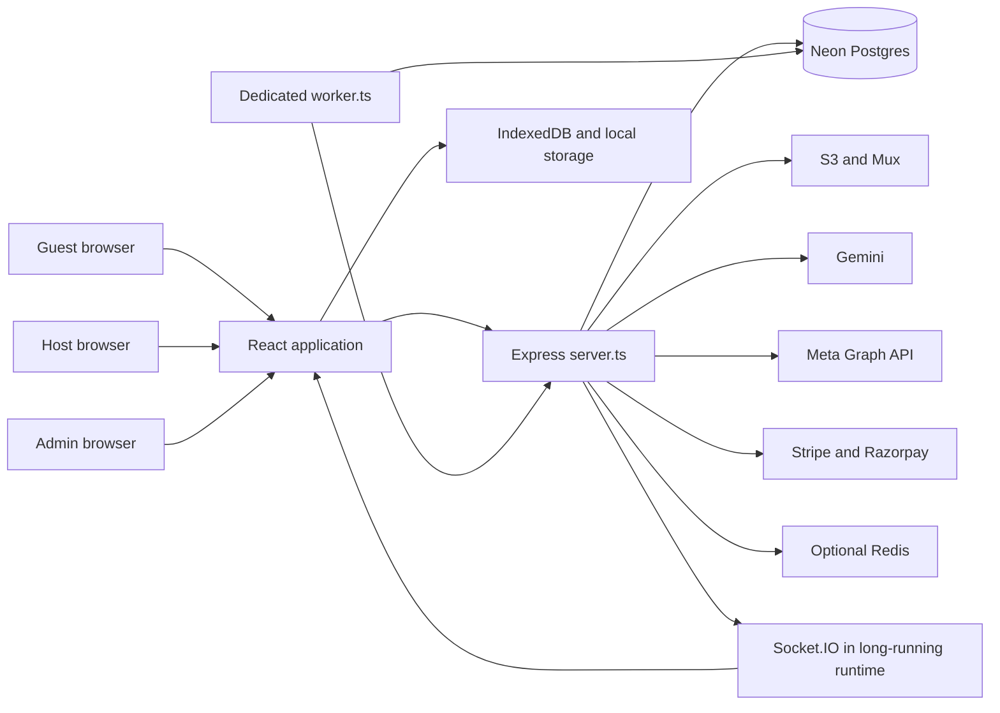

# HARVO

**Encho's living project understanding and boardroom blueprint**

Version 0.39 · Execution checkpoint updated 24 September 2026 · Owner: Founder · Maintainer: project engineering assistant

Current session authority: CR1 continuous Phase 3 execution, authorized by the founder on 23 September 2026 under the three-sided platform blueprint and execution plan. Checkpointed at 37/48 packages locally complete (77.1%), including Batch 7 (P4.4 Quote/Hold/Order Capture, P4.5 Trip Management/Cancellation, and P4.6 Concurrency Recovery Exit). Verified with 218 CR1 core tests across 16 test files, 353 provider/portfolio/adtech tests, 736 legacy tests, 124 postgres tests, and 43 guest presentation tests. Production readiness remains gated separately.

**Historical AdTech execution authority: Discussion 034 — autonomous ADT-0 through ADT-7 implementation.** The subsequent founder directive explicitly approves half-open tier boundaries and continuous implementation with verified milestone exits. Follow the [AdTech strategy execution plan](docs/implementation/ADTECH_STRATEGY_EXECUTION_PLAN.md) and [execution verification](docs/harvo/ADTECH_EXECUTION_VERIFICATION.md). Preserve immutable campaign evidence, finance/activation authority and provider capability checks. Software delivery, external staging/provider evidence and pilot acceptance remain separate.

**Current ADT delivery checkpoint:** ADT-0–ADT-6 remain complete locally (7/8, **87.5%**). The later ADT-7 directive explicitly authorizes the primary Neon database from `.env` and a zero-spend PAUSED canary using Listing 1; staging remains unconfigured. Migrations 032–035 now committed and exact checksums/AdTech named-role catalog pass. The baseline full sweep passes 1,947 tests; the new production VARCHAR readiness correction passes 47 targeted checks. Actual restricted-runtime login, complete predecessor grants and exact provider district targeting remain blocked; no canary ad was created. See the [production rollout](docs/implementation/ADTECH_PRODUCTION_ROLLOUT.md) and [dated receipt](docs/harvo/ADTECH_PRODUCTION_ROLLOUT_RECEIPT.json). This is not production certification.

**HARVO-034 rollout authority history:** the earlier local-only rehearsal instruction was subsequently superseded only for the explicitly requested production apply of migrations 017–031. Discussion 033 and section 49 record their successful application/checksum verification and authenticated production workspace HTTP 200 on 21 September. That bounded operation does not establish least-privilege runtime acceptance or authorize unrelated migration/advertising operations. Dedicated activation still requires accepted canonical booking/current-consent composition and external operating evidence; paid pools remain blocked. No production/pilot acceptance follows merely from a working workspace.

**Current acceptance qualification — discussions 019–024:** The preceding 50% count describes historical local verification, not current release acceptance after the reproduced regressions. The founder authorizes preserving useful changes and remediating the regressions, with a plan prepared before implementation (HARVO-022). HARVO-023 adds selective, verified refinements after reviewing Gemini's suggestions; generic reset/failover and production sandbox bypasses are rejected. HARVO-024 confirms Encho as the complete host campaign-monitoring interface, with independent status, performance and canonical outcome evidence. HARVO-025 adds critically reviewed UI refinements; top-ups and unsupported forecasts remain deferred. Follow the [production remediation plan](docs/implementation/HARVO_PRODUCTION_REMEDIATION_PLAN.md), [architecture assessment](docs/harvo/GEMINI_ARCHITECTURE_REVIEW.md), [telemetry review](docs/harvo/TELEMETRY_OBSERVATION_REVIEW.md) and [frontend review](docs/harvo/FRONTEND_UX_REVIEW.md). Code work and external acceptance have separate exit criteria; HARVO-026 begins implementation, with current evidence in section 43 and the remediation execution verification. Production readiness remains blocked. No guest legal or provider gate is cleared.

### HARVO-033 implementation checkpoint — 21 September 2026

**HARVO-034 local release checkpoint:** the subsequent local-only run passes one full regression at **1,860/1,860 across 144 files, zero failed/pending**, TypeScript, lint, isolated client/server build, compiled smoke and 20 browser scenarios. Exact 027–031 SQL/grants pass a disposable PostgreSQL rollback rehearsal; synthetic prior-history metadata is not Neon evidence. A private ignored local signing ring is runtime-valid. Dedicated quote authority is independent of the paid-pool block, but accepted canonical booking/current-consent composition remains absent. Staging is intentionally deferred. See the [local release receipt](docs/harvo/HARVO_034_LOCAL_RELEASE_RECEIPT.json); five of ten historical milestones remain accepted.

Implemented locally: explicit India-time flights and advisory economics; signed revision/card attribution with explicit consent and expiring optional identifiers; four-card fact/media story review and provider verification; participant-bound idempotent inquiry messaging, own-campaign outcome counts and connected inbox notifications; pool invitations/consent/eligibility, separate contribution contracts, weighted collection responses and inventory maintenance. The complete scoped record is [SEARCH_PORTFOLIO_FINAL_DELIVERY.md](docs/implementation/SEARCH_PORTFOLIO_FINAL_DELIVERY.md).

SP5 is **partial**: collection response rotation is not provider impression allocation; paid pooled provider execution and observed bill settlement are absent. Deployed pool quote/checkout/activation is blocked in code, while drafting/review/withdrawal remain available. A request for actual pilot listing IDs and operator is pending. Canonical booking/Purchase composition and actual production database/provider acceptance also remain open. No deployed UI change, Git push, live ad spend or production 100% claim is implied by local source changes.

## 1. Read this first

Encho's intended product is an India-first stays marketplace with one account for guests and hosts, supported by an optional managed advertising service. The host supplies the accommodation; Encho helps customers discover, book, pay, communicate, and resolve problems. Encho earns host booking commission or a property subscription, plus a separately disclosed advertising management fee.

**The local project is not presently demonstrated ready for a public paid-stays launch.** There is substantial implementation, including relational room/media work, transactional inventory holds, campaign publishing/reconciliation, and detailed host/admin surfaces. The continuous marketing execution corrected scoped identity, financial-boundary and delivery-truth defects. Remaining integration, deployment, provider, checkout and operating acceptance dependencies are recorded in [CONTINUOUS_EXECUTION_VERIFICATION.md](docs/harvo/CONTINUOUS_EXECUTION_VERIFICATION.md). Earlier guest test failures and unreviewed legacy areas are not silently accepted by the marketing suite. No production incident or live success is inferred.

**Historical paid-funnel assessment:** Section 29 evaluated the earlier GitHub → Vercel deployment snapshot at **2/10 launch readiness**, a provisional engineering judgment. Required database tables were absent in the last configured-database inspection; the current Vercel configuration does not start the required marketing worker; live configuration, settlement, conversion and pilot evidence remain incomplete. Discussion 007's [paid campaign audit](docs/harvo/PAID_CAMPAIGN_AUDIT.md) is historical defect evidence. Its synthetic analytics and approval/payment bypass observations must not be attributed to the replacement v2 workflow without checking the current remediation record.

**Latest acquisition strategy:** [Booking growth research](docs/harvo/BOOKING_GROWTH_RESEARCH.md), discussion 008, develops Google Search/Hotel distribution, Meta creative, bounded AI optimization, causal measurement and host/admin experience. Centralized operation does not automatically permit combining independent advertisers in one Google ad-serving account. New Google source findings H-048–H-052 further qualify readiness. No booking-lift guarantee, implementation approval or phase transition is implied.

**Conditional readiness target:** Discussion 009 estimates approximately 8/10 for a bounded first production launch after full implementation and independent pre-release verification, and approximately 9/10 only after representative controlled production evidence. These are proposed engineering judgments, not achieved ratings, success probabilities or booking forecasts. This historical rating is not a new score for later source changes. Unresolved critical money/security/provider/booking gates prevent launch regardless of other scores.

**Previous verified implementation snapshot:** Continuous execution connected revision-bound host/admin studios, AI/human review, cost-plus finance, genuine Meta/Google transports, separate paused creation/activation, durable fenced workers and truthful observations. The final scoped suite passed 591 tests and browser verification passed 29 checks; client/server builds and project typechecking passed within their documented limits. All provider/payment success evidence is isolated local fixture evidence; no live ad was created. See [CONTINUOUS_EXECUTION_VERIFICATION.md](docs/harvo/CONTINUOUS_EXECUTION_VERIFICATION.md). Historical source observations below retain their original snapshot context.

**Hosting:** Section 30 proposed Render web/API plus a separate HARVO worker, retaining Neon and S3. The founder now reports hosting/configuration completed; the deployed artifact and environment have not been observed in this execution. Packaging defects were corrected in [deployment hardening](docs/harvo/DEPLOYMENT_HARDENING.md); Linux/container and deployed acceptance remain separate from local builds.

**Conditional post-hosting assessment:** Section 31 estimates approximately 5/10 if hosting, packaging, migrations/roles and configuration are correctly completed while recorded functional/acceptance gaps remain; approximately 8/10 is a conditional limited-launch target only after the remaining critical integrations and live acceptance pass. These hypothetical judgments do not change verified milestone status or establish that a deployment occurred.

**Review honesty:** This is a detailed architecture and critical-flow baseline, not a completed semantic review of every line. The initial structural inventory covered 948 selected first-party files and 148,590 lines, including 146 application files / 93,087 lines. Every included text file was processed for its inventory; selected critical paths were read in detail. Hundreds of maintenance scripts, large UI branches, and substantial service/test code remain structurally indexed rather than fully reviewed. The exact limits and next review batches are in [REVIEW_COVERAGE.md](docs/harvo/REVIEW_COVERAGE.md). Do not describe HARVO v0.1 as a complete line-by-line audit.

At the initial audit this workspace had no discoverable Git repository at its root; file hashes identified that snapshot. This limitation is superseded for current local source: discussions 019–020 inspected the Git repository on `main` at `e832db6` plus the dirty worktree. A current deployed-version match is still unknown. A read-only configured-database schema/role inspection was completed during continuous execution; no customer rows, secret values, live payment success or live delivery evidence were inspected. No remote schema or data was changed by that verification. The initial audit was read-only; subsequent authorized execution changed scoped application code. The final 91-file source manifest and verification report identify that locally verified implementation.

### Evidence labels

| Label | Meaning |
|---|---|
| APPROVED | An existing controlling document or explicit founder decision establishes intent. It does not prove implementation. |
| SOURCE VERIFIED | Behavior or structure is visible in the inspected source at the linked location. |
| TEST OBSERVED | An explicitly identified local test/build was run and its result recorded. |
| HISTORICAL CLAIM | A prior document says something was completed/certified. Its scope and current applicability still require verification. |
| PROPOSED | A boardroom recommendation awaiting a decision. |
| UNKNOWN | Evidence was unavailable or the relevant work has not been inspected. |
| BLOCKED | An existing legal, provider, or founder gate prevents execution. |

## 2. HARVO's role and maintenance rules

Read the [Engineering Constitution](docs/ENCHO_ENGINEERING_CONSTITUTION.md) first, then HARVO and the controlling domain decision register. HARVO is the cross-project understanding layer. It does not silently supersede the Constitution or the [Guest Booking Decision Register](docs/blueprints/GUEST_BOOKING_DECISION_REGISTER.md).

The founder explicitly authorized HARVO to evolve with new evidence and discussion. Update its current understanding when facts change. Preserve why the understanding changed in [DECISIONS.md](docs/harvo/DECISIONS.md); mark previous positions superseded instead of erasing decision history. Record disagreement and open questions without treating them as approval. Update approved architecture documents through the existing operating protocol when an architectural change is actually authorized and implemented.

For each meaningful discussion or finding:

1. Record the concrete statement, evidence/date, status, and affected customer/host/admin flows.
2. Distinguish a founder decision from an assistant recommendation or hypothesis.
3. Update the relevant HARVO section and decision/assumption register.
4. Recheck source evidence before using an old finding to prescribe a code change.
5. Record validation and remaining uncertainty. Close findings only with relevant verification.

No automatic background maintenance is implied. Update HARVO during active work and discussions in this workspace. The startup instruction in `AGENTS.md` makes it discoverable in future sessions.

### Boardroom working agreement — reaffirmed by founder

Throughout discussion and the eventual authorized production upgrade, evaluate Encho Space through business strategy, investment, marketing, operations, engineering and customer/host behavior. Challenge weak assumptions directly; explain disagreements with evidence and practical alternatives. Critique ideas rather than the founder. Humor is welcome, but harshness is not evidence. Ratings, when useful, must state their criteria and uncertainties; do not invent precision or validate an idea because the founder likes it.

Maintain HARVO as the evolving discussion record, preserving approved decisions, proposals, open questions and superseded reasoning. Correct the assistant's own claims when evidence changes. These analytical perspectives do not imply actual professional credentials or replace existing specialist sign-off gates. The renewed role instruction does not change the current Boardroom phase or authorize production implementation. The advertising percentage base was resolved in discussion 006: markup on defined campaign costs. Exact cost/tax scope remains open.

## 3. Goal, customer promise, and product boundaries

### Approved direction

- Public brand: **Encho Stays**; initial geography: **India domestic stays**.
- One account can book as a guest and manage listings as a host. Admin is a privileged authority, not a separate host account model.
- Host remains the accommodation supplier; Encho is the disclosed marketplace/collection agent.
- Guests pay neither Encho booking commission nor a gateway surcharge.
- Hosts choose Flex or Growth under the approved commercial rules below.
- Advertising is optional and separate from booking charges.
- Actual accommodation, approved media, truthful reviews, location privacy, captured-payment evidence, and accountable refunds/payouts are core promises.
- Experiences, international guest checkout, Google Ads expansion, and advanced retargeting are outside the active India stays transformation.

### Proposed outcome to optimize

**Guests should receive the stay they understood they were buying, at the accepted total, with reliable help when something goes wrong. Hosts should receive profitable, fulfilled bookings, accurate availability, and explainable payouts.**

Proposed north-star metric: completed, undisputed stay nights with reconciled payment and payout, accompanied by positive host and platform contribution. Booking count alone encourages low-quality supply; ad clicks alone reward spend without proving a stay happened. Track both volume and economics rather than compressing them into one score.

### Scope reality

The repository also contains experiences, a traveler lobby, social publishing, SEO tooling, marketing campaigns, lead scoring, payment wallets, custom media experiences, and several generations of listing/checkout code. Their presence does not put them inside the launch scope. Shipping all visible surfaces would create a much wider business and support obligation than the accepted India stays plan.

The correct strategic question is which guest need and host segment Encho can serve reliably in one market. This has not been answered by current traction evidence. Wayanad/Kerala appears frequently in UI examples; that is not proof of a founder-approved launch market or live supply.

## 4. Commercial model and unresolved arithmetic

| Product | Approved intent | Implementation status in this review |
|---|---|---|
| Flex | Default 15% host booking commission, admin-configurable and snapshotted at booking confirmation | Decision approved; canonical settlement/quote engine remains M5-blocked. Legacy payment settings and guest fee code conflict. |
| Growth | ₹4,999 plus applicable GST per property per rolling 30 days; 0% commission for bookings confirmed during an active term | Decision approved; end-to-end billing, snapshot, and settlement behavior not established by this review. |
| Growth extension | Active term extends by 30 days from its expiration; otherwise starts at successful activation | Approved decision, not proof of a shipped subscription lifecycle. |
| Advertising | Recover defined campaign costs C plus admin-selected profit markup p on those costs: profit = C × p; charge = C × (1 + p). Intended introductory rate 3–5%; exact cost/tax treatment still to specify | Replaces the fixed 15% advertising-fee direction prospectively. Existing code/contracts/live rates unchanged. See section 23. |
| Standard payout | Initiation 24 hours after verified check-in, subject to the approved verification/payout mechanisms | Mechanism and payout rail remain gated; no claim of actual banking timing. |
| Risk reserve | Default 10% for 30 days for designated high-risk hosts; configurable; deficit recovery rules apply | Approved commercial intent, not a certified production reserve ledger. |

**Advertising arithmetic conflict, excluding tax:** With media spend `A = ₹10,000`, the approved additive fee is `0.15 × A = ₹1,500`, giving a charge of `₹11,500`. At the same gross charge, the current 15%-of-gross split yields `₹1,725` in fees and `₹9,775` in media. Equivalently, taking ₹15 out of a ₹100 deposit is a 17.647% markup on the ₹85 of media. These descriptions cannot be used interchangeably. Evidence: `server.ts:getOrEstablishFinancialContract` around line 8490 and the older strategy document's $100 example.

The preceding arithmetic documents the historical additive-versus-gross-split conflict. Discussion 005 now selects a different future business direction: expense recovery plus an admin-selected campaign profit target. Historical contracts, top-ups, taxes, refunds and displayed budgets still need an explicit migration decision before implementation; the new direction does not retroactively change them.

**Current founder decision (discussion 006):** The 3–5% is profit calculated on defined campaign costs, after recovering those costs. It is a markup on costs, not a margin on the total charge. Separate Flex booking commission remains. Exact recognized cost/tax scope still needs specification. Sections 21–22 preserve discussion history; section 23 states the selected formula.

### Illustrative economics, not forecasts

Let `G` be the approved commissionable booking base, `c` the snapshotted Flex rate, `A` media spend, `n` bookings serviced for a Growth property during its term, and `K` the platform's variable costs per serviced booking.

| Measure | Simplified pre-tax expression |
|---|---|
| Flex booking revenue | `c × G` |
| Historical advertising management revenue | `0.15 × A`; superseded as the future pricing direction by discussion 005, whose final formula remains to be selected |
| Growth revenue per serviced booking | `4999 / n` |
| Platform contribution | Commission + recognized subscription revenue + ad management fee − gateway fees − support/moderation − AI/media − refund/fraud losses − acquisition costs borne by Encho |
| Host contribution | Accommodation proceeds − platform commission/subscription allocation − ad spend and ad fee − property variable fulfillment costs − refunds/other host costs |

Growth's simple host fee break-even against 15% Flex is `4999 / 0.15 = ₹33,326.67` of commissionable booking value per term, ignoring taxes and different service costs. This is arithmetic, not a financial recommendation or a final tax-inclusive comparison. The approved definition of commissionable value must remain explicit.

The business risk is selection: higher-volume properties have the strongest incentive to buy Growth, while Encho continues to bear gateway, support, fraud and refund costs. A ₹4,999 subscription is not automatically sustainable for unlimited booking volume. Model volume bands before promoting it aggressively; any pricing alteration requires a founder decision.

Host-funded ads can produce two Encho charges: ad management and Flex booking commission. Explain both before funding. Host ROAS must be based on actual attributed accommodation revenue, clearly separated from estimated lead value and net contribution. Attribution does not establish incrementality; some attributed customers would have booked anyway.

## 5. Current business reality

### What is known

There is a large local implementation and extensive historical documentation. The active stays plan is incomplete. The production stay-checkout compliance gate is present in the newer checkout paths. Targeted current tests fail. The old strategy document's assertion that all components are synced and production-verified cannot be carried forward as current fact.

### What remains unknown

| Required founder/business evidence | Current status | Why it changes decisions |
|---|---|---|
| Actual launch/deployment status and source version | UNKNOWN | Determines whether findings are local debt or urgent live exposure. |
| Number of contracted, verified, bookable properties/room types | UNKNOWN | Determines real supply and whether marketplace choice exists. |
| Active hosts and fulfilled paid bookings | UNKNOWN | Separates implementation from demand and operational traction. |
| GMV, recognized revenue, refunds, cancellations and disputes | UNKNOWN | Required to assess contribution and trust. |
| Monthly burn, available runway and founder/team capacity | UNKNOWN | Determines how much scope is affordable. |
| First destination and guest segment | UNKNOWN | Needed for supply quality, acquisition channels and support design. |
| Live ad spend, captured funding and incremental booking return | UNKNOWN | Needed to justify the marketing engine. |
| Merchant approvals, payout rails and tax/legal sign-off | UNKNOWN here; documented gates remain BLOCKED | Needed before booking-money activation. |
| Support coverage and property check-in escalation owner | UNKNOWN | A hospitality product requires someone accountable when arrival fails. |

The founder was asked for these business inputs during the initial review. No figures have been inferred from seeds, examples, test fixtures, historical ad IDs, or screenshots mentioned by old documents.

The earlier “6.5/10 idea” and survival probabilities (15–20%, then 75% with safeguards) have no validated model in the inspected materials. Treat them as historical opinions, not investment evidence. HARVO does not assign a new numerical business rating without data.

### Competitive reality checked 13 September 2026

- Airbnb already documents host-only fee structures; “no guest platform fee” alone is not a unique advantage. Fee structures vary, so do not advertise a universal competitor rate. [Airbnb service fees](https://www.airbnb.com/help/article/1857).
- Guesty markets direct booking websites, a booking engine, guest communication and Google Vacation Rentals distribution. Encho competes with the host's existing distribution and operations workflow, not merely a website builder. [Guesty direct reservations](https://www.guesty.com/features/direct-reservations/).
- StayFi offers managed email marketing intended to turn guest data into direct bookings. The earlier description of it as only Wi-Fi capture understates its current marketing offering. [StayFi managed email marketing](https://stayfi.com/vrm-insider/2026/05/19/meet-stayfi-managed-email-marketing/).

**Inference:** Encho's possible advantage is the combined service—trusted local supply, useful guest discovery, dependable reservation operations, and measurable profitable demand generation. AI copy, luxury graphics and an ad dashboard are individually reproducible. This inference requires customer interviews and real cohort results; current sources do not prove product-market fit.

## 6. Existing system map

This is a source dependency picture, not a verified deployment topology. The worker imports functions from the large server module; it is not an independent service boundary. Vercel and container configurations coexist. There is no `.openai/hosting.json` identifying this checkout as a registered Site. Sites was inspected for applicability; no new Site or deployment was created.

| Layer | Source and role | Important qualification |
|---|---|---|
| Entry | `index.tsx`, `App.tsx`, contexts and error boundaries | React/Vite application with custom view state/history; no conventional route framework establishes all flows. |
| Guest presentation | `ListingCard`, `FilterBar`, `MapSidebar`, `ListingDetailsNew`, gallery/video components | Large cinematic surface; current fabricated fallbacks violate truth contract. |
| Legacy presentation | `ListingDetails`, `BookingPage`, older checkout paths | Still present, imported/bundled; retirement needs reachable-flow evidence. |
| Host | `HostDashboard`, `HostForm`, `HostCalendar`, inbox and marketing components | Stays and experiences both exist; eight-step builder and multiple save paths. |
| Admin | `AdminDashboard`, ops/control/financial/trace panels | Property moderation and ad operations coexist; authorization must be server-enforced. |
| API | `server.ts` — 20,678 lines at baseline | Auth, schemas, business workflows, integrations and background tasks in one file; `@ts-nocheck` suppresses important checking. |
| Stays domain | `src/lib/stayProjection.ts`, `src/services/inventoryHoldService.ts`, migrations 001–007 | Newer privacy and relational inventory mechanisms coexist with older paths. |
| Advertising domain | Canonical truth, delivery reducer, control plane, external sync, telemetry, DCO, provider modules | More developed decomposition; integration truth is inconsistent across adjacent legacy services. |
| Persistence | `pg` main/read pools; some services create their own pools | Declared SQL is not evidence of deployed schema/RLS. |
| Media | S3 uploads, Sharp processing, Mux video; FFmpeg dependencies | Real adapters exist; upload ownership, limits, remote-fetch safety and takedown require deeper audit. |
| Offline/PWA | `lib/syncService.ts`, `src/lib/syncService.ts`, `lib/syncHandlers.ts`, Vite Workbox | Multiple cache/queue implementations; broad POST replay is unsuitable as booking authority. |
| Operations | `worker.ts`, `Dockerfile.worker`, Vercel routes/cron, health/metrics/log services | Worker activation, import side effects, single ownership and deployed cutover status remain unverified. |

Initial structural map: 232 Express route registrations, including array-based aliases. Duplicate `GET /api/admin/metrics` and `POST /api/admin/marketing/campaigns/:id/resync-meta` registrations need handler-order analysis. These are registration counts, not unique endpoints. [Complete extracted API map](docs/harvo/API_MAP.md).

## 7. Guest journey: present vs required

| Stage | Current implementation | Required customer truth |
|---|---|---|
| Discover | Search/filter/map/catalogue cards; custom App state and fetch/caching | Relevant available stays, honest location/price/media, clear room vs whole-property offer. |
| Inspect | `/stay/:slug` loads `/api/v2/stays/:slug`; canonical component additionally fetches older listing/calendar routes | One public projection; approved room-specific photos; no invented amenities, prices, ratings or trust labels. |
| Choose | Client room tiers, guest counts, dates and calendar occupancy calculations | Canonical room identity; valid occupancy/minimum stay; dates expressed as occupied nights. |
| Hold | M4 API/service provides principal-bound transactional holds | UI must bind a real server-issued hold; no fake countdown/availability assurance. |
| Quote | Current component calculates fee/tax locally | M5 stored immutable quote after legal sign-off; guest accepts final amount explicitly. |
| Identity | Password, Google-profile and OTP paths exist | Verified identity before payment; server-validated identity proof and secure privilege assignment. |
| Pay | Newer production stay checkout blocks; older code remains | Razorpay order bound to quote, hold, principal, amount/currency and attempt. |
| Confirm | Legacy App path updates optimistically; BookingPage invents reference/access details | Server confirmation after authoritative captured payment and transactional inventory allocation. |
| Arrive | UI makes check-in/escrow promises | Actual verified arrival procedure, private directions only for authorized bookings, reachable support. |
| Manage/refund | Legacy status/cancellation handlers exist; canonical lifecycle not accepted | Versioned policy, durable refund obligation, reconciled execution and transparent timeline. |
| Review | Review APIs and display components exist | Reviews tied to eligible completed stays; zero reviews means “New on Encho Stays.” |

Razorpay distinguishes payment authorization from capture; possession of a checkout signature is not a substitute for the approved fulfillment checks. [Razorpay Payments APIs](https://razorpay.com/docs/api/payments/). This supports the existing captured-payment requirement; it does not approve Encho's unimplemented order/quote lifecycle.

### Particularly consequential customer contradictions

1. `ListingDetailsNew` adds a 15% guest-facing fee and 18% tax estimate, despite the zero-guest-commission decision and legal tax gate.
2. It appends stock images, creates fallback room tiers, shows invented verified reviews and unconditional host trust claims.
3. It fetches a public calendar response containing private booking details.
4. The legacy booking UI can present success before server success. The old server insert itself has 16 parameter positions and only 14 supplied values, so this review does **not** claim that route currently completes a real insertion.
5. A visually polished “instant confirmation” promise conflicts with the intentionally unavailable production stays checkout.

## 8. Host journey and admin parity

### Host listing workflow

The actual eight builder steps are Identity → Location → Rooms → Media → Amenities → Policies → SEO → Launch (`HostForm.tsx:28`). Hosts enter property/brand identity, exact private location, room pricing/capacity, media and safety/amenities, guidelines and pricing configuration, discovery metadata, and AI-assisted review.

Media upload uses presigned S3 URLs, a base64 fallback, and Mux upload/polling for video. Submission builds property-wide and room-specific photos, then posts/updates listings and separately saves draft data. The server has relational room/media writes, publication validation and admin media moderation. This is a valuable foundation, but its parallel representations and approval paths must agree.

Current pain points visible in source:

- New form defaults include sample luxury rooms and stock photos, so the product can manufacture listing content before the host provides evidence.
- Required nearby-POI behavior in step navigation increases onboarding work; the approved presentation contract treats nearby information as optional.
- `HostDashboard` combines reservation operations, experiences, calendar, messaging and marketing; some empty/error states collapse to empty arrays.
- The host calendar's private operational view is also used publicly by the guest component.
- The form and API mix mutable room tier strings with relational room IDs; labels must not become inventory identity.
- Draft save, live listing save and moderation outcomes need a visible, durable state that distinguishes saved from approved/published.

### Property feature parity register

| Data | Host surface | Guest surface | Admin surface | Review conclusion |
|---|---|---|---|---|
| Identity/description/brand | HostForm | ListingDetailsNew/cards | Admin listing editor | All surfaces exist; default content and projection correctness require remediation. |
| Room type, capacity, price | HostForm room builder | Room slides/cards and checkout handoff | Listing editor and rooms endpoint | Relational authority partially implemented; legacy room tiers persist. |
| Room-specific approved photos | Host upload/classification | Gallery and room slides | Media moderation endpoint/panels | M3 publication gate exists; current public fallback/visual tests expose gaps. |
| Exact address | Host location step | Must remain private; coarse location public | Admin operational access | Public projection protects some fields; calendar and free-text surfaces need full privacy tracing. |
| Amenities/safety/POIs/rules | Builder steps | Property details | Admin editing | Presence is not validation of claims; moderation and omission of unknowns needed. |
| Availability | HostCalendar and block routes | Current browser capacity calculation | Reservation operations | Canonical holds exist but cross-path consistency not demonstrated. |
| Quotes/taxes/payout terms | Future accepted financial configuration | Future M5/M6B disclosures | Future audit/settlement control | Blocked/unfinished, not an additional UI-only field. |

Any new property feature must still update guest, host, and admin areas. HARVO does not waive this rule.

### Proposed host-first improvement priorities

Make the next required action clear: finish missing photos, resolve moderation notes, update real availability, answer an inquiry, or inspect a payout. Show net proceeds and evidence-backed campaign outcomes. Let hosts pause optional spending easily and understand unspent balances. Explain errors as actions they can take; expose integration details in admin operations, not guest-facing flows.

Admin work should be prioritized by harm and time sensitivity: arrival failure, captured payment without inventory, refund overdue, private-data exposure, dangerous/misleading listing, then ad-quality improvements. Moderation throughput alone is not the operational objective.

## 9. Inventory, database and API understanding

### Existing canonical stays tables

| Table/domain | Intended authority |
|---|---|
| `listings` | Property ownership/content/publication and canonical slug. |
| `room_types` | Relational room identity, base price, occupancy, inventory and minimum stay. |
| `media_assets` | Room/property association, ordering, hero flag, moderation and sleeping-area evidence. |
| `backfill_conflict_records` | Durable problems converting legacy JSON into relational content. |
| `inventory_days` | One room type/date capacity: total, held, booked and blocked units. |
| `booking_holds` | Principal/idempotency/fingerprint-bound reservation hold with expiry. |
| `booking_hold_nights` | Per-night allocation for a hold. |
| `legacy_block_conflict_ledger` | Ambiguous/unmapped legacy calendar blocks requiring investigation. |
| `schema_migrations` | Ordered migration history with checksums. |

The hold service uses strict `[check_in, check_out)` semantics, ordered inventory locking, all-night capacity checks, a configured 10-minute default TTL, and owner/admin release logic. These are important mechanisms to preserve. Its presence does not prove the older booking routes or public UI participate in those same transactions.

There are source concerns even inside the accepted baseline: legacy block reconciliation can update rows before the advertised ordered lock; mapped blocks use `GREATEST(blocked_units,1)` rather than a demonstrated total allocation model; a conflict insert's `ON CONFLICT (dedupe_key)` does not express the predicate of the migration's partial unique index. These need real Postgres checks, not conclusions drawn from a mock suite. See findings H-018/H-019.

Migrations 001–007 add slugs, draft publication, relational room/media authority, constraints, inventory/holds and legacy mapping/dedupe. They assume pre-existing base tables; they are not a complete fresh-database schema. Several `NOT VALID` constraints require a later validation operation. The runner warns on checksum drift and skips an already-recorded migration rather than refusing drift.

The approved protocol prohibits runtime DDL, but `ensureListingsTable`, numerous handlers, and services still create/alter tables. A single-column fast check marks multiple schema groups initialized; this is not proof the whole database is migrated.

### Other database domains

- Identity and messaging: `users`, `threads`, `messages`, reviews and wishlists.
- Legacy stays/experiences: `bookings`, `room_calendar_blocks`, `calendar_prices`, `experiences`, `experience_bookings`.
- Marketing: `host_marketing_campaigns`, draft/social-post data, publishing transactions/events/traces, external truth, variants and optimization records.
- Money: `host_wallets`, `wallet_transactions`, `wallet_accounts`, `ledger_entries`, `ledger_lines`, campaign financial contracts and processed payment references.
- Async/operations: inbound/async webhook queues, DLQs, lead notification intents, worker leases, reconciliation incidents and metrics rollups.

Some helpers instead query `marketing_campaigns` or `campaigns`. Treat similarly named tables as separate until mappings, migrations and production usage are proven. They are not interchangeable aliases.

Planned `booking_quotes`, canonical payment-attempt/refund/payout obligations and associated immutable financial snapshots remain target architecture under the stays plan. Do not mark them implemented based on document headings or unrelated advertising ledgers.

### API contract map

The [full extracted API register](docs/harvo/API_MAP.md) preserves source locations and inline middleware. Main families are authentication, listings/drafts/rooms/media, canonical stays/holds, calendar/reservations, threads/messages, wishlists/reviews, experiences/lobby, AI content/targeting, campaigns/social posts/controls, payment/wallet/webhooks, admin operations, health/cron and tracking. Input/response contracts remain distributed across route code, TypeScript types, Zod schemas, tests and blueprints rather than a single OpenAPI document.

## 10. Marketing engine: what exists and what is not proven

The intended lifecycle is host draft → AI evaluation → human moderation → verified funding/escrow → safe external creation → explicit activation → externally verified delivery → metrics/leads → booking conversion and reconciliation.

The implementation has distinct kinds of state that must not be collapsed:

| State domain | Meaning |
|---|---|
| Local campaign FSM | Host/admin workflow: draft, pending, approval, escrow, publish, active, paused, failures and terminal states. |
| Publishing transaction | Progress/recovery around provider calls, unknown outcomes, rollback and quarantine. |
| External delivery reducer | What Meta currently reports about campaign/ad set/ad hierarchy, review and freshness. |
| Funding/escrow/contract | Captured host funding, authorized provider spend, fee and release permission. |
| DCO optimization | Whether sufficient measured evidence authorizes a creative change. |
| Lead lifecycle | Ingestion, prioritization, thread creation, response and conversion. |

Useful existing design: approval hashes, financial limits in minor units, trace/correlation IDs, safe paused object creation, explicit activation, reconciliation for uncertain external outcomes, host/admin projections, telemetry freshness, pause-source ownership and DCO threshold logic. These are assets to preserve, not grounds to rewrite the whole project.

Critical qualifications:

- The local campaign FSM allows an admin actor to bypass its transition table and catches event-write failure. Existing control-plane checks do not automatically make every caller safe.
- AI evaluation has a favorable static default that can remain after AI failure. A score must not be represented as an actual AI/policy pass when the evaluator did not complete.
- Notification intents use fabricated destinations; the default dispatcher logs and marks delivered without a real transport acknowledgement.
- Dynamic pricing “sync” writes local audit data but does not itself update and verify remote ad copy.
- The retargeting service labels dispatch based on credential presence without performing the advertised external send in that method.
- Calendar auto-pause compares the count of bookings with total room inventory without evaluating occupancy across the campaign's target nights. That is not the promised date-aware circuit breaker.
- Some services have durable leases; others leave crash/claim recovery or separate SELECT/UPDATE transaction boundaries unresolved.
- Google provider code exists but the server's Google dispatch path is explicitly contained. Presence of its adapter must not be advertised as a supported live product.

### Strategic interpretation of the master account

One managed account reduces host setup friction and centralizes operations. It also concentrates platform dependency and enforcement risk. Saying it “prevents one bad host from affecting everyone” reverses that tradeoff. AI and human checks can reduce the chance of bad content; they cannot guarantee an external platform will not restrict Encho. Retain the approved architecture while validating provider permission, operational limits, liability, monitoring and recovery in a separately authorized integration review.

The historical assumption that every hospitality campaign is governed by the same HOUSING category/targeting rules needs fresh, product/jurisdiction-specific Meta verification before live expansion. HARVO neither endorses nor changes that policy mapping.

## 11. Security and trust priorities

The detailed evidence is in [FINDINGS.md](docs/harvo/FINDINGS.md). These are source findings and local test results; they are not a claim that an attack occurred.

**Release blockers:** server-verified identity, privileged admin authorization, socket-room membership, private calendar data, honest property presentation, and canonical payment/booking containment. The most severe source findings include browser-trusted Google login, an OTP bypass, weak privileged payment checks, and public guest information in the room-calendar endpoint.

RLS needs database-role evidence. The source contains a permissive outreach policy, no demonstrated FORCE RLS on the inspected policies, a wrapped main pool but unwrapped transactional/read/service paths, and context reset to bypass. Application ownership checks are still necessary. A pg-mem test that intercepts `set_config` cannot certify production tenant isolation.

Secret-handling gaps include a hardcoded JWT fallback, different guest-session environment naming in code vs the environment specification, and a process-random PII encryption-key fallback. A process restart or multiple instances can therefore make ciphertext unreadable when the persistent key is missing. No secret values belong in HARVO.

## 12. Customer and host experience proposals

These are discussion proposals, not approved new milestones.

### Customer experience

1. Prioritize the buying decision: real property identity, room configuration, occupied nights, capacity, relevant amenities, approximate location and transparent price status.
2. Use real approved media only. A smaller honest gallery is preferable to content representing facilities the property may not have.
3. Show known uncertainty early. If payment cannot proceed, the primary action should explain availability of the service before customers invest in checkout.
4. Use verified reviews and clearly defined verification badges. Never substitute host response-time or quality claims for evidence.
5. Give a recoverable payment experience: pending/reconciling/confirmed/refund status must survive refresh and sign-in on another device.
6. Preserve a reliable arrival/support path and a clear cancellation policy. Masking private details must not prevent necessary fulfillment or support.
7. Test mobile readability, reduced motion, keyboard access, media controls and slow connections. Luxurious imagery should not make the task difficult.

### Host experience

1. Keep onboarding centered on publishable truth. Save drafts durably, show precise missing requirements, and let hosts complete optional editorial content later.
2. Separate daily operations, booking money, and optional advertising money in the UI. An advertising wallet is not a payout balance.
3. Display net economics with spend, fees, source, attribution window and freshness. Clearly label unavailable metrics.
4. Promote refueling only after evidence suggests available inventory and sensible returns. Budget exhaustion is not evidence that more spend will be profitable.
5. Give hosts reliable notifications and predictable response workflows. A notification outbox is useful only when it reaches a real destination.
6. Provide a plain refund/unspent-funds policy. Retention should come from value; involuntary liquidity restriction creates trust and support costs. Any change to the existing wallet policy requires founder/legal review.

### Operational experience

Create a single view of unresolved customer harm: arrival issues, booking/payment mismatches, overbooked nights, refunds due and payout delays. Keep campaign failures and listing moderation accessible with evidence and ownership. Do not let a campaign dashboard's polish obscure unresolved stay operations.

## 13. Validation observed in this review

| Check | Result | What it establishes |
|---|---|---|
| Type checking | PASS | Configured TypeScript checks completed; `@ts-nocheck` means this does not cover all server logic. |
| Production build | PASS with warnings | Assets/server compile; not proof of deployed runtime or behavioral correctness. |
| Three privacy/presentation suites | 38 passed / 19 failed, 57 total | Current M2 public-component consumption and M6A truth/interaction gaps are observable. |
| Other selected domain suites | See [VALIDATION.md](docs/harvo/VALIDATION.md) | Recorded separately, with mock-vs-real-DB limitations. |
| Production/Postgres isolation/concurrency | NOT RUN | No current certification of real locks, RLS, migration state, booking fulfillment or provider behavior. |
| Browser visual/accessibility end-to-end | NOT RUN | DOM/SSR tests are not device/browser QA. |

Build output reported a circular vendor chunk and large chunks, including approximately 740 kB minified / 222 kB gzip for ListingDetailsNew, 1.44 MB / 414 kB gzip for vendor-react, and 4.93 MiB PWA precache. These are artifact sizes, not measured page performance; test actual mobile network/CPU before claiming a latency score.

Some tests assert style/text markers rather than commercial behavior. At least one “no unauthorized fees” assertion misses the current UI's changed wording despite the prohibited calculation still being present. Passing assertions must be interpreted in context.

## 14. Milestone status preserved

| Existing milestone | Controlling declared status | HARVO interpretation |
|---|---|---|
| M1 | ACCEPTED — architectural baseline | Preserve historical acceptance. |
| M2 | ACCEPTED — public projection/routing/privacy baseline | Current public-component fetch regression is observed; acceptance does not certify this snapshot. |
| M3 | ACCEPTED — relational room/media authority | Source exists; failures/fallbacks need targeted review; no re-certification granted. |
| M4 | ACCEPTED — inventory days/atomic holds | Source exists; real PostgreSQL and all legacy integration paths remain unverified here. |
| M5 | NOT STARTED; legally blocked | Written Indian CA/tax-lawyer sign-off required. |
| M6A | AWAITING INDEPENDENT ACCEPTANCE | Current local tests fail; must not be accepted on this evidence. |
| M6B | NOT STARTED; blocked by M5/legal sign-off | Preserve gate. |
| M7–M15 | NOT STARTED | Future gallery, identity/checkout, payment fulfillment, confirmation, refunds/payouts, parity, attribution, certification and cutover. |

The implementation-plan header, some detailed milestone statuses and guest blueprint header disagree with later progress tables and Constitution/AGENTS. Record that drift; do not invent a new completion percentage. The marketing engine's separately named M1–M15 work is not the stays milestone sequence.

## 15. Proposed boardroom agenda and decision order

This is a business discussion order, not a Phase 2 implementation plan.

1. Establish reality: deployed state, team/runway, real properties, real fulfilled bookings and first market.
2. Choose the launch proposition: the guest trip we solve, the host we serve, the minimum service promise and exclusions.
3. Decide release-risk response using the verified findings; clarify whether the inspected source is live. Do not expand guest-paid/ad-funded access on an unverified foundation.
4. Resolve commercial language: additive advertising fee, Flex base, Growth economics and transparent host cost disclosures, while preserving existing approved decisions until explicitly changed.
5. Define hospitality operations: verification, support, arrival disputes, cancellations, refunds, payout/reserve policy and owner accountability.
6. Specify the pilot measurement: profitable fulfilled stays, conversion drop-offs, cancellations, refund/payout delays, repeat intent, and incremental marketing contribution.
7. Move to Phase 2 only on the founder's explicit command. Convert accepted decisions and blockers into bounded milestones; execute only the authorized milestone in Phase 3.

Proposed pilot logic: start with enough real properties to satisfy one destination/guest use case and enough operating capacity to handle every arrival. Set numbers only after founder supply, staffing and budget evidence. Do not choose a national rollout merely because the interface supports many cities.

## 16. Measures required before claiming the project is “best”

| Audience | Outcome measures | Failure signals |
|---|---|---|
| Guest | Relevant search-to-detail rate, date availability, accepted-quote-to-capture conversion, fulfilled stays, repeat intent | Misleading content, surprise total, failed arrival, cancellation, payment ambiguity, refund delay |
| Host | Publishable-listing completion, net revenue per available room-night, response time, payout accuracy, repeat usage | Unanswered leads, paid clicks without contribution, calendar drift, double booking, unexplained deductions |
| Encho | Contribution after variable costs, cohort retention, support minutes/stay, moderation time, reconciliation backlog | Growth costs exceeding subscription income, unprofitable acquisition, fraud loss, aging obligations |
| Engineering | Error/latency by journey, queue age, unknown external outcomes, inventory drift, ledger imbalance | Silent fallback success, missed alert delivery, stale metrics presented as live, repeated manual patches |

Before setting KPI targets, define event sources, identifiers, attribution windows, ownership, exclusions and reconciliation. Seeded users, requested bookings, payment attempts and captured/fulfilled bookings must be separate populations.

## 17. Open decision and risk registers

- [Decisions, assumptions and discussion history](docs/harvo/DECISIONS.md)
- [Evidence-backed findings and verification needed](docs/harvo/FINDINGS.md)
- [Review coverage and remaining line-by-line work](docs/harvo/REVIEW_COVERAGE.md)
- [Local validation results](docs/harvo/VALIDATION.md)
- [File inventory](docs/harvo/SOURCE_INVENTORY.md) and [machine-readable symbol/import/route/table index](docs/harvo/SOURCE_INVENTORY.json)
- [API route map](docs/harvo/API_MAP.md)

## 18. Initial revision record

| Date | Revision | Reason |
|---|---|---|
| 2026-09-13 | v0.1 — boardroom evidence baseline | Founder requested a persistent project understanding named HARVO. Established source inventory, traced critical journeys, checked current competitors and local validation, recorded blockers and proposals without changing application behavior. |
| 2026-09-13 | v0.2 — first Boardroom discussion | Recorded founder's integrated host-marketing-to-guest-booking vision and transparency requirement; corrected four hardening diagnoses against source; preserved fee conflict and phase gates. See discussion below. |
| 2026-09-13 | v0.3 — Boardroom working agreement | Founder requested candid multidisciplinary challenge throughout the upgrade and reaffirmed continuous HARVO maintenance. Recorded this preference without changing product decisions or phase. |
| 2026-09-13 | v0.4 — marketplace strategy and precedents | Checked Etsy/Slice claims; developed guest/host/admin outcome proposals, host economics and a pilot learning plan; added targeted source findings H-032/H-033. |
| 2026-09-13 | v0.5 — introductory advertising pricing proposal | Recorded founder's 3–5% idea, fee-versus-profit distinction, scenario calculations, admin scope and unresolved cost allocation; no price/code change. |
| 2026-09-13 | v0.6 — founder clarifies profit after campaign expenses | Selected expense recovery plus configurable 3–5% campaign profit target; superseded the fee-includes-costs interpretation. Margin base and final costing rules still open; no implementation. |
| 2026-09-13 | v0.7 — founder selects markup on campaign costs | Resolved denominator: profit = costs × admin rate. At 5%, ₹10,000 costs yields ₹500 profit. Cost/tax specification remains pending; no code/live-rate change. |
| 2026-09-13 | v0.8 — paid-funnel source audit | Traced host creation/AI/funding/admin publication/reporting/DCO/CRM paths; reproduced simulated analytics offline; added H-034–H-047 and a 2/10 readiness assessment. No implementation or phase switch. |
| 2026-09-13 | v0.9 — booking growth research and experience direction | Researched current Google/Meta capabilities and measurement; added Google source findings H-048–H-052, account/feed constraints and an interactive Boardroom concept. Research/design authorized; production decisions remain proposed. |
| 2026-09-13 | v0.10 — conditional readiness expectations | Distinguished implemented code, independently verified launch readiness and demonstrated production operation; retained current 2/10 and all release gates. |
| 2026-09-13 | v0.11 — execution authorized, M1 locally verified | Added ten numbered marketing milestones; implemented Google paused Search foundation and isolated acceptance tests. Recorded independent review fixes and preserved live-release/guest gates. |

Next meaningful update should incorporate founder business reality and verified remaining source review. Do not turn unknowns into facts to make this blueprint appear complete.

## 19. Boardroom discussion 001 — Production excellence

**Founder intent, reaffirmed:** Hosts list rooms and manage availability/pricing/media inside Encho, fund and manage advertising without visiting external ad managers, and receive guests on ListingDetailsNew and its room galleries for an easy nightly booking journey. The founder requires comprehensive, prompt transparency into their campaigns' provider state. HARVO must be updated as discussion and evidence change.

**Scope interpretation:** The current explicit request is to enter the Boardroom and discuss readiness. The included recommendation to enter Phase 4 is recorded as the proposed next direction, not an instruction to start implementation in this turn. No code change, launch, Google reactivation, financial-policy amendment, or milestone acceptance follows from this discussion.

### Product boundaries and success

The three domains are a useful framing: property/inventory management, advertising orchestration, and financial accounting/reconciliation. Calling them a full PMS, an independent bidding engine, or a micro-bank overstates what is established. Encho configures campaigns while the networks run their auctions; ledger account names do not prove actual bank custody or legally established escrow. Full PMS operational coverage and actual funds settlement remain unverified.

Source presence is evidence of implementation effort, not a complete functional lifecycle. Existing false-success paths and failing guest tests show that correctness and integration completeness are missing in addition to stress-testing. The labels “10/10,” “release candidate,” and “ready to print money” are not adopted as evidence-backed conclusions. No profitable acquisition/retention data was supplied.

**Assistant proposal:** Retention should come from fulfilled stays, net host returns, trustworthy money records, support and convenient operations. Keeping leads and bookings on-platform is compatible with that objective; making hosts feel trapped is not a useful success metric. Optimize creative experiments toward qualified/fulfilled booking contribution, with click cost as a diagnostic. Do not automatically declare a winner from a short or statistically weak sample.

### Financial example — conflict remains open

The founder supplied a $1,000 total → $150 fee + $850 media example. That describes the older gross-split model, while the Constitution specifies media spend plus 15%. Under the approved additive interpretation, $1,000 media implies $1,150 before taxes; a fixed $1,000 all-in pre-tax allowance implies approximately $869.57 media and $130.43 fee, subject to an explicit currency-rounding rule. No fee policy is silently changed. The founder must explicitly choose a replacement before the approved rule changes.

Payment authorization, capture, processor clearing, bank settlement, wallet credit, spend reservation, incurred provider spend and fee recognition are distinct events. A database posting does not prove cash reached Encho's bank. “Pure SaaS revenue” must not be read as pure profit or automatic recognition on activation: gateway, service, fraud, refunds, AI and operations costs still matter, and recognition/refund treatment remains subject to approved accounting terms. Flex/Growth booking income remains part of the model alongside advertising fees.

### Four technical diagnoses checked

| Submitted diagnosis | Verified current understanding | Proposed acceptance direction |
|---|---|---|
| Google production engine uses v16; migrate to v25 and launch | `server.ts:8219–8249` explicitly disables dispatch for initial launch. Residual GoogleAdsClient calls reference v17/v18 at lines 144/202/267. Google's current documentation lists v25; choosing a supported version alone cannot establish a working integration. | Preserve containment. A future authorized milestone must validate current version, account permissions/authentication, payloads, conversions, budgets and reconciliation. |
| `balance = balance + $1` proves a race without SERIALIZABLE | PostgreSQL serializes conflicting row updates even at Read Committed; this expression alone is not proof of lost updates. The ledger accepts either Pool or PoolClient and does not own a transaction, so caller transaction scope, conditional spend authorization, currency handling and idempotency need proof. pg-mem tests cannot establish production concurrency. | Prove one reservation for competing spends, no partial journal/cached-balance state after a crash, per-currency conservation and safe retries with real isolated Postgres. Choose locking/isolation for the actual invariant; SERIALIZABLE also requires retry handling. |
| Synchronous webhook dedup necessarily causes a retry storm | Meta handler already performs durable inbox insertion before 200. Persistence before acknowledgement is desirable. The key includes Date.now(), undermining replay deduplication. The normal handler enqueues `meta_event`, while the worker's dedicated lead path expects `leadgen`/`new_lead`; unsupported events can be warned about and marked completed. | Stable event identity, correct batched-envelope expansion, bounded durable acceptance, idempotent processing, crash recovery, measured latency/backpressure and explicit unsupported-event handling. Do not acknowledge before any durable copy exists. |
| All workers rely on Redis EX 30, so they double-bill after 31 seconds | The Redis helper exists and has no renewal/fencing, but a repository TS/TSX search found no call sites outside its definition. Actual inspected workers use PostgreSQL claims/leases in several forms. The claimed duplicate charge is not reproduced. | Trace each active worker. Test pause beyond lease expiry, stale completion, duplicate claim and crash after remote success. Enforce claim ownership at writes. Database fencing alone cannot prevent an external API accepting a stale request; use provider-supported idempotency or persisted intent plus reconciliation/unknown-outcome containment. |

Primary references checked on 13 September 2026: [Google Ads version schedule](https://developers.google.com/google-ads/api/docs/sunset-dates), [PostgreSQL isolation semantics](https://www.postgresql.org/docs/18/transaction-iso.html). These corrections do not close existing financial/worker findings or certify the integration.

### Host transparency — founder requirement, proposed contract

Comprehensive transparency means all relevant information available to Encho about **that host's** campaign, without exposing other tenants' data, master credentials or unrelated master-account transactions. Encho cannot promise to expose provider-internal information the API does not supply.

The proposed UI separates requested action, confirmed provider state, effective delivery, provider-reported provisional spend and reconciled financial spend. Show provider IDs where useful, rejection reasons, creative/targeting/budget changes, campaign pause/activation history, fees, held/available funds, attributed bookings and an auditable host statement. Display provider event time when available, Encho observation time, last successful sync, pending changes and stale/unknown status. Never turn missing updates into zero spend or an invented LIVE badge.

Use supported provider notifications and scheduled reconciliation together. Prompt propagation after Encho receives evidence is controllable; zero-delay completeness of provider statistics is not. Google explicitly documents metric-dependent reporting delays and later revisions: [data freshness](https://support.google.com/google-ads/answer/2544985?hl=en). Freshness targets need a field-by-field provider capability and quota assessment before a customer SLA is promised.

### Production performance — proposed discussion order

1. Correctness and tenant safety: authenticated identity, private data, truthful rooms/media/prices, authoritative inventory and payment-confirmed bookings.
2. Financial safety: validated fee contract, per-currency atomic postings, available/reserved/incurred balances, duplicate capture/funding/retry behavior and provider reconciliation.
3. Reliable execution: durable commands/events, recoverable claims, remote unknown outcomes, inventory-aware spend controls, alerts and accountable operations.
4. Measured speed and resilience: mobile ad-landing performance, gallery loading, search/availability latency, webhook acceptance latency, queue lag and metric freshness under a defined workload.
5. Release evidence: isolated real Postgres adversarial tests, controlled provider sandbox evidence where available, restore drill, observability, operational runbooks, bounded rollout and explicit acceptance of the launch scope.

These are Boardroom quality dimensions, not numbered execution milestones. No specific concurrency number, 99.99% uptime claim, or “all micro-updates instantly” promise is approved without traffic, budget, staffing and provider evidence. Slow dependencies, duplicate/out-of-order events, process death, last-room competition and delayed payment capture belong in the acceptance model.

**First business decision to discuss:** the public launch promise and its minimum complete guest/host lifecycle. Proposed: truthful, reliably bookable India stays with controllable, measurable Meta acquisition once independently accepted; Google remains deferred under its existing gate. This is a proposal, not a newly approved launch plan.

## 20. Boardroom discussion 003 — Can this become a successful marketplace?

**Founder intent:** Integrated host property operations and managed acquisition, a compelling direct-to-property guest booking journey, and admin control of users/properties/operations. The labels “Phase 2: Guests” and “Phase 3: Admin” in the founder's business narrative describe product areas here; they do not supersede the project's four-phase governance. Advertising fee interpretation remains unresolved despite the repeated gross-split example.

### Precedents checked, not accepted by analogy

| Claim | Primary evidence and corrected understanding | Implication for Encho |
|---|---|---|
| Etsy Offsite Ads is the same funding model | Etsy pays upfront media costs and charges for qualifying attributed orders within a 30-day click window. The seller fee is 12% or 15%, with conditions and a per-order cap. [Policy](https://www.etsy.com/legal/advertising/), [seller explanation](https://help.etsy.com/hc/en-us/articles/360000338367-How-Etsy-s-Offsite-Ads-Work). | The managed-execution analogy is useful; host-prepaid Encho advertising assigns performance risk differently. Etsy's company scale does not prove Encho's campaign profit or unit economics. |
| One documented Etsy master account and every checkout must redirect to Etsy | Reviewed policies establish platform-managed buying, not a particular account topology. Etsy's policy also permits partner checkout through Etsy Payments on third-party platforms. [Policy](https://www.etsy.com/legal/advertising/). | Do not claim a specific corporate account architecture or zero external checkout as verified precedent. |
| Slice proves app-only ordering, a fixed three-mile radius and one @slice advertiser identity | Slice's 2022 article describes managed digital ads leading to online ordering. Its current site promotes merchant-branded sites and merchant ownership/export of customer lists. The exact radius and account identity were not established. [Historical advertising offer](https://blog.slicelife.com/holiday-pizza-orders/), [current product](https://slice.com/). | Slice supports simplifying merchant operations and demand generation; it does not support the proposed “trapped host” rationale. |

“One of the world's most profitable models” is unverified: no comparable segment margins, acquisition costs, retention or host results were provided. Calling this a “Walled-Garden Master Account DSP” does not establish a recognized category or independent bidding capability. Use **managed advertising for a stays marketplace** as the precise product description unless broader capabilities are demonstrated. This is terminology clarification, not an architectural change.

### What Encho must prove

**Proposed thesis:** A focused set of independent properties can receive incremental, profitable stay bookings through Encho because it combines trustworthy room information, current inventory, an easy purchase, reliable fulfillment and accountable acquisition.

The master account reduces setup friction but concentrates provider dependency. AI scoring and human moderation can reduce mistakes, not guarantee approval or immunity from restrictions. An 8/10 creative score is neither a profitability forecast nor assurance that a property is real. Encho's editorial brand may eventually help conversion, but its current trust/recognition is unknown. Hosts' willingness to pay for that association is a hypothesis to test.

Routing an ad to the property page is the intended entry path; it does not guarantee zero leakage, attribution, availability or conversion. Guests can still abandon, compare prices, search the property's name, or book through another channel. Keep the Encho transaction valuable through reliable support, clear terms and trustworthy fulfillment. Necessary arrival communication must remain possible under approved disclosure rules.

The existing documentation includes lead-form acquisition while the reviewed publish code also has a website BOOK_TRAVEL creative (`server.ts:10030`). Trace actual routing and select the intended pilot objective. Direct booking and inquiry-assisted booking need different conversion definitions; do not silently treat a lead as a paid stay. No ad objective/payload change is approved here.

### Economics before dashboard psychology

Illustrative pre-tax Flex scenario using the currently approved additive management fee, not a forecast:

| Item | Amount |
|---|---:|
| Media spend | ₹10,000 |
| Advertising management fee, 15% of media | ₹1,500 |
| Attributed fulfilled booking value | ₹20,000 |
| Host Flex commission, assumed base equals that value | ₹3,000 |
| Assumed variable property fulfillment cost, 40% of value | ₹8,000 |
| Host contribution after these items | **−₹2,500** |

That campaign reports **2× revenue/media ROAS and still loses host contribution** under these assumptions. If all attributed revenue were incremental and those cost percentages applied, simplified break-even ROAS is `1.15 / (1 − 0.15 − 0.40) ≈ 2.56×`, before taxes, fixed costs, other losses and desired host profit. Real host costs, commission base, cancellations and displaced organic/OTA bookings must replace these assumptions. Growth requires its own subscription allocation. Never use this example as a universal campaign threshold.

Encho would show ₹4,500 in combined ad-fee and commission revenue in that example before its own costs. Positive platform revenue while hosts lose money is not sustainable retention. Price and media-budget disclosures must explain both charges. Paid media can buy attributed bookings that would have happened anyway; attribution reports alone cannot establish incremental value.

**Proposed control:** Define a host-specific allowable acquisition cost, bounded learning budget and review conditions. A weak campaign should prompt investigation or pause, not automatic pressure to refuel. Creative optimization should consider qualified bookings and contribution, while acknowledging delayed conversions and insufficient data. Do not promise a profitable winner after a fixed 24-hour test.

### Product ideas grounded in the three user journeys

All items below are proposals, not authorized implementation milestones. Any new property field must cover host input, admin management and guest display under the existing parity rule.

| Area | Proposed product behavior | Why it matters / required proof |
|---|---|---|
| Host onboarding | Assisted first-listing setup, recoverable drafts, clear room-type/capacity/media requirements and honest readiness checklist | A form submission must result in an accurate, publishable, bookable product. Measure time to first usable listing and moderator corrections. |
| Host inventory | Show which nights and room types need demand; define source of truth for external/OTA bookings before promoting availability | A last room cannot be sold twice. Existing-channel coexistence and calendar freshness are discovery questions, not assumed integration support. |
| Host campaign | Let the host choose a commercial outcome such as filling eligible weekday nights, then show a reviewable audience/creative/budget proposal | Reduce effort without concealing risk or automatically inventing a return forecast. Verify inventory and permitted provider controls. |
| Host money | Separate booking payout, ad funds, reservations, provisional spend, reconciled spend and management fees | A host should understand every deduction and pending balance without reading ledger terminology. Clear cancellation/unspent-funds terms remain necessary. |
| Host results | Lead with completed/confirmed bookings, net economics, attribution limitations and freshness; retain clicks/CTR as diagnostics | Measure whether hosts voluntarily purchase again after receiving a reconciled statement and fulfilled stays. |
| Guest ad landing | Preserve advertised property/room context and any valid dates/occupancy; make date selection, room choice and total-price status obvious | The customer should not need to browse a cinematic gallery before discovering whether the stay is suitable. |
| Guest gallery | Keep spatial storytelling, but make each image's room/common-area ownership clear; progressive loading and optional motion/video | Premium presentation should increase understanding and remain usable on low-end mobile devices and slow connections. |
| Guest checkout/aftercare | Server-authoritative total and inventory, recoverable payment status, honest confirmation, arrival support and visible refund progress | Completion includes the actual stay and resolution of problems, not only a successful payment animation. Existing M5/M6B gates remain intact. |
| Admin operations | Prioritized queue for imminent arrivals, capture-without-confirmation, inventory conflicts, overdue refunds/payouts and unsafe campaigns | Admin is the operational control surface. Each issue needs evidence, an accountable owner, urgency and an audited recovery action. |
| Admin business health | Separate live/test data; expose booking contribution, host repeat funding, unresolved money obligations and support effort | Vanity growth can hide losses and operational debt. Existing tabs do not establish a complete hospitality operations workflow. |

### Production engineering direction to debate

Start by proving one complete vertical journey: real host → approved rooms/media → available dates → valid ad destination → guest selection → accepted quote/payment → confirmed stay → support/refund/payout as applicable. Ad funding, publishing and reconciliation need their own linked transaction evidence. Existing implemented modules cannot be assumed to form this complete path.

Favor clear domain boundaries within the existing application before introducing infrastructure complexity. Candidate boundaries are identity/access, catalog/media, inventory, reservations/quotes, payments/ledger, advertising and operational events. A modular monolith with independently operated workers is a proposal to evaluate, not a rewrite decision. Preserve tested authority, audit and transaction mechanisms while eliminating contradictory legacy paths through explicitly planned cutover.

Define production workload before promising scale: public reads, availability searches, competing last-room holds, concurrent wallet spends, provider callbacks, media traffic and staff workflows. Verify real isolated Postgres behavior, duplicate/out-of-order events, crashed workers, stale provider states, provider success followed by network timeout, and restoring backups. Measure p95/p99 journey latency and queue age under that workload. Set performance/error budgets from the actual pilot and operational capacity; no arbitrary “10,000 hosts supported” claim.

### Pilot and decision order

**Proposed learning sequence:** select one destination and trip type; recruit a small supportable cohort of verified hosts with real unsold inventory; establish their existing booking economics and operational workflow; complete the booking/support path; then run bounded, opt-in marketing experiments after readiness/legal/provider gates are satisfied. Do not spend merely to test an unready checkout.

Track cost per incremental fulfilled booking, host contribution, host repeat purchase of advertising, guest cancellation/refund experience, time to resolution, and Encho contribution including manual onboarding/moderation/support. Pilot size/budget is not selected without founder resources and supply evidence. Interviews and test bookings are distinct from paid customer validation.

Continue only if the end-to-end service works and there is credible demand/retention evidence; revise positioning or acquisition if hosts lose money or customers reject the offering. Stop/contain the relevant flow immediately when inventory, identity or money correctness fails. A polished pilot presentation does not substitute for these outcomes.

**Next founder inputs:** first destination, target guest trip, and verified properties/hosts actually available there. Live/deployment status, team/support capacity and budget remain unknown. OPEN-FEE-001 still needs an explicit decision. The proposed roadmap cannot responsibly be sized until these facts are supplied.

### Source exploration added during this discussion

- `App.tsx:307–380`: inspected search request construction and client filters. This handler does not transmit stay dates; acoustic/crowding filters derive numbers from categorical privacy heuristics. No claim is made about every other search path.
- `components/ListingCard.tsx:155–215,245–285,570–640` and symbol references: inspected inferred property structure, category-based privacy percentages and their display. Added H-032.
- `server.ts:5950–5983`: inspected landing-page validation that supplies a synthetic 120 ms success for strings containing `encho.com`. Added H-033.
- `server.ts:10005–10048`: inspected image-variant creative construction and website BOOK_TRAVEL destination. Full provider lifecycle remains outside this targeted increment.
- `components/HostMarketing.tsx:340–450`: inspected lead-booking form state, explicit sandbox social data, simulated-webhook handler and wallet fetch. Their presence alone is not proof of unlabelled production display.
- `components/AdminDashboard.tsx`: searched tab/action declarations and moderation/payment references; structural/targeted review only, not full semantic acceptance.

Documentation-only update: no API/schema/UI changes, tests rerun, live advertising, database mutation or deployment. Existing source findings and prior validation remain open. Full line-by-line coverage remains incomplete.

## 21. Boardroom discussion 004 — Lower introductory advertising charges

**Historical discussion, updated by section 22:** The founder has now rejected interpretation A as the intended model. Retain its calculations as sensitivity analysis only. The assistant's suggested 5% fee inclusive of operating costs is not the selected direction.

**Founder proposal:** Let admin control Encho's own advertising profit percentage separately from taxes/fees, initially around 3–5%, while retaining a separate 15% booking commission. Founder expects lower introductory pricing to improve host adoption. This is a proposal being evaluated, not an instruction to modify live rates. HARVO must revise obsolete ideas while preserving the rationale and history of replacements.

**Correction to possible interpretation of discussion 003:** The ₹2,500 host loss was an illustrative scenario with assumed 40% property variable costs and 2× media ROAS. It was not measured Encho performance, proof that all hosts lose money, or proof the entire business model is broken. It demonstrates why a campaign cannot be judged from revenue/media ROAS alone.

### Fee is configurable; realized profit is an outcome

There are two different readings of the proposal:

- **A — Management fee:** Host pays media plus a 3–5% fee on media plus approved applicable taxes. Encho pays its payment-processing, AI, moderation/support and other costs out of revenue. This is a simple introductory price, not a guaranteed 3–5% profit.
- **B — Cost recovery plus markup:** Host pays media, defined and disclosed recoverable costs, a 3–5% markup on an explicitly defined base, and approved applicable taxes. A 5% markup on ₹10,000 media contributes ₹500 before costs omitted from recovery. It is not automatically a 5% margin on the host's total payment, nor net profit after overhead, losses and income tax.

Founder was asked which interpretation is intended. Until answered, both remain alternatives; no cost pass-through has been approved. Cost lines need a defined payer/base, clear quote, caps or agreed adjustment terms and reconciliation. Do not bill hosts arbitrary overhead under an opaque “fees” label or assume all tax amounts have identical economic treatment. Legal/accounting gates remain in place.

Actual payment settlements can include processor fee/tax deductions; gross funds received are not realized margin. [Razorpay's pricing explanation](https://razorpay.com/pricing/) confirms such deductions. No provider rate, tax rate or settlement schedule is assumed in the calculations below. Fees based on the total payment may require solving for the gross collection rather than simply adding an estimated percentage of media.

### Same host scenario, different Encho advertising fee

Keep media ₹10,000, fulfilled booking value ₹20,000, assumed Flex base ₹20,000, commission ₹3,000 and assumed property variable cost ₹8,000. Model interpretation A; taxes, extra pass-through costs, fixed costs and other losses excluded.

| Advertising fee on media | Advertising fee | Host contribution | Encho ad + booking revenue before own costs | Simplified host break-even media ROAS |
|---|---:|---:|---:|---:|
| 15% | ₹1,500 | −₹2,500 | ₹4,500 | 2.56× |
| 5% | ₹500 | −₹1,500 | ₹3,500 | 2.33× |
| 3% | ₹300 | −₹1,300 | ₹3,300 | 2.29× |
| 0% | ₹0 | −₹1,000 | ₹3,000 | 2.22× |

Lower pricing improves the example by ₹1,000–₹1,200 but does not make it profitable. Under interpretation B, separately charged costs reduce host contribution further relative to the same markup with costs absorbed by Encho. These are not universal thresholds: actual cost structure, seasonality, attribution/incrementality, cancellation losses and Growth subscription allocation change them.

At 5%, the host pays Encho ₹3,500 in fees on ₹20,000 of booking value in this example, or 17.5%, plus media and applicable taxes. At 3%, the comparable fee burden is 16.5%. Therefore “only 15% after a booking” is true for the booking commission line, not the host's total cost when advertising is purchased. Advertising must remain optional and separately explained.

### Assistant recommendation — conditional introductory offer

Consider testing a transparent **5% introductory advertising management fee on media**, with the existing separate Flex commission, only after modelling whether Encho can afford it. This is a candidate, not an evidence-backed optimal rate or accepted policy. If operating costs exceed the fee, record the subsidy and put limits on pilot duration, eligible properties, supported spend and manual service effort. A zero-booking campaign must have an affordable maximum downside for both parties; hoped-for future booking commission cannot guarantee recovery.

Evaluate combined Encho contribution across the host relationship while showing advertising and booking economics separately. Do not use Flex commission to justify the same ad subsidy for Growth hosts who retain zero qualifying booking commission under the approved plan. Refunds, cancellations, abandoned campaigns and existing customer acquisition all affect the business case.

Use evidence of host profitable bookings and voluntary repeat funding to decide whether to continue the offer. Start/end dates, future pricing, fee earning/refund treatment, paused/underdelivered spend and top-up rules need disclosure. A later rate increase must apply prospectively under agreed terms rather than rewriting accepted financial contracts.

### Admin product scope if this direction is later approved

Proposed controls: separate advertising fee and booking commission policies; explicit fee base; introductory eligibility/effective dates; permitted cost-recovery rules; preview of host payable amounts and estimated Encho contribution; bounded, authorized changes with reason/audit; immutable policy snapshots for accepted transactions; actual cost/revenue reconciliation. Tax rules must come from the approved tax engine and specialist decisions, not a discretionary profit slider. Guest booking commission/gateway surcharge prohibition remains unchanged.

**Current source check:** `components/AdminDashboard.tsx:1970–2020` shows legacy platform commission, tax and flat system-fee settings; its wording says commission is added to the base price. That is not a demonstrated after-cost profit policy and conflicts with the approved host-paid guest-fee-free direction. `server.ts:getOrEstablishFinancialContract` around 8480 still computes 15% of gross; other paths at 11987, 12293, 18641 and 18704 expose or calculate the 85/15 split. Changing a single admin field would not reliably change the advertising contract throughout the system. No production edits were made.

**Open decisions:** fee versus costs-plus-markup; percentage base; cost payer; actual introduction rate and budget; Flex/Growth eligibility; when fees are earned/refunded; prospective policy changes and agreed host disclosures. OPEN-FEE-001 remains open with a more specific candidate replacement. Preserve the old rule as the current approved policy until the founder explicitly replaces it; then mark the historical rule superseded with the exact new terms and effective scope.

## 22. Boardroom discussion 005 — Selected cost-recovery direction

**Historical clarification:** Discussion 006 resolves the denominator in favor of markup on costs. The margin-on-charge alternative below and the assistant's preference for it are superseded.

**Founder clarification, current understanding:** After all campaign expenses, including Meta/Google expenses and applicable taxes, Encho should retain a campaign profit target of 3–5%, selected by admin. This selects expense recovery before the intended profit. It supersedes interpretation A and the earlier fixed 15% advertising-fee direction for future design. The separate Flex booking commission remains, with existing Growth rules unchanged. The Constitution's business-model paragraph is synchronized to this direction; no architecture, code, accepted financial contract, live price or legal gate changed.

Do not repeat the already answered question of whether operating expenses must come out of a 3–5% management fee. The remaining numerical issue is **what amount the percentage measures**:

| Definition | Simplified formula | Example at 5%, costs C = ₹10,000 |
|---|---|---|
| Profit margin on campaign charge R | `(R − C) / R = p`, hence `R = C / (1 − p)` | R = ₹10,526.32; profit approximately ₹526.32 |
| Profit markup on costs C | `(R − C) / C = p`, hence `R = C × (1 + p)` | R = ₹10,500; profit ₹500; margin on charge approximately 4.76% |

Both leave a positive amount after the specified costs, but they are not the same percentage. These are simplified arithmetic examples with a fixed known cost total, no separate pass-through tax line or charge-dependent fee, and rounded display amounts; not tax-inclusive invoices or production formulas. Assistant recommendation is to use explicit campaign-margin terminology and a defined tax-exclusive recovered campaign charge as the base, but the founder has not yet approved that denominator or accounting presentation.

The final cost model must distinguish media spend, payment processing, campaign-serving/AI/media/moderation/support costs, applicable nonrecoverable taxes and any approved allocation of shared expenses. Tax collected for remittance must be tracked separately rather than counted as profit; exact tax treatment needs the existing written specialist sign-off. A margin after direct campaign costs alone is campaign contribution, not company-wide net profit after salaries, overhead and income tax. The founder's stated “all expenses” intent must not be weakened to media costs alone.

At quotation time, some costs are estimates; charges dependent on the final collected amount must be solved within the quote. Record expected costs and target profit separately from actual costs and realized profit. Define host-approved limits and who absorbs adverse variance; no silent extra charge may be assumed to preserve Encho's target. Actual provider costs and corrections must reconcile before claiming the target was achieved. A target is not a guaranteed result.

**Commercial implication:** This is a clearer method for pricing Encho's service costs and desired contribution. It does not establish host campaign profitability. Hosts still need sufficient incremental accommodation contribution to cover advertising's total charge and booking commission. Adoption and sustainable cost recovery require real campaign economics, not just a lower profit setting.

**Status:** Business direction selected; final formula/cost taxonomy and rollout terms pending. The earlier “only 15% after booking” claim remains incomplete for hosts who also buy advertising. Future changes must preserve host disclosure, prospective rate snapshots, admin authorization/audit, and accepted financial obligations. No production tests were necessary for this documentation-only clarification; arithmetic was checked separately.

## 23. Boardroom discussion 006 — Profit percentage base decided

**HARVO-009 — APPROVED founder decision:** “Admin’s 5% mean profit on campaign costs.” The denominator is the defined campaign cost total. Do not reopen fee-versus-profit or cost-versus-charge questions without a new founder instruction or materially conflicting evidence.

Let C be the complete recognized campaign cost base and p the admin-selected markup rate:

- Encho campaign profit target = C × p.
- Campaign charge for that cost base = C + C × p = C × (1 + p).
- Example: C = ₹10,000, p = 5%; profit = ₹500; charge = ₹10,500. At 3%, profit = ₹300; charge = ₹10,300.

This is a cost-plus commercial formula, not a 5% margin on the host's total charge. Separate 15% Flex booking commission and approved Growth exceptions remain unchanged. The intended introductory 3–5% range is not a decision to set a particular live rate or permanent admin bounds today.

**Remaining specification:** Exactly which costs enter C; treatment of recoverable taxes versus actual expenses and taxes collected for remittance; fees dependent on the collected amount; allocation of campaign/shared operating expenses; currency rounding; estimated versus actual cost reconciliation; host-approved limits and variance/refund treatment. The numerical example assumes C is already complete and fixed; it is not a production tax invoice. Do not double-count tax or add undisclosed costs later to protect Encho's markup.

Admin should display the cost estimate, selected markup, profit target and host total separately, with final realized results after reconciliation. No implementation, contract repricing, funds movement or legal-gate clearance occurred. Constitution and decision register are synchronized with this approved formula direction.

## 24. Boardroom discussion 007 — Host dashboard and paid marketing audit

**HARVO-010 — Founder-requested analysis completed for the critical paid funnel, with explicit coverage limits:** the detailed [PAID_CAMPAIGN_AUDIT.md](docs/harvo/PAID_CAMPAIGN_AUDIT.md) is the controlling evidence summary for this discussion. It extends earlier structural and selected source review; it does not certify every line of every host/admin component or the entire project.

**Current understanding:** the architecture includes useful ownership/schema checks, admin row locks and audit records, financial contracts, publishing/recovery records, external hierarchy reducers, telemetry and statistical DCO routines. However, the main paid flow violates several of those intended boundaries. Overall production readiness is **2/10**, an explained engineering judgment capped by money/trust failures, not a completion percentage or commercial valuation.

- Admin Approve & Launch marks payment paid and escrow released without verifying capture; it can announce live success despite dispatch failure.
- Publication creates active provider entities and treats total media authorization as daily budget; verification can default to active and stamp a fresh success time after a failed fetch.
- Campaign GET calls simulate and persist spend/impressions/clicks/conversions from elapsed time. The isolated ten-minute diagnostic produced ₹72, 900 impressions and 20 clicks without provider data; no real DB was touched.
- Host/admin charts use fixed demographic, geographic, placement and device percentages. The authenticity badge uses a constructed string rather than verified provider evidence. CTR units, reach/click/lead meanings and missing-data behavior need correction.
- Wallet launch references an undefined variable; the campaign Razorpay order response is treated as payment success by its UI handler; the manual telemetry route and service signature disagree.
- AI can return passing default scores without successful evaluation. DCO's local optimized state can precede a confirmed provider action, and queued action states do not match the inspected reconciler.
- CRM lead conversion inserts a legacy confirmed booking outside the canonical hold/capture authority. Host list polling performs repeated detailed queries and simulated writes.

**Validation:** five selected suites collected 44 tests: 22 passed and 22 skipped, with three setup failures. Eight of nine passing transparency tests are tautologies; the ninth tests a locally constructed object. Extracted-source diagnostics reproduced the unsupported reporting claims. [VALIDATION.md](docs/harvo/VALIDATION.md) records exact limits and [FINDINGS.md](docs/harvo/FINDINGS.md) tracks H-034–H-047; all remain open.

**Proposed direction, not founder-approved implementation:** distinguish content approval, captured/reserved funds, fraud clearance, provider acceptance, activation and observed delivery. Bind immutable campaign/quote revisions to authorization; create provider objects paused; verify activation; use one evidence-based metric contract; preserve unavailable/stale states; reconcile external actions before declaring optimization; hand leads into canonical booking/payment flows. Prioritize truthful statements and host budget control before expanding acquisition or visual features.

**Business decision preserved:** C × admin markup is target campaign profit, C × (1 + markup) is the defined charge; separate Flex booking commission remains 15%. Application code still uses legacy 15%/85% campaign arithmetic. Lower pricing alone does not establish positive host returns. A trustworthy fulfilled-booking contribution statement should guide recommendations and repeat spend.

No code fix, rate change, provider request, production data inspection, migration, phase transition or milestone acceptance occurred. Existing legal/provider restrictions remain unchanged.

## 25. Boardroom discussion 008 — Genuine acquisition engine and experience

**HARVO-011 — APPROVED research/design scope:** the founder authorizes deeper study of maximizing genuine booking conversion from Google and Meta using listed property media/data and AI guidance, plus an interactive, polished host/admin campaign experience. Permission includes considering Motion, GSAP or Three.js where useful. It does not command a phase switch or authorize live spend/account creation.

The [research report](docs/harvo/BOOKING_GROWTH_RESEARCH.md) is the detailed record, with 24 source notes linking primary provider documentation and original research. Read it alongside the existing audit; hardening is necessary but not sufficient for growth. The target is incremental fulfilled booking contribution subject to host budget/availability constraints. Clicks, attributed purchases and visual engagement are intermediate measures. No lift magnitude can be promised from code or a Gemini score.

**New understanding:**

- Preserve no host-managed setup. Google's third-party policy may require separate end-advertiser accounts; a manager/client arrangement can retain an Encho-only host experience. Whether Encho qualifies as one marketplace advertiser remains a provider classification question. A master brand/domain is not sufficient evidence by itself.
- Test high-intent Google Search with property-specific destinations; add eligible Hotel Ads/free booking links through accurate feeds. Hotels and vacation rentals have distinct eligibility. Google's third-party-rate feature ends September 30, 2026; do not build around that shortcut.
- Evaluate PMax/AI Max as controlled expansion. Automatic URL expansion must not route one host's paid traffic to another host's listing without an explicitly agreed marketplace acquisition model.
- Use real room/setting media for Meta Reels/posts; distinguish direct-booking and qualified-lead goals. AI may suggest edits, crops and experiments, but must preserve accommodation facts and rights. Meta's provider creative studies are not Encho booking-lift forecasts.
- Use verified captured bookings for timely optimization where appropriate, with cancellation/fulfillment reconciliation and deduplicated measurement. Evaluate incrementality with adequately designed experiments; do not declare every 24-hour difference a statistical winner.
- Encho AI governs the offer, evidence, content and experiment. Provider bidding systems handle auctions. Automation needs explicit authority bounds and the ability to recommend no additional spend.
- Premium UI means clear progress, exact previews, recoverable edits, cost understanding and purposeful micro-motion. Existing Motion is a reasonable starting point. GSAP/Three.js remain optional choices justified by experience/performance, not a requirement to add dependencies.

**Additional source evidence:** Google hierarchy creation fabricates local resource names and returns success without a create mutation; missing refresh-token configuration enables simulation outside tests; transport uses v17/v18; offline uploads mark all rows uploaded without checking partial failures; Google DCO declares rotation/pinning from local updates. H-048–H-052 remain open. Google API release/onboarding guidance was checked on this research date; some official summaries retain older developer-token instructions despite the September 2026 migration notice. Verify actual project access at implementation.

**Interactive concept:** a local Boardroom-only campaign studio explores illustrative cost/CPC/conversion assumptions, creative storyboard formats and separate admin content/funding/risk gates. It is not a connected account, production UI or forecast. Interaction and light/dark layout checks are recorded in VALIDATION.md. Source is in the task-owned visualization directory; no application source changed.

**Proposals awaiting later decisions:** initial market/cohort, exact channel allocation, account identity classification, feed provider/direct eligibility, financial cost/variance specification, permitted optimization mutations, experiment loss caps and measurable UI acceptance. Existing C × p advertising markup and Flex/Growth booking rules are unchanged. Current readiness remains 2/10 until defects are fixed and independently verified.

## 26. Boardroom discussion 009 — Expected readiness after implementation

**REVIEW-005 — CONDITIONAL assistant assessment:** The founder asks what production-readiness rating to expect if the documented plan is implemented. Approximately **8/10** is a reasonable target for a bounded first production launch only after implementation and independent pre-release verification. Approximately **9/10** requires representative controlled production evidence across the chosen channels and booking/payment lifecycle. Neither figure is earned today, a numerical probability, a guarantee or a formal certification. Current inspected paid-funnel readiness remains **2/10**.

Implementation alone does not establish a new readiness score. Pre-release evidence must close in-scope critical findings and prove real provider execution, correct captured funding/reservations and reconciliation, authoritative inventory/booking/checkout, truthful tenant-scoped reporting, bounded AI actions, real PostgreSQL concurrency/crash recovery, measured load and operational recovery. Applicable legal/provider gates and complete cost/refund rules must be resolved. A security, funding or booking blocker cannot be averaged away by excellent UI or passing unrelated tests.

The later production assessment needs reconciled real campaign costs and booking outcomes, monitored service targets under representative use, refunds/cancellations and incident recovery evidence, plus an operationally workable host/admin journey. Exact load targets, pilot cohort and observation period remain to be defined from intended launch scale and conversion/settlement delays; no arbitrary duration or test count guarantees the rating. Unreviewed paths or newly discovered defects can lower the assessment.

Production readiness is distinct from profitable acquisition: a reliable service may still deliver unprofitable campaigns. Booking lift and host contribution require separate evidence. A blanket 10/10 promise is unwarranted. This discussion updates expectations only; it changes no phase, approved architecture, application code, launch authorization or existing finding status.

## 27. Execution discussion 010 — Marketing implementation authorized; M1

**HARVO-012 — APPROVED founder instruction:** move forward into execution of the documented paid-marketing plan, implement and verify Meta/Google integration, and deliver engaging, interactive host/admin campaign setup. The instruction explicitly authorizes Phase 3; no extra phase confirmation is required. AGENTS.md still limits each response to one implementation milestone. The numbered track and per-milestone evidence are recorded in [the execution plan](docs/implementation/HARVO_MARKETING_EXECUTION_PLAN.md).

**M1 implemented and locally verified:** Google v25 transport has no implicit simulation or default credentials. The server-owned serving customer and trusted landing origin are explicit. Paused Search creation requires a published property owned by the campaign host, its exact canonical destination, a valid explicit Search plan and a matching financial ceiling. That ceiling is not proof of capture or activation permission. Semantic fingerprints and short real-Postgres transactions prevent duplicate creation across keys; abandoned or ambiguous requests require reconciliation. Existing Google entities without publishing evidence also block re-creation.

Creation persists only provider-returned resource identities after paused hierarchy/daily-budget readback. Local configured PAUSED and unobserved effective UNKNOWN remain separate. No successful optimization or controls are fabricated; activation, pause and budget mutation explicitly remain unavailable in this adapter until their control-plane milestone. Google reads now fetch actual provider data; missing/malformed metrics are unavailable, and campaign eligibility alone never becomes a LIVE claim. Structural reconciliation checks child relationships/statuses and budget association/amount. It is not full creative, targeting or delivery certification.

**Verification:** 207 tests passed across six selected suites, including 64 tests using isolated local PostgreSQL; no pg-mem in these suites. Full application typechecks, Vite production build and server compilation passed. Independent source review found destination, parentage, child-status, legacy-entity and integer-precision issues; fixes and regression tests were completed. [M1 verification](docs/harvo/M1_VERIFICATION.md) records scope, commands and limitations. No app server, production DB, account creation, live provider call, spend, payment or deployment was operated.

**Further source understanding:** MetaAdProvider's generic creation method also fabricates identifiers; Google worker methods only import the provider before returning success; the control-center transaction lookup is not provider-scoped. These remain M3/M4 integration prerequisites, not fixed by the Google adapter. Existing server-side Google dispatch containment remains unconditional. Legacy Google conversion uploads are disabled by default because their canonical booking lineage is not repaired.

**Progress:** 1 of 10 marketing milestones implemented and locally verified (10% by milestone count, not by effort or readiness). Current overall launch assessment remains 2/10 with critical financial/security/guest/provider issues open. The host/admin visual redesign remains M7/M8; the previous concept is not production UI. Existing cost-plus direction, Flex/Growth contracts and guest legal gates are unchanged. M2 addresses funding, financial contracts and approval separation; unresolved tax/cost/variance inputs cannot be invented.

## 28. Execution discussion 011 — Continuous completion authorized

**HARVO-013 — APPROVED founder instruction, 13 September 2026:** Continue the entire documented marketing upgrade without asking for routine permission between milestones. This explicitly supersedes the earlier one-milestone-per-response workflow. Implementation and verification proceed concurrently where independent; progress remains evidence-based. A claim of 100% still requires all ten milestone acceptance criteria, including the controlled real-provider pilot. Missing external credentials, commercial policy or legal evidence cannot be invented to raise a percentage.

Implementation begins by separating revision-bound content approval from captured funding and release, replacing synthetic provider behavior, and connecting a new host/admin campaign experience to truthful APIs. Cost-plus advertising follows C × (1 + p), with admin-selected markup on defined costs; booking commission remains separate. No live campaign, budget, tax ruling or paid-provider acceptance is inferred from the execution authorization.

### Continuous implementation findings — source and local evidence

The implementation now separates content review from immutable cost quotes, captured gateway funds, a 24-hour risk hold, reserved authorization, paused provider creation and verified control. M2 introduces new integer-money accounts/journals; existing legacy wallet balances are deliberately not converted into proven captures. Initial integration suite passed 318 tests; additional regression and UI suites are in progress. This is local evidence, not a completed live pilot.

Independent reviews found and corrected reservation-before-preflight, repeated media-cost allocation, misleading settled/refunded-funds presentation, and a failed telemetry job overwriting a queued host pause. Workflow operations now carry a job ID as well as a lease fence and revision. Irreversible remote ambiguity cannot be fixed by Redis/SQL fencing alone; uncertain provider writes remain quarantined.

Identity review found passwordless local-admin login, an OTP override, email-based admin promotion, known-password bootstrap, client-asserted Google identity and a fixed JWT-secret fallback. These affected marketing authorization and were removed or replaced with signed identity verification and persisted-role checks. No account compromise is asserted; existing sessions/roles require operator audit before launch. Simulated pacing on reads and legacy paid approval/dispatch were retired.

**New provider evidence:** Google's current official budget guide (updated 10 September 2026) supports Search campaign total budgets using CUSTOM_PERIOD + totalAmountMicros with explicit flight dates. New v2 Search publication is being updated to this bounded model; daily-budget compatibility remains for existing M1 records. This supersedes the provisional v2 daily-budget/headroom approach and improves the provider billing boundary. See https://developers.google.com/google-ads/api/docs/campaigns/budgets/create-budgets and https://support.google.com/google-ads/answer/10486938?hl=en. Total-budget provider support still needs actual account acceptance.

Meta targeting must reflect the host's actual selected supported country codes; display labels cannot silently stand in for different operator-wide targeting. A selected video needs a selected genuine image thumbnail and documented human video review. AI outages keep a null score and review requirement. No fabricated booking count, profile visit or immediate delivery claim is shown.

Local configuration inspection found provider/payment setup incomplete: campaign cost/operator configuration, Gemini review setup, Google serving customer/origin, Meta pixel and dedicated campaign payment webhook/account identities are missing. Presence of other keys is not verification of validity. No secrets were output. The final live pilot also still needs an identified property and bounded spend; a missing-information question remains pending while engineering proceeds.

### Current implementation record and open completion dependencies

The continuous execution replaced the legacy paid route with a versioned property → draft/revision → AI/human review → immutable cost quote → captured funding → reserved authority → paused provider creation → guarded activation/reporting flow. Meta/Google use actual API transport and returned IDs; no live account result is invented. Host and admin use the new interactive studios. Refunds are original-payment obligations, with unknown outcomes held for reconciliation. A narrow pre-submission cancellation releases only an intact reserve proven never submitted and invalidates stale publishing jobs; cancellation does not automatically void an already created gateway checkout.

New source review corrected local upload overwrites and conditional S3 signing, including the empty-body checksum defect. All five upload clients now forward only the supported signed precondition. Actual bucket CORS/policies, older URL expiry and genuine-media/model acceptance remain deployment requirements. AI media retrieval has one absolute DNS/download deadline; no slow response can keep a review alive indefinitely.

**Verified configured-database facts:** the read-only inspection completed on 13 September 2026. Legacy property/media/provider tables exist; inventory_days and the HARVO v2 workflow/job/finance/measurement tables are absent. The current configured database role bypasses RLS. No tenant contents, credentials or connection URL were recorded; no remote schema/data was changed. See `docs/harvo/artifacts/continuous/database-schema-check.json`. The database findings are deployment evidence, not an assertion that local accepted migrations were deployed.

**Current Completion Status: 50% — M1, M2, M3, M7 and M8 locally verified; 5 of 10 milestones.** M4 remains incomplete until canonical checkout/conversion and final billing evidence are connected. M5 needs actual model/media quality acceptance and the complete deployed creative pipeline. M6 needs trustworthy booking outcomes and measured bounded experiments. M9 still needs staging/production migration, least-privilege and operating acceptance. M10 needs a real named/budgeted host/provider pilot. These dependencies cannot be replaced with credentials guessed from source, a synthetic booking, a provider ACTIVE flag or a claimed 10/10 rating.

The final consolidated suite passed 591 tests across 24 suites, including cancellation, immutable S3, absolute media deadline and checkout-race regressions. Browser verification passed 29 checks. Application/client and strict server builds passed; final source-aligned results and hashes are maintained in `docs/harvo/CONTINUOUS_EXECUTION_VERIFICATION.md`. The latest local 30-concurrent workspace observation in the final run was 507 ms p95, so the earlier 200 ms aspiration has not been established.

Engineering changes and evidence are in the continuous report, the numbered execution plan and `docs/harvo/OPERATIONS_RUNBOOK.md`. They supersede prior statements implying instant telemetry, automatic full creative optimization, a bank escrow product, or production acceptance from source alone. The founder's no-routine-permission authorization remains active; missing factual inputs and existing guest/legal gates remain explicit.

## 29. Evaluation discussion 012 — Would a GitHub push and Vercel deployment work today?

Date: 13 September 2026. **HARVO-014 — Founder-requested evaluation**, not a new deployment, provider request or paid pilot. This assessment reviewed the current Vercel/API/worker wiring, configuration/error boundaries, host/admin source, recorded browser screenshots, final local verification and the last read-only database inspection. It is not a fresh end-to-end test of a deployed environment.

**Conclusion: no, the current Vercel deployment alone does not deliver a working production paid-marketing journey.** Genuine provider transports and substantial local safeguards now exist. Required deployment components and external acceptance remain incomplete. A passing frontend build does not execute the marketing jobs or establish successful advertising.

### What would happen to a host

1. If the deployed API uses the last inspected database, the new campaign workspace encounters missing tables. `src/server/marketing/router.ts` maps missing-relation errors to HTTP 503 / `MARKETING_MIGRATION_REQUIRED`. The existing application startup schema shortcut does not apply the HARVO migrations.
2. Once schema and role deployment are corrected, missing `HARVO_MARKETING_CONFIG` and provider/payment/account/policy inputs still prevent funding, publication or activation. Credentials present in a local environment have not been proven valid in Vercel or against actual accounts.
3. Once configured, approved and funded publication is queued. `vercel.json` currently schedules only daily `/api/cron/rewarm`; `api/index.ts` exports the HTTP app. Neither runs the separate `src/server/marketing/worker.ts` consumer. Without that consumer, payment verification, publishing, activation, refunds and periodic observations do not complete.
4. A successful worker submission creates a verified **paused** provider hierarchy. Separate activation gates and provider acceptance precede delivery. An ID in Ads Manager, an ACTIVE configuration flag, actual impressions and fulfilled bookings are different outcomes. No live campaign has yet established that chain.

The existing Vercel function configuration sets `maxDuration: 60`. Vercel documents that background promises passed to `waitUntil` share the function timeout and are cancelled on expiry; adding an unbounded loop to an HTTP function is not a deployment solution. See [Vercel function lifecycle](https://vercel.com/docs/functions/functions-api-reference/vercel-functions-package#waituntil). Recommendation: retain Vercel for the web/API if staging validates it, deploy the existing worker as a separately supervised Node process, and use the intended migrated Postgres database with least-privilege roles. A serverless durable-job adaptation is another design option, but is not present in the current configuration. No hosting service was provisioned by this evaluation.

### Experience and readiness judgments

These are provisional reviewer judgments from local source, recorded screenshots and isolated browser checks. They are not customer usability results, certifications, success probabilities or averages of milestone completion.

| Area | Current rating | Reason and limitation |
|---|---|---|
| Host/admin visual presentation | 8/10 | Coherent typography, creative previews, responsive layouts and restrained motion. This does not establish an award or real-user performance. |
| Host campaign setup usability | 6/10 | Property/media selection, explicit quotes and truthful status are useful. Google still asks for resolved location/language resource IDs and keyword/copy configuration; Meta uses country-code input. That does not yet meet the promised setup experience for a host with no advertising expertise. |
| Admin review experience | 7/10 | Exact-revision approval, visible creative and separate content/payment/provider gates are strong. Long review pages, manual exception handling, incomplete final settlement and limited recent-record navigation prevent an industrial operating-console claim. |
| Production paid-launch readiness with the current deployment | 2/10 | Missing schema/role rollout, worker deployment and live configuration are immediate blockers; checkout/conversion, final billing and real-provider pilot acceptance are still incomplete. This score remains low despite better code because launch blockers are decisive. |

The local evidence remains 591 passing scoped tests, 29 browser checks and successful builds/typechecks within the documented scope. These tests used real disposable PostgreSQL and injected provider/payment/AI fixtures. They did not exercise real ad delivery or payment settlement. No new full test run was needed for this documentation-only assessment.

### What earns a higher score

Complete staging schema/least-privilege rollout, supervised worker and operational alerts; verify actual account access, cost policy, immutable media and signed payment webhooks; simplify targeting with verified human-readable pickers and reviewed AI suggestions; connect trusted checkout/conversion and provider final-billing evidence; then demonstrate the entire bounded live sequence for each channel: capture → paused creation → activation → observed delivery → pause → booking/correction → final settlement/refund where applicable. Preserve all existing acceptance requirements.

Reporting currently schedules provider observations every five minutes and refreshes the visible workspace every 30 seconds. These are polling schedules, not instant provider data. Missing profile visits, leads or bookings remain unavailable. AI review/native bidding/protection do not establish full DCO, automatic retargeting or measured booking lift. The complete upgrade remains **50% by locally verified milestone count (5/10)**; this is not a production-readiness score.

## 30. Deployment discussion 013 — Hosting guidance after the Vercel assessment

**HARVO-015 — Founder-requested guidance, 13 September 2026:** Recommend hosting and concrete next steps; the founder is open to Cloudflare or another provider. This permits analysis/documentation and does not establish a completed provider migration or purchase.

**Recommendation:** Render paid Web Service for the existing Express/React application, a separate Render Background Worker for HARVO, existing Neon Postgres and existing S3. Retain current DNS initially; Cloudflare DNS/edge delivery is optional. Vercel plus a separate worker remains feasible; its current configuration is incomplete, not evidence that Vercel is categorically unsuitable. Cloudflare Workers/Containers are alternatives requiring additional adaptation and acceptance. See [HOSTING_AND_ROLLOUT_GUIDE.md](docs/harvo/HOSTING_AND_ROLLOUT_GUIDE.md) for verified primary sources, costs, founder setup steps, engineering prerequisites and rollout sequence.

**New source findings:** the current worker Dockerfile launches the legacy root worker rather than HARVO; both Dockerfiles target Node 20; the Docker build context does not exclude all environment-file variants; server compilation and public static assets share `dist`. Deployment preparation must correct those boundaries. Disabling web-process legacy loops also disables the canonical expired-hold sweeper, so that task requires an explicit owner before booking launch. These are source findings and pending fixes, not observed production incidents. No credentials were printed or live deployment tested.

Two provisionally sized 2 GB Render services are currently listed at $50/month combined, plus $25/month if using a Pro workspace. This excludes Neon, media, AI, extra services/staging, usage charges and taxes. Capacity and region need measurement against the existing database. Switching hosting does not complete accounting/checkout/provider/pilot acceptance; completion remains 5/10 locally verified milestones.

## 31. Evaluation discussion 014 — Readiness assuming the hosting guidance is completed

**HARVO-016 — Hypothetical evaluation requested by the founder, 13 September 2026:** “Consider I have done as you guided.” Assess the implemented documented plan honestly. This is a scenario assumption, not fresh deployment or live-provider evidence. The phrase could mean infrastructure setup or the whole rollout including unfinished integrations and the live pilot; preserve that distinction explicitly.

**If infrastructure setup is complete:** assume the web application and correct HARVO worker are deployed, packaging defects corrected, database migrations and least-privilege roles verified, background-task ownership resolved, and real account/policy/webhook configuration supplied correctly. With the currently recorded functional and acceptance gaps otherwise remaining, the provisional overall production-readiness judgment is **approximately 5/10 for the reviewed marketing-to-booking system**. Description: deployed infrastructure with incomplete end-to-end acceptance. This does not support unrestricted host-funded advertising.

Remaining critical evidence includes:

- Canonical guest checkout/legal acceptance and trusted booking verification, including cancellation/refund corrections.
- Consent-aware provider conversion uploads and actual acknowledgements.
- Trusted final ad-cost/billing settlement and reliable campaign closure.
- Real payment/refund, paused creation, activation, serving, pause and reconciliation on each enabled provider.
- Representative operational load, monitoring/alert response and restore/recovery acceptance.

The implemented ledger, immutable approvals, durable worker claims, guarded provider operations and host/admin studios justify a stronger assessment than the currently unconfigured deployment. The 591 local tests and 29 browser checks support those scoped behaviors, but cannot substitute for the missing integrations and live evidence. **The 5/10 estimate is not calculated from 50% milestone completion.** It is a subjective engineering judgment, not a numerical success probability or a whole-repository security certification.

**If the founder means every rollout step is completed and verified:** after the remaining critical integrations, applicable policy/checkout acceptance, representative pre-release checks and a bounded real-provider/payment/booking/settlement pilot pass, approximately **8/10 for a defined limited production launch** is a defensible conditional target. Approximately **9/10** additionally requires representative production operating evidence and demonstrated recovery. Neither is an achieved score in this workspace.

Full multi-asset DCO, advanced retargeting and generated creative variants remain part of the broader plan. They do not necessarily block an explicitly limited first product, but that product must not claim the entire advanced engine or maximum-booking optimization is completed. Hosting alone does not improve the recorded host setup usability (6/10), admin review experience (7/10), or visual presentation (8/10) without corresponding product changes and validation.

No source code, infrastructure or actual milestone acceptance changed in this discussion. The verified record remains **50% — five of ten marketing milestones locally verified**. This discussion does not turn the hypothetical premise into an observed deployment or update the last recorded database findings as though a new inspection had occurred.

## 32. Execution discussion 015 — Close the remaining production gaps

**HARVO-017 — APPROVED founder execution, 13 September 2026:** Execute the remaining documented work and resolve the gaps behind the conditional 5/10 assessment. Continuous implementation/testing authorization remains active. No phase confirmation is required. The founder reports hosting and configuration completed. That report is recorded as user-provided evidence; it is not an observed deployed-artifact, database or provider acceptance check. Neither provider/legal acceptance nor a perfect readiness rating is invented.

The impact/implementation plan is [GAP_CLOSURE_EXECUTION.md](docs/harvo/GAP_CLOSURE_EXECUTION.md). Parallel bounded owners address deployment packaging, financial closure and conversion delivery while root implements targeting/host/admin integration and independent verification. Migration numbers 012/013/014 are reserved for settlement, conversion delivery and shared targeting/operating limits respectively. Each owner records exact changes and evidence before central milestone updates. Five of ten milestones remain the last accepted count until the remaining full acceptance criteria pass. This count is distinct from the earlier conditional 5/10 readiness judgment.

### Implemented closure boundaries

- Provider-origin Google location/language selection now replaces host-entered resource IDs. Draft labels are checked against selected provider identities; PostgreSQL shares lookup and AI-drafting request budgets across instances. Existing committed draft intents replay without a new provider lookup.
- Hosts can request grounded Gemini copy, inspect quoted listing evidence and explicitly apply it to the editor. No generated price, budget, target, permission or campaign launch is accepted from that response. Model quality and live generation require actual configuration/evaluation.
- Hosts/admins can search and page the campaign history and property picker. Stable creation-ID ordering prevents updated status from moving a campaign between pages. Related approved property media remains available outside the picker page.
- Financial close now has original document storage, source/hash checks, exact invoice/campaign/cost allocations, independent current finance-admin approval and one transactional settlement. Authenticated provider reads prove stopped configuration only. Dashboard spend is never a final bill. Hosts see their own reconciled totals and released funds; master-account bills stay restricted. Historical documents/proposals and eligible campaigns are searchable and paginated. Automatic provider invoice import and a post-close correction workflow remain unconnected.
- Canonical conversion transport now implements Google Data Manager v1 purchase delivery and diagnostics, Google Ads v25 order corrections and Meta v26 Purchase CAPI. Immutable dispatch claims preserve unknown outcomes. Google requires a separately scoped Data Manager refresh grant. Accepted booking/capture and current-consent attribution adapters remain deliberately absent until their authority exists; the worker and admin UI report this blocker. Meta corrections require explicit provider remediation.
- Live activation now also checks those code-level authorities for the selected channel. Meta publishing and canonical Purchases must use the same pixel; a changed remote ad-set pixel or conversion event blocks spending while preserving safety pause. Configuration references alone cannot clear this guard.
- Public client output and private compiled server/migrations are separated. Node24 web/worker entrypoints, migration/RLS readiness, process draining, hold-cleanup ownership and worker progress supervision replace the unsafe deployment setup. Local compiled-process tests are not Linux-image or deployed operational acceptance.

The current source/evidence record is [GAP_CLOSURE_VERIFICATION.md](docs/harvo/GAP_CLOSURE_VERIFICATION.md). No real ad, payment, invoice settlement, schema migration or deployment was executed by this run. The local environment presence check still lacks the v2 cost/service-actor/checkout configuration and several AI/provider/payment settings; this does not establish what is configured in the founder's remote deployment.

Independent review has now connected the reviewed derivative workflow to the host/admin API and studios, added the eligible Google invoice evidence importer, and added safety-first observation scheduling plus the client bundle boundary. These changes remain source/local evidence; they are not relabelled as deployment settings. See the evidence-led continuation in the implementation impact plan before considering the gap-closure record final.

## 33. Deployment discussion 016 — Render rollout runbook

**HARVO-018 — Founder-requested next step, 13 September 2026:** Give the founder a concrete provider decision and click-by-click setup path after the Vercel evaluation. The founder is authorized to carry out the account-side setup. This records an execution guide; it does not mean that an account, service, database, DNS record or provider campaign was created by Codex.

**DEPLOY-REC-002 (CURRENT RECOMMENDATION):** Use Render paid Web Service for the compiled React/Express application and a separate Render paid Background Worker for the HARVO consumer. Keep Neon Postgres, S3 and the current domain registrar. Use Cloudflare later for DNS and narrowly scoped immutable-media delivery, not as the first runtime migration. Vercel can remain the web host only if a separately supervised worker is operated and staging proves the same contracts. Cloudflare Workers is not the right first host for this Node/native-media/continuous-worker process without a port and new acceptance work.

**Click path:**

1. In GitHub, create a private repository, add the reviewed source, confirm `.env`, `.env.local`, key files, customer exports and generated dumps are ignored, then push the chosen revision.
2. In Neon, create an isolated staging branch/database in the same region as the intended service where practical. Verify a restore before applying migrations; never experiment against the live branch.
3. In Render, choose **New → Blueprint**, connect the repository and select the staging branch. Review `render.yaml`; it creates `encho-web` and `encho-harvo-worker`. Choose a region close to Neon, start with one paid 1 CPU/2 GB instance for each, and keep automatic deploys off until staging passes.
4. Set server-only environment values on both services. The web service sets `DISABLE_BACKGROUND_WORKERS=true`; the worker sets `HARVO_HOLD_SWEEPER_ENABLED=true`. Supply the same database/configuration values and the actual provider/payment/AI/media secrets through Render's secret fields or an environment group. Never use `VITE_` for a secret.
5. Deploy the web with `/api/health/live` as the initial process check. Run the reviewed migration runner once against staging, including migrations 009–016, then verify `npm run marketing:check -- --database` and the non-superuser/non-BYPASSRLS role. Change the Render web health check to `/api/health/ready` only after this passes.
6. Confirm the worker log reports `HARVO_WORKER_STARTED` with `expiredHolds`, `campaignObservations`, `creativePreparation` when configured, and `canonicalConversions`. Confirm the private worker health file stays fresh and a controlled test job is claimed exactly once.
7. Add the custom domain in Render. Copy the exact CNAME/A record Render provides into the existing DNS provider, leave Cloudflare proxying disabled during staging, then set `ALLOWED_ORIGINS` and signed webhook URLs to the final HTTPS origin. Do not cache `/api`, `/webhooks` or checkout routes.
8. Run the no-spend smoke path: sign in, open a published listing, queue creative review, confirm host/admin review, create a draft, request AI guidance, inspect the quote/status projection, exercise signed-webhook rejection, and observe worker progress. Keep funding, publication and activation disabled.
9. Only after staging evidence exists, configure real Meta/Google identities, Stripe/Razorpay test events, Gemini and S3/CDN. Run the named, budget-capped provider/payment/booking/settlement pilot described in the operations runbook. A green Render deploy is not permission to spend the master account's money.

**Stop gates:** stop before DNS cutover if the web is not serving the compiled artifact, before worker activation if readiness reports missing tables or an RLS-bypassing role, before funding if cost/tax/checkout acceptance is not documented, before publishing if provider identity and paused creation are not externally verified, and before activation if canonical Purchase delivery and consent authority are not accepted. Render hosting improves process lifecycle; it does not close these business or legal gates.

This section supersedes the earlier packaging-open wording in section 30. The current Dockerfiles, public/private artifact split, Node 24 entrypoints, worker progress supervision and Render Blueprint are locally source/build verified. Linux container build, remote schema readiness, DNS, provider permissions, payment captures, live delivery and the bounded pilot remain unobserved. The milestone record remains 50% (five of ten locally verified); hosting completion is not a production-readiness score.

## 34. Deployment observation 017 — Render native web boot and readiness blocker

**HARVO-019 — FOUNDER-PROVIDED DEPLOYMENT EVIDENCE, 13 September 2026:** The founder supplied Render logs for commit `06132c34134d019c6c1cdc01a2241588d1b578a4` at `enchospacenew.onrender.com`. The build completed and Render marked the web service live. This is an observed log report, not Codex access to the Render account or acceptance of production marketing.

**DEPLOY-OBS-001 (SOURCE/LOG ALIGNED):** The service used Render's native Node path (`.nvmrc` Node 20.20.2, Bun build wrapper, `bun run start` → `node build/server/server.js`). It therefore did not demonstrate the Docker/Node24 topology defined in `render.yaml`, `Dockerfile` and `Dockerfile.worker`. The source intentionally disables legacy background timers when `NODE_ENV=production`; the message's “Serverless/Test runtime detected” wording is a generic false branch, not proof that Render is serverless. The log contains no `HARVO_WORKER_STARTED` event, so no dedicated marketing worker can be accepted from this deployment.

**DEPLOY-OBS-002 (READINESS):** The process connected to Postgres, but production startup's read-only `databaseReadiness` check returned false and logged `DATABASE_MIGRATIONS_OR_ROLE_NOT_READY`. The `/api/health/live` probe still returned 200 because it only proves process liveness. The unresolved causes are missing required canonical/HARVO tables or migrations, incomplete FORCE RLS, or an application role with superuser/BYPASSRLS authority; the deployed log does not distinguish them. Run the read-only operator check and versioned migrations against an isolated intended staging database, then require `/api/health/ready` to return 200 before worker startup.

**DEPLOY-OBS-003 (WARNINGS):** Render reported eight npm audit vulnerabilities (four moderate, four high) and an AWS SDK warning for Node 20. These did not stop this boot, but they remain release-review items. Provider keys that the integration inspector labels valid prove only configured shape/presence; they do not prove account permissions, paused creation, delivery, payment capture, settlement or booking conversion.

**CURRENT ACTION:** Keep funding, publication and activation disabled. Preserve this native service as rollback while creating the `render.yaml` Docker web service and separate `Dockerfile.worker` background worker, applying and checking migrations/RLS with a least-privilege role, switching the web health check to `/api/health/ready`, and verifying fresh worker progress. No application code or schema was changed for this observation.

## 35. Staging migration terminal evidence

Date: 14 September 2026. The founder supplied terminal output from a local run that read a concealed staging URL into `DATABASE_URL` and executed `npm run migrate`. The runner reported `APPLIED` for migrations 001–007 and 009–016. A local SHA-256 comparison against the current repository files matches every checksum returned from Neon. This is evidence that the runner completed against the connection string available to that process; the text alone does not prove which Neon branch the URL selected. The SSL-mode notice was a driver warning and did not fail the run.

The following `npm run marketing:check -- --database` printed local configuration presence only and then failed with `CONFIGURATION_OR_DATABASE_CHECK_FAILED`. The output showed no reviewed `HARVO_MARKETING_CONFIG`, no persisted service actor, no provider/operator clearances, and all funding, publishing and activation flags disabled. The command therefore did not reach its checksum/RLS result. It must not be interpreted as a failed migration or as permission to add dummy values. The next evidence gate is a read-only ledger/table/RLS check on Neon `staging`; the production `main` branch remains unchanged until that gate and rollback preparation pass.

The founder subsequently supplied read-only staging results showing all 22 requested inventory/hold/marketing/settlement/conversion/creative tables present and all 16 required marketing tables with both RLS and forced RLS enabled. The runtime readiness contract also requires `users`, `listings`, `host_marketing_campaigns`, `provider_entities` and `provider_publishing_transactions`, plus an application connection role with `rolsuper=false` and `rolbypassrls=false`; those five relations and role flags remain to be checked. Staging has passed the reported table/RLS subset, but `main` must remain untouched until the complete gate is evidenced.

The five remaining runtime tables were then confirmed present. The connection used for the role check was `neondb_owner`, with `rolsuper=false` and `rolbypassrls=true`. This is a readiness failure even though the tables and forced-RLS flags pass. Neon owner credentials must remain administrative only; the application/Vercel connection needs a separately created login role with `rolsuper=false` and `rolbypassrls=false`, verified on the actual connection string. No role, credential, code or database change was made by this observation.

The founder's subsequent Neon screenshot shows the SQL Editor on `staging`/`neondb`; repeating `CREATE ROLE encho_app_staging` returns SQLSTATE `42710` because that role already exists. This confirms role creation occurred earlier but does not prove the role's password, grants, attributes or usable connection. The safe next step is read-only inspection and a fresh connection using that role; do not drop/recreate it or use the `neondb_owner` URL for the application.

The founder then verified `encho_app_staging`: it is login-capable, `rolsuper=false`, `rolbypassrls=false`, with no elevated attributes, and its role-membership query returned no rows. The later `current_user` result remained `neondb_owner` because the SQL Editor connection was still the owner session. The role-attribute gate passes; the actual application-role connection, password and grants are still unverified.

The next Connect screenshot remains on `staging`/`neondb` but exposes only `neondb_owner` in the role selector. This is not evidence that `encho_app_staging` disappeared. It reflects the owner connection offered by the current UI; the SQL-created login role must be tested by a private direct connection string or an equivalent client. The owner URL must not be copied into the application environment.

The founder's subsequent grant report confirms broad table privileges for `encho_app_staging`, while the shell connection test was rejected because it was submitted to a SQL-oriented tool. The role has enough rights for a staging connectivity check, but `DELETE/UPDATE` across audit, ledger and migration history is too broad for production least privilege. This remains an operational security gap; no code or database change was made by this observation.

The founder then ran the staging connection test from Terminal. PostgreSQL reached the Neon pooler endpoint and rejected the credentials with `password authentication failed for user encho_app_staging`. The endpoint and username are therefore reachable; the app-role password is unknown, stale, or still a placeholder. Reset the existing role password privately on the `staging` branch and repeat the read-only role-flag query before changing Vercel configuration. Do not recreate the role or delete the database. App-role connectivity remains pending; the broad runtime grants remain a separate production least-privilege blocker.

The founder repeated the terminal test successfully: `current_user=encho_app_staging`, `current_database=neondb`, `rolsuper=false` and `rolbypassrls=false`. Staging now passes the runtime identity and RLS-bypass gate. The broad grants on audit, ledger and migration-history tables remain a separate production least-privilege blocker; no code or database change was made by this observation.

The deployed Vercel readiness endpoint then returned `status=not_ready` with the inventory/hold and HARVO marketing tables missing, `roleBypassesRls=true` and `forcedRls=false`. This confirms Vercel is still connected to an un-migrated branch using the owner/elevated role. The staging app-role pass does not propagate to Vercel. The safe production path is to migrate and verify Neon `main` through the administrative path, provision a reviewed non-BYPASSRLS production runtime role, update only Vercel Production `DATABASE_URL`, redeploy and recheck readiness. No code or database change was made by this observation.

The founder then migrated Neon `main`; its schema ledger contains all repository migrations `001–007` and `009–016` with the expected checksums. Vercel readiness now reports `missing=[]` and `forcedRls=true`, while `roleBypassesRls=true` remains. Schema and required RLS structure therefore pass; the remaining failure is the Vercel runtime identity, which is still an owner/elevated bypass role. The next deployment action is to use a reviewed non-BYPASSRLS production runtime role on `main` and update Vercel Production `DATABASE_URL`. No code change was made by this observation.

The founder's Google Ads screen returned a valid ten-digit customer-ID error. Source verification shows that the serving/client account belongs in `GOOGLE_ADS_CUSTOMER_ID`, while the distinct manager account belongs in `GOOGLE_ADS_MCC_CUSTOMER_ID`; the runtime does not read the older `.env.example` name `GOOGLE_ADS_LOGIN_CUSTOMER_ID`. OAuth client ID, client secret and refresh token are required for the current user-authentication path, `GOOGLE_ADS_LANDING_ORIGIN` is the public HTTPS origin, and `HARVO_GOOGLE_DATA_MANAGER_REFRESH_TOKEN` is a separate conversion-delivery grant. Google has moved API access-level management to Cloud projects and sunset new developer-token onboarding, while the existing code still exposes an optional developer-token configuration and presence check. No code or provider configuration was changed by this observation.

The founder's Google Ads screenshots show two visible accounts, `ENCHO SPACE` (`990-499-8948`) and `Encho Space` (`226-530-4956`), both labeled `Manager`. The selected manager's Accounts page shows zero rows under a `Directly linked` filter and the account search shows no client account. Neither visible ID is a valid serving customer ID for `GOOGLE_ADS_CUSTOMER_ID`; one canonical manager must be selected, then an existing child client must be revealed by changing the level filter to `All` or a non-manager client must be created/linked. No code or provider configuration was changed by this observation.

## 36. Google targeting authentication observation

The founder's deployed campaign builder displayed `Google authentication or account access was rejected` with support reference `fd05bc60-dbb0-4b74-88ad-a33c4d3dd38a` while the Google audience picker was loading. The error is produced by the existing Google client for OAuth failures and Ads HTTP 401/403 responses. The picker calls `/targeting/google/languages` immediately on mount; this executes an authenticated Google Ads v25 `searchStream` against the configured serving account, while location lookup uses `geoTargetConstants:suggest` with the configured manager as `login-customer-id`. The UI intentionally redacts the provider's detailed response, so the screenshot alone cannot distinguish a bad or revoked refresh token/client pairing, missing user access, missing manager-to-client linkage, invalid manager or serving IDs, Cloud-project API access, or a Google security-policy failure.

The current runtime names are `GOOGLE_ADS_CLIENT_ID`, `GOOGLE_ADS_CLIENT_SECRET`, `GOOGLE_ADS_REFRESH_TOKEN`, `GOOGLE_ADS_MCC_CUSTOMER_ID`, `GOOGLE_ADS_CUSTOMER_ID`, and `GOOGLE_ADS_LANDING_ORIGIN`. The older `.env.example` name `GOOGLE_ADS_LOGIN_CUSTOMER_ID` is not read by the current client. The two visible IDs in the founder screenshots are manager accounts and must not be used as the serving customer ID until a non-manager child account is identified. The safe next gate is no-code: inspect Vercel Production variables and logs using the support reference, privately exchange the refresh token with the exact OAuth client pair, confirm user access and manager/client linkage in Google Ads, and confirm Google Cloud API access for the OAuth-owning project. No code, database or provider configuration was changed by this observation.

The source readiness presence list includes `GOOGLE_ADS_CUSTOMER_ID` but omits `GOOGLE_ADS_MCC_CUSTOMER_ID`, even though the Google client requires and normalizes the MCC before authenticated requests. A green presence report can therefore miss this required manager credential and does not certify targeting access. No code was changed by this observation.

The founder then ran the private OAuth refresh test from Terminal. Google's token endpoint returned `error=invalid_grant`, `token_present=false` and no access token. This establishes that the current blocker occurs before any Ads customer or manager request. The configured refresh token is invalid, expired, revoked, issued for a different OAuth client, or otherwise incompatible with the grant. A fresh token generated with the exact OAuth client pair and the Google Ads scope must be tested before diagnosing account hierarchy. No code, database or provider configuration was changed by this observation.

The founder's Vercel Production environment screenshot shows `GOOGLE_ADS_REFRESH_TOKEN` and `GOOGLE_ADS_CLIENT_SECRET` marked `Needs Attention`; the values are masked, so the screenshot cannot prove whether they are stale, malformed, mismatched, or merely flagged for secret review. It also shows `GOOGLE_ADS_CUSTOMER_ID` scoped to Production and the client/refresh values scoped to Production and Preview. The independent Terminal result remains the decisive evidence: the OAuth grant is rejected before Google Ads is reached. The no-code recovery is to generate a fresh token using the exact Cloud OAuth client pair and Ads scope, verify the private exchange, replace the matching Production secret values, and redeploy because Vercel environment changes apply only to new deployments. No code, database, Google, or Vercel setting was changed by this observation.

The founder then supplied the Google Auth Platform client screen for the same Web application client. It shows an enabled client secret, the deployed Vercel origin, and `https://developers.google.com/oauthplayground` among the authorized redirect URIs. This makes a missing OAuth Playground redirect URI unlikely and confirms the client type is suitable for the Playground flow; the masked secret and client page still cannot validate the refresh token or prove that the Terminal test used the exact Vercel pair. If the private test did use that pair, the refresh token/grant is the remaining proven blocker. No code, database, Google, or Vercel setting was changed by this observation.

The founder clarified that the OAuth client belongs to the `ajitsabzz@gmail.com` Google Cloud owner while the Google Ads manager/customer accounts are operated by `enchoenterprises@gmail.com`. This is valid: the Cloud owner supplies the OAuth client ID/secret in OAuth Playground, while the Google account that authorizes the grant must be the Ads user with access to the Encho manager and serving client. The resulting refresh token represents the Ads user's grant to that OAuth client; neither customer ID is entered into Playground. If the OAuth project is still Testing, the Ads user must also be an allowed test user. No code, database, Google, or Vercel setting was changed by this observation.

The founder confirmed completion of the Google Auth Platform publishing-status check and the OAuth Playground setup through entering the exact Encho OAuth client ID and secret. The next no-code step is to request the Google Ads scope while authorizing as `enchoenterprises@gmail.com`, exchange the code, privately verify the new refresh token, then update Vercel Production and redeploy. No code, database, Google, or Vercel setting was changed by this observation.

The founder then privately exchanged the new Google Ads refresh token with the configured client ID and secret. Google's token endpoint returned no error, `token_present=true`, and `expires_in=3599`. This verifies the OAuth client/secret/refresh-token relationship and moves the remaining gate to Vercel secret replacement/redeployment and Google Ads account/project access. The token itself was not disclosed. No code, database, Google, or Vercel setting was changed by this observation.

On 15 September 2026, the founder's deployed Vercel campaign builder still displayed the generic Google authentication banner, but the browser Network/Console evidence changed the failure to HTTP `403` for `GET /api/marketing/v2/targeting/google/languages`. The selected Vercel invocation shows outbound calls to both `oauth2.googleapis.com/token` and `googleads.googleapis.com/v25/...`; therefore the deployed request reached the Google Ads provider after token exchange. Source verification shows the language lookup uses `GOOGLE_ADS_CUSTOMER_ID` as the serving customer and the client maps any Google Ads `401/403` to the generic banner. The current blocker is now downstream account/project authorization (manager-to-client access, wrong serving or login customer, disabled customer, Cloud-project API access, or provider access policy), not the refresh-token exchange. The screenshots also show repeated `DATABASE_MIGRATIONS_OR_ROLE_NOT_READY` notices and separate `504` failures for wishlist/unread-count routes; these are independent runtime/readiness issues and must not be conflated with the Google 403. No code, database, Google, or Vercel setting was changed by this observation.

The founder's follow-up Vercel invocation identifies the exact Google Ads request path as `googleads.googleapis.com/v25/customers/8779692864/googleAds:searchStream`, confirming that `8779692864` is the deployed `GOOGLE_ADS_CUSTOMER_ID` and that the endpoint/version and numeric formatting are valid. The invocation also shows the OAuth token endpoint before the Ads call, but no provider error body or Google request ID is visible. Whether `8779692864` is an active non-manager client linked under the configured MCC remains unverified; a 403 still points to account linkage/user permission or Cloud-project/API access until the provider subcode is recovered. No code, database, Google, or Vercel setting was changed by this observation.

The founder's 15 September Vercel log for support reference `2a654f0b-d006-4f29-8526-d3d84f0154e5` shows `GET /api/marketing/v2/targeting/google/languages` returning HTTP 403 and a `HARVO_REQUEST_FAILED` event with code `GOOGLE_AUTH_EXPIRED`. Source inspection confirms that this code is emitted for OAuth non-200 responses and for any Google Ads HTTP 401/403, so it is a broad classifier and is not proof that the refresh token itself expired. The browser independently confirms the same 403; separate wishlist/unread-count 504s are unrelated. The next no-code gate is to verify the Vercel Production secret pair and deployment, then recover the provider subcode/account status before changing code. No code, database, Google, or Vercel setting was changed by this observation.

The founder's Google Ads account-selector screenshot now shows manager `ENCHO SPACE` (`990-499-8948`) selected, with child account `ENCHO SPACE` (`877-969-2864`) listed under `All ENCHO SPACE accounts`. This verifies the intended hierarchy: `GOOGLE_ADS_MCC_CUSTOMER_ID=9904998948` and `GOOGLE_ADS_CUSTOMER_ID=8779692864`, subject to confirming the child is fully enabled rather than still in draft. The deployed customer path matches this child, so the remaining 403 should be diagnosed through the exact provider subcode, account status/permissions, and Cloud-project API access. No code, database, Google, or Vercel setting was changed by this observation.

## 37. Wayanad search-theme proposal

On 15 September 2026, the founder requested booking-oriented Google Ads search themes for a Wayanad host. This is an assistant marketing proposal, not an approved campaign policy or provider acceptance. The recommended first asset group uses a small set of distinct, broad, high-intent phrases such as `Wayanad homestay`, `Wayanad resort booking`, `places to stay in Wayanad`, `Wayanad room booking`, `book stay in Wayanad`, and truthful property-type/location/landmark variants. The host must remove any phrase that does not describe the actual listing or its real distance from a location. Generic research terms (`Wayanad tourism`, `Wayanad weather`, `Wayanad map`) should not be primary themes because they signal low booking intent. Google search themes are additive signals; they do not guarantee exact query matching. No code, database, provider, or deployment setting was changed.

The founder then requested copy for Google's `What makes your products or services unique?` field. The recommended message is property-specific: a peaceful Wayanad stay, genuine local hosting, comfortable rooms, verified nearby access, transparent pricing and direct availability/booking through the Encho listing page. This remains a proposal and every amenity or location claim must be true on the advertised listing; no code, database, provider, or deployment setting was changed.

The founder's Google Ads onboarding screenshot for child customer `877-969-2864` shows `Enter payment details` still incomplete. The selected payments profile is `AJITH SABU`, an Individual India profile, and the payment method is UPI with an `Add prepay amount` step; Google also displays the RBI manual-payment notice. This is evidence of incomplete customer signup and a personal billing-profile mismatch risk for an Encho corporate master account. Completing billing/signup may clear an `INCOMPLETE_SIGNUP`/not-enabled gate, but the screenshot does not prove that any particular rupee amount is required merely to finish setup. Under manual payments, funds are required before live ads can deliver. The separate Vercel log screenshot shows the application reaching OAuth and the Google Ads v25 `searchStream` call; it does not expose the provider error body. No code, database, provider, or deployment setting was changed.

The founder asked whether the production child can be activated without paying Google immediately. Google supports postpay or, for eligible accounts, monthly invoicing as alternatives to an upfront prepayment, but all live-account paths still require a completed billing setup and an accepted payment profile. A Google Ads test hierarchy is the only no-payment/no-charge path; test accounts cannot serve live ads or interact with the production hierarchy. Leaving the current prepay onboarding incomplete may continue to produce `INCOMPLETE_SIGNUP`/`CUSTOMER_NOT_ENABLED`. No code, database, provider, or deployment setting was changed.

The founder requested the click path for a Google Ads test hierarchy. Google's documented route is to create a separate test manager using a Google account not linked to the production manager, then create a test client under `Accounts` → `Create new account`. Test accounts have no billing and do not serve ads; they are suitable for API/authentication and campaign-structure checks only. Their manager/client IDs must remain separate from Encho production values `9904998948`/`8779692864`; no code, database, provider, or deployment setting was changed.

Google's billing guidance confirms a production account may use postpay instead of prepay when the account is eligible: open Billing → Settings → How you pay and select `Switch to postpay`. Postpay avoids an upfront deposit but still requires a valid organization billing profile/payment method and charges after ads accrue costs. Monthly invoicing is not a realistic immediate route for this new customer because Google lists eligibility requirements including business history, an established Ads account and sustained spend. If the current onboarding exposes only UPI/prepay, there is no supported zero-upfront activation path for this child; manager-level billing/support is the remaining no-prepay option. No code, database, provider, or deployment setting was changed.

The founder then opened child customer `877-969-2864`. Google Ads presents the onboarding flow `Create your first campaign`, with `Add business information`, `Link accounts`, `Create your campaign`, and `Enter payment details`; the page also shows a pending spend offer and a default Business Profile destination. This is direct evidence that the child is new/incomplete or still in draft onboarding, even though it is visible under the manager. Google documents incomplete signup or deactivation as the cause of `CUSTOMER_NOT_ENABLED`, which is a leading explanation for the deployed Google Ads 403. The safe next step is to complete non-spend business information and confirm whether Google offers a draft/skip path; do not accept the offer, submit payment, or publish a campaign without an explicit spending decision. No code, database, Google, or Vercel setting was changed by this observation.

The founder reports that `GOOGLE_ADS_LANDING_ORIGIN` is absent from Vercel. Source verification shows this is an Encho-owned public configuration value, not a Google-issued credential: it must be the live production HTTPS origin (scheme plus hostname only, with no path, query, credentials or localhost), for example `https://encho-space-chi.vercel.app` when that is the production host. The provider later appends `/stay/<slug>` to this origin for canonical landing URLs. Its absence is a configuration gap for campaign creation and destination validation, but it is not the cause of the initial `/targeting/google/languages` 403. No code or external setting was changed by this observation.

The founder's 15 September browser Network screenshots show the request URL and referrer both use the production origin `https://encho-space-chi.vercel.app`, and the response is a fresh Vercel `403` with `Cache-Control: no-store`, `X-Vercel-Cache: BYPASS`, and request/correlation IDs. The request headers visibly include an Encho bearer session token; the token is sensitive and must not be shared or repeated. This is the app session credential, not the server-side Google refresh token. Invalidate the exposed browser session, then continue diagnosis using only the request IDs and redacted response fields. The response still does not expose Google's provider subcode; no code or external setting was changed by this observation.

After enabling Chrome's Service Worker `Bypass for network`, the founder repeated the request and received the same JSON `403` response with code `GOOGLE_AUTH_EXPIRED` and application correlation ID `a6ad0976-01a6-4b8c-9192-2498f5c2ba82`. This rules out a stale service-worker response as the cause. The response contains no Google provider subcode or request ID; diagnosis must continue through Vercel invocation logs and Google Ads account/project checks. No code or external setting was changed by this observation.

The founder supplied the Google Ads manager's `Sub-account settings` screenshot and the exported report for 15 September 2026. Both identify child `877-969-2864` as `Active`, with direct manager `ENCHO SPACE` `990-499-8948`; the report records the account link date as 14 September 2026 and the manager owner value as `ENCHO SPACE`/`9904998948`. The child account's `Admin → Access and security → Managers` view independently lists `ENCHO SPACE` `990-499-8948`, date linked 14 September 2026, `Owner = Yes`, and action `Remove access`. This proves the MCC-to-serving-account link and manager ownership are complete; no link request should be resent. It does not prove billing/signup/API serving eligibility, which remains the leading 403 gate. The report's two-step-verification value differs from the screenshot's visible `Off` label and should be verified separately as a security item. No code or external setting was changed by this observation.

The founder's child-account `Admin → Access and security → Users` screenshot shows `Total users = 0` and an empty direct-user table for `877-969-2864`. Because the same child is owned by manager `990-499-8948`, this is not by itself an access failure: manager users can administer linked client accounts through the MCC. Effective API access still requires confirming that `enchoenterprises@gmail.com` has Admin or Standard access on the manager account; adding a duplicate direct child user is unnecessary unless that inherited access check fails. No code or external setting was changed by this observation.

The founder then verified the manager account's own `Admin → Access and security → Users` view. It contains `enchoenterprises@gmail.com` with `Admin` access, no expiry, recent activity, and enabled two-step verification. The child account's `Admin → Access and security → Managers` view separately lists `ENCHO SPACE` `990-499-8948` with `Owner = Yes`. Together these screenshots and the account-access export prove both the OAuth user's manager-level access and the MCC-to-child ownership link; the empty direct-user list on the child is expected. The Google 403 must therefore be investigated at the remaining account-enablement, provider/API-project, or deployed-secret boundary. No code or external setting was changed by this observation.

The founder's child-account Overview for `877-969-2864` now shows `You're almost done setting up your first campaign`, an unfinished Performance Max draft, `Available funds ₹0.00`, `Funds exhausted`, and `You haven't made any payments yet`. This proves the child remains in incomplete campaign/billing onboarding despite its active appearance in the manager and its verified MCC ownership. It is consistent with an underlying `CUSTOMER_NOT_ENABLED`/incomplete-signup response, but the screenshot alone does not prove that a zero balance is the sole cause of the read-only targeting 403. The safe next action is to inspect `View billing` and resume the draft through business-information steps, stopping before `Add funds` or `Submit` unless spending is explicitly approved. No code or external setting was changed by this observation.

The founder's follow-up billing screenshots for child `877-969-2864` show a billing summary with `Available funds ₹0.00`, `Payments ₹0.00`, `Net cost ₹0.00`, and no payments made. The payment-details step is still open with country India, India time, and an `AJITH SABU` payments profile (`4121-1402-6001`) identified as an Individual profile; Google itself advises using an Organisation profile when signing up on behalf of a business. A promotional offer is displayed as applying only after successful billing setup and is not proof of free activation. The screenshots confirm incomplete billing/signup and a possible personal-versus-organisation profile mismatch, but do not prove that adding funds is the only way to clear the targeting API 403. No payment, code, or external setting was changed by this observation.

The founder's latest full-page payment screenshot shows the `Payments profile` control focused with no profile selected and its menu open. The only choices are the existing `AJITH SABU (4121-1402-6001)` Individual profile and `Create new payments profile`; the payment-method area below is blank and no final submit control is rendered. This explains the missing next/submit button at this stage: the profile selection is incomplete. For Encho business spend, create/select a truthful Organisation profile, then review the newly revealed billing/payment fields; do not submit or add funds without an explicit spending decision. No payment, code, or external setting was changed by this observation.

The founder's subsequent Google Ads signup-congrats screen for child `877-969-2864` states `Your ads will go live after being reviewed`, indicating that the account/campaign submission flow reached the review stage. Google also displays a site-tag setup card containing Google tag ID `AW-18451185414` and warns that the tag was not detected on `encho-space-chi.vercel.app`; this is a conversion-measurement warning, not evidence of an OAuth or Google Ads API authorization failure. The page offers `I'll do this later` and `Retest`; installing the tag would require an application change and is outside the founder's no-code approval. No code, payment, or external setting was changed by this observation.

The founder's latest Chrome DevTools Console screenshot still shows repeated HTTP `403 Forbidden` responses for `GET /api/marketing/v2/targeting/google/languages` on the production origin. It adds no Google provider subcode or request ID, so it confirms persistence of the authorization-boundary failure but does not identify whether the cause is customer enablement, developer-token/project access, deployed credentials, or another Google Ads policy. The same console shows separate HTTP `504` failures for `/api/wishlists` and a benign Google Identity Services warning about a button width of `100%`; neither explains the Google Ads language lookup. No code, database, Google, or Vercel setting was changed by this observation.

Google's current developer-token migration guidance (updated 11 September 2026) states that developer tokens were sunset on 9 September 2026, that API access is now assigned to the Google Cloud project owning the OAuth client, and that v25 returns `CLOUD_PROJECT_NOT_APPROVED_FOR_PRODUCTION` when a project with Test access calls a production account. The project-level access status must therefore be checked in the Google Ads API Overview page for the OAuth client project owned by `ajitsabzz@gmail.com`; the existing masked `GOOGLE_ADS_DEVELOPER_TOKEN` warning is not sufficient evidence by itself. No code or external setting was changed by this observation.

Read-only source inspection confirms `server.ts` defines a public `GET /privacy` handler at lines 974–1008 with a short Encho policy page. No frontend link to `/privacy` was found. Because `vercel.json` rewrites the catch-all `/(.*)` path to `/index.html`, the deployed `/privacy` URL must be manually checked: a source route alone does not prove that Vercel serves the policy instead of the SPA shell. The existing text has no concrete contact address and is a minimal draft; its legal accuracy and Google OAuth compliance require owner review. No code or external setting was changed by this observation.

Read-only source inspection on 15 September 2026 found no `GET /terms`, `/terms-of-service`, or equivalent Terms of Service page or frontend link. The root Vercel URL is the application homepage, not a Terms URL; the catch-all rewrite may render the SPA for an unimplemented path. A public Terms page would need to be added or an existing truthful legal page selected before supplying a Terms URL to Google. No code or external setting was changed by this observation.

With founder authorization on 15 September 2026, the project added public legal artifacts at `public/privacy.html` and `public/terms-of-service.html`, explicit `/privacy` and `/terms-of-service` Vercel rewrites before the SPA catch-all, and crawlable legal links in the application shell. The Express server also serves the same artifacts for the long-running Node deployment. This change addresses public legal-page routing only; Google credentials, billing, database data, and provider settings were not changed. Local build verification and a live Vercel redeploy/manual Incognito check remain required, and the legal text remains subject to owner/legal review.

## 38. Boardroom discussion 019 — Post-HARVO change audit

**Scope and evidence.** This review uses HARVO creation commit `06132c3` as the implementation baseline and audits all 26 later commits through `e832db6`, plus the current uncommitted workspace. The committed range changes 15 files with 633 insertions and 48 deletions. The uncommitted workspace additionally contains a database-readiness change, an edits-tracker addition, 32 tracked scratch-file deletions, one untracked architecture opinion document, and numerous ignored database intervention scripts. This is a complete semantic review of the post-baseline committed code diff and its directly affected contracts, not a claim that every line of the 148,000-line project was re-audited.

**SOURCE VERIFIED — accepted improvements.** The public privacy and Terms artifacts, explicit Vercel rewrites, Express fallback routes and crawlable links are correctly structured. On 20 September 2026, the deployed `https://www.encho.co.in/`, `/privacy` and `/terms-of-service` URLs each returned HTTP 200, while `https://encho.co.in/` returned a canonical 308 redirect to `www`. Adding both custom-domain origins to the HTTP CORS allowlist is correct, although the missing-configuration log still names only the earlier `.space` domains and Socket.IO uses a separate allowlist. Restoring the dedicated background worker after temporary hybrid experiments preserves worker ownership. Changing the room-calendar query from nonexistent `bookings.total_price` to `bookings.total_rent AS total_price` repairs the schema mismatch. The HostCalendar asynchronous initial-selection effect fixes the empty-on-first-render race; explicit no-store fetching is directionally correct for mutable inventory.

**P0 SOURCE/TEST VERIFIED — missing configuration now grants spending authority.** `src/lib/marketing/config.ts` replaced the fail-closed empty configuration with a hardcoded testing policy, service actor `1`, invented approval references, both provider clearances, checkout acceptance and funding/publishing/activation enabled. This contradicts its own comment, the Constitution, and the original acceptance contract. Targeted tests reproduce both intended safety failures: missing policy returns live permissions instead of `false`, and `financialPolicy` is not `null`. This change must not be accepted into any deployed runtime.

**P0 SOURCE VERIFIED — conversion authority is fabricated and contract-invalid.** `server.ts` and the dedicated worker now advertise `verifyBooking` and `resolveAttribution` ports, but the booking callback returns only `{id,status,revenueMinor}` from a legacy booking row and the attribution callback returns newly manufactured implicit consent. The canonical schemas require immutable event/order/campaign/host/listing/capture bindings, acceptance reference, currency, sequence, capture evidence and a current first-party attribution/consent record. The returned objects cannot pass those schemas. Presence-based readiness can nevertheless appear enabled when provider configuration exists. Consent may never be inferred or created at dispatch time. These callbacks must be removed until a real accepted checkout/capture and consent authority exists, or replaced by a separately approved complete adapter.

**P0 WORKTREE/TEST VERIFIED — database readiness was weakened.** The uncommitted change to `src/server/deployment/databaseReadiness.ts` removes the rejection of `rolsuper` and `rolbypassrls`. The focused readiness test now fails because a bypass role is incorrectly accepted. `FORCE ROW LEVEL SECURITY` on tables does not constrain a superuser or `BYPASSRLS` runtime identity. The edits-tracker description of this as managed-Neon compatibility is rejected; the correct remedy is a dedicated non-bypass application role, already required by the deployment runbook.

**P0 OPERATIONAL EVIDENCE — manual database intervention breached the designed control plane.** The edits tracker and ignored scratch scripts document direct writes that inject payment/funding, fast-forward risk holds, change finance balances, reset campaign states, rename dedupe keys, delete jobs and patch runtime configuration. Some scripts contain fixed production-like campaign, quote and account identities and load the default `DATABASE_URL`. These are not safe recovery controls or tests. They can bypass immutable evidence, idempotency, unknown-outcome quarantine, escrow and audit boundaries. Preserve the evidence for incident review, revoke/rotate any exposed operational access as appropriate, and prohibit execution outside a disposable isolated database.

**P1 SOURCE VERIFIED — payment identity was replaced with placeholder identity.** The Razorpay payment-link request hardcodes `Encho Host` and `host@encho.co.in`. This satisfies shape validation by sending false customer identity and violates the project's no-placeholder rule. The gateway request must use verified host/legal billing data or a provider-supported flow that omits customer identity; a provider rejection must remain explicit when neither is available.

**P1 SOURCE VERIFIED — calendar repair re-exposes a pre-existing privacy defect.** The corrected unauthenticated `GET /api/listings/:id/room-calendar` endpoint returns booking IDs, guest names, email addresses, avatars, prices, dates, block notes and host IDs without authentication or ownership authorization. The SQL column correction is valid, but it restores functionality to a route that violates tenant and guest privacy. The endpoint must require an authenticated listing owner/admin and an audited tenant-scoped query before it can be considered a completed fix. The fabricated default room catalogue in the same path remains inconsistent with guest truth requirements.

**P1/P2 SOURCE VERIFIED — Google error and telemetry patches are incomplete.** Preserving a workflow guard code instead of masking every error is directionally correct, but constructor-name inspection is brittle, all such errors become HTTP 409 validation failures, and the raw error object is attached as details. Use a typed `MarketingError` boundary and an explicit safe-code/status/redaction map. Clamping a future campaign's start date to the report end date prevents a crash, but the query then covers a different interval from the interval written into the normalized snapshot. Future/unstarted campaigns require an explicit no-observation result or one consistent bounded window; mismatched query and snapshot windows can corrupt reporting truth.

**P2 SOURCE VERIFIED — calendar client and legal presentation need bounded follow-up.** Adding `Date.now()` to every calendar URL defeats intermediary reuse and increases unique-request cardinality; server-side private/no-store headers with a stable URL are preferable. The selection effect does not repair a selected listing ID that later disappears. The legal pages are reachable and materially better than the earlier state, but the privacy text describes users connecting Google accounts even though the approved master-account architecture says hosts do not OAuth their own ad accounts. Legal entity name, address, governing terms, cancellation/refund treatment and Indian-law review remain legal-owner questions. The global legal footer sits outside the React root and therefore appears on every shell route, including authenticated/full-screen surfaces.

**DOCUMENT STATUS.** `docs/Harvo_gemini_pov.md` is untracked third-party analysis, not an approved ADR. Its recovery UI, mutable database configuration, multi-account failover and sandbox proposals require provider-policy, money-state, audit and unknown-outcome design before approval. In particular, a generic “clear lock and retry” may not reset an ambiguous provider/payment write, and automatic account failover may not repeat a possibly committed provider operation. Its 15% advertising-margin premise is superseded by HARVO-008/009's 3–5% profit markup on defined campaign cost.

**TEST OBSERVED, 20 September 2026.** `git diff --check` passed. The production build completed and verified 38 public files; existing chunk warnings remain and `ListingDetailsNew` is currently about 1.82 MB minified. Strict server TypeScript passed. The project-wide TypeScript command fails because ignored scratch diagnostics are included and contain broken imports. The focused marketing run recorded 51 passes, two meaningful fail-closed assertion failures and 35 PostgreSQL-dependent skips/failures caused by sandbox shared-memory restrictions. The focused readiness run independently reproduced the BYPASSRLS regression; unrelated HTTP-listener/PostgreSQL cases were sandbox-blocked. ESLint remains red with 26 errors and one warning across inherited application and HARVO code; this review does not attribute every lint defect to the post-baseline changes.

**BOARDROOM RELEASE POSITION.** The post-HARVO change set lowers the marketing/control-plane standard overall despite valid legal, domain, worker-isolation and calendar correctness improvements. Funding, publication, activation, conversion delivery and production database readiness must remain blocked. No milestone acceptance, phase transition, live-spend authorization or architectural redesign is approved by this audit. The recovery order proposed for founder discussion is: restore fail-closed configuration and RLS-role rejection; remove fabricated conversion/consent and payment identity; quarantine manual DB tooling and reconcile live mutations from authoritative provider evidence; secure the calendar endpoint; then redesign typed recovery/configuration/provider health under new ADRs and tests.

## 39. Boardroom discussion 020 — Authorized remediation, plan first

**FOUNDER AUTHORIZATION — HARVO-022.** The founder accepts the need to remediate the post-HARVO regressions, directs engineering to preserve useful changes, grants implementation discretion and asks for the plan to be prepared first using HARVO and DECISIONS as memory. The [production remediation plan](docs/implementation/HARVO_PRODUCTION_REMEDIATION_PLAN.md) now defines R0–R8 with source evidence, affected files, dependencies, API/database/UI/security impacts, regression tests, release gates and rollback. This supersedes AUDIT-PROP-001's lack of implementation authorization; the detailed plan is engineering's implementation choice, not evidence of completed work. Routine local fixes need no repeated approval.

**SOURCE REVERIFIED.** Missing marketing configuration still supplies testing permissions; the web and worker still inject contract-invalid legacy-booking and manufactured-consent adapters; the dirty readiness change still accepts an RLS-bypassing role. The placeholder payment identity, unauthenticated calendar, unsafe Google error translation and mismatched telemetry date window remain. Removal of fabricated adapters must preserve the existing disconnected, explicitly blocked canonical integration until accepted authority exists.

**ADDITIONAL SOURCE FINDINGS.** Calendar requests do not cancel/discard stale responses and non-OK responses leave previous guest records visible; selected listing fallback can disagree with the requested ID. The legacy database pool wrapper restores session-level `app.bypass_rls=true` and sends anonymous/admin queries through a direct path. Actual policy/role effects require real PostgreSQL connection-reuse tests; no production disclosure is asserted. CI selects Node 22 although the package and deployment contract select Node 24. These dependencies are included in R2, R4 and R8 instead of declaring that the earlier small fixes alone establish production readiness.

**PRECISION CORRECTIONS.** The privacy text's audience is ambiguous: Google sign-in and Encho operator Ads authorization must be distinguished from prohibited host Ads OAuth. It is not evidence that every Google authorization flow is absent. The original no-Git limitation is historical, as clarified above. Prior test results remain dated historical evidence; this planning pass rechecked source but did not rerun application tests or inspect a live database/provider.

**STATUS.** Plan prepared, implementation pending. Code remediation and production acceptance are separate deliverables. Existing guest legal, provider/account, authentic checkout/consent and bounded-spend pilot dependencies remain; no invented policy, consent, capture, account approval or production rating can replace them. Only planning/memory documents changed in this pass.

## 40. Boardroom discussion 021 — Gemini suggestions independently reviewed

**FOUNDER DIRECTION — HARVO-023.** Treat Gemini's briefing/opinion as suggestions; verify against source, reject unsafe or inaccurate claims, and incorporate only useful improved designs. The [detailed assessment](docs/harvo/GEMINI_ARCHITECTURE_REVIEW.md) and remediation plan section 8 record the resulting engineering choices. The original opinion is preserved and is not promoted to controlling authority.

**VERIFIED RECOVERY GAP.** `MarketingJobQueue.fail()` quarantines every PUBLISH/ACTIVATE failure, including proven pre-dispatch failures; `workflow.schedule()` prevents re-entry. Durable dedupe identity and provider evidence must not be cleared. The v2 admin already has operations/readiness views and guarded pause, and providers expose hierarchy readback. The missing capability is safe evidence-bound recovery, not an unrestricted reset. Partial hierarchy creation, lost responses and stale workers must remain fenced/quarantined until original-account effects are resolved.

**VERIFIED CONFIGURATION CORRECTIONS.** Malformed JSON throws an explicit config error; missing config currently invents testing authority and remains a P0 defect. Meta placements validate too late for early capability guidance. Publishing reads `META_PIXEL_ID`; conversion delivery has a separate `conversions.meta.pixelId`. Existing markup is already managed through versioned database preferences. The v2 UI uses server-projected capabilities, not client environment readiness. Worker/config consistency should extend existing endpoints and use effective-config fingerprints and freshness; later non-secret configuration management requires immutable versions and dispatch revocation checks.

**SELECTIVE PLAN REFINEMENTS.** Include safe recovery cases, typed preflight/errors, bounded webhook diagnostics, provider/account health, staged versioned non-secret configuration and isolated fault/clock fixtures in R1/R5/R6/R7/R8. Reject generic clear-lock/retry, raw payload dumps, silent semantic rewriting and a production sandbox override. Defer multi-account routing pending a separate justified ADR with original-account lifecycle binding; it is not proven a mandatory launch requirement or a guaranteed policy isolation mechanism. The no-host-Ads-OAuth model and HARVO-008/009 commercial authority remain unchanged.

**EDIT VERDICT AND LIMITS.** Keep the calendar SQL correction and useful legal/domain/worker work; refactor #11's error/date handling; reject #11/#12's fabricated verifier/consent adapters, #15's manual reset method and #16's RLS-role relaxation. Financial controls do not certify the engine as bulletproof. Live-test narratives, current provider health and actual remote side effects were not independently verified in this pass. Documentation only changed; no application tests, production mutations, migrations, commit or deployment occurred. Implementation and production acceptance remain pending/blocked respectively.

## 41. Boardroom discussion 022 — Complete campaign monitoring inside Encho

**FOUNDER DIRECTION — HARVO-024.** Independently assess Gemini's telemetry suggestions and improve only valid parts. Hosts must monitor their ads and valid outcomes entirely inside Encho, without Meta/Google console access or account-management terminology. Admins need operational controls and diagnostic evidence. The [telemetry assessment](docs/harvo/TELEMETRY_OBSERVATION_REVIEW.md) and remediation plan section 9 capture this product requirement and proposed T1–T5 implementation refinements within R5–R8.

**SOURCE VERIFIED — empty reports and recovery qualification.** Both providers reject missing metric rows; a telemetry job becomes DEAD after eight failed attempts, but the durable scheduler can create a later observation. The quoted campaign-8 INVALID_ARGUMENT error does not prove an empty report, which uses a different code. Local protection runs before provider reads, and the catch path queues a fail-closed pause for LIVE/PROVIDER_REVIEW with a known provider identity. A queued pause is not confirmed external stop. Avoidable pause/retry churn and missing report-state distinctions need repair without authorizing blind spend.

**SOURCE VERIFIED — deeper status/freshness gap.** Both delivery read methods preserve paused preparation truth and return UNKNOWN for enabled/non-paused campaigns; neither currently establishes serving. Engine persistence couples fresh status to report success. Workflow projection drops stored freshness/date/data-as-of/provider-attribution metadata, and budget freshness checks fetch time rather than established source coverage. Complete hierarchy/eligibility mapping, scoped delivery evidence, separate lane persistence and safe delayed-spend handling are required; neither increased polling nor configured ACTIVE proves live delivery.

**SOURCE VERIFIED — outcome and UI wiring.** Engine leads/bookings are null; profileVisits is omitted. Canonical `bookingTruth()` and truthful normalization exist but are not wired into the inspected v2 dashboard; booking completeness is expressly NOT_ESTABLISHED. An authenticated campaign refresh POST exists, while studio buttons only reload stored evidence. Extend existing mechanisms with job progress, scoped diagnostics and source-completeness projections. Legacy lead-status counts cannot certify captured bookings; legacy lead ingress requires separate integrity remediation before reuse.

**PLAN AND HONESTY.** Separate campaign status, provider performance, Encho outcomes and funds/safety. Preserve valid old observations, distinguish no report/zero/failure/staleness, record source timestamps only when known, keep host actions inside Encho and reserve technical detail for admins. Proposed status/report cadence targets need quota/load validation. Reject invented zeros, fixed universal provider latency, raw response dumps and unbounded first-report grace periods. Canonical checkout/consent/legal gates still apply to outcome measurement.

**TEST OBSERVED — 20 September 2026.** Existing truthful-normalization tests: 17 passed, 32 deliberately filtered out. Existing independent safety/fair-observation tests: 7 passed using disposable local PostgreSQL after sandbox shared-memory restrictions were lifted for that command. Initial Vite cache-write restriction was avoided with config runner mode. These results certify only their tested local cases. Documentation only changed; no live provider/remote database mutation, application implementation, commit or deployment occurred. No remediation batch or milestone was accepted.

## 42. Boardroom discussion 023 — Evidence-based marketing experience

**FOUNDER DIRECTION — HARVO-025.** Independently evaluate Gemini's frontend suggestions, improve valid points and incorporate them into the plan for discussion. The [frontend assessment](docs/harvo/FRONTEND_UX_REVIEW.md) records source evidence, verdicts and the boundaries for U1–U5 in remediation section 10. It does not promote proposed financial contracts or forecast assumptions into founder-approved decisions.

**SOURCE VERIFIED.** Quote/media details are static and the five independent progress gates use complete/not-complete icons. Per-action explanations need improvement, but generic blockers, capabilities and operations tooling exist. Budget inputs are decimal fields, not sliders. Listing-based AI drafting already has bounded source citations, ownership checks, request limiting, explicit accuracy review and stale-selection protection. Source fields are title/city/description, not a structured amenities projection. Reduced-motion styles and motion preferences already exist. Provider budget mutation methods exist, while v2 financial authorization expressly rejects exceeding immutable allocation; there is no complete host top-up flow in the inspected path.

**ENGINEERING PLAN REFINEMENTS — PENDING.** Add an honest media-consumption meter, richer gate/action reasons, source-qualified delivery/report states, improvements to existing reviewed-copy UX and browser/accessibility acceptance. Keep itemized charges, media allocation, reported spend and refundable funds distinct. Reuse T1–T5/R6 evidence and recovery; never infer serving from configured ACTIVE or historical impressions. Display stale/unknown/error honestly and avoid fabricated estimates, artificial urgency or perpetual progress effects. R0–R2 safety/privacy work still precedes polish.

**DEFERRED CONTRACTS.** In-flight funding needs immutable amendments, verified incremental capture, risk/authorization/settlement and original-account provider readback with uncertain-outcome quarantine. Do not raise draft budgets or rewrite accepted quotes as a shortcut. Outcome forecasts need validated compatible data, uncertainty and actual evaluation. Neither extension is silently a mandatory launch deliverable; current legal/provider/commercial gates remain.

**LOCAL EVIDENCE.** On 20 September, the two existing guidance service/UI suites passed all 48 tests. These fixtures corroborate the existing guidance safeguards, not the proposed experience or production model/provider behavior. Documentation only changed; no source implementation, migration, production mutation, commit or deployment occurred. No remediation batch or milestone advanced.

## 43. Discussion 024 — Integrated execution resumes

**FOUNDER DIRECTION — HARVO-026.** Implement the reviewed production remediation and monitoring experience for independent hosts and admins. This is execution authority, not a score, revenue forecast or clearance of provider/legal/guest gates.

**IMPLEMENTED LOCALLY.** Fail-closed configuration and deployed authority composition; strict runtime role readiness; private canonical calendars with a separate guest availability projection; audited idempotent capacity blocks; truthful Razorpay requests; transaction-local pooled database context; removal of the permissive legacy lead policy; independent delivery/report persistence; typed no-report states, coalesced refresh receipts and a source-qualified media-use display. Migrations 017/018/019 are local and unapplied to production.

**ADDITIONAL IMPLEMENTATION.** Private realtime subscriptions now verify session, persisted role and thread membership; exact approved origins apply to HTTP and sockets. Admins can inspect bounded revision-bound recovery evidence without destructive resets. Guest/host/admin presentation removes invented property media, room tiers, amenities, testimonials, trust claims and approval fallbacks. Supplied photo identity survives room/gallery selection. The unapproved client-side guest fee/tax checkout remains disabled under the existing guest decision register. Shared missing-image handling now reports unavailable media. These corrections preserve the accepted direction without accepting M6A or clearing M5/M6B.

**VERIFIED LOCALLY.** Full isolated HARVO run: 936 tests in 47 files after the operational RLS and realtime race fixes. Dedicated isolated guest run: 33 tests in four files. ESLint and application/server TypeScript checks pass; the earlier compiler failures are superseded by real fixes, including removal of server-wide type suppression. Twelve actual-component desktop/mobile browser combinations pass with local fixture data. Build/runtime checks and reproducible evidence are in [remediation execution verification](docs/harvo/REMEDIATION_EXECUTION_VERIFICATION.md).

**OPERATIONAL RLS FOLLOW-UP.** Migration 019 now forces row security on jobs, AI attempts and commercial preference history. Owned receipts/enqueue remain available; claims/updates/global jobs require service/admin context, and attempts/preferences retain immutable evidence. Runtime service composition and policy-version reads use existing explicit authority. Seven real non-bypass-role tests and the restore drill pass.

**STILL OPEN.** Production grants/migrations and broader caller isolation still require review; local policy tests are not universal database acceptance. Full recovery case/action execution, full-hierarchy serving evidence, canonical outcome coverage, accepted checkout/consent, production migration/configuration, independent review, safe legacy-suite isolation, distributed/load acceptance and a bounded pilot remain required. A first refresh receipt implementation's N+1 reads and a later realtime role-revocation race were corrected before final checks. No assistant claim of a completed line-by-line project audit, deployed success, production readiness or new milestone acceptance is made. Historical marketing milestone count stays 5/10.

## 44. Boardroom discussion 025 — Evidence required for a 10/10 standard

**FOUNDER DIRECTION — HARVO-027.** The founder explicitly returns the current session to Phase 1 Boardroom to define how Encho reaches a 10/10 production standard. This is a quality objective and discussion mandate, not evidence of readiness, a milestone acceptance, or permission to ignore legal, financial, provider or deployment gates. No production-code work begins in this Boardroom phase without a later explicit phase command.

**RELEASE-GATE FINDING — 21 September 2026.** GitHub `main` and Vercel contain commit `37803a17100a9efe0ca273022364110e87628644`, and the deployed lazy-loaded marketing chunks contain the new monitoring/recovery UI. Vercel nevertheless promoted the commit while the repository's required GitHub Actions workflow failed at `npm run test`. Reproducing that exact command locally yielded 74 failed and 49 passed test files; 138 failed, 781 passed and 724 skipped tests. Dominant failures are legacy/shared `pg-mem` schema drift (`users.phone`, legacy `host_marketing_campaigns` columns and missing provider/queue tables) plus tests that still expect superseded Google synthetic/control behavior. This does not by itself prove equivalent production defects, but it proves the default release gate is non-authoritative and red.

**BOARDROOM POSITION.** A 10/10 claim is prohibited while deployment can bypass red required CI, the canonical full-suite contract is undefined, external production evidence is absent, and M4–M6/M9–M10 remain incomplete. First priority is release governance: one authoritative schema/migration-backed test contract, explicit separation or retirement of historical suites, hermetic Node 24 execution, and promotion blocked on required green checks. Provider/payment/booking pilot evidence, tenant isolation, recovery drills, observability/SLOs, legal/tax approval and support operations follow as independent gates; visual polish cannot substitute for them.

**UNTRUSTED RFC BOUNDARY.** The untracked `docs/harvo/MARKETING_ENGINE_STRATEGIC_RFC.md` predates this diagnostic run and is treated as an external proposal only. Its statements that the financial core is "bulletproof," its numerical rating, named provider dataset/pixel, retargeting and budget-split recommendations are not accepted decisions. Each requires source, provider-policy, consent/privacy, economics and experiment evidence before architecture adoption.

## 45. Discussion 026 — Evidence-bound recovery and monitoring execution

**FOUNDER DIRECTION — HARVO-028.** Resume implementation of the remaining marketing work toward complete production acceptance. This supersedes the preceding Boardroom pause, while retaining actual legal, canonical checkout/consent, provider and live-pilot requirements.

**IMPLEMENTED.** The default Node 24 test entry now isolates ambient credentials/dotenv and separates current marketing/guest suites from historical pg-mem tests without excluding the latter from the release gate. CI preserves test artifacts. A fixed-localhost, destructive inventory benchmark that previously swallowed connection refusal now creates its own disposable migration-backed PostgreSQL cluster. The real benchmark produced one successful hold, 99 conflicts and two held room-nights.

**MONITORING.** Google and Meta hierarchy readiness now distinguishes eligibility, review, blockage and unknown evidence; enabled configuration still cannot establish live delivery. Wrong-provider/identity, stale and future-dated status reads cannot replace the prior observation. Hosts/admins see failed and stale attempts explicitly. Actual host/admin/calendar desktop/mobile fixture checks pass. Canonical outcomes remain unavailable where the source authority is absent.

**RECOVERY.** Migration 020 and a bounded administrator endpoint/UI can adopt an already-recorded successful PAUSE after fresh readback from the original account. Persisted admin roles, original revision/job/correlation, quarantine, concurrent operators, fences, independent safety conditions and immutable receipts are enforced. Twenty-three recovery cases pass using a non-superuser/non-bypass runtime connection. A real local dump/restore also preserves the original recovery receipt, immutable triggers, tenant visibility and idempotent replay without another provider request. No remote write, money release, quote rewrite, dedupe reset or generic return to APPROVED is introduced. Unknown/partial publication and activation remain quarantined.

**ADDITIONAL VERIFIED FIX.** A complete run exposed Base64 signature spelling aliases in local upload capability verification. Canonical signature spelling is now required before the existing timing-safe MAC check, with deterministic valid/tampered/alias regressions. This is not evidence of a forged MAC or a production breach; unchanged issued tickets remain valid.

**FINAL LOCAL GATE.** Current marketing passes 986 tests/50 files and guest presentation passes 33/four. The complete repository run remains red: 1,298 passed, 127 failed, 268 skipped/unexecuted across 126 files (46 failing historical files). The full failure queue remains included, with preserved logs. Lint, typechecks, build, compiled smoke, browser fixtures and local restore pass.

**EVIDENCE AND LIMITS.** Current checks and migration/API/rollback contracts are in [remaining execution verification](docs/harvo/REMAINING_EXECUTION_VERIFICATION.md). Historical milestone completion remains **50% (5/10)**. The failing legacy test gate, remote release controls, production migration/grants, complete recovery cases, provider/model/storage acceptance, canonical checkout/consent and the authorized bounded pilot remain open. No production database/provider action, Git push or deployment is claimed. Broad production readiness and a complete semantic source audit are not established by this pass.

## 46. Boardroom return and post-HARVO-028 change audit — 21 September 2026

**FOUNDER DIRECTION — HARVO-029.** The founder explicitly returns the current session to Phase 1 Boardroom for a detailed review of the changes made after the last accepted baseline. HARVO-028 remains historical execution authority and evidence, but it is paused for this session. No product implementation, milestone advancement, commit, push, deployment, external provider action or production database change is authorized by this Boardroom review.

**AUDIT SCOPE.** Before this Boardroom record was appended, the reviewed worktree against Git/GitHub baseline `37803a17100a9efe0ca273022364110e87628644` contained 39 modified tracked files (400 insertions and 130 deletions) plus 11 untracked files (714 lines). Recording this audit adds 30 documentation lines, so the current tracked total is 430 insertions and 130 deletions across the same 39 files. The review traced every changed file and the affected runtime, database, UI, test and documentation paths. It is not represented as a line-by-line semantic audit of the untouched repository. `HEAD`, `main` and `origin/main` are equal; the reviewed worktree changes are not on GitHub.

**BOARDROOM VERDICT.** The delta is net-positive for integrity and evidence quality, but it is not merge-ready or production-ready. Keeping it with the release gate red, provider status translation incomplete, and production database/release controls unverified would lower Encho's stated standard. The historical milestone count remains 5/10.

**KEEP — VERIFIED IMPROVEMENTS.** Preserve the environment-allowlisted Node 24 test entry, disabled dotenv/Vite environment loading, separate real-PostgreSQL/current and legacy pg-mem projects, the full historical suite in the default failing gate, disposable concurrency database, fail-closed benchmark, canonical upload-ticket signature spelling, provider/campaign/timestamp binding for accepted observations, the separation of hierarchy eligibility from current delivery, and the narrowly evidence-bound committed-pause adoption. The pause path retains original provider operations, dedupe identity, quote/reservation references and unknown-outcome quarantine; it performs no provider write or financial release. Its real-PostgreSQL, non-bypass-role, replay, concurrency, demotion, restore and immutable-receipt tests are useful evidence.

**REQUIRED REDESIGN / CLOSURE BEFORE MERGE OR RELEASE.** (1) The complete gate remains red at 1,298 passed, 127 failed and 268 skipped/unexecuted across 126 files; each of the 46 failing historical files needs a source-contract disposition, not a blanket obsolete label. (2) Google/Meta provider status maps must be exhaustive, version-bound and fixture/contract-tested against the actual configured API versions. The current Google reducer uses a partial handwritten map; the official field contract inspected during this review includes review and primary states not modeled by the reducer. (3) Meta delivery observation currently catches every error without structured logging; fail-closed state is correct, silent loss of the cause is not. (4) Every PAUSE failure is currently quarantined even when a typed provider result could prove that no remote mutation began; retain quarantine for unknown/after-dispatch outcomes and design explicit safe retry classes for proven pre-dispatch failures. (5) database readiness checks only table presence and FORCE RLS flags. It must also prove the expected policies, append-only trigger/function, runtime privileges/grants and migration identity for recovery authority. (6) concurrent recovery attempts can duplicate the read-only provider check and the losing actor can receive a raw uniqueness failure; a durable recovery-attempt claim should provide deterministic replay/conflict behavior across actors without holding a database transaction over the network. (7) the shared delivery component exposes raw external provider campaign IDs to hosts, contrary to the walled-garden product boundary; provider identifiers belong in authorized operations views. (8) the 20-minute UI freshness threshold and five-minute worker cadence have no accepted provider-specific SLO. Show explicit as-of age and use evidence-backed status/report cadences before describing the experience as live. (9) CI retains complete console logs without an explicit short retention/redaction contract. (10) the inventory benchmark still derives table DDL by regex from `server.ts` and uses a fixed December 2026 date; replace this with a canonical fixture migration manifest and time-stable future dates.

**MONITORING LIMIT.** The UI can now distinguish eligible, limited, reviewing, blocked, paused, stale and failed status reads. It still cannot prove that an impression is being served now; both provider reducers deliberately return `isLive=false` and `isServingImpressions=false`. Canonical Encho leads/bookings and complete provider reporting remain separate unfinished authorities. This is safer status monitoring, not yet the founder's complete single-pane live operations system.

**STRATEGIC RFC STATUS.** `docs/harvo/MARKETING_ENGINE_STRATEGIC_RFC.md` remains an untrusted proposal. Its numerical rating, “bulletproof” finance claim, fixed ADR floor, named audience IDs, device/wealth targeting, housing-category assumption, retargeting and guaranteed-ROAS language are rejected as architecture without current provider-policy, legal/privacy, economic and source evidence. Structured feeder-market experiments, multi-asset creative and first-party attribution may enter later discovery only through measured, consent-aware, provider-compliant decision records.

## 47. Boardroom review of search portfolio and keyword-planning proposal — 21 September 2026

**FOUNDER DIRECTION — HARVO-030.** Independently verify the new Gemini handover and adopt only improvements supported by current source, provider contracts and Encho's security, financial and truth boundaries. This is a Phase 1 review. It does not authorize implementation or promote an assistant suggestion to an architectural decision.

**DOCUMENT INTEGRITY FINDING.** The handover says `docs/harvo/MARKETING_ENGINE_STRATEGIC_RFC.md` contains a Section 5.4, Keyword Planner specification and five cannibalization frameworks. The inspected 150-line file, SHA-256 `051add7b2c9d394bb32d51562b9450307f730a570127e1f6d3a6718b3c4282b1`, contains none of them. Those ideas exist only in the founder-supplied handover and remain proposals. The RFC's `b2cdb50` gallery source is also obsolete as a marketing truth source: that commit assigned arbitrary photos invented infinity-pool, presidential-suite, spa, wine-vault and private-chef claims. Current source deliberately removed those claims and preserves host-supplied room/media identity.

**CURRENT IMPLEMENTATION TRUTH.** Meta website campaigns currently accept one approved image or video derivative and country-level targeting from the configured allowlist. Google Search is text-only in this version, accepts explicit exact/phrase keywords, resolves provider geo constants for cities/regions/countries and any other targetable type returned by Google, supports languages and already emits `positiveGeoTargetType` including `PRESENCE`. Its network settings enable Google Search while disabling Search partners, Display and partner Search. The runtime has one explicit Google serving customer and a distinct manager identity. There is no Keyword Planner, internal intent-conflict registry, negative-keyword planner, sitelink/image-asset compiler or Meta carousel compiler in the inspected path.

**GOOGLE CONTRACT CORRECTION.** Google's current account-prioritization documentation states that multiple eligible keywords targeting the same domain within one account do not compete with each other in the auction; one candidate is selected by Google's prioritization/Ad Rank rules. The claimed ₹35-to-₹95 internal CPC escalation and “arbitrary” selection have no supplied evidence and are rejected. A real multi-tenant risk remains: overlapping host campaigns can fragment learning and budgets, make routing opaque, and repeatedly favor one property without an Encho fairness contract. Moving hosts into separate child accounts is not a cure. It can allow true cross-account competition and risks Google's unfair-advantage/multiple-account rules if used to force more than one Encho site ad into the same auction. Account pools may be considered separately for legitimate operational isolation only, never policy evasion.

**QUALIFIED DISCOVERY TOPICS.** A rate-limited, cached Keyword Planner research adapter is technically valid: current Google APIs support URL/keyword seeds plus location/language/network filters and return historical search/CPC/competition metrics. These metrics refresh monthly, are not real-time demand truth, and the service is limited to one request per second per customer ID. Suggestions must remain decision-support evidence; they cannot autonomously authorize spend, invent listing features or guarantee volume/ROI. Multi-asset Meta creative and Google sitelink/image assets are also valid discovery topics, but their inputs must come from immutable approved media and canonical listing facts—not UI layout, array position or the removed gallery fiction.

**PROPOSED BETTER MODEL — NOT YET APPROVED.** Define Search Portfolio Governance before adding more targeting controls: deterministic preflight overlap analysis across normalized intent, exact provider geo/language resources, date window and canonical listing facts; immutable policy/evidence versions; explicit admin/host review; and outcome reporting that attributes the candidate actually selected by Google. Separate property-specific campaigns (brand and verified differentiators linked to one canonical stay) from any generic destination-demand product. Generic destination terms should be an explicit opt-in pooled marketplace product leading to a truthful collection/search experience with a disclosed allocation policy, rather than selling the same supposedly dedicated query to multiple hosts. Inventory can remove an unavailable property from eligibility; it must not silently redirect one host's purchased allocation to another.

**REJECTED DEFAULTS.** Do not force AI-created non-overlapping themes, exclusive “wealth” PIN-code territories, arbitrary feeder-city partitions, time-sliced delivery or child-account proliferation. AI may propose themes only from canonical facts with citations and human approval. Geo and schedule allocation require measured demand, host objectives and an approved fairness/commercial policy. No milestone, schema, service contract or provider operation changes in this discussion; historical marketing completion remains 5/10 and the release gate remains red.

**PLAN ARTIFACT — NOT IMPLEMENTATION AUTHORITY.** The detailed [Search Portfolio Governance implementation report](docs/harvo/SEARCH_PORTFOLIO_IMPLEMENTATION_REPORT.md) records the proposed product modes, services, data responsibilities, APIs, host/admin experience, security boundaries, tests, rollout, rollback and SP0–SP7 sequence. It keeps HARVO-029 release closure first and leaves the dedicated-versus-pooled commercial decision with the founder. The artifact is a reviewable Phase 1 proposal; it does not reserve migration numbers, approve schemas or advance milestones.

**RFC DISPOSITION CLARIFICATION.** The strategic RFC was not rejected wholesale. The implementation report now contains an item-by-item disposition and integrated workstreams for provider-resolved Meta geography, unit-economics guidance, timezone-safe scheduling, first-party attribution/conversion verification, canonical multi-asset creative and single-pane operations. It rejects only unsupported guarantees, fixed thresholds, hard-coded wealth/device targeting, fictional gallery facts, unverified policy assumptions and consentless retargeting. The source RFC remains preserved as proposal input rather than silently rewritten into controlling architecture.

## 48. Founder approval and SP0/SP1 execution — HARVO-031

**APPROVED.** Dedicated Stays campaigns land on canonical property pages; opt-in pooled campaigns for generic destination queries land on truthful curated collections with transparent allocation. The founder accepts AUCTION-030, canonical creative facts and signed opaque attribution and authorizes the integrated SP0–SP7 order. Keyword research, provider-resolved Meta geography, canonical multi-asset creative and timezone-safe schedules are expressly included. The detailed blueprint and threat model are recorded before code changes.

**IMPLEMENTATION INTERPRETATION.** Transparent allocation must separately disclose provider-selected advertising impressions and Encho-controlled collection placement/exposure. The approval does not guarantee equal impressions or permit reservation transfers between hosts. Exact pooled accounting/allocation algorithms, overlap-blocking thresholds and independent policy activation roles still require explicit contracts; shadow overlap analysis is the initial rollout default. No guest legal gate is cleared.

**EXECUTION EVIDENCE.** See [Search Portfolio execution verification](docs/harvo/SEARCH_PORTFOLIO_EXECUTION_VERIFICATION.md). Saved SP0 gate evidence is dated; every new test/build run is recorded independently. No new historical milestone is accepted by the authorization.

### SP0 first execution batch — 21 September 2026

The approved blueprint has entered local execution. Host views now use an Encho submission flag; provider IDs and internal event payloads remain administrative. Meta read failures emit bounded diagnostics. CI uploads only a seven-day sanitized summary. The inventory benchmark uses an explicit disposable baseline plus complete migrations and relative UTC dates. One historical Google credential suite now tests actual readback and fail-closed behavior instead of synthetic success. These corrections preserve financial reservations, operation claims and audit records. Full outcomes and open gate items are recorded in [Search Portfolio execution verification](docs/harvo/SEARCH_PORTFOLIO_EXECUTION_VERIFICATION.md) and the [per-file release register](docs/harvo/SP0_RELEASE_FAILURE_REGISTER.md). SP0/SP1 remain in progress; no new milestone is accepted.

Final first-batch evidence: 1,314 passed / 125 failed / 268 pending or unexecuted; 45 failing files remain. Current marketing: 995 passing tests/52 files; guest presentation: 33/four. Lint, both compilation boundaries, public build audit, compiled smoke and six browser checks pass. No additional milestone or production readiness is accepted.

### Comprehensive execution continuation — HARVO-032

The founder directs the full integrated sequence without routine permission stops, beginning with the remaining SP0 release failures. SP3 has no blocking or funding authority. Every phase retains evidence-based acceptance, tenant isolation, immutable financial boundaries and existing external/legal gates. The first fixture repair is under validation; no full-suite green or additional milestone completion is claimed. See discussion 030 in the decision register for the exact authority and evidence qualifications.

### HARVO-032 verified progress — 21 September 2026

Complete SP0 local suite: **1,748 passed / 0 failed / 0 pending, 130 files**. Historical failing fixture and retired-contract expectations have explicit dispositions. Recovery now has durable attempt claims (022), bounded read timeout, immutable terminal evidence and exact catalog/grant/checksum readiness. Legacy escrow-release bypass is retired before mutation; telemetry schema 021 and UTC rollup are corrected. Lint, both typechecks, build, isolated compiled smoke and six desktop/mobile browser checks pass. Production migrations/grants, remote protection, independent review and pilot are still unverified. No commit/push/deployment this batch. Historical milestone acceptance remains 5/10.

SP1 work has begun: two-product service contracts and immutable canonical fact snapshots (023); ten initial real-PG tests pass. No automatic pooled funding, fabricated facts or provider-impression allocation promises. See execution verification for scope and remaining checks; this is not SP1 acceptance.

### HARVO-032 SP1–SP3 integration follow-up

The preceding ten-test SP1 note is historical. New dedicated revisions now atomically bind immutable canonical facts and product records (023/025); room/listing changes and revoked approved media invalidate downstream use. Real image preparation, retained byte hashes and independent review are exercised. Legacy rows are preserved without invented backfill. This is not yet a guarantee that all free-text creative claims are fact-bound.

SP2 now has Google v25 historical keyword research through a fixed-account read-only port, durable tenant cache/shared-customer cooldown (024), exact integer metrics and a host panel requiring deliberate keyword selection. Distributed request budgets protect both geography lookups and new research. No provider writes or financial authorizations result from research.

SP3 now has an indexed admin-only shadow observer and immutable receipts/reviews (026), with manual admin inspection and idempotent evidence annotation in the campaign drawer. It runs outside publication/funding/control-worker paths, never changes those states, and labels bounded coverage and unresolved geo/semantic overlap. A locked-campaign regression verifies that inspection takes no campaign row lock. It has not yet measured real-traffic false positives or enabled host warnings.

Portfolio catalog readiness checks exact policies, immutable functions/triggers, forced RLS and minimum runtime grants; the operator checks all packaged migrations. The full suite after the first integration passed 1,787 tests across 134 files; later security/UI tests and final checks are recorded separately in [execution verification](docs/harvo/SEARCH_PORTFOLIO_EXECUTION_VERIFICATION.md). See the [SP1–SP3 delivery/threat/rollout report](docs/implementation/SEARCH_PORTFOLIO_SP1_SP3_DELIVERY.md) for precise implemented and outstanding scope across every milestone.

Meta residents-only v26 support, hour-specific schedules, opaque consent-bound attribution, pooled allocation/accounting, real spatial landing anchors/multi-asset publication and the full live pilot remain outstanding. Founder allocation/pilot inputs are pending, not implicitly approved. Historical completion remains 5/10; production readiness remains open. Local work does not establish a deployment, Git push, provider acceptance or a line-by-line semantic audit of the entire repository.

**Final local evidence for this batch:** 1,801 passed / zero failed / zero pending across 136 files. Lint, application/server compilation, isolated build/public audit, same-artifact compiled smoke and eight desktop/mobile fixture checks pass. Final artifact `/tmp/harvo-release-build-7aoWTr`; exact results and remaining qualifications are in execution verification. No source or operational claim of 100% SP0–SP7 completion follows from this gate.

## 49. HARVO-034 production migration activation — 21 September 2026

**FOUNDER AUTHORITY.** The founder explicitly authorized the persistent migration of the Neon database backing `encho.co.in`, superseding HARVO-034's earlier local-only restriction for this narrow database operation. The authorized scope was migrations 017–031 plus ledger, lock, endpoint and workspace verification; it did not authorize provider spend, pool activation or milestone acceptance.

**TARGET AND PRECONDITION.** The Vercel production Neon integration and the production connection configured for the migration runner were verified to resolve to the same direct database endpoint and database without printing credentials. The pre-run `schema_migrations` ledger contained every repository migration through 016 except the repository's intentionally absent 008, with matching checksums; 017–031 were the exact pending set.

**PERSISTENT EXECUTION.** `npm run migrate` used the hardened runner and advisory lock `82749102`. Migrations 017 through 031 applied in order with no failed migration. A separate strict post-run verifier recomputed SHA-256 from every committed SQL file: all 15 ledger rows exist and all 15 checksums match. Recorded application timestamps run from `2026-09-21T10:23:04.703Z` through `2026-09-21T10:23:10.783Z`. No holder remained for the migration advisory lock after completion.

**PRODUCTION ACCEPTANCE.** An unauthenticated workspace request correctly returns 401. A request from the existing authenticated Encho host session returns HTTP 200 with the expected workspace projection (`listings`, `campaignListings`, `campaigns`, `policy`, `capabilities`, `page`, `listingPage`). The host Marketing Engine subsequently loaded its campaign journal and controls without the migration-required banner. This closes the reported migration/workspace incident.

**BOUNDARY.** This is production schema and workspace evidence only. It does not establish live provider publication, paid-pool settlement, specialist/legal clearance, canonical Purchase acceptance, remote release protection or the bounded M10 pilot. Historical marketing milestone acceptance remains 5/10; the migration directive itself is complete.

## 50. Dynamic price-tier strategy review — Discussion 034, 22 September 2026

**FOUNDER DIRECTION.** Implement database-managed Budget, Comfort and Premium acquisition strategies, validated city/pin radius feeders with destination exclusions, bounded host adjustments, Gemini corridor discovery and a versioned admin console. The immediate requested deliverable is the architectural plan, impact analysis and incremental milestones. See [ADTECH_STRATEGY_EXECUTION_PLAN.md](docs/implementation/ADTECH_STRATEGY_EXECUTION_PLAN.md).

**VERIFIED SOURCE.** Meta geography is country-only, but countries/placements/categories already have runtime configuration. More critically, publication currently takes those settings from the worker's current config; enabling runtime strategy edits requires an immutable strategy binding at campaign revision creation. Existing carousels, Google sitelinks/images/Search isolation, scheduling and finance/recovery must be preserved. Marketing snapshots lack a canonical price basis and verified district/coordinate authority. The optional India-time preset is not a universal fixed flight. The hardcoded AI cutoff is 8; moving it to a profile must preserve separate truth/policy/rights checks.

**REFINED PLAN.** Use immutable profile/corridor versions, atomic strategy releases, per-revision bindings, strict typed provider capability validation, audited admin changes and actual PostgreSQL RLS tests. AI discovery produces grounded proposals, initially reviewed before publication. Failed geography does not widen to national targeting. Tier-derived copy cannot invent amenities or occupancy; CAC/radius/persona presets are hypotheses rather than measured outcomes. Resolve overlapping boundaries explicitly as proposed in the report. The RFC's break-even arithmetic is corrected there.

**BOUNDARY / EVIDENCE.** Documentation and selected critical-path review only; no new application code, 032+ migrations, credentials, provider settings or deployed UI changed. ADT-0 through ADT-7 have 0/8 verified-complete implementation milestones. The existing 1,860-test local receipt remains historical; no new suite result is claimed. Production schema-through-031 evidence remains valid, while actual restricted-runtime, booking/current-consent, provider and bounded-pilot acceptance remain open. Historical marketing acceptance is still 5/10.

## 51. Dynamic AdTech local delivery — Discussion 034 execution, 22 September 2026

**VERIFIED IMPLEMENTATION.** Migrations 032–035 introduce database-managed price-tier profiles, immutable releases/corridor evidence, exact campaign-revision strategy bindings and bounded inference jobs/proposals. New strategies use canonical exact-paise entire-place INR prices and provider-verified public feeders with mandatory district exclusions. Saving a revision binds the strategy atomically; future profile releases cannot change its compiler input. Meta and Google effective-setting readback also runs before spending controls using the published revision/hash. Safety pauses do not depend on strategy validity.

**HOST / ADMIN.** `/admin/marketing/adtech` now exposes profile authoring, diff/release/rollback, corridor maps, research review and immutable audit receipts. Host Studio supplies adaptive budgets and approved feeder/radius adjustments without exposing private property coordinates or provider credentials. Quick draft preparation preserves review/payment/activation checks. Google keyword research remains historical, city-scoped evidence and does not promise exact proximity demand. No new property field or guest claim is invented.

**RESEARCH AUTHORITY.** A dedicated worker coalesces public destination requests, enforces durable quotas and fences retries/completion. Gemini's proposals require external geographic identity checks and administrator review. Approval saves an unpublished corridor version; a separate audited release is still required. The worker is independent of critical pause/refund/inventory processing. No AI output authorizes ad spending.

**LIMITS.** Seed destinations do not contain guessed live provider IDs. Exact district availability, radius/attribution defaults, provider account capabilities and paused canaries remain unverified. Unsupported instant-form/lead authority and unverified Advantage+ exclusion combinations remain blocked. Whole-room/ambiguous price bases are not coerced into a tier. Maps render public feeder circles and locked exclusion labels, not fictional district boundaries. Business CAC/feeder assumptions are hypotheses. Paid pooled execution and canonical checkout/current-consent/legal gates remain unchanged.

**LOCAL FINDINGS.** Non-bypass migration seeding required moving RLS activation after inserts within the same transaction. Spending controls needed the same strategy verification as publication. The final full regression exposed five legacy analytics assertions whose non-UTC inserts disagreed with UTC rollups; the actual legacy delta writer and test inserts now explicitly store UTC wall time, with two non-UTC connection regressions. These are source/local findings, not observed production incidents.

**EVIDENCE / STATUS.** Local tests use disposable PostgreSQL, synthetic provider fixtures and real browser components with fixture APIs. Exact migration/grant rollback, non-owner catalog and adversarial policy/grant/immutability checks pass. See the final dated receipts in `docs/harvo/ADTECH_EXECUTION_VERIFICATION.md`. No remote migration, provider mutation, commit, push or deployment took place in this delivery. ADT local progress is seven of eight milestones; historical marketing acceptance remains five of ten. The founder's current instruction is local-only because staging is not configured.

## 52. ADT-7 primary Neon rollout — Discussion 035, 22 September 2026

**SUPERSEDING AUTHORITY.** The founder explicitly authorizes primary Neon from `.env`, exact 032–035 application and a zero-spend PAUSED canary using Listing 1; staging remains unconfigured. The production integration and baseline commit were verified before mutation. All four SQL files committed sequentially in one transaction under lock 82749102. Four checksums match; 16 new tables have FORCE RLS. `encho_app_prod` passes new-table catalog/minimum-grant inspection, not an actual runtime login.

**OBSERVED LIMITS.** Production uses the owner/BYPASSRLS role and readiness remains 503, despite no missing tables. The restricted role lacks predecessor application grants and a verified login. Production's VARCHAR publication-status column caused two correct policies to differ from the TEXT fixture spelling; the scoped checker correction preserves exact policy grouping/type authority and passes hostile-role tests for both schemas. Listing 1 is canonically INR 48,000/night, PREMIUM, rather than the described INR 8,000. Generic Goa does not identify its district. No accepted district corridor is present; live Meta/Google lookup could not establish the required district exclusion. The local/server geocoder input is unavailable. Nothing was fabricated or activated.

**EVIDENCE.** Full baseline sweep: 1,947 passed/zero failed; later readiness correction: 47 targeted passes. Both compilations, lint, isolated build/runtime and 24 fixture browser scenarios pass. The authenticated host journal renders after refresh. Read [the rollout report](docs/implementation/ADTECH_PRODUCTION_ROLLOUT.md) and [machine receipt](docs/harvo/ADTECH_PRODUCTION_ROLLOUT_RECEIPT.json) for actual production/schema evidence and remaining requirements. No canary ad, synthetic stay or ad spend occurred. ADT-7 remains partial; 7/8 ADT milestones and historical 5/10 marketing acceptance remain distinct.

**DEPLOYED CORRECTION.** GitHub main received `635cc65`; its Vercel production deployment reached Ready. A fresh live readiness request now accepts the exact portfolio policies (`policyValid: true`) while retaining HTTP 503 for the privileged runtime/grant blockers. This confirms the checker fix on the production catalog without claiming production certification.

## 53. Company and product boardroom reopened — Discussion 037, 23 September 2026

The founder has reopened Phase 1 for a candid company-wide review spanning strategy, investment, marketing, operations, psychology, product and engineering. Historical marketing acceptance remains 5/10; this boardroom does not advance milestones. `NextO` is the explicit phase-exit phrase. The living record is [BOARDROOM_DISCUSSION_037.md](docs/harvo/BOARDROOM_DISCUSSION_037.md). It begins with verified delivery boundaries, unresolved ADT-7 evidence and a Constitution conflict between legacy Meta/HOUSING language and the newer versioned capability architecture. No Phase 2 blueprint or application change is authorized while this discussion remains open.

**AUDIT 037-A.** The defensible Encho thesis is the integrated listing → truthful creative → funded campaign → inventory protection → on-platform inquiry/booking → reconciled outcome loop, not AI copy or a dashboard alone. Zero Host OAuth remains a valid UX goal, but current Google third-party policy requires a separate account for each end advertiser; an MCC can manage those accounts without forcing hosts to operate Ads Manager. Treating one serving customer as automatically protective is rejected pending provider-approved advertiser-of-record classification. The boardroom retains 15–20% survival without operating shields as a judgment heuristic and rejects the historical unsupported claim that shields alone create >75% survival. Commercial proof remains 2/10; current accepted product completion remains 5/10. Provider concentration, negative cash exposure and privileged multi-tenant runtime/canonical-truth failure are the three identified architectural company killers. Full reasoning and open questions are in the living record. No provider, finance, rate or source change follows from this audit.

**FOUNDER VISION 037-B.** Encho is host-first. The guest surface is the premium canonical web and conversion destination; the host surface removes website/ad-account/targeting/measurement burden; the admin surface is the expert risk and performance control plane. The founder explicitly includes approved organic Feed/Reel distribution through Encho's Facebook/Instagram presence in addition to paid Meta/Google campaigns. AI assessment and strict admin approval must precede unchanged master-brand/provider publication. Encho promises transparent, timestamped evidence and disciplined configuration—not profit or booking guarantees.

**SOURCE FIT 037-B.** `ListingDetailsNew`, galleries, inventory/calendar, v2 paid Campaign Studio, tier strategies, AI/admin review and timestamped campaign metrics materially support the vision. The canonical new listing page does not implement the legacy socket viewer hint. Host placement/persona preferences remain absent. Social publishing is a separate legacy flag-gated v19 Instagram-only worker; Facebook publishing is not present, and the legacy AI caption fallback can fabricate generic luxury claims while returning a high score. It is not acceptable master-brand safety. The clarified vision is assessed at 50–55% source coverage, 30–35% production proof and under 10% commercial proof; historical accepted marketing completion remains 5/10. See the living boardroom record for the three-surface matrix and qualifications.

**GUEST ARCHITECTURE 037-C — PROPOSED, NOT APPROVED.** The guest surface is defined as a booking-truth system presented through premium hospitality UX, not merely an advertising landing page. The merged candidate flow is canonical acquisition link -> privacy-safe published stay projection -> trip/date/room decision -> immutable server quote and atomic hold -> verified unified identity -> Razorpay order and signed webhook fulfillment -> server-backed confirmation/manage trip -> arrival/stay/cancellation/refund support -> eligible verified review and consented conversion outcome. Current source strongly supports canonical presentation, relational room/media truth and atomic availability, while `ListingDetailsNew` deliberately disables checkout and M5/M6B remain legally blocked. Post-payment recovery, trip support, verified reviews, consented end-to-end attribution, performance/accessibility acceptance and production operating evidence remain incomplete. Exact current-viewer counts are recommended for deferral; any later presence signal must be real, time-bounded, deduplicated, bot-filtered, privacy-thresholded and never used as fabricated scarcity. See `docs/harvo/BOARDROOM_DISCUSSION_037.md` for the layer matrix, target projections and release evidence.

**HOST/ADMIN ARCHITECTURE 037-D — PROPOSED, NOT APPROVED.** Founder direction that hosts receive bounded choices while Encho administers executable provider configuration is sound. The recommended operating model is strategy once, compile many and review exceptions: the host selects owned property, outcome, investment, dates, verified media/story, format preference and structured guest-fit intent; admin controls immutable provider strategies, corridors, exclusions, objectives, conversion/attribution, bidding and capability policy; the system binds and compiles the exact revision; campaign operations approves, creates paused resources, activates behind guards and reconciles provider evidence. Do not reproduce two external Ads Manager consoles or configure every campaign manually. Use one command center with Meta and Google Strategy Labs, a per-revision Campaign Flight Desk, a Provider Operations Desk and a separately authorized Finance/Settlement Desk. Existing `CampaignStudio`, `AdtechWorkspace` and `AdminMarketingWorkspace` provide substantial local foundations, but the host still sees raw Google/provider choices, exact paused canary/account proof remains open, social publication is legacy, and operations/finance role separation lacks production evidence. `couples`, `families`, `friends`, `workation` and similar values are proposed `GuestFitIntent` signals, not direct relationship-demographic targeting. Hosts should not directly set executable age, gender, relationship, attribution, bidding, keyword-match or provider identity controls. See Discussion 037-D for the authority matrix and open founder choices.

**MIXED-INVENTORY RESORT ARCHITECTURE 037-E — FOUNDER-APPROVED PRINCIPLE.** The founder approved classifying each sellable room offer rather than the entire resort. The current `priceEvidenceSchema` anticipates room-type pricing, but `canonicalPriceEvidence()` and strategy binding accept only INR entire-place `listings.price`; multi-room resorts therefore fail closed until this is implemented. The approved model binds an immutable sellable marketing offer (room type + rate plan/conditions + occupancy/date price/inventory + approved media/facts + landing context) and composes its economics tier with fact-bound `GuestFitIntent`, destination corridor, channel playbook and experiment policy. Price tier governs economics/risk and does not automatically identify a traveler persona. A property may contain separate BUDGET, COMFORT and PREMIUM offer flights. Room-led flights are the launch default; property discovery and later multi-room portfolio allocation remain bounded by the truth, finance, attribution, inventory and host-consent rules in Discussion 037-E/F. This is an architecture decision, not Phase 2/3 authorization or milestone acceptance.

**DISCOVERY/OFFER BOUNDARY 037-F — FOUNDER-APPROVED PRINCIPLE.** Use `Rooms from ₹X` only as a truthful property-discovery summary; classify and execute paid performance campaigns per exact sellable room offer. The lowest price must never classify a mixed resort. A from-price record must identify an eligible room/rate/occupancy/date or reference-price context, availability, conditions, timestamp and source hash, and must disappear/recompute when unavailable. Host creative authority is bounded to selecting the room/portfolio, approved room-specific media, factual highlights, guest-fit intent, dates/budget and released feeder preferences. Campaign Studio may not accept an independent price or allow the host to choose the tier. Price changes occur through canonical room/rate authority; material campaign changes create a new revision and may require host re-acceptance. Initial scope is room-led campaigns plus a property discovery option; automated multi-room allocation remains later. This does not clear the legal/rate-plan gates or authorize implementation before the boardroom exits.

**HOST-ORIGINATED CREATIVE 037-G — FOUNDER REQUIREMENT, ARCHITECTURE PROPOSED.** Hosts must be able to market newly produced property content as a Reel/video, single post/image or carousel, in addition to selecting approved gallery media. Treat campaign subject and creative expression as independent axes: one room, property discovery or a later selected-room portfolio is bound to an immutable creative package sourced from gallery media, a campaign-only upload, a previously approved package or a provably retained Encho social publication. Never allow direct upload-to-master-account publication. New content requires ownership/rights, technical scanning, canonical fact and room/context binding, deterministic renditions, AI assessment, host preview confirmation, exact admin review, immutable package/revision hashes and provider capability/readback evidence. Video additionally requires transcoding, frame/audio/OCR/licensing/privacy review. Campaign-only content does not silently become guest-gallery content, and Encho organic publication is a separate editorial authority. The current image derivative pipeline is a strong base. Source reinspection in 037-I corrects the earlier broad carousel-gap wording: reviewed four-card canonical spatial stories already compile into Meta image carousels and Google sitelink/image assets. The gaps are generalized host-upload packages, reviewed video, campaign-only sources, organic-publication authority and complete creative-performance evidence. Detailed plan and release order are in Discussion 037-G; Phase 2/3 is not authorized until `NextO`.

**DELEGATED MARKETING OPERATIONS 037-H — FOUNDER PROPOSAL, NOT APPROVED.** The founder proposes inviting staff by email and delegating campaign setup, review and monitoring through specialized modern workspaces. Current source is largely binary `admin`/non-admin and maps admin requests to broad database authority; granting that role to staff is unsafe. Recommended direction: preserve the unified user identity, add Encho organization memberships, role-permission-resource-condition bindings, invitation/session/access-review lifecycle and static/dynamic separation of duties. Use one role-aware Marketing Operations Console containing Strategy Lab, Creative & Policy Desk, Campaign Flight Desk, Provider Operations, separately authorized Finance & Risk, Incident Room and Audit/Workforce surfaces. `Jarvis-like` means prioritized evidence queues, diffs, recommended safe actions and fast navigation; AI never gains silent mutation authority. Reuse versioned economics, guest-fit, corridor, season/inventory, objective, creative and channel playbooks, while keeping immutable offer/campaign bindings. Price tier alone never defines audience. Details and open staffing decisions are in Discussion 037-H; no implementation is authorized before `NextO`.

**037-H FOLLOW-UP — DIRECTION ACCEPTED, DETAILS OPEN.** The founder's next message accepts the preceding logic and requests deeper design for Meta/Google studios, administrator-selected host freedoms and delegated staff operation. This accepts the direction of reusable expert programs and scoped staff workspaces; it does not approve all proposed role combinations, spend thresholds, demographic permissions or a phase transition. Preserve the original proposal above as history.

**MARKETING STUDIOS RESEARCH 037-I — PHASE 1 PROPOSAL.** The [detailed architecture research report](docs/harvo/MARKETING_STUDIO_ARCHITECTURE_RESEARCH_037.md) compares public primary material from Sojern, Evocalize, Ylopo, Vendasta and Google/Meta with focused source inspection at `85b52ba`. Recommend one operations console with deep provider-specific studios, composable released programs, canonical offer bindings, server-enforced host delegation, scoped internal memberships, exact creative approval, authorized asynchronous commands, paused readback and truthful observations. Reject universal native-console parity as a permanent promise: API/account support and Encho verification differ, and some functions require provider-native action. Every exposed control needs dependency, permission, compiler and readback evidence. Evocalize's embedded blueprint pattern and Ylopo's guided/expert modes are relevant; Vendasta Advertising Intelligence is reporting-only; Sojern's proprietary travel data is not Encho's data. Current `bindings.ts` still resolves `listings.price` despite a room-price evidence type. Staff requests remain broad admin/host authority, and observations are scheduled at five-minute intervals. Existing spatial story/carousel support is retained. Public research is not an authenticated inspection of the supplied Ads Manager account or a provider canary. No code, migrations, provider settings, deployment or test execution occurred; production/legal gates and historical acceptance remain unchanged. Candidate work packages P0–P7 are discussion material, not a Phase 2 execution authorization.

**INDUSTRIAL EXAMINATION 037-J — PHASE 1 JUDGMENT.** The studio proposal is assessed at approximately 8.5/10 as architecture, while current implemented Admin/Host operating capability is approximately 4.5/10 and is not production-proven. These are judgments, not acceptance or code-completion metrics. Industrial operation requires safe host autonomy, expert provider control, least-privilege staff delegation, exact revision execution, requested/compiled/observed truth and economics that avoid manual reconstruction. Current strengths are versioned strategies, bounded feeders, immutable bindings, reviewed images/spatial stories, operation receipts and finance safeguards. Critical gaps are canonical room-offer resolution, organization staff IAM/maker-checker enforcement, explicit host delegation contracts, generalized creative/video packages, complete capability/readback coverage, source/freshness monitoring semantics and actual restricted-runtime/paused-provider evidence. The recommended initial golden path is one eligible room offer through one released Meta website-booking and Google Search program to paused readback and honest monitoring; broaden only through capability releases. Full analysis is in Discussion 037-J. No phase transition or execution authority follows.

**037-J FOUNDER Q&A — CONTROL BOUNDARIES.** The intended Admin studio provides expert create/read/update/pause/resume/stop/revise/readback/reconcile control for every explicitly supported, account-eligible Meta and Google workflow, including continued operation after publication. It cannot truthfully promise every native-console feature, instantaneous provider reporting or power over provider billing/verification/appeal/account restrictions. Current source does not yet deliver that complete studio. Hosts choose exact owned offer/discovery subject, creative, factual message, compatible placement preference, dates, accepted budget and bounded released feeder preferences. `couples`, `families`, `friends`, `workation/workers` and similar values remain guest-fit/content intent rather than automatically executable relationship targeting; Google Search has no direct equivalent. Normal hosts should not receive unrestricted age targeting. Admins publish provider-resolved versioned corridors; hosts may adjust only released pins/radii within bounds. The Churam/Adivaram/Thusharagiri example invalidates a universal whole-district exclusion: use a reviewed smallest-provider-expressible local-demand exclusion that preserves evidenced feeder markets, or fail closed. AI assists with program, keywords, geography, creative/policy, drift/error and operational recommendations with sources/confidence, but cannot approve, publish, activate, invent provider IDs or guarantee conversion. Discussion 037-J contains the full answers; no execution is authorized.

**CONCURRENT CAMPAIGN MONITORING 037-K — VERIFIED FOUNDATION, PROPOSED EXPERIENCE.** Current source independently keys workflows/revisions, provider resources, jobs, delivery evidence, financial snapshots, telemetry and first-party outcomes per campaign, and returns multiple owned campaigns in the Host workspace. Therefore four campaigns for one property can remain distinct rather than overwrite each other. The finished Host experience should provide a campaign portfolio view plus an exact flight detail view with source/freshness-aware automatic updates. Property totals must deduplicate canonical bookings; provider-attributed conversions across campaigns cannot be blindly summed. Concurrent publication needs overlap, budget-fragmentation, truth/inventory, aggregate financial exposure and attribution checks, with allow/warn/consolidate/sequence/block outcomes. Current per-campaign UI components are a foundation, not proof of a complete portfolio UX or four live provider campaigns. Full contract is in Discussion 037-K. No implementation or acceptance follows.

**THREE-SIDED COMPLETENESS STANDARD 037-L — FOUNDER DIRECTION.** Architecture and the later blueprint must optimize the complete Guest, Host and Admin/staff system for future business scale and operational smoothness. Interpret 10/10 as evidence-backed completeness for an explicit released scope, not every imaginable feature. All three projections derive from the same versioned property/offer/media/inventory/price, campaign/finance/provider and inquiry/booking truth. Guests require truthful accessible discovery through secure canonical transaction; Hosts require room/listing authority, bounded campaign creation, transparent finance, concurrent flight monitoring and support; staff require scoped IAM, reusable programs, exact provider studios, review, readback, finance/risk and incident evidence. Shared bars cover truth, authority, determinism, reliability, observability, accessibility, performance, privacy, financial integrity, evolvability, operability and viable unit economics. Design for multiple offers/campaigns/accounts/staff teams through versioned modules, not premature services or unbounded features. First 10/10 acceptance requires one adversarially tested golden path across all three roles and actual runtime/provider evidence. Full standard is Discussion 037-L. Existing legal/provider/production gates remain and `NextO` has not been issued.

**CRM AND SERVICE OPERATIONS 037-M — FOUNDER DIRECTION, VERIFIED GAPS, PROPOSED DESIGN.** The founder requests reliable guest–host communication, fast alerts/replies, delegated staff CRM management and excellent cross-role interaction, informed by Etsy Offsite Ads, Sojern, Evocalize, Ylopo and BoomTown. Focused review at `85b52ba` preserves the existing participant-checked inquiry service, client-UUID replay, consented attribution and secure socket subscriptions, but identifies material gaps: legacy notification recipients are synthetic and default dispatch records delivery after logging; the current inquiry route has post-commit socket alerts without durable intent and a string/object notification mismatch; InboxPage contains canned fact claims and simulated translations that can reverse availability meaning; optimistic IDs, private browser cache/queued bearer persistence and broad admin message access need repair. These are source findings, not production incident claims. Recommend one integrated Guest and Host Service Desk, durable truthful receipts, actor-scoped replay, room/trip context, bounded staff assignment/access, visible Encho assistance, grounded human-reviewed AI and accessible mobile/desktop UX. Preserve host inquiry ownership; staff workload routing never transfers it to another property. Support hours, notification permissions, retention/disclosure and viable assisted-sales pricing remain open. Detailed evidence, primary-source research and candidate sequencing are in [CRM_AND_GUEST_OPERATIONS_RESEARCH_037.md](docs/harvo/CRM_AND_GUEST_OPERATIONS_RESEARCH_037.md) and Discussion 037-M. No application change, test rerun, deployment, milestone acceptance or phase transition occurred; `NextO` remains unissued.

## Phase 2 master blueprint — Discussion 037 synthesis, 23 September 2026

**FOUNDER PHASE TRANSITION:** The founder issued `NextO` and moved Encho from Phase 1 Boardroom discussion into Phase 2 Blueprint. The implementation-ready synthesis is [docs/blueprints/ENCHO_THREE_SIDED_OPERATING_PLATFORM_BLUEPRINT.md](docs/blueprints/ENCHO_THREE_SIDED_OPERATING_PLATFORM_BLUEPRINT.md). Phase 3 execution remains gated by a separate explicit founder command.

**CURRENT UNDERSTANDING:** Encho is a host-first three-sided operating platform. Its defensible loop is verified stay/offer truth → reviewed creative → accepted funding → controlled provider execution → observed delivery → on-platform inquiry/booking → reconciled outcome. The Phase 2 CR1 boundary completes one adversarial Guest–Host–Staff golden path before breadth. Preserve the canonical guest/room/media/inventory work and modular marketing-v2/AdTech/finance/provider foundations. Close the restricted-runtime and external gates; introduce organization-scoped staff IAM, reliable conversation/outbox/service operations, legally approved canonical sellable offers, offer-led creative/campaign bindings, provider capability/account releases, supported expert studios, and a truthful concurrent campaign portfolio. Use an additive modular monolith plus dedicated workers; do not prematurely split services or clone provider consoles.

**STATUS DISCIPLINE:** The blueprint is architecture, not an acceptance claim. Written Indian legal/tax approval, provider-compliant advertiser/account topology, an actual restricted Neon runtime, isolated staging, paused provider readback, operational drills and commercial pilot evidence remain open. Historical marketing acceptance stays 5/10 and ADT-7 remains partial. Recommended staff thresholds, support policy, host age controls, local-suppression exceptions, organic publication scope and RPO/RTO targets still require the approvals identified in the blueprint.

## CR1 Phase 3 execution activated — 23 September 2026

**FOUNDER AUTHORITY:** The founder authorized continuous execution of Complete Release 1 under [the Phase 2 master blueprint](docs/blueprints/ENCHO_THREE_SIDED_OPERATING_PLATFORM_BLUEPRINT.md), with no routine approval stops between tasks. The live delivery ledger is [docs/implementation/CR1_EXECUTION_PLAN.md](docs/implementation/CR1_EXECUTION_PLAN.md). Phase 3 begins with P0 architecture/runtime evidence and P1 legacy/reliability work, then follows the blueprint dependency graph through P8.

**METHOD:** Use additive migrations and a strangler pattern; preserve canonical guest, inventory, marketing-v2, AdTech, finance, attribution and provider-operation foundations. Run focused tests during implementation and comprehensive sweeps at P2, P4, P6 and P8 exits. Update this record, the decision register and execution evidence as verified understanding changes.

**GATES PRESERVED:** Continuous execution does not grant third-party approval or authorize live spend by implication. Legal/tax decisions, provider advertiser/account topology and capability, actual restricted production credentials, isolated staging, paused readback, named pilot bounds and commercial evidence remain fail-closed gates. Local implementation can progress around them; production acceptance cannot.

## CR1 local authority and conversation checkpoint — 24 September 2026

**Verified implementation:** P0 route/schema inventory and explicit external gate register; P1 request context, safe errors, durable outbox and actor-scoped browser persistence; P2 migration 036, restricted staff projections, fresh scoped transactional permissions, maker/checker actions, owner bootstrap, invitation acceptance and version/fence-bound work claims. Separate workforce credentials never fall back to consumer tokens or the ambient migration-owner connection. Session issuance/environment binding and offboarding integrations remain in progress; local policy seeds do not mean founder operational approval.

**Conversation authority:** additive 037 preserves historical message IDs/content, assigns ordered per-thread sequences, and commits each new message with exactly one content-free notification intent and immutable enqueue evidence. Both application service and database insertion guard require the canonical published stay/experience and real participants. Runtime and queue-only roles are non-owner/non-bypass with exact catalog/grant verification. Booking-only historical messages remain read-only and participant-bound pending the audited context bridge; no new orphan message writer is allowed.

**Truth and recovery:** GET history does not mark content read. The Inbox acknowledges only an incoming message observed inside its visible viewport and returns a monotonic committed cursor. Lost COMMIT acknowledgements remain unknown; retry/reconnect uses the same message event UUID. Worker success means socket hint dispatched, never device delivery, recipient receipt or reading. Failed unread queries no longer become zero. Private message text is excluded from notification previews. Verified translation/AI reply services are still unavailable; fabricated keyword translations and canned factual claims are removed.

**Source findings corrected:** experience images are JSONB, not a SQL array; unpublished experiences cannot open a new conversation. Conversation enumeration now uses bounded recent-activity keyset pages. Actor/session changes fence pending UI operations, and read acknowledgements respect viewport visibility. Legacy broad-admin conversation reads/deletions and unbridged booking-message writes are contained while scoped staff cases are implemented.

**Evidence limits:** migration/notification foundation: 35 disposable PostgreSQL tests; root conversation HTTP/service/projection slices: 21 tests before later pagination improvements, then 18 pagination/projection/API checks and 16 final service/runtime-config/Inbox checks. These are overlapping scoped runs, not an aggregate suite count. Invitation lifecycle has its own 58-test combined run and 18-test focused rerun; subsequent session/environment work still requires verification. No CR1 remote database migration, external notification, provider write, deployment or Git push occurred. Full P2 regression/build/browser acceptance remains open. The delivery counter closes only explicitly verified work packages and is not a production score.

#### CR1 checkpoint: workforce sign-in and inbox integration (24 September 2026)

The separate Operations HTTP sign-in flow and UI now use explicit workforce Google configuration and an isolated session issuer; consumer providers no longer bootstrap inside the Operations root. Production policy/MFA/owner-role rollout remains gated. Canonical inbox behavior is integrated with 037, queue hints, visible-message read cursors and actor-fenced retries. Actual isolated desktop/mobile inbox checks passed; external delivery, scoped support rollout and full phase acceptance remain separate. See CR1-006 and the P2/P3 delivery documents; the CR1 local package ledger remains the authoritative counter rather than historical marketing test totals.

#### CR1 checkpoint: support, workforce and release integrity

Support now has participant disclosure/withdrawal and an assignment-fenced Service
Desk, with committed access evidence before private reads and separate internal
notes. Workforce read evidence is environment-scoped and never labeled as formal
approval. Browser checks cover 18 Service Desk and 15 Inbox scenarios at desktop
and 360px; all use local fixtures with external networking blocked. A transient
optimistic-message duplication was reproduced and fixed with sender-scoped stable
event identity. Case dispatch, staff replies, external notification delivery and
accepted production policies remain open.

Read-only canonical room evidence exists for independent mixed-resort tier
classification; it is not a quote, approved rate plan or publishable offer. Guest
presentation truth auditing is active. The existing migration runner's warning-only
checksum handling and disabled TLS validation were verified defects, now replaced
by preflight rejection, strict remote TLS, held session/transaction locks, atomic
receipts and explicit unknown-commit outcomes. Local runner/IAM checks pass; no
remote database or deployment action occurred. The CR1 work-package ledger, not
these foundation counts, determines completion.

#### CR1 checkpoint: Batch 7 commerce integration, trip lifecycle & concurrency recovery (24 September 2026)

Under continuous CR1 Phase 3 execution, Batch 7 completes packages P4.4, P4.5, and P4.6:
- **Server Quote & Hold Invariants:** `StaysCommerceEngine` generates immutable, server-authoritative quotes ignoring client rate inputs, with 18% statutory GST calculation and 15-minute TTL holds.
- **Atomic Order Creation & Idempotency:** Implemented atomic order creation with unique idempotency keys. Evaluated under an adversarial 5-request concurrency burst within 200ms: exactly 1 execution succeeds (`replayed: false`), 4 replays return primary order ID (`replayed: true`), 0 double-spends or orphan records.
- **Socket Severing Fault Injection:** Verified mid-flight database connection failure during order creation: uncommitted transactions cleanly roll back via PostgreSQL engine invariants, preserving hold state and creating zero zombie rows.
- **Monotonic Webhook Sequencing:** Out-of-order webhook delivery (e.g. sequence 2 arriving after sequence 3) is detected and ignored, preventing regression of terminal CONFIRMED states.
- **Trip Cancellation & Inventory Unlocking:** User-authorized cancellations atomically transition bookings to `CANCELLED` and release inventory holds (`RELEASED`).
- **Test Baseline:** Verified with 4 adversarial tests in `src/test/harvo/cr1_commerce_pipeline.test.ts` on disposable local PostgreSQL (868ms), bringing the CR1 suite to 218 passing tests across 16 files.
- **Delivery Ledger:** Advanced to 37/48 packages complete (77.1%). External gate P4.3 (Indian CA/tax sign-off) remains fail-closed.

