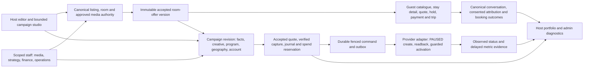

# Encho CR1: evidence-led golden path to a production decision

> **Reconciliation qualification, 4 October 2026:** This is a companion proposal written against the older dirty primary checkout. W0 truthful public discovery has since passed independent local acceptance and clean canonical integration; see `docs/implementation/W0_EXIT_ACCEPTANCE_2026_10_04.md` and `docs/implementation/W0_CANONICAL_INTEGRATION_2026_10_04.md`. Do not use this document's earlier W0 status, percentages or phase assumptions to override those receipts, the controlling blueprint or current decision registers. Later waves remain unaccepted.

**Status:** Engineering companion plan, 2 October 2026. This document does not approve a policy, migration, provider operation, payment, pilot or release. The [three-sided master blueprint](ENCHO_THREE_SIDED_OPERATING_PLATFORM_BLUEPRINT.md), [remediation blueprint](CR1_ENGINEERING_REMEDIATION_BLUEPRINT.md), [32-card corrective ledger](../implementation/CR1_REMEDIATION_WORK_PACKAGES.md), [external gate register](../implementation/CR1_EXTERNAL_GATE_REGISTER.md), Constitution and current decisions remain controlling. This plan orders their unfinished work around one independently testable business journey.

**Source identity:** Primary checkout `<repository-root>`, `main` at `6ec5b6602ab8e9c2cb4776ba5d178ae923876710` when inspected. The worktree was dirty before this plan; preserve and re-identify every existing edit before implementation or commit. Antigravity is temporarily unavailable and no implementation task is being dispatched from this document. Source observations below are a risk-based semantic review of named paths, **not** a claim that every repository document or code line was semantically reviewed. No full regression, deployed browser, provider, payment or production test was run for this planning pass.

## 1. Product outcome and the honest baseline

Encho's first sellable product is a managed path from a host's true room offer to a guest's fulfilled booking. The host owns the accommodation and chooses bounded commercial intent; Encho's scoped staff, versioned programs and adapters do the dangerous ad-platform work. A guest sees the same verified room, price, conditions and imagery that an ad promised. The host sees campaign state, actual provider-reported spend with its reporting window, canonical inquiries and bookings, and the distinction between a requested pause and a provider-confirmed pause. The admin can review evidence, approve an exact revision, operate within assigned authority and recover ambiguous remote outcomes without editing database rows.

The initial release slice is **one real property, one independently priced room offer, one dedicated campaign, one canonical inquiry and one guest booking path**. A second provider, several simultaneous flights, pooled campaigns, organic social publishing, advanced staff delegation and aesthetic expansion follow only after the slice survives failures and independent review. This is sequencing, not deletion of already implemented modules.

| Evidence category | Current finding | What it means |
|---|---|---|
| Historical completion | 48/48 original packages is disputed; 0/48 independently reaccepted and 0/32 corrective cards fully accepted in the current register. | Do not translate prior counts into a release percentage. |
| Provisional planning estimates from boardroom | Overall ~55%; Guest 47%; Host listing 60%; Host marketing 53%; Admin 62%. Live monitoring and fuel were not independently scored. | Directional estimates, not a measurement of current deployed behavior. This documentation pass does not change them. |
| Local foundation | Relational rooms/media, inventory holds, finance journals/quotes, durable outbox, campaign revisions, provider adapters, host/admin UIs and CRM modules exist. | Preserve these boundaries and connect them into real routes/workers. Class tests alone do not deliver a journey. |
| Guest commerce | `ListingDetailsNew.tsx` explicitly disables checkout; legacy production booking mutation returns 503. Legal/tax and commercial gates remain open. | A real guest cannot presently finish the target paid booking journey. |
| Provider operation | Google OAuth branding and partial Meta app/business identity captures exist, but Ads account eligibility, advertiser mapping and authenticated PAUSED create/readback do not. | No honest claim of live provider launch or safe spend activation. |
| Staging/roles | The primary Neon `.env` is not an isolated staging identity; deployed restricted LOGIN roles are unproved. | Local PostgreSQL evidence cannot certify deployed tenant isolation or migration readiness. |

### Newly identified P0 source findings to reproduce before repair

1. **Public card truth:** `components/ListingCard.tsx` fills displayed image slots with fixed Unsplash houses and derives lodging features and fixed privacy percentages from title/category. `src/lib/stayProjection.ts` projects mutable `listings.price`, `rooms`, `image_url` and `image_urls` into `/api/listings`, while the stay detail uses relational room/media authority. Source proves a reachable discrepancy path; a current production listing exhibiting it has **not** been observed. Real inventory cards must show only approved property media and supportable facts; an empty-media state is preferable to a false photograph. The fictional `/investor-showcase` remains isolated, labeled and non-bookable.
2. **Host media and room identity:** `HostForm.tsx` validates only its first three steps at submit and can persist an Unsplash URL when the property photo array is empty. A new listing defaults to draft and needs approved room media to publish, but an edit to an already published listing can change mutable image fields. Room upsert and photo binding can match by nonunique room type/name, which threatens a resort with two rooms of the same class. Reproduce mounted Host→Admin→catalogue/detail behavior before changing it.
3. **Publication writers:** The bounded PATCH status route now locks the listing and validates on one held PostgreSQL connection; two prior races are locally repaired and tested. Host listing/room writers, admin moderation and the draft-publish path do not yet share a single parent-first lock/version rule. Publication can still be invalidated by another writer. Immutable accepted offer versions and atomic publication audit remain undelivered.
4. **Live-status semantics:** Current `deliveryEvidence` adapter initializes both `isLive` and `isServingImpressions` false for fully active hierarchy observations. The engine requires both to set `deliveryConfirmed`, so the host's “Active at network” badge is not supported by that production adapter path, even if mocked tests inject true. This conservative behavior avoids false live claims; the UI needs truthful, separate *eligible*, *serving observed*, *reporting delayed* and *unknown* states, with provider-backed evidence for each.
5. **Fuel/top-up:** Per-campaign media meters and a four-card portfolio surface exist. They are useful and should be retained. There is no independently accepted canonical host top-up that joins accepted incremental quote, verified capture, journal/reservation, exact provider budget change/readback and ambiguous-outcome recovery. The retired legacy “refuel” flow must stay retired.
6. **Authority:** A persisted `users.role='admin'` currently grants broad marketing-admin routing, and marketing DB context has an admin/system RLS-bypass branch. The intended scoped workforce IAM has local work but no independently accepted deployed-role proof. Do not infer least privilege from a staff-looking UI.

These are source and local-test findings, not a production incident declaration. Preserve earlier local receipts and the new failing-before evidence separately. In particular, qualify the older statement that sparse public galleries never substitute unrelated media; the real `ListingCard` path currently can.

## 2. Target architecture and boundaries

**Authority contract:** The database, not the browser, determines seller, room, accepted price/conditions, inventory, media provenance, campaign account and available funds. Each accepted offer has an immutable version. A campaign revision pins the offer/property-discovery subject, approved asset bytes, effective strategy release, provider capability/account and finance scope. A worker reauthorizes a claimed job and compiles from that exact bound revision. A provider mutation is not successful until authenticated readback confirms the intended resource and state; a timed-out write is `RECONCILIATION_REQUIRED`, not retry permission. A provider status is not a metric, and a reported metric is not a captured booking.

**Finance contract:** Keep canonical `financeService`, accepted quotes, minor-unit amounts, balanced journals, idempotency and settlement. One flight has an authorized media amount and optional provider allocation. A top-up is a new explicit contract, never a mutable balance field. The proposed host fuel display shows `(authorized, reserved, observed provider spend, reporting as-of/window, estimated remaining, unallocated, refund pending)` by campaign and provider; unknown spend is `unknown`, not zero. Visual warnings may inform a host, but no pressure cue or guaranteed-return language may induce spend.

**Account model:** Zero Host OAuth is a product experience; it does not mean all unrelated hosts are one Google end advertiser. Google's current third-party policy calls for a separate serving account per end advertiser, managed under a manager account where appropriate; exact Encho/host advertiser-of-record classification must be approved for the actual topology. [Google third-party policy](https://support.google.com/adspolicy/answer/6086450?hl=en), [Google API account hierarchy](https://developers.google.com/google-ads/api/docs/concepts/account-types). Meta controls likewise depend on current permission/account capability. Encho's admin studio should expose every **supported and verified** operation needed for the released product, with a clear native-console task for billing, identity, appeal or an unsupported setting; “complete console parity” is not a truthful requirement.

**Operational model:** Keep the modular monolith, versioned contracts, PostgreSQL/RLS, dedicated workers, durable outbox and source-labeled observations. Use same-connection transactions and a parent-listing-first lock order for every writer touching published offer facts. Keep real media in an approved-origin pipeline with immutable hashes and rights evidence; never accept a remote image URL as verified by appearance. Gate checkout, activation, top-up and paid pool separately. Missing legal/provider/staging evidence cannot be generated by fixtures.

## 3. Three-sided experience to deliver

| Actor | Minimum usable path | Exact evidence shown | Failure behavior |
|---|---|---|---|
| Guest | Search real stays → view approved property/room media → choose an independently priced room and dates → server quote/hold → verified pay/confirm → own trip, cancellation/support. | Per-offer price basis, capacity, conditions, availability as-of, total taxes/fees from approved policy, confirmation only from captured payment and committed booking. | Stale offer/availability refreshes with changed terms; payment ambiguity shows pending/reconciliation; no synthetic reviews, viewer count or unrelated stock media. |
| Host | Create/edit a property and multiple distinct room offers → see moderation blockers → pick exact subject and approved creative → accept quote/finance and submit → see per-flight status, source-aware outcomes and fuel → request pause/top-up where permitted → respond to inquiries. | Difference between draft, admin approval, PAUSED provider creation, observed activation, delivery evidence and delayed metrics; per-provider authorized vs reported spend and last observation. | Disabled action explains prerequisite. Unknown remote/financial outcome is visible and retriable only through reconciliation. Host can safety-pause one flight without silently changing another. |
| Admin/scoped staff | Verify listing facts/assets and rights → release strategy/corridor versions → review exact campaign revision and funding → paused publish/readback → guarded activation and live observation → recover/settle/audit. | Before/after release diff, exact hash/version, actor, source IDs, correlation ID, financial ledger, provider responses with secrets masked, queued/observed pause. | Maker/checker separation, least privilege and emergency pause; no broad “god mode” bypass, no blind duplicate remote create or database-row repair as normal operation. |

AI proposes copy, feeder evidence or corrections with confidence and source hashes. It cannot fabricate amenities, relationship-demographic support, provider geo IDs, legal approval, spend authority or a conversion promise. Unavailable AI routes to human review or fail-closed deterministic rules. A photo/reel creative package independent of a property gallery still needs usage rights, exact-byte approval and an honest canonical landing subject.

### 3.1 Logical data contracts to implement against the reconciled catalog

These are **logical contracts**, not instructions to create duplicate tables or claim that a new migration number is available. The current migration history, especially applied 045 and recovered 047, must be reconciled before deciding whether an existing entity suffices or additive SQL is needed.

| Record | Immutable or versioned fields | Database invariant / lifecycle |
|---|---|---|
| Sellable room offer | Opaque public key, owner/listing/room identity, nightly-price basis in paise, currency, capacity, date/rate rules, cancellation/policy version, approved media hashes, provenance and acceptance actor/time. | Unique real room identity independent of display name/type. A new accepted version supersedes for *future* quotes only. Historical quotes/bookings/ads retain their exact version. Missing basis cannot publish. |
| Availability/hold | Offer version, nights, capacity units, hold expiry, actor, command UUID and state. | Atomic inventory contention; expiration and late capture have explicit outcomes. No UI calendar observation authorizes payment. |
| Quote/booking/payment | Server-calculated guest total and components, tax/fee policy version, hold, gateway order, signature/capture receipt, booking identity and fulfillment/refund status. | Idempotent acceptance and balanced journal effects; provider redirect is evidence of nothing. Confirmation requires verified capture *and* committed capacity. |
| Campaign revision | Host-owned exact offer or approved discovery subject, asset hash/rights, approved claims, intent, provider capability/account, strategy/corridor versions, requested dates/geo, maximum spend and content-review hash. | Every approval, funding reservation and provider command references the same revision hash. Admin change to a released profile affects only future drafts. |
| Finance reservation/top-up | Accepted campaign/incremental quote, cost base/tax/markup policy, provider allocation, verified capture, journal transaction, risk hold and command UUID. | Additional funds cannot increase provider budget until capture, reservation and authorized command exist. A repeated intent replays the same financial result; provider readback controls applied state. |
| Provider command/observation | Command ID, revision/account/resource IDs, desired state, lease/fence, request hash, remote outcome class, readback receipt, `observedAt`, reporting window and freshness. | Unknown remote result is durable and non-repeatable until reconciled. Status eligibility, delivery, spend and conversion reports are distinct observations with independent timestamps. |
| Inquiry/outcome | Scoped conversation and participants, consented attribution token, stable event UUID, canonical booking/capture/fulfillment ID. | No cross-tenant read; one canonical booking contributes once to portfolio captured-booking totals, while multiple touchpoints remain visible as attribution evidence. |

### 3.2 API and command boundaries

Retain existing mounted v2 routes where their contracts meet the requirements; route names below are **capabilities**, not permission to add parallel endpoints. All new inputs use strict Zod schemas at the trust boundary and parameterized SQL under a held connection.

1. `SaveOfferDraft(expectedVersion, changes, commandId)` validates ownership and accepted-field provenance, locks parent listing, writes draft/version/audit/outbox atomically; it never changes a currently accepted offer in place. `RequestPublication(offerVersion)` obtains the same lock, checks staff/host authority and exact approved assets/facts, then records a staff-review request or accepted publication according to the **unresolved** approval policy. A status flag alone cannot publish an unversioned room.
2. `GetPublicOffer(key, dates, guests)` and `QuoteOffer(key, dates, guests, commandId)` use the same immutable offer and current inventory authority. Public search, detail and SEO may omit unavailable sensitive fields but cannot substitute unrelated images, amenities or a different rate basis. The quote response includes immutable version/expiry; the browser cannot submit its own total.
3. `CreateHold`, `CreatePaymentOrder`, `AcceptSignedCapture` and `ConfirmBooking` remain separate state transitions. Each has a distinct idempotency key and authorization predicate. A captured but unconfirmable booking becomes an explicit refund/reconciliation obligation. Never infer capture from a client callback.
4. `SaveCampaignRevision` binds offer facts/creative/program/capability/account; `SubmitForReview`, `AcceptQuote`, `ReserveFunds`, `ApproveExactRevision`, `CreatePaused`, `VerifyReadback`, `Activate`, `RequestPause` and `VerifyPause` are separate commands and receipts. The right to safety-pause may remain available when optional approval or analytics are degraded; the right to activate may not.
5. `QuoteTopUp` shows incremental host charge, fee/tax and permitted channel split; `AcceptTopUp` captures/reserves; `RequestProviderBudgetChange` carries the exact allocation and revision; `ObserveBudgetReadback` makes an applied amount visible. Failed or unknown provider changes retain the captured-fund obligation and require settlement/recovery, not an optimistic meter increment.
6. Read projections expose `desiredState`, `observedState`, `stateObservedAt`, `metricSource`, `metricWindow`, `metricAsOf`, `reportingStatus`, `authorizedMinor`, `reportedSpendMinor`, `spendAsOf`, `remainingEstimateMinor|null`, `pendingTopUpMinor`, and `dataFreshness`. The UI labels *configured/eligible*, *delivery observed*, *report delayed*, *stale*, *unavailable* and *unknown*. An absent insight row cannot be mapped to zero without a provider-specific proven zero-data rule.

### 3.3 State and concurrency rules

- **Offer:** `DRAFT → REVIEW_REQUESTED → ACCEPTED → SUPERSEDED/WITHDRAWN`; the exact names may map to current persisted states, but transitions, authority and retained history must be explicit. Removing an approved image or changing a price starts a successor review or blocks serving the old claim. It cannot silently mutate an ad's approved snapshot.
- **Guest money:** `QUOTED → HELD → ORDER_PENDING → CAPTURE_VERIFIED → BOOKED`, with `EXPIRED`, `CAPTURE_UNKNOWN`, `REFUND_PENDING` and `RECONCILIATION_REQUIRED` branches. A booking-visible success is the joined inventory/payment/database fact, never a screenshot or browser redirect.
- **Ad:** Preserve the current persisted marketing workflow in the Constitution. The provider substate separately records `NOT_CREATED`, `PAUSED_REQUESTED`, `PAUSED_OBSERVED`, `ACTIVATION_REQUESTED`, `ENABLED_OBSERVED`, `PAUSE_REQUESTED`, `PAUSED_OBSERVED` and `OUTCOME_UNKNOWN` as evidence, not necessarily new enum columns. Observed enabled hierarchy is not equivalent to serving impressions.
- **Lock order:** All commands that can change an accepted/published listing's room/media facts lock the parent listing first, then the exact room/media rows in a deterministic order on **one** connection. An audit/outbox failure aborts the business transaction. Two writers on separate connections and a lost client response are mandatory tests.
- **Top-up:** Campaign budget authorization is monotone only after verified capture and exact quote acceptance. Provider applied budget may lag; if remote write outcome is unknown, freeze additional mutation for that resource until readback. Pausing one flight must not redistribute its unused funds to another without a separate accepted contract.

### 3.4 Design system and product behavior

Create one state vocabulary shared across Guest, Host and Admin: *draft, awaiting review, approved, payment pending, paused at provider, activation requested, observed eligible, delivery observed, reporting delayed, reconciliation needed*. Components should render evidence source and age in a secondary line and the human action in the primary line. The host's meter communicates remaining **authorized media budget estimate**, not a bank balance or a fabricated live burn rate. Use color plus text/icons, not color alone; reduced-motion and screen-reader equivalents are required. A campaign card contains the exact offer, channel, creative, accepted amount, provider-reported spend as-of, observed status and independent pause/top-up actions. The portfolio total deduplicates bookings without hiding that several flights touched one booking. Admin desks prioritize exceptions (unknown remote outcome, asset rights, stale approval, invoice drift) with filtered queues, stable deep links, correlation IDs, exact revision diffs and maker/checker actions. Any native-only task is explicitly identified rather than emulated with a nonfunctional switch.

## 4. Dependency-ordered delivery waves

These are reviewable **work batches**, not a redefinition of the original phase numbers. Each batch updates its existing R-card acceptance evidence, original P-package traceability and affected HARVO/decision notes. Prefer one or two targeted suites during development; run full regression, typecheck, lint and offline build at controlling P2/P4/P6/P8 exits. Use Node 24 and `scripts/testing/run.mjs`, disposable PostgreSQL with separate restricted LOGIN roles, real mounted HTTP/worker/browser paths, and named environment labels.

| Wave / owner / effort | Detailed engineering work and existing cards | Exit evidence and containment |
|---|---|---|
| **W0 — source, security and public truth**. Lead architect + Guest/Host; L; P0. | Freeze HEAD/index/worktree identity and reconcile applied migration 045/047 before allocating numbers (**R0-01/02/03/04**). Reproduce mounted public-card fallback/unsupported claims and same-class room collision. Remove stock-media insertion from real HostForm/card and make unknown facts absent rather than inferred; preserve isolated investor demo. Finish workforce/session and durable-command repairs (**R1/R2**). | Host edit of a published listing cannot place an unrelated image in public search/SEO/detail; missing media has an intentional accessible empty state; catalogue and detail agree or fail closed. Tests use real routes and a browser card, with negative other-tenant cases. Disable affected real publication if truth cannot be established. No migration runner on primary `.env` for a planning/test shortcut. |
| **W1 — canonical sellable offer and publication**. Guest commerce + Host/Admin; XL; P0. | Finish **R3-01**, plus R4-03/R4-04 fact binding. Define stable opaque public offer key and distinct room identity even when room type/name repeats. Create immutable approved offer version with seller, room, prices in paise, tax/policy reference, capacity, dates, conditions, inventory and approved media hashes. All host, admin media and draft/status writers lock the parent first, mutate through one reviewed authority or create a successor draft, and record audit/outbox atomically. Public catalogue/detail/host edit/admin moderation use the same accepted version. | Mixed budget/premium and two same-class suites remain independently identifiable and priced across all three surfaces. Two-connection races cover edit vs publish, moderation vs publish, rate change, media withdrawal and rollback. A changed accepted fact never silently alters a live offer/ad; old versions remain readable. If offer authority is missing, checkout and campaign publication stay closed. |
| **W2 — guest booking and service**. Commerce/payments + privacy/service; XL; P0. | Implement **R3-02.LOCAL/03/04** against synthetic policy vectors while preserving `LEGAL-01`/`COMM-01`. Server quote→capacity hold→gateway order→signed webhook capture→transactional booking/confirmation→own trip/cancel/refund. Join conversation and support through **R4-01/02**. Capture honest first-party inquiry and fulfilled-booking outcomes separately from ads. | Mounted browser/API journey works against disposable PG and payment sandbox, including 100-contender inventory, duplicate/out-of-order webhooks, lost COMMIT, late capture, foreign-user denial, refund ambiguity and journal balance. Live payable launch remains blocked until applicable signed policy and named payment evidence exist. Rollback stops new checkout but preserves webhook/reconciliation/refund obligations. P4 full exit required. |
| **W3 — truthful creative and host intent**. Marketing + design; L; P1. | Finish **R4-03/04**, then **R6-01**: exact offer/discovery subject, 1 image/reel/carousel package with approved rights/bytes, versioned provider program, bounded objective/intent/date/budget/feeder preference and server defaults. Replace mandatory Google keyword/provider jargon in ordinary host flow with optional advanced controls only where supported. AI assists but cannot approve. | Host creates a valid draft without Ads expertise; each provider-relevant field has schema, program bounds and actionable errors. Tests cover malformed assets, off-property claims, unsupported targeting/demographics, changed offer, stale revision, repeat submit, 360px/keyboard. Disable unsupported options rather than fall back to whole India or invent provider mappings. |
| **W4 — staff program, advertiser and provider path**. AdTech/infrastructure/security; XL; P0. | Complete **R5-01.LOCAL/02/03** and R1 workforce constraints. Bind actual advertiser/client account/capability to each revision and finance reservation. Release admin strategy/corridor versions by CAS with checker, diff and rollback for future drafts. Create exact resources PAUSED through fenced outbox; authenticate readback; separately authorize activation; protect inventory sellout, material offer change and emergency pause. | Wrong advertiser, unsupported feature, stale strategy, unknown create, partial child, absent exclusion, revoked staff, duplicate worker and delayed pause fail closed. Recorded fixtures and disposable PG/restart tests are local; authentic Ads eligibility and PAUSED create/readback remain **PROV-G/M** gates. Stop new creates/activation on rollback; keep pause/reconciliation available. |
| **W5 — fuel, finance and portfolio truth**. Finance + analytics/Host UI; XL; P0/P1. | Complete **R5-04** and **R6-02**. Add accepted incremental top-up quote, verified funds, journal/reservation and exact provider budget readback; preserve unknown outcome and refund/overdelivery policy gates. Model one flight per provider or explicit supported split allocation. Read-only four-flight portfolio shows separate provider state, metric window, status age, spend as-of and campaign-specific remaining amount. Deduplicate canonical booking ID in portfolio outcomes; show attributed booking vs causal lift distinctly. | Replayed click/webhook, two simultaneous top-ups, capture then network loss, provider rejection, spent-over-cap, pause-one-of-four and shared booking touchpoints produce no double charge, false balance or cross-tenant metric leak. Empty insights are `not yet reported` or source-qualified zero, never an invented live zero. Full P6 exit. Disable new top-ups without removing settlement/refund handling. |
| **W6 — CRM, operations and experience**. Product/design/ops/security; L; P1. | Finish **R4-01/02**, **R6-03/04** using the [guest–host CRM companion blueprint](CR1_GUEST_HOST_SERVICE_CRM_BLUEPRINT_2026_10_02.md): atomic first inquiry and exact-thread continuation, durable message/notification intent with consent, per-conversation scopes and service-case escalation; source-grounded AI drafts; host/admin status vocabulary; action prerequisite explanations; accessible map alternative, 360px and desktop layouts, reduced motion, keyboard/screen-reader checks, slow/offline/account-switch behavior. Do not promise channels or response SLAs until `PRIV-01`/`OPS-01` approval and transport proof. | Guest message accepted once; host receives truthful in-app event and can reply; outbox retries/restart with no lost accepted message; staff visibility is scoped/audited. UX study covers guest quote and trip, host create/monitor, staff review/reconcile, all error states. No raw contact censorship without approved policy and no fake “online viewers.” |
| **W7 — independent release and bounded pilot**. Release owner + independent reviewer + founder/legal/provider owners; XL; P0 before paid launch. | **R7-01/02/03/04**: reconcile migration byte/checksum and deployed catalog; immutable artifact and offline build; all relevant original packages reaccepted against current source; isolated Neon staging with separate non-BYPASSRLS roles and restore drill; owner-approved provider PAUSED canary with zero spend; then signed limited pilot policy and stop-loss. | Full suite/tsc/lint/build, real restricted-role adversarial tests, browser/device/accessibility/load/restore evidence, spend limits, audit/alerts and rollback runbook. Google test accounts prove API behavior only; they cannot provide serving/billing evidence. No public launch or “97% certified” assertion while external gates stay open. |

**Parallelism:** W0 migration identity, public card truth and workforce sessions can be handled in disjoint files. W1 writer authority must have a single contract owner; W2 booking can prepare policy interfaces while waiting for W1 and legal approval. Provider adapter fixtures and UX prototyping can proceed independently of authenticated canary, but cannot authorize one. Reviewers must not accept their own protected work.

## 5. Quality, security and operational test contract

1. **Traceability:** Every R-card handoff names source commit/tree/diff, original P acceptance criteria, routes/tables/components/workers, source of truth, negative tests, rollback and evidence level (`SOURCE`, `UNIT`, `INTEGRATED_LOCAL`, `BROWSER_LOCAL`, `STAGING`, `PROVIDER`, `LEGAL`, `PILOT`). Local fixtures never upgrade themselves into remote evidence.
2. **Threat model:** Cross-host object access, compromised staff, forged price/media/provenance, stale approvals, duplicate payment/provider commands, lost COMMIT, revoked workforce session, provider restriction, consent withdrawal, synthetic receipts and cross-surface drift. `FORCE RLS` tests use actual separate non-bypass LOGIN roles. Audit/outbox entries and business state commit together.
3. **Worker recovery:** Two processes/connections claim the same job; stale fencing token loses authority; unknown remote write is read back before any retry; old service-worker queue migrates without privilege escalation; logout/account switch revokes replay. Simulate provider 401/403/429/timeout, overspend, correction and delayed reports.
4. **Performance and accessibility:** Adopt workload-defined budgets before sign-off; the remediation blueprint proposes API projection and durable command-acceptance p95 ≤500 ms excluding external calls, zero unexplained financial imbalance, WCAG 2.2 AA journey coverage and 44px product touch targets. Test real 360px and desktop browsers, not CSS-class assertions. Record dataset, concurrency, network, error rate and p95; simplify visual motion when it impairs task completion. These are **proposed** targets, not measured present performance.
5. **Observability:** Correlation from guest/host/admin action through quote, journal, outbox and provider resource; redacted provider errors; freshness, lease age, DLQ depth, pause request/confirmation lag, stale metric age, capture mismatch and audit gaps. Distinguish telemetry collection rate from UI poll rate. Escalation action and owner are part of each alert.
6. **Release/rollback:** Build offline with sanitized environment. Migration preflight is explicitly read-only on a named target and held connection; apply only authorized immutable SQL through the existing advisory lock. Canary remains PAUSED and zero spend. Rollback stops new acceptance/activation, preserves readback, webhook/refund/reconciliation and historical contracts, and produces a new release rather than editing applied migration bytes.

## 6. Business measurement and the requested 97% target

The requested **Overall ~97%, Guest 96%, Host listing 95%, Host marketing 99%, live monitor 95%, fuel 95%, Admin 98%** are *aspirational planning scores*. They are neither proof of investor-grade reliability nor a valid weighted calculation from the current 0/32 and 0/48 registers. Do not change percentages after a document, demo or isolated test pass. If a score remains useful for management, the product/release owner must first approve a denominator of independently testable journeys and evidence weights; scores must be computed from accepted journeys, not UI surface area or passing test count. Legal/provider/staging blockers must be displayed as separate binary gates, never diluted by a high UI score. No estimate can honestly be called “production certification.”

The pilot should measure guest quote-to-verified-booking completion, oversell/duplicate-charge rate, host time to a valid submitted campaign, staff review/recovery time, inquiry first-response distribution, provider observation freshness, authorized-versus-reported spend variance, attributable captured/fulfilled bookings, host retention and support burden. Targets, sample size and stop-loss require named owner approval before a paid trial. Clicks and impressions are useful observations; neither proves profit or incremental lift. Google cautions that reporting has freshness and zero-row nuances; record the provider's source/time window rather than advertising the UI as instantaneous. [Google reporting guidance](https://developers.google.com/google-ads/api/docs/productionize/manage-data-efficiently?hl=en), [zero-metric behavior](https://developers.google.com/google-ads/api/docs/reporting/zero-metrics).

Competitor references inform design, not acceptance: [Etsy Offsite Ads](https://help.etsy.com/hc/en-us/articles/360000338367-How-Etsy-s-Offsite-Ads-Work) shows the value of seller-visible traffic/orders/fees, but its attributed-sale fee model is different from Encho's proposed cost-plus campaign financing. [Sojern's platform](https://www.sojern.com/platform) presents hospitality outcome reporting and operator support; [Evocalize](https://evocalize.com/) presents centrally governed local programs. Those vendors' descriptions do not prove their conversion rates will transfer to Encho. The usable lesson is one accountable record of an accepted offer, campaign cost, observed demand and actual booking.

## 7. Open decisions and external dependencies

| Decision/gate | Options and recommendation | Owner and effect |
|---|---|---|
| Published offer mutation | (A) In-place mutable public facts; (B) immutable accepted version with successor draft and re-review. **Recommend B**. | Founder/product + commerce/security. Until approved, contain writes that would invalidate publication; no silent live change. |
| Listing approval authority | Current host-facing text says staff review; some status route behavior permits owner-requested publication after photo minimum. **Recommend explicit staff approval of accepted offer facts**, with host request as a separate state. | Product/ops; affects Host/Admin UI, API and audit. |
| Advertiser-of-record | Separate end-advertiser serving accounts managed under Encho MCC versus a documented Encho advertiser-of-record arrangement where actually accepted. **Default to the former for Google**, pending provider/counsel evidence. | Provider owner/legal; `PROV-G-01` blocks activation. |
| Ads charges and top-up | Specify cost base, tax, markup, fees, rounding, overdelivery, unused funds and refunds in a host-accepted versioned contract. No trapped-cash default. | Founder/finance/Indian CA/lawyer; `COMM-01`, `LEGAL-01`. |
| Staff/CRM policy | Approve role combinations, checker thresholds, participant disclosure, contact handling, retention, support hours and SLA. | Security/ops/privacy; `IAM-01`, `PRIV-01`, `OPS-01`. |
| Environment and proof | Create isolated staging, restricted web/worker roles, current Ads capability/account evidence and approved PAUSED zero-spend canary before paid pilot. | Infrastructure/provider/founder; `ENV-01`, `DB-01`, `PROV-*`, `PILOT-01`. |

## 8. Antigravity handoff when available

Do not send an unbounded “make Encho 10/10” prompt. Send one card-scoped task with owned files and an impact note. **First proposed assignment:** reproduce and repair real-inventory `ListingCard`/`HostForm` fabricated-media and unsupported-claim paths; preserve `/investor-showcase`. Require mounted failing-before tests of an already published host edit and public card/detail/SEO, two same-class rooms, 360px browser inspection, targeted sanitized tests, rollback and exact diff. A separate worker may reproduce the admin/host cross-writer publication race but must not edit the same writer contract until its owner signs the lock/version design. Codex reviews the actual worktree, runs independent adversarial checks, rejects overbroad edits and updates the existing R-card evidence. If Antigravity remains unavailable, stop delegated implementation at a safe checkpoint; keep the plan and prior local evidence intact.

## 9. What can be promised

Engineering can promise a disciplined sequence, preservation of correct existing code, truthful evidence labels, a bounded first journey, independent review of Antigravity changes and a clear go/no-go decision. It **cannot promise** a date, a 97% score, guaranteed bookings/ROAS, provider approval or production certification without the external decisions and empirical trial. The expected deliverable is a system where a real host can list and market an approved offer and a real guest can book it **only after** the legal, provider, finance, security and deployment gates prove that journey safe. Until then, keep incomplete money/spend actions unavailable and report the exact blocker rather than a reassuring percentage.

## 10. Reverification anchors for the first implementation reviews

The following line positions refer to the inspected source tree and can move with subsequent edits. The owning engineer must re-open the current revision, not blindly implement from this list.

| Boundary | Source anchor | First proof to capture |
|---|---|---|
| Real public card imagery and unsupported privacy | `components/ListingCard.tsx:393-407`, `:622-640` | Mounted card with missing approved media and unrelated fallback, then corrected empty-media/fact behavior. |
| Host submit/media authority | `components/HostForm.tsx:716`, `:785-799`; `server.ts:3883-4160` | Already-published host edit through HTTP into public catalogue/detail; same-tier room identity. |
| Public catalogue vs detail | `server.ts:13975-13982`; `src/lib/stayProjection.ts:481-518`; `src/server/guest/publicStayAuthority.ts:27-56` | Same offer/version/price/approved photo from search to detail, including no date and changed-date labels. |
| Current publication fix and residual writers | `server.ts:4168` onward; `src/server/media/mediaModerationService.ts:81` onward; `docs/audits/cr1-remediation/r3-01/R3_01_PUBLICATION_TOCTOU_HANDOFF.md` | Parent-first two-connection races for host, admin and draft-publish writers, not just PATCH status. |
| Disabled guest checkout | `components/ListingDetailsNew.tsx:393-400`; `server.ts:15415-15421` | Prove local canonical quote/hold/capture/booking before considering approved live enablement. |
| Provider delivery status | `src/lib/providers/deliveryEvidence.ts:7-11`, `:43-56`; `src/lib/marketing/engine.ts:158-166` | Real-adapter eligible vs observed-serving state and UI copy without injected true flags. |
| Existing host marketing/fuel | `components/marketing/CampaignStudio.tsx:184-204`; `components/marketing/MediaBudgetEvidence.ts:46-107`, `:640-726` | Preserve independent per-flight meters while testing source/time/unknown semantics. |
| Broad admin/DB context | `src/server/marketing/router.ts:45-56`; `src/lib/marketing/database.ts:5-6` | Restricted-role and scoped-workforce denial for protected strategy/finance/provider actions. |

**Documentation trace:** Founder room-offer/creative decisions and objections to unsupported controls are in `docs/harvo/BOARDROOM_DISCUSSION_037.md`; Host/Admin current-state analysis is in `docs/harvo/BOARDROOM_DISCUSSION_038_HOST_ADMIN_REALITY.md`; exact card criteria and evidence levels are in `docs/implementation/CR1_REMEDIATION_WORK_PACKAGES.md`. `ENCHO_BUSINESS_PLAN_AND_STRATEGY.md` is a historical strategy document whose older fixed ad-fee, universal serving-account and trapped-cash assumptions are explicitly superseded by its qualification note and current Constitution/decisions. A structural inventory found 393 Markdown/TXT files after adding this plan; it is not semantic validation of all 393.

## 11. Founder inputs, engineering responsibilities and release ladder

Architecture cannot substitute for signed policy, provider authority, a real cohort or operational ownership. The founder's CEO-level implementation authorization enables local engineering; it does not make a primary `.env` connection into staging or a branding screenshot into an Ads operation. The following are **inputs to supply**, not requests for passwords in chat. Store secrets in a named secure source; provide document/branch/account identifiers and evidence paths to reviewers.

| Input the founder must arrange | Exact artifact or decision | Engineering work possible before it arrives | Release action blocked until it arrives |
|---|---|---|---|
| **Real resort and offer** | Permission from a named host, verified property/media rights, exact distinct room IDs, dated price/inventory/occupancy/conditions and a named host/admin test account; agree which data may be used in isolated staging. Select the first dedicated campaign provider and keep the other explicitly unavailable until its separate evidence exists. | Build canonical contracts and synthetic adversarial fixtures; repair public truth. | Authentic one-resort pilot and claims that approved ads reflect a real bookable room. A one-provider pilot cannot certify both channels. |
| **Indian legal and commercial approval** (`LEGAL-01`, `COMM-01`) | Written CA/tax-lawyer and founder-approved marketplace/merchant role, GST/withholding, invoice, cancellation/refund/payout treatment; ad cost base `C`, markup `p`, tax, overdelivery, unused funds, top-up and host disclosure examples with effective date. | Implement versioned interfaces and synthetic tests behind disabled live mutation. | Paid guest booking, customer-capital ad funding/top-up, invoicing and financial-product promises. |
| **Google/Meta account-owner evidence** (`PROV-G-01`, `PROV-M-01`) | Current Ads developer/API access and permission level, advertiser/serving-account mapping, Meta app/business/ad-account/page/Instagram/pixel bindings, allowed operations, billing and owner-authorized PAUSED create/readback scope. Branding alone is insufficient. | Build capability matrix, local fixtures, denied-state tests and operator runbook. | Authentic provider canary, activation and a claim of managed Google/Meta delivery. |
| **Isolated environment and restricted roles** (`ENV-01`, `DB-01`) | Named Neon staging branch/project, separate secret file/store, migration-owner plus web/worker/issuer LOGIN roles without superuser/BYPASSRLS, restoration owner and credentials handled outside Git. | Disposable PostgreSQL tests, offline build and read-only migration-history analysis. | Staging certification, remote migration rehearsal, production cutover and multi-tenant release assertion. |
| **People and escalation** (`IAM-01`, `OPS-01`) | Named accountable strategy reviewer, media/rights reviewer, finance operator, incident on-call and independent checker; approved forbidden role combinations, step-up/amount thresholds, business hours and host/guest response commitments. | Build deny-by-default roles, queues and measured local drills. | Broad staff production access, maker/checker acceptance and any guaranteed support SLA. |
| **CRM/privacy and AI processing** (`PRIV-01`) | Approved participant/staff disclosure, consent, contact-sharing/redaction rule, retention/deletion schedule, channel opt-in and AI-use notice. | Build scoped in-app conversations, audit and opt-out-safe behavior. | External alerts, staff monitoring and automatic message rewriting beyond approved policy. |
| **Pilot charter** (`PILOT-01`) | One host/offer, named providers/accounts, maximum funds and daily/lifetime loss, dates, stop triggers, approvers, escalation contact, refund/support plan, success/failure measures and signed go/no-go authority. | Prepare canary, reconciliation dashboard and rollback drill with zero spend. | Any real ad spend or general public-launch claim. |

**Engineering lead's accountable outputs:** (1) source/migration/evidence identity and a frozen reviewed artifact; (2) P0 public-media/offer/writer corrections with failing-before and fixed-after mounted tests; (3) guest quote/hold/capture/booking/refund path under approved contracts; (4) exact reviewed campaign→funding→PAUSED provider→readback→guarded activation path; (5) source-aware live monitor and safe top-up; (6) scoped workforce/CRM, accessibility and incident tooling; (7) independent security/performance/recovery validation; (8) deployment, rollback and evidence receipts. Antigravity may implement bounded slices; the engineering lead reviews actual diffs, independently reruns negative tests and refuses to count incomplete work as accepted. None of these outputs can be replaced with a slide deck or a percentage.

### Four decisions, not one 97% sticker

1. **Local integrated candidate:** All applicable critical corrective cards and original journey predicates have independent review; full sanitized tests/typecheck/lint/offline build, real disposable PostgreSQL/role/restart tests and production-built browser journeys pass on one frozen artifact. This is software evidence, not permission to collect capital or spend.
2. **Staging candidate:** The *same* artifact and reconciled immutable migrations run in a named isolated Neon environment with actual restricted roles, a restore drill, consent-safe notifications and no remote side effect outside the approved scope. Primary `.env` is not a staging substitute.
3. **Provider/commerce pilot entry:** After a separately reviewed **production** read-only schema/grant/artifact preflight and shadow window (`R7-02.PROD`), exact advertiser/account/capability and legal/commercial/privacy/IAM/ops policies are approved. Owner-authorized, zero-spend PAUSED create/readback proves configuration for the **same target/account/revision**; the founder then signs a bounded paid-pilot charter. A staging canary does not certify production. Provider test accounts do not serve ads or demonstrate billing/delivery. [Google test-account limits](https://developers.google.com/google-ads/api/docs/best-practices/test-accounts).
4. **Observed pilot and public-release decision:** Daily reconcile captures, host charges, provider invoices/spend, bookings/refunds, inquiries and incidents; evaluate predetermined stop-loss and experience thresholds against the named cohort. Independent reviewer issues `RELEASE_ACCEPTED` or `HOLD` for the exact artifact/environment. A clean pilot can justify bounded expansion; it cannot by itself prove product-market fit or a universal 10/10 standard.

**Percentage discipline:** If management still wants 96/95/99-style progress figures, first approve a domain-specific denominator of executable journeys and evidence grades. A critical open gate must prevent a “production ready” label even if most UI tasks are done. Report at least three dimensions separately: accepted local/integrated corrective cards (of 32), independently reaccepted original packages (of 48), and named external gate outcomes. Do not mathematically average these into one comforting score. The 97% target can be a planning aspiration, never a substitute for the four release decisions above.

| Requested planning target | Minimum evidence before the target could be *considered* credible | Example disqualifier despite polished UI |
|---|---|---|
| **Guest 96%** | Real-offer search/detail truth; accepted dated quote and inventory hold; signed captured payment; committed booking; own-trip, cancellation/refund and support; real restricted-role staging and legally approved transaction policy; mobile/accessibility/failure recovery. | Checkout remains disabled, payment redirect counted as booking, false listing photograph or unsupported final price. |
| **Host listing 95%** | Distinct same-type/mixed-price rooms; approved and rights-bound media; Host edit, Admin moderation and Guest presentation share one accepted offer version; post-publication edits require successor review; real browser usability. | Stock-house fallback, type/name room collision or a writer that invalidates a published offer. |
| **Host marketing 99%** | Bounded host setup; exact approved creative/offer; accepted funding; capability-backed **Google and Meta** account mapping and separate PAUSED create/readback/activation/pause/recovery paths; actual pilot observations in the authorized scope. | Only one provider is evidenced, universal native-control claim, ambiguous remote create blindly retried or spend started without review/funding. |
| **Live monitor 95%** | Four independent concurrent flights in a mounted/browser test; authenticated provider status and reports with source/window/freshness; first-party inquiry and deduplicated captured/fulfilled booking outcomes; stale and no-data behavior demonstrated. | `LIVE` inferred from configured status, missing report treated as zero or the same booking counted in four campaigns. |
| **Fuel gauge 95%** | Per-flight/provider authorized amount, observed spend as-of, estimated remaining and pending obligations; pause-one-of-many; incremental accepted quote→verified funds→journal/reservation→provider budget readback→unknown-outcome/refund/overdelivery reconciliation; host-visible tax/fee terms. | A visual meter alone, direct balance update, unapproved trapped credit or top-up shown as applied before provider readback. |
| **Admin 98%** | Scoped workforce roles and maker/checker, verified media/offer review, versioned program/corridor release, exact revision approval, provider/finance diagnostics, audited recovery, independent deployed-role and operator drill evidence. | `users.role='admin'` remains a universal production bypass or a staff action has no auditable durable result. |

The percentages have no defensible mathematical precision until their denominators, criticality weights, environment and confidence level are signed off. “96%” should never hide a missing 4% that contains payment capture, tenant isolation or legal approval.
