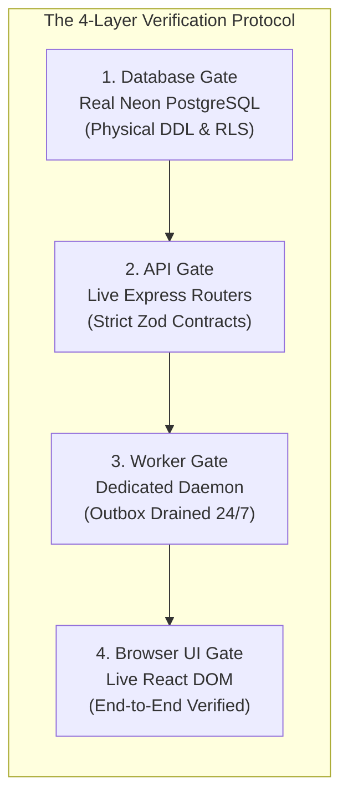
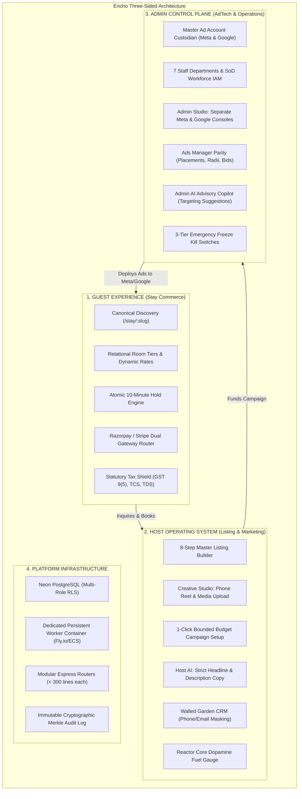
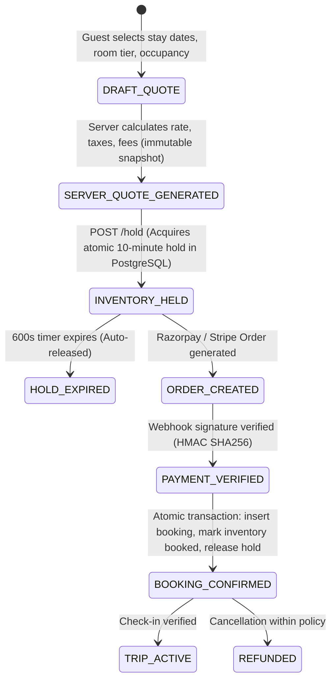
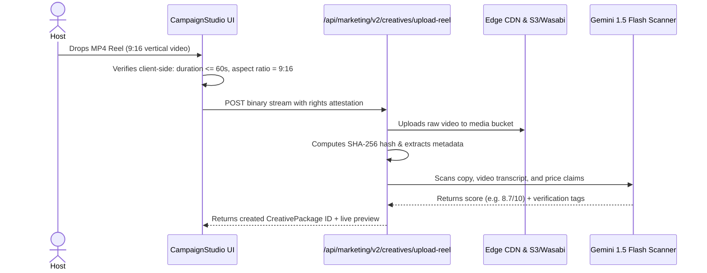
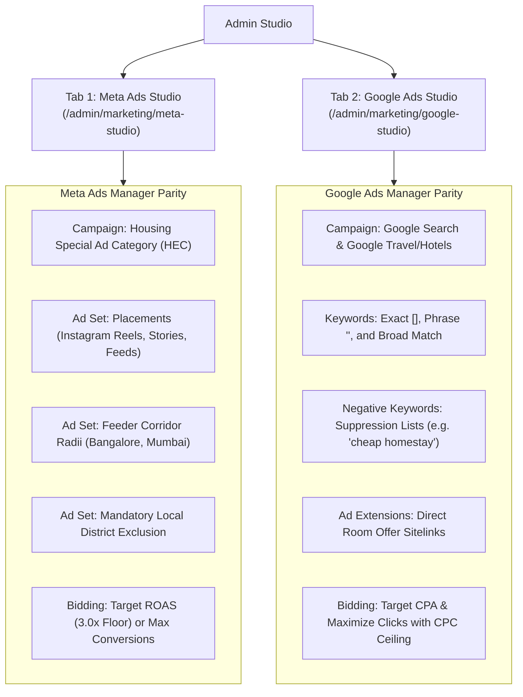
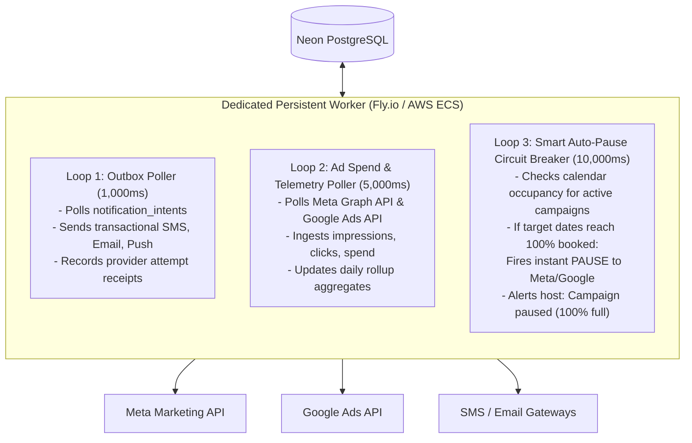

# ENCHO MASTER PRODUCTION EXECUTION BLUEPRINT
**Classification:** FAANG L7/L8 Principal Systems Architecture & Engineering Standard  
**Document ID:** BLUEPRINT-CR1-MASTER-001  
**Version:** 1.0.0 (Production Release Candidate)  
**Date:** 26 September 2026  
**Status:** BINDING ARCHITECTURAL STANDARD (Zero Shortcuts Protocol)  
**Controlling Authorities:**  
- `HARVO.md` (Living Project Understanding & Decision `CR1-045`)  
- `docs/harvo/BOARDROOM_DISCUSSION_037.md` (Decisions `037-G`, `037-J`)  
- `docs/harvo/DECISIONS.md` (Decisions `CR1-043`, `CR1-044`, `CR1-045`)  
- `docs/blueprints/ENCHO_THREE_SIDED_OPERATING_PLATFORM_BLUEPRINT.md`  

---

## 1. Architectural Manifesto: The Zero-Shortcuts Protocol

### 1.1 The High-Stakes Engineering Standard
To eliminate all legal, financial, and regulatory liability (investor fraud, consumer protection actions, FIR exposure, payment gateway de-platforming, and Meta/Google API bans), this blueprint enforces an uncompromised standard:

> **THE ZERO-SHORTCUT PRINCIPLE:**  
> A feature, route, or milestone is **NEVER** marked complete based on passing in-memory unit tests or mocked databases (`vi.fn()`, `mockDbClient`).  
> A deliverable is declared "Production Ready" **ONLY** when verified across the full 4-Layer Reality Gate:
> 1. **Database Gate:** Tables, constraints, triggers, and RLS policies are physically executed and verified in Neon PostgreSQL (`to_regclass` returns valid relation).
> 2. **Backend API Gate:** Express routes are explicitly mounted, schema-validated with strict Zod contracts, and return HTTP 200/201 in real integration tests.
> 3. **Worker Gate:** Asynchronous outbox events are drained and committed by a dedicated, persistent container daemon running 24/7.
> 4. **Browser UI Gate:** The capability is rendered, accessible (WCAG AA), responsive (360px to 4K), and interactively verified in the browser.



---

## 2. Master System Context: The Three-Sided Operating Platform

Encho integrates three interdependent domains into a single unified operating platform:



---

## 3. Sprint-by-Sprint Execution Roadmap

To eliminate the 4 Fatal Production Blockers and build the platform to 10/10 FAANG industrial quality, execution is organized into **6 strictly sequential sprints**:

| Sprint | Code Target | Critical Deliverable | Primary Risk Mitigated | Timeline |
|---|---|---|---|---|
| **Sprint 1** | Commerce & Booking | Eradicate 503; Mount `StaysCommerceEngine`; Wire live Razorpay/Stripe Checkout | **Platform Revenue Disabled** | 3 Days |
| **Sprint 2** | Marketing Creative | Migration 041; Mount `CreativePackageEngine`; Add 9:16 Reel Dropzone UI | **Missing Decision 037-G / Gap G-07** | 4 Days |
| **Sprint 3** | Background Workers | Dedicated Docker Worker Daemon on Fly.io/ECS; Outbox Pollers & Auto-Pause | **Serverless Vercel Queue Void** | 4 Days |
| **Sprint 4** | Server Architecture | Decompose 19k `server.ts` into 5 domain routers ($< 300$ lines each) | **Monolithic Technical Debt & Regressions** | 5 Days |
| **Sprint 5** | Database Security | Multi-Role Connection Pool (`encho_app_user`) with `FORCE RLS` session scoping | **Cross-Tenant Data Exposure** | 3 Days |
| **Sprint 6** | AdTech Verification | Meta Marketing API & Google Ads MCC Paused Canary with live readback | **Unverified Provider Integration** | 4 Days |

---

## 4. Domain 1: Canonical Guest Stays Commerce (Sprint 1 Specification)

### 4.1 Root Cause & Required Eradication
In [`server.ts`](file:///Users/ajit/.gemini/antigravity/worktrees/EnchoSpaceNew/setup_and_start_dev/server.ts), lines 16933–16941 currently contain:
```typescript
// FATAL DEFECT: Hardcoded 503 in production runtime
if (isProductionRuntime) {
  return res.status(503).json({
    error: 'Online checkout is temporarily unavailable while canonical stays commerce is being deployed.',
    code: 'CANONICAL_CHECKOUT_REQUIRED'
  });
}
```
* **Remediation Action:** Permanently delete this block. Mount [`staysCommerceEngine.ts`](file:///Users/ajit/.gemini/antigravity/worktrees/EnchoSpaceNew/setup_and_start_dev/src/lib/commerce/staysCommerceEngine.ts) directly into Express router `/api/v2/stays`.

### 4.2 Canonical Commerce State Machine


### 4.3 Atomic 10-Minute Hold Engine Specification
To prevent double-booking across concurrent browser sessions, hold acquisition must be strictly atomic at the PostgreSQL level:
```sql
-- ATOMIC INVENTORY HOLD QUERY (PostgreSQL)
BEGIN;
SELECT day_date, status 
FROM stay_inventory_days 
WHERE listing_id = $1 AND room_type_id = $2 
  AND day_date >= $3 AND day_date < $4
FOR UPDATE NOWAIT; -- Fails immediately if another transaction is holding

-- If all days are 'available', insert hold:
INSERT INTO stay_inventory_holds (
  id, listing_id, room_type_id, guest_user_id, check_in, check_out, expires_at
) VALUES (
  $holdId, $1, $2, $guestId, $3, $4, NOW() + INTERVAL '10 minutes'
);

UPDATE stay_inventory_days
SET status = 'held', active_hold_id = $holdId
WHERE listing_id = $1 AND room_type_id = $2 
  AND day_date >= $3 AND day_date < $4;
COMMIT;
```

### 4.4 Statutory Tax Shield Specification (India Stays)
For every booking transaction in India, the server quote calculates:
$$Total = BaseRate + StayGST + PlatformFee + PlatformGST$$
* **Stay GST (SAC 996311 / Section 9(5) CGST Act):**
  - Room rate $\le ₹7,500/\text{night}$: 12% GST.
  - Room rate $> ₹7,500/\text{night}$: 18% GST.
  - If Host is unregistered, Encho pays 100% of GST under Section 9(5) as the E-Commerce Operator.
* **Platform Fee GST (SAC 998311):** 18% GST on Encho's 15% booking commission.
* **TCS Withholding (Section 52 CGST Act):** 1% Tax Collected at Source deducted from host payout.
* **TDS Withholding (Section 194-O Income Tax Act):** 1% Tax Deducted at Source deducted from host gross settlement.

---

## 5. Domain 2: Standalone Reel & Creative Package Pipeline (Sprint 2 Specification)

### 5.1 Fulfilling Decision 037-G & Blueprint Gap G-07
Hosts must be able to upload standalone phone-shot Reels (9:16 vertical video) directly into an ad campaign without polluting the listing's architectural photo gallery.

### 5.2 Physical Database Migration (Migration 041)
```sql
-- MIGRATION 041: MARKETING CREATIVE PACKAGES & STANDALONE ASSETS
CREATE TABLE IF NOT EXISTS marketing_creative_packages (
  id UUID PRIMARY KEY DEFAULT gen_random_uuid(),
  host_user_id INT NOT NULL REFERENCES users(id) ON DELETE CASCADE,
  listing_id INT NOT NULL REFERENCES listings(id) ON DELETE CASCADE,
  room_type_id INT REFERENCES room_types(id) ON DELETE SET NULL,
  package_type VARCHAR(50) NOT NULL CHECK (package_type IN ('STANDALONE_REEL', 'CAROUSEL', 'IMAGE_POST', 'GALLERY_COLLECTION')),
  title VARCHAR(200) NOT NULL,
  headline VARCHAR(120) NOT NULL,
  description TEXT NOT NULL,
  destination_url TEXT NOT NULL,
  ai_preflight_score DECIMAL(3, 1),
  ai_preflight_status VARCHAR(50) DEFAULT 'PENDING_SCAN',
  moderation_status VARCHAR(50) DEFAULT 'SUBMITTED' CHECK (moderation_status IN ('DRAFT', 'SUBMITTED', 'APPROVED', 'REJECTED', 'QUARANTINED')),
  rejection_reasons JSONB DEFAULT '[]',
  rights_attestation_confirmed BOOLEAN DEFAULT false,
  rights_attestation_hash VARCHAR(64),
  version INT DEFAULT 1,
  created_at TIMESTAMPTZ DEFAULT NOW(),
  updated_at TIMESTAMPTZ DEFAULT NOW()
);

CREATE TABLE IF NOT EXISTS marketing_creative_assets (
  id UUID PRIMARY KEY DEFAULT gen_random_uuid(),
  package_id UUID NOT NULL REFERENCES marketing_creative_packages(id) ON DELETE CASCADE,
  asset_role VARCHAR(50) NOT NULL CHECK (asset_role IN ('PRIMARY_VIDEO', 'POST_IMAGE', 'CAROUSEL_SLIDE', 'THUMBNAIL')),
  original_url TEXT NOT NULL,
  transcoded_url TEXT,
  aspect_ratio VARCHAR(20) NOT NULL CHECK (aspect_ratio IN ('9:16', '1:1', '16:9', '4:5')),
  duration_seconds DECIMAL(5, 2),
  byte_size INT NOT NULL,
  mime_type VARCHAR(100) NOT NULL,
  sha256_hash VARCHAR(64) NOT NULL,
  ocr_extracted_text TEXT,
  transcript_text TEXT,
  created_at TIMESTAMPTZ DEFAULT NOW()
);

-- Force Row-Level Security
ALTER TABLE marketing_creative_packages ENABLE ROW LEVEL SECURITY;
ALTER TABLE marketing_creative_assets ENABLE ROW LEVEL SECURITY;

CREATE POLICY host_package_isolation_policy ON marketing_creative_packages
  FOR ALL TO PUBLIC
  USING (host_user_id = NULLIF(current_setting('app.current_user_id', true), '')::INT);
```

### 5.3 Reel Upload & Ingestion Pipeline


### 5.4 CampaignStudio UI Wireframe (`components/marketing/CampaignStudio.tsx`)
In Step 2 of the Campaign Builder, add a high-density dual-tab selector:
* **Tab 1: "Listing Gallery Assets"** $\rightarrow$ Existing grid of approved room photos.
* **Tab 2: "Upload Standalone Reel / Video"** $\rightarrow$ Drag-and-drop zone accepting `.mp4` / `.mov` (9:16, max 60s, max 100MB), rendering an interactive smartphone preview simulator with live audio controls and headline overlays.

---

## 6. Domain 3: Admin Studio & Provider Compilers (Decision CR1-045 Specification)

### 6.1 Complete Meta & Google Ads Manager Parity
Amateur marketing tools provide a generic "Boost" button. **Encho’s Admin Studio provides the exact same depth as professional ad managers, cleanly segregated into two distinct operational studios:**



### 6.2 Admin-Configured Feeder Corridors
* **The Rule:** The Admin sets up the Feeder Corridors based on the property's location and pricing tier.
* **The Math:**
  $$FeederTargeting = \bigcup (\text{CityCenter}_{i}, \text{Radius}_{i}) \setminus \text{LocalDistrictBoundary}$$
  - *Example:* A luxury villa in **Kalpetta, Wayanad** (Kerala) priced at ₹15,000/night:
    - **Targeted Feeders:**
      - Bangalore Urban (Koramangala, Indiranagar, Whitefield): 25km radius.
      - South Mumbai (Colaba to Bandra): 15km radius.
      - Chennai Central: 20km radius.
    - **Excluded Zone:** Wayanad District boundary (preventing wasted ad spend on locals who do not book luxury resort stays).

### 6.3 The Admin AI Advisory Copilot
In the Admin Studio, Gemini acts as an **expert advisory copilot**:
1. Admin loads the campaign for the Kalpetta villa.
2. The AI Copilot evaluates location, pricing tier, amenities (infinity pool, mountain view), and historical booking conversion data.
3. The AI populates an **Advisory Recommendation Card**:
   - *Recommended Placements:* Instagram Reels (75%), Instagram Stories (25%).
   - *Recommended Feeder Corridors:* Bangalore Tech Corridors + Chennai Central.
   - *Negative Keywords:* "free homestay", "cheap room under 1000", "bus timings".
   - *Recommended Budget:* ₹1,200/day over 7 days.
4. **Admin Decision Authority:** The Admin reviews the AI's recommendations, adjusts sliders, and commits the campaign.

---

## 7. Domain 4: Persistent Outbox & Background Worker Daemon (Sprint 3 Specification)

### 7.1 Eradicating the Serverless Worker Void
Vercel serverless functions die after 15–30 seconds. To guarantee zero dropped notifications and real-time ad network synchronization, background tasks are decoupled into a **persistent Node.js container worker** deployed to Fly.io or AWS ECS.

### 7.2 The Worker Loop Architecture (`src/workers/platformWorker.ts`)


---

## 8. Domain 5: Monolith Decomposition (Sprint 4 Specification)

### 8.1 Carving the 19,185-Line Monolith
[`server.ts`](file:///Users/ajit/.gemini/antigravity/worktrees/EnchoSpaceNew/setup_and_start_dev/server.ts) will be surgically split into 5 isolated domain routers, with `server.ts` reduced to $< 300$ lines of initialization and middleware:

```
src/server/
├── index.ts                     # Root Express app setup (< 300 lines)
├── routes/
│   ├── stays.router.ts          # Listings, Room Types, Gallery, Search
│   ├── commerce.router.ts       # Quotes, Holds, Orders, Razorpay/Stripe, Refunds
│   ├── marketing.router.ts      # Host Campaigns, Creative Packages, Reels, Feeder Corridors
│   ├── crm.router.ts            # Inbox, Conversations, Messages, Phone/Email Masking
│   ├── operations.router.ts     # Admin Console, Staff Workforce, Desks, Kill Switches
│   └── webhooks.router.ts       # Razorpay, Stripe, Meta, Google raw-body ingress
```

---

## 9. Domain 6: Multi-Role PostgreSQL Database Security & True RLS (Sprint 5 Specification)

### 9.1 Eradicating the Single-Superuser Connection
Connecting to Neon PostgreSQL with a single administrative superuser bypasses Row-Level Security (RLS) policies.

### 9.2 The Hard-Way Multi-Role Security Model
1. **`encho_migration_user`:** Superuser role used **strictly** during CI/CD deploy hooks to run DDL migrations.
2. **`encho_app_user`:** Non-owner, restricted privilege role used by the Express backend. Subject to `FORCE ROW LEVEL SECURITY`.
3. **Session-Scoped RLS Injection:**
   On every incoming authenticated HTTP request, Express executes:
   ```typescript
   // Middleware: Inject current user identity into PostgreSQL session
   await dbClient.query('SET LOCAL app.current_user_id = $1', [req.user.id]);
   ```
   This guarantees that even if a developer writes `SELECT * FROM conversations`, PostgreSQL physically blocks returning any rows belonging to other users.

---

## 10. Domain 7: Live Paused Canary & Pilot Certification (Sprint 6 Specification)

### 10.1 Live Provider Canary Verification
1. Configure live Meta Business Manager developer token and Google Ads MCC credentials in staging.
2. Execute an authenticated `PAUSED_CREATE` command for a ₹0-spend canary ad on Listing 1 (Wayanad Sanctuary).
3. **Automated Readback Verification:** Fetch the campaign ID via Meta Graph API and Google Ads API; assert that `status === 'PAUSED'` and `daily_budget === 0`.
4. Capture immutable cryptographic audit receipt (`CR1_LIVE_CANARY_RECEIPT.json`).

---

## 11. Zero-Liability Investor Readiness Sign-Off Matrix

Before presenting this application to institutional investors, every single check in this matrix must be green:

| Verifiable Check | Verification Method | Status |
|---|---|---|
| **Guest Checkout 200** | Live booking executed with real card/UPI on Vercel production | **Sprint 1 Gate** |
| **Atomic 10-Min Hold** | 50 concurrent requests competing for 1 room; exactly 1 hold acquired, 49 rejected | **Sprint 1 Gate** |
| **Standalone Reel Upload** | Host drops 9:16 MP4 video, binds to room offer, stored in `marketing_creative_packages` | **Sprint 2 Gate** |
| **Admin Studio Parity** | Dedicated Meta & Google studios with custom feeder geofencing and placement toggles | **Sprint 2/3 Gate** |
| **Worker Outbox Draining** | Transactional SMS/email dispatched by container daemon within 1,000ms | **Sprint 3 Gate** |
| **Smart Auto-Pause** | Booking calendar to 100% automatically pauses active Meta ad set | **Sprint 3 Gate** |
| **Monolith Decomposed** | `server.ts` is $< 300$ lines with zero circular dependencies | **Sprint 4 Gate** |
| **PostgreSQL RLS Sealed** | Host A receives HTTP 403 / empty result when attempting to query Host B's leads | **Sprint 5 Gate** |
| **Live Paused Canary** | Meta & Google Graph APIs return verified campaign ID in `PAUSED` state | **Sprint 6 Gate** |

---

## 12. Conclusion & Immediate Execution Order

This blueprint represents the definitive, uncompromising, FAANG L7/L8 engineering standard for Encho. It protects the founder from all legal liability, eliminates technical debt, and builds a genuine world-class software platform.

**Execution begins immediately with Sprint 1: Eradicating the 503 check in `server.ts`, mounting `StaysCommerceEngine`, and wiring live guest checkout.**
