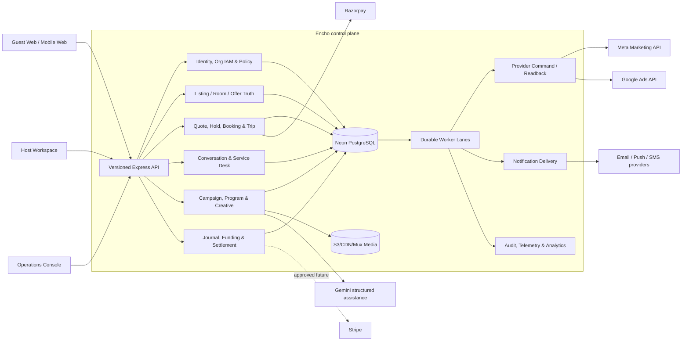
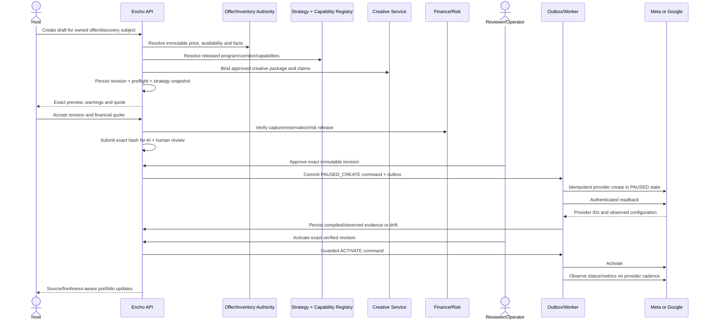
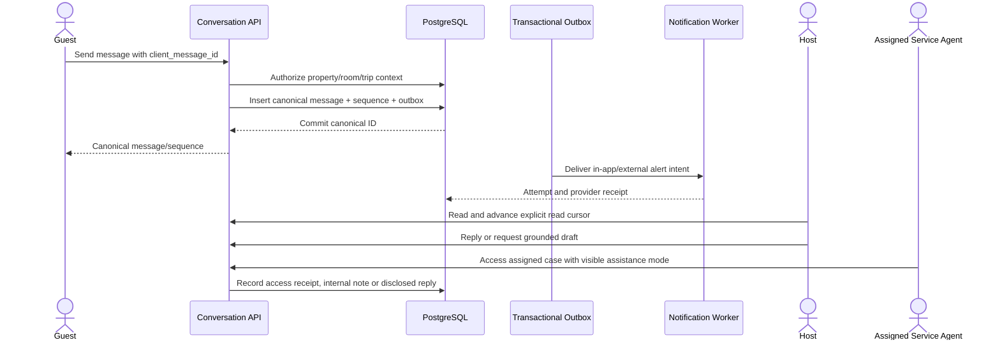
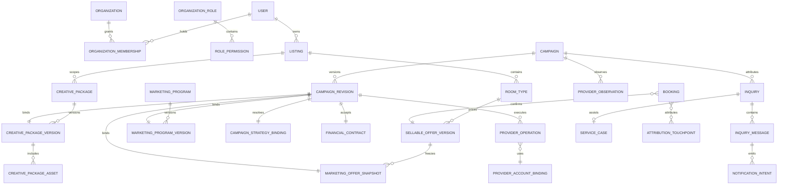
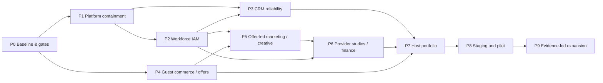

# Encho Three-Sided Operating Platform — Phase 2 Master Blueprint

**Status:** Phase 2 — implementation-ready architecture; product execution is not authorized until the founder moves the work to Phase 3  
**Date:** 23 September 2026  
**Source baseline:** repository commit `85b52ba` plus the uncommitted HARVO Discussion 037 records  
**Primary living record:** `docs/harvo/BOARDROOM_DISCUSSION_037.md`  
**Companion evidence:** `docs/harvo/MARKETING_STUDIO_ARCHITECTURE_RESEARCH_037.md`, `docs/harvo/CRM_AND_GUEST_OPERATIONS_RESEARCH_037.md`  
**Controlling engineering policy:** `docs/ENCHO_ENGINEERING_CONSTITUTION.md`

> **Evidence boundary.** This blueprint combines accepted founder decisions, verified source findings and recommended architecture. It does not clear Indian legal/tax gates, establish provider eligibility, accept a milestone, prove production behavior or authorize live ad spend. Where this document conflicts with law, a current provider contract, the Engineering Constitution, or an approved domain decision register, the higher authority controls.

---

## Understanding of the project

Encho is a host-first, three-sided hospitality operating platform. The guest product is the canonical, premium property discovery and booking destination. The host product removes the need to build a website, learn ad platforms, operate provider accounts or reconcile disconnected marketing data. The administrator and delegated workforce product carries the specialist work: listing truth, creative and policy review, reusable advertising programs, provider operations, finance and risk, service operations, and incident recovery.

The differentiated product is the closed truth-and-operations loop:

`verified stay and room offer -> reviewed creative -> accepted funding -> controlled provider execution -> observed delivery -> on-platform inquiry/booking -> reconciled outcome -> safer next decision`

The existing repository contains substantial pieces of this loop. It does not yet contain a production-proven complete loop. Canonical room/media and atomic inventory foundations, a sophisticated marketing v2 engine, versioned AdTech strategies, finance controls, telemetry, inquiry primitives and admin workspaces exist. Canonical guest checkout remains legally blocked and incomplete; the production runtime still has a least-privilege gap; provider account structure and paused readback evidence are unresolved; staff delegation and CRM delivery truth are incomplete; and several legacy paths conflict with the new architecture.

### Five most important conclusions

1. **Encho must ship one complete, adversarially tested operating loop before adding breadth.** More dashboards, AI suggestions or provider options will not create a business while checkout, provider eligibility, staff authority, support delivery and outcome reconciliation remain incomplete.
2. **The campaign authority is a sellable room offer, not the property’s cheapest price.** Mixed-inventory resorts require immutable offer-level price, availability, media and landing evidence. `BUDGET`, `COMFORT` and `PREMIUM` govern economics and risk; they do not identify the guest by themselves.
3. **The safe operating model is reusable expert programs plus exception review.** Hosts choose bounded commercial intent. Scoped staff operate one Encho command center. Provider-specific studios expose only controls that the API, account, compiler and readback have all proven. Encho must not promise to clone every native Ads Manager function.
4. **One super-admin and best-effort messaging are unacceptable scale foundations.** Encho needs organization-scoped staff IAM, maker/checker rules, durable command and notification outboxes, honest delivery receipts, case assignment, internal notes and actor-scoped offline data.
5. **Production readiness is gated by evidence outside the code.** Written Indian tax/legal approval, an actual restricted Neon runtime role, provider-compliant advertiser/account topology, a paused provider canary, restore/runbook evidence and a bounded commercial pilot cannot be replaced by test counts.

---

## 1. Executive summary

This blueprint preserves the current modular marketing and guest-truth foundations and completes Encho through a controlled strangler migration. The near-term target is a **bounded Complete Release 1 (CR1)**, not every feature imagined in Discussion 037.

CR1 supports:

- one published multi-room property with at least one canonical sellable room offer;
- truthful public discovery and room-specific landing content;
- one verified guest inquiry and, only after legal approval, one canonical server-quoted booking;
- a host-created dedicated campaign using an approved image, carousel or reviewed video package;
- offer-level strategy resolution, bounded host preferences and an immutable accepted quote;
- AI evidence followed by independent human approval;
- separate Meta and Google program compilation through provider-compliant account bindings;
- paused creation, authenticated readback and guarded activation;
- staff operation through scoped permissions rather than global admin;
- durable guest-host messaging, service assignment and truthful alerts;
- per-campaign source/freshness-aware monitoring for concurrent campaigns;
- finance, provider and booking reconciliation with immutable audit evidence; and
- one bounded property/corridor/provider pilot with explicit stop-loss and rollback controls.

The recommended implementation remains a **modular monolith with PostgreSQL authority and dedicated worker processes**. The repository is not ready for a microservice split. Strong domain modules, versioned contracts, transaction boundaries, outboxes and worker leases provide the required isolation without adding distributed-system failure modes prematurely.

### Release boundary

| In CR1 | Deferred until CR1 evidence exists |
|---|---|
| Dedicated room-offer and property-discovery campaigns | Paid pooled destination campaigns |
| Meta website campaign and Google Search program supported by released capabilities | Universal native-console parity, Performance Max, Google Hotel Ads, unrestricted Advantage+ |
| Single image, reviewed four-card carousel and reviewed short-form video | Automated DCO budget reallocation and generated synthetic imagery |
| In-app CRM plus explicitly configured alert channels | Autonomous AI sales agent or unsupervised translation |
| Source/freshness-aware campaign portfolio | Fabricated “live viewers,” guaranteed bookings or guaranteed ROAS |
| Admin-approved organic social workflow design | Automatic publishing to Encho’s brand accounts |
| Human-approved AI recommendations | AI approval, provider activation or financial mutation |
| One controlled India pilot corridor | Multi-country payments, broad international rollout and premature microservices |

---

## 2. Project vision and measurable success criteria

### 2.1 Product vision

#### For guests

A fast, accessible and truthful place to discover a stay, compare real room offers, ask questions, receive support and complete a secure booking without misleading price, scarcity, review or availability claims.

#### For hosts

A single pane of glass to publish an excellent property presence, select an exact sellable offer or property-discovery goal, provide factual creative, accept a transparent campaign quote, communicate with guests and monitor every campaign without operating Meta or Google accounts.

#### For administrators and staff

An evidence-first operations system that turns expert policy into reusable versioned programs, routes exceptions to the right specialist, executes exact approved revisions, observes providers and money independently, and makes every sensitive action attributable and recoverable.

### 2.2 CR1 product success measures

These are release acceptance targets, not current claims.

| Dimension | CR1 measure |
|---|---|
| Canonical truth | 100% of public offer price, availability, capacity, media and claims trace to versioned canonical facts; zero synthetic fallback claims |
| Guest transaction | 100% of checkout totals originate from an immutable server quote; zero client-authoritative price/tax math; zero double booking under the accepted concurrency benchmark |
| Tenant security | Zero cross-host access in adversarial API and non-bypass PostgreSQL tests; production app connects with a verified non-owner, non-`BYPASSRLS` role |
| Campaign determinism | 100% of provider writes bind campaign, revision, offer snapshot, creative package, program release, account binding, finance contract and idempotency receipt |
| Provider truth | Every supported provider control has request, compiled payload and observed/readback evidence; unknown outcome never becomes success |
| Financial integrity | Every recognized amount balances in the journal; no spend activation before verified funding/risk release; overrun and refund paths reconcile explicitly |
| Messaging reliability | Every committed message creates a durable delivery intent in the same transaction; UI never marks an external alert delivered without a provider receipt |
| Concurrent monitoring | Four campaigns for one property render as four independent flights; property totals deduplicate canonical bookings and disclose unresolved attribution |
| Accessibility | CR1 journeys meet WCAG 2.2 AA through automated and manual keyboard/screen-reader verification at mobile and desktop widths |
| Web performance | Public stay route targets LCP <= 2.5 s, INP <= 200 ms and CLS <= 0.1 at the agreed mobile test profile; performance budgets fail CI when materially regressed |
| Recovery | Database restore and queue replay are rehearsed; proposed pilot target is RPO <= 5 minutes and RTO <= 60 minutes, subject to infrastructure capability approval |
| Operational safety | One paused provider canary completes with zero spend before any activation; kill-switch and unknown-outcome drills pass |
| Commercial proof | A named, consented pilot cohort produces reconciled spend, inquiry, fulfilled-booking and repeat-funding evidence; vanity impressions alone do not count |

### 2.3 Guardrail metrics

- provider policy warnings, disapprovals and account restrictions;
- unreconciled remote operations by age and spend exposure;
- host-funded amount versus reserved, committed, invoiced, spent and returned amount;
- stale observation ratio and last provider evidence time;
- inquiry first-response and resolution times, with support-hour context;
- staff queue age, reassignment count and privileged-action rejection rate;
- listing/offer availability drift and campaign pause latency;
- failed notification attempts and false delivery claims;
- guest quote-to-hold, hold-to-capture and capture-to-confirmation recovery rates;
- cohort-level contribution after provider cost, processing, support, refunds and chargebacks.

No metric may be labeled “real-time” unless its source and latency contract support that label.

---

## 3. Current-state assessment

### 3.1 Repository profile at blueprint start

| Area | Verified observation | Architectural consequence |
|---|---|---|
| Client | React 19/Vite; `App.tsx` is about 1,672 lines and remains view-state oriented | Preserve UI, but introduce route/shell boundaries and lazy loading instead of a framework rewrite |
| Main server | Express 5; `server.ts` is about 19,349 lines with legacy and v2 routes | Use a strangler extraction; prohibit new domain logic in `server.ts`; retire routes by evidence |
| API surface | Approximately 328 Express route declarations across `server.ts` and `src/server` | Build a route/security inventory before cutover; version contracts and deprecate explicitly |
| Guest surface | `ListingDetailsNew.tsx` is about 1,341 lines; canonical presentation exists; checkout is intentionally unavailable | Independently accept and optimize presentation, then connect only to the legally approved quote/booking path |
| Marketing | Modular domain/services under `src/lib/marketing`; runtimes/routes/workers under `src/server/marketing` | Preserve these boundaries and make them the canonical marketing implementation |
| Data | Neon PostgreSQL with migrations through 035 | Continue additive migrations from the verified next number; no table rewrites or destructive rollback |
| AdTech | Versioned profiles/corridors/releases, immutable bindings and proposal-only corridor inference exist | Extend to offer-level authority, staff IAM and provider capability releases rather than replacing it |
| Tests | Broad Vitest/Playwright infrastructure; last documented baseline was 1,947 passing tests across 155 files at the ADT rollout | Use targeted suites during implementation and one clean full certification; do not quote the historical count as a current rerun |
| Runtime | Production schema 032–035 exists, but the application runtime still lacks proven restricted-role operation | This is a P0 release blocker before sensitive multi-tenant expansion |

### 3.2 Capability scorecard

| Domain | Current strength | Current gap | Decision |
|---|---|---|---|
| Guest discovery | Canonical slug route, relational room/media, truthful empty states, premium gallery foundation | M6A independent acceptance, route weight, measured conversion/accessibility | Preserve and harden |
| Inventory | Inventory-day authority and atomic holds accepted locally | Full checkout/capture/recovery integration | Preserve; connect through approved state machines |
| Guest commerce | Detailed V2 blueprint and state machines | M5/M6B legally blocked; payment fulfillment/manage-trip/refund/payout incomplete | Do not bypass; execute only after gates |
| Host listing | Unified account model and host property workflows | Complete offer/rate-plan authority and three-surface field parity | Extend canonical CMS, do not add marketing-only price truth |
| Campaign workflow | Revisions, review, finance, provider identity, jobs, recovery and operations are substantial | Complete simple host contract, accepted account topology and live proof | Preserve v2; close integration gaps |
| Tier strategy | SQL-backed `BUDGET`/`COMFORT`/`PREMIUM`, releases, corridors and immutable binding | Binding still resolves property-level `listings.price` | Refactor to canonical offer evidence |
| Creative | Reviewed image derivatives and four-card spatial stories compile to Meta/Google assets | General campaign-only upload, video, organic authority and complete provider acceptance | Extend with immutable Creative Packages |
| Telemetry | Per-campaign metrics, first-party attribution foundations and delayed-data semantics | Zero-row calibration, freshness UX, raw diagnostics and real provider proof | Improve modeling and observation tooling |
| Finance | Quotes, reservations, double-entry checks, refund/reconciliation foundations | Exact recognized cost base, taxes, live gateway/provider reconciliation | Preserve controls; resolve commercial/legal gates |
| CRM | Participant-checked inquiry service, client UUID replay, secure socket subscription | Best-effort notifications, fake translation/copy, broad admin, unscoped offline queue, fragmented threads | Replace unsafe edges; unify service desk |
| Admin | Marketing, AdTech, settlement and recovery workspaces exist | Binary admin authority, no workforce lifecycle, no maker/checker | Add organization-scoped IAM and one operations shell |
| Provider ops | Meta/Google adapters, paused/active control, readback patterns | Exact end-advertiser account model, exclusion capability, restricted runtime and canary evidence | Fail closed pending provider evidence |
| Organic social | Legacy feature-flagged Instagram worker | Graph v19, no Facebook path, claim-inventing fallback | Quarantine; redesign separately |
| Destination pools | Contracts and foundations exist | Paid execution intentionally unavailable before settlement protocol | Keep circuit breaker; defer from CR1 |

### 3.3 Evidence classification

All progress reports must use one of these labels:

1. **Specified** — architecture exists on paper only.
2. **Implemented locally** — source and focused tests exist.
3. **Integrated locally** — real PostgreSQL and cross-domain flow pass.
4. **Deployed** — exact commit/schema/config is in an environment.
5. **Provider-verified** — authenticated provider request/readback evidence exists.
6. **Operationally accepted** — alerts, rollback, restore, support and incident drills pass.
7. **Commercially proven** — bounded cohorts show reconciled customer outcomes and viable contribution.

“Complete” without a label is prohibited.

### 3.4 Honest completion baseline

These measures answer different questions and must never be collapsed into one percentage:

| Measure | Phase 2 baseline | Meaning |
|---|---:|---|
| Historical marketing milestone acceptance | 5 of 10 | Accepted outcomes under the existing marketing register; unchanged by this blueprint |
| ADT track | 7 of 8 milestones locally/deployment partially evidenced | ADT-7 still lacks the exact restricted-runtime and accepted paused-provider evidence |
| Clarified vision represented in source | approximately 50–55% | Boardroom engineering judgment about code coverage, not release acceptance |
| Operational production proof | approximately 30–35% | Boardroom judgment about deployed/runtime/provider evidence |
| Commercial proof | under 10% | No accepted cohort yet proves incremental profitable fulfilled stays and repeat funding |

The architecture is ahead of the operating company. The next work must convert existing foundations into one complete, supported and economically measured loop rather than increase the amount of partially integrated code.

---

## 4. Summary of completed capabilities to preserve

### 4.1 Guest and listing truth

- canonical `/stay/{slug}` routing and published-property projection;
- relational room types and media authority with stable asset identity;
- truthful gallery/room separation and explicit missing-data states;
- inventory-day ledger and atomic 10-minute hold foundation;
- public privacy filtering and unified account model;
- accepted booking state-machine specification and detailed Guest V2 implementation plan.

### 4.2 Marketing and AdTech

- campaign/revision/workflow identity, AI and human review states;
- financial quotes, reservations, capture/refund and balance-drift checks;
- Meta and Google provider adapters, operation receipts and pause/recovery primitives;
- versioned SQL tier profiles, corridors, releases, strategy audits and immutable revision bindings;
- bounded host feeder controls and provider-validated proposal-only corridor inference;
- Google v25 keyword research and shadow portfolio conflict analysis;
- first-party attribution/consent foundations and canonical spatial creative stories;
- per-campaign outcome/telemetry projection and independent concurrent campaign identity;
- recovery, settlement, invoice import and admin operation surfaces.

### 4.3 Security and operations

- FORCE RLS patterns on newer marketing/AdTech tables and hostile-role test fixtures;
- idempotency and durable attempt/operation concepts across financial and provider work;
- job workers separated from web runtime for marketing and AdTech inference;
- correlation, audit and readiness foundations;
- exact additive migration ledger/checksum discipline through migration 035.

These capabilities are assets. The blueprint does not authorize a wholesale rewrite.

---

## 5. Gaps between current state and target state

| Gap ID | Gap | Consequence | Required closure |
|---|---|---|---|
| G-01 | Production app uses/depends on owner-grade database access; restricted role incomplete | RLS can be bypassed and tenant breach blast radius is unacceptable | Restricted runtime role, complete grants, actual-login catalog/readiness proof and rotation runbook |
| G-02 | Canonical quote/tax/payment/booking flow is legally blocked and incomplete | Marketing cannot prove fulfilled booking value; guests cannot complete a trusted journey | Written legal sign-off, server quote, webhook fulfillment, recovery, manage-trip and refund/payout phases |
| G-03 | Strategy binding reads property-level price | Mixed resorts are misclassified or rejected | Canonical sellable offer and immutable offer snapshot binding |
| G-04 | Binary admin authority | Staff delegation creates excessive privilege and poor accountability | Organization membership, permissions, assignments, maker/checker and step-up controls |
| G-05 | CRM has non-durable alerts and fabricated transformation/copy paths | Lost leads, false delivery, reversed meaning and privacy risk | Transactional outbox, truthful receipts, grounded reply assist, actor-scoped storage and service cases |
| G-06 | Provider account and capability truth is incomplete | Account suspension or unsupported configuration can halt business | Advertiser entity/account mapping, capability release, exact compiler/readback and external-step registry |
| G-07 | General campaign-only Reel/post/carousel package is incomplete | Host cannot safely market fresh content | Creative Package revisions, rights, scan/transcode, claims, admin review and provider eligibility |
| G-08 | Host sees an implementation-oriented campaign UI rather than a complete portfolio product | Hosts cannot confidently operate multiple flights | Simple bounded builder, per-flight status, source/freshness, deduped outcomes, attention queue |
| G-09 | Telemetry zero-data and delayed provider reporting are not fully modeled | Jobs can die or UI can misstate calibration as failure | Empty-valid snapshot semantics, observation health, raw diagnostics and freshness policies |
| G-10 | Legacy routes, mock helpers and overlapping paths remain in a 19k-line server | Security drift, duplicate truth and maintenance cost | Route inventory, module extraction, flags, deprecation telemetry and evidence-based retirement |
| G-11 | Organic brand-social path is legacy and unsafe | Encho brand account can publish invented or unsupported content | Quarantine and later separate editorial product with exact asset/review authority |
| G-12 | No isolated staging environment and no accepted paused canary | Local confidence cannot prove provider/runtime behavior | Create staging, seed non-sensitive fixtures, run paused canary/readback and rehearsed promotion |
| G-13 | Exact cost/tax/variance/refund policy remains open | Campaign margin and host statements can be wrong | Founder/legal/finance decision register and versioned cost policy |
| G-14 | Support operating model and assisted-sales economics remain open | CRM promise may be operationally unviable | Define hours, languages, response model, channels, retention and pricing before SLA claims |

---

## 6. Complete requirements

### 6.1 Functional requirements — guest

| ID | Requirement |
|---|---|
| FR-G01 | Resolve only active canonical slugs and permanent redirects; inactive/unpublished stays fail privately and safely. |
| FR-G02 | Render property, room, media, amenity, verification and review facts only from the published privacy-safe projection. |
| FR-G03 | A `Rooms from` summary must identify eligible offer context, conditions, source hash, availability and observation time; otherwise omit it. |
| FR-G04 | Let guests select dates, occupancy and an exact room offer before requesting a quote or inquiry. |
| FR-G05 | Generate immutable server quotes and price lines; client values are display/input only. |
| FR-G06 | Acquire/release atomic inventory holds and expose honest expiration/recovery states. |
| FR-G07 | Verify identity at the approved checkout stage and create provider payment orders idempotently. |
| FR-G08 | Confirm bookings only from verified signed payment events and exact amount/inventory reconciliation. |
| FR-G09 | Provide server-backed confirmation, trip details, cancellation/refund/support states and verified review eligibility. |
| FR-G10 | Preserve consented attribution without exposing internal identifiers or private guest data. |
| FR-G11 | Let a guest begin or resume a property/room-context inquiry and receive durable, ordered messages. |
| FR-G12 | Never fabricate viewers, scarcity, ratings, testimonials, translation, availability or response claims. |

### 6.2 Functional requirements — host

| ID | Requirement |
|---|---|
| FR-H01 | A unified account can act as guest and host; host authority is listing/resource scoped. |
| FR-H02 | Host creates/edits canonical property, room, media and future approved offer inputs; every public field has admin moderation parity. |
| FR-H03 | Host selects an exact owned sellable offer or a property-discovery subject; the host cannot type a campaign-only price or tier. |
| FR-H04 | Host may select approved gallery media or upload a campaign-only single image, carousel or video package. |
| FR-H05 | Host supplies factual highlights and `GuestFitIntent` such as couples, family, friends or workation; these are content intent, not direct provider demographic controls. |
| FR-H06 | Host chooses a supported outcome in plain language, compatible creative-format preference, dates, bounded budget and released feeder options. |
| FR-H07 | Host cannot remove mandatory safety exclusions or choose provider IDs, bidding, attribution, conversion events, unrestricted demographics, keyword match policy or account topology. |
| FR-H08 | Host receives deterministic preflight findings: missing truth, inventory, creative, overlap, economics, provider eligibility and policy. |
| FR-H09 | Host receives AI assistance strictly for headline and description copy suggestions and pre-flight quality scoring (CR1-045); AI cannot autonomously configure ad targeting, publish or approve. |
| FR-H10 | Host accepts an immutable quote and material revision; cost/scope changes require explicit re-acceptance. |
| FR-H11 | Host tracks each concurrent campaign independently and sees a deduplicated property portfolio summary. |
| FR-H12 | Every status and metric displays source, reporting window, observed-at time and stale/calibration/error state. |
| FR-H13 | Host can request pause/stop/refund/top-up only through finance- and provider-safe state transitions. |
| FR-H14 | Host receives in-app and consented external alerts without guest private content in notification previews. |
| FR-H15 | Host owns the guest relationship for the listed stay; staff assistance is visible and cannot reroute the lead to a competing property. |
| FR-H16 | Host can reply quickly on mobile, use approved saved replies and request grounded AI assistance without invented facts. |
| FR-H17 | Host sees inquiry, visit and booking outcomes only where consent, attribution and canonical event authority permit them. |
| FR-H18 | Host never needs provider OAuth or native Ads Manager access for a supported Encho workflow. |

### 6.3 Functional requirements — admin and delegated staff

| ID | Requirement |
|---|---|
| FR-A01 | Invite, activate, suspend, offboard and access-review staff through an Encho organization membership lifecycle. |
| FR-A02 | Grant explicit permission/resource/condition bindings; no staff member receives global `admin` merely to perform one job. |
| FR-A03 | Enforce maker/checker separation for creative approval, strategy release, activation, high-risk finance and recovery actions. |
| FR-A04 | Maintain immutable versioned programs composed from economics, guest fit, corridor, season/inventory, objective, creative and channel capability. |
| FR-A05 | Draft, diff, validate, release, rollback and audit program versions using CAS publication. |
| FR-A06 | Operate provider-specific Meta and Google studios providing full Ads Manager-level parity (targeting, placements, Feeder Corridors, geofencing, bidding, budget pacing, keywords) for controls proven by provider schema; Admin configures targeting and Feeder Corridors based on property location and cost/tier, using AI in the studio as an advisory copilot for optimal setup recommendations (CR1-045). |
| FR-A07 | Record provider-native-only billing, verification, appeal or account restriction work as assigned external steps with evidence. |
| FR-A08 | Review the exact offer, creative bytes, claims, rights evidence, AI findings, targeting, budget, schedule and risk before approval. |
| FR-A09 | Create provider resources paused, read them back, detect drift and activate only after every guard passes. |
| FR-A10 | Pause, resume, stop, revise and reconcile active campaigns through idempotent commands and observed-state confirmation. |
| FR-A11 | View requested, compiled, submitted and observed configuration side by side. |
| FR-A12 | Access raw sanitized provider diagnostics, correlation IDs, command attempts and immutable state history. |
| FR-A13 | Assign campaign, creative, provider, finance, service and incident queues with priority, SLA and escalation. |
| FR-A14 | Operate finance reconciliation separately from campaign approval and record all adjustments as journal entries. |
| FR-A15 | Assist guest-host conversations through assigned cases, separate internal notes and disclosed staff participation. |
| FR-A16 | Read conversation content only under assigned/resource-scoped authority; every sensitive access creates an access receipt. |
| FR-A17 | Use AI as an evidence-bound copilot for prioritization, facts, creative/policy, keywords, geography, diagnostics and response drafts. |
| FR-A18 | Run safety drills, kill switches, DLQ replay, restore and provider incident workflows from documented runbooks. |
| FR-A19 | See workforce load and outcome metrics without exposing unnecessary guest/host personal data. |
| FR-A20 | Break-glass access is time-bound, step-up authenticated, reason-coded and independently reviewed. |

### 6.4 Functional requirements — platform and CRM

| ID | Requirement |
|---|---|
| FR-P01 | Commit domain state and transactional outbox event atomically for messages, notifications, provider commands, payments and material audit events. |
| FR-P02 | Every retryable external operation uses stable idempotency identity, request fingerprint, lease fencing, exponential backoff with jitter and a DLQ. |
| FR-P03 | Preserve `UNKNOWN`/`RECONCILIATION_REQUIRED` when external outcome is ambiguous; never blind-retry a possible side effect. |
| FR-P04 | Store desired and observed provider state separately. |
| FR-P05 | Treat empty early provider telemetry as a valid calibration snapshot when the provider contract permits it, not a fatal job error. |
| FR-P06 | Aggregate provider metrics by reporting window and preserve raw sanitized response references for diagnostics. |
| FR-P07 | Order conversation events by server sequence; client UUID replay returns canonical IDs and does not lose notification intent. |
| FR-P08 | Use per-participant read cursors; a GET request must not silently mutate read state. |
| FR-P09 | Scope browser cache/offline queues by actor and tenant; purge secrets and queued operations on logout/account switch. |
| FR-P10 | Ground saved/AI replies in canonical room, availability, policy and trip facts; translations preserve source and disclose machine assistance. |
| FR-P11 | Store internal notes separately from guest-visible messages and enforce disclosure rules for staff replies. |
| FR-P12 | Keep paid advertising, optional organic publication and booking commission as separate products, authorities and financial contracts. |

### 6.5 Non-functional requirements

| ID | Requirement |
|---|---|
| NFR-01 Security | Default deny at API and database; FORCE RLS; non-bypass runtime; server-only provider/payment credentials; step-up for privileged commands. |
| NFR-02 Privacy | Data minimization, purpose-limited staff access, redacted logs, no guest content in alert previews, consent/version evidence and retention controls. |
| NFR-03 Determinism | Immutable accepted facts, revisions, hashes and financial snapshots; no ambient config read during execution. |
| NFR-04 Reliability | Transactional outbox, durable leases, replay, reconciliation, kill switches, backups and restore drills. |
| NFR-05 Performance | Public Core Web Vitals budgets; paginated projections; precomputed rollups; no raw-event scans in dashboard requests. |
| NFR-06 Scalability | Partition work by tenant/campaign/provider lane; indexes follow observed query plans; use queue backpressure before adding services. |
| NFR-07 Accessibility | WCAG 2.2 AA, keyboard operation, screen-reader names/status, reduced motion, color-independent states and 44px touch targets. |
| NFR-08 Observability | Correlation and causation IDs, structured redacted logs, traces/metrics for every state boundary, source/freshness in UI and actionable alerts. |
| NFR-09 Maintainability | Domain modules, typed schemas, ADRs, migration ledger, contract tests and no new business logic in the legacy server root. |
| NFR-10 Compatibility | Additive migrations, explicit API versioning, idempotent backfill, feature flags, shadow comparison and evidence-based retirement. |
| NFR-11 AI safety | Structured schemas, bounded inputs/outputs, prompt/version evidence, no direct spend authority, evaluation sets and deterministic fallback. |
| NFR-12 Financial integrity | Minor units only, double-entry journal, immutable quotes, exact rounding rules, balanced settlement and no silent cash transfer. |

### 6.6 Business rules

1. **BR-01 — Flex:** current default host booking commission is 15%, snapshotted at booking confirmation. Guests are not charged Encho booking commission or gateway surcharge.
2. **BR-02 — Growth:** current direction is ₹4,999 plus applicable GST per property per rolling 30 days, with 0% booking commission for bookings confirmed during an active term; legal/tax implementation remains gated.
3. **BR-03 — Advertising:** optional and distinct. Target charge is complete recognized campaign cost `C` plus markup `C × p`, with prospective `p` of 3–5%. Exact `C`, tax, variance, refund and earning rules remain open.
4. **BR-04 — Claims:** no conversion, booking, occupancy, viewer, delivery or profitability guarantee is permitted.
5. **BR-05 — Offer authority:** a mixed resort is never tiered by its cheapest room. Each executable campaign binds an exact sellable offer or an explicitly labeled property-discovery subject.
6. **BR-06 — Strategy composition:** a price tier is an economics/risk profile. Guest fit, destination, inventory, objective, creative and channel policy are composed separately.
7. **BR-07 — Media authority:** campaign-only assets do not become public gallery assets without a separate listing-publication decision.
8. **BR-08 — AI boundary:** AI cannot approve itself, release strategy, activate spend, alter money, invent provider IDs or broaden unresolved targeting.
9. **BR-09 — Provider topology:** provider account topology must follow current written provider rules. For Google, the working recommendation is Encho MCC management with one client account per end advertiser unless Encho obtains explicit advertiser-of-record approval.
10. **BR-10 — Budget transfer:** unused budget cannot be transferred between offers/campaigns without the host’s explicit accepted financial contract. The older automatic trapped-cash concept is not approved.
11. **BR-11 — Pool safety:** paid pooled destination execution stays disabled until contribution, invoice settlement, allocation, inventory and refund contracts are accepted.
12. **BR-12 — Organic separation:** organic publication to Encho brand accounts is a separate editorial product and permission, even when it reuses an approved creative package.

### 6.7 Roles and permission model

| Principal | Permitted scope | Explicitly prohibited |
|---|---|---|
| Guest | Public discovery; own inquiry, quote, booking and trip | Other users’ data; campaign/provider/admin controls |
| Host | Owned listings/offers/media; owned inquiries/bookings; bounded campaign drafts and monitoring | Tier/account/provider internals; another host’s data; approval/activation; unrestricted targeting |
| Service agent | Assigned conversation cases, approved replies, escalation | Provider writes, campaign approval, finance mutation, unassigned content browsing |
| Creative/policy reviewer | Assigned exact package/revision review | Editing approved bytes after approval; activation; finance |
| Campaign planner | Draft provider-neutral and provider-specific plan within released program | Approving own plan; activation; journal mutation |
| Strategy publisher | Release versioned programs with checker rules | Direct per-campaign activation; finance settlement |
| Flight operator | Exact-revision preparation, paused creation, readback, allowed pause/stop | Editing canonical offer/creative; changing accepted financial scope |
| Provider operator | Account health, readback, provider incidents and native external steps | Host finance and creative self-approval |
| Finance/risk operator | Reconcile capture, invoices, journals, refunds and risk release | Creative/strategy approval and unreviewed activation |
| Workforce administrator | Memberships, role bindings, access review | Reading message content or moving money unless separately granted |
| Auditor | Read-only evidence and access receipts | Mutation |
| Platform break-glass | Time-bound incident-only scope | Standing daily operation; unreviewed use |

**Recommended pending approval:** the same actor must not both submit and approve a creative/program/campaign revision; activation above the approved pilot threshold requires a second actor from Finance/Risk or Provider Operations. Exact thresholds and role combinations are an open founder decision.

### 6.8 Edge cases and failure behavior

| Condition | Required behavior |
|---|---|
| Price below ₹1,000 or ambiguous/private-room price basis | `STRATEGY_UNCLASSIFIED`; explain the missing canonical offer; no silent promotion to a tier |
| Offer price/availability changes after acceptance | Existing revision remains historical; block or pause based on materiality; create and re-accept a new revision |
| Destination exclusion cannot be expressed safely | Fail closed with `EXCLUSION_UNRESOLVED`; never expand to India-wide targeting |
| Local destination also contains valuable feeder demand | Use reviewed smallest provider-expressible local suppression or explicit exception; a universal district ban is not automatic |
| Provider request times out after submission | Mark outcome unknown, stop blind retry, reconcile by idempotency/readback |
| Provider returns zero telemetry rows for a new active campaign | Persist calibration/zero-evidence snapshot if schema-valid; schedule later observation; do not exhaust the job |
| Provider reporting is delayed | Retain last value with stale badge and window; never replace with zero or generic error |
| Four campaigns overlap | Analyze budget fragmentation, keyword/audience/geography/date/offer overlap; allow, warn, consolidate, sequence or block with evidence |
| Property becomes unavailable | Queue safety pause; show requested and provider-confirmed pause separately; reconcile spend through confirmation time |
| AI unavailable or uncertain | Continue deterministic checks and route to human review; never auto-approve |
| Message commit succeeds and socket/email fails | Outbox retries delivery; canonical message remains; UI shows honest state |
| Duplicate offline message submission | Return canonical message/sequence for client UUID and do not duplicate alerts |
| Payment captured after hold expiry | Re-lock inventory; if unavailable, enter explicit captured-inventory-unavailable reconciliation path |
| Staff account is suspended mid-operation | Recheck permission at execution; fence claim, revoke sessions and reassign work |
| Browser account switch/logout | Purge actor-scoped cache, bearer material and queued mutations before next principal loads |
| Provider account restricted | Stop new activation, preserve current evidence, trigger incident/host communication and bounded pause/recovery plan |
| Legacy client calls deprecated route | Return explicit version/deprecation contract; measure callers; never silently invoke a weaker path |

---

## 7. Proposed system architecture

### 7.1 Architectural style

Use a **modular monolith plus dedicated workers**:

- one versioned API application for synchronous commands and projections;
- domain modules with explicit ports and transaction boundaries;
- PostgreSQL as canonical state, journal, outbox and job authority;
- dedicated marketing/provider, AdTech inference, notification, booking/payment and analytics workers;
- object/media storage and transformation services for assets;
- provider adapters behind typed capability contracts;
- real-time sockets only as a delivery optimization, never as durable truth.

Split a module into a separate service only after measured scale, deployment isolation or regulatory need justifies the operational cost.

### 7.2 Context architecture

### 7.3 Major components and responsibilities

| Component | Responsibility | Current base | Required evolution |
|---|---|---|---|
| Public Experience | Search/discovery, stay/room presentation, consented attribution | `ListingDetailsNew`, published projections | Split route bundles, offer selector, inquiry/quote integration, CWV/a11y acceptance |
| Account/Host Shell | Listings, offers, inquiries, bookings, campaigns, finance | Current dashboard/view-state app | Route-based shell, role-aware nav, portfolio projection, actor-scoped cache |
| Operations Shell | Work queues and evidence workspaces | `AdminMarketingWorkspace`, `AdtechWorkspace`, settlement/recovery panels | Organization IAM, My Work, Strategy, Creative, Flight, Provider, Finance, Service, Incident, Audit |
| Identity and Organization IAM | Principal, membership, permissions, conditions, step-up, sessions | Unified users plus binary admin | Fine-grained policy engine and execution-time authorization |
| Listing/Offer Authority | Property, room, rate/conditions, inventory, published facts | Relational rooms/media and inventory | Legally approved sellable-offer authority and immutable marketing snapshots |
| Guest Commerce | Quote, hold, payment, booking, trip/refund/review | M1–M4 foundation and V2 spec | Execute M5 onward only through gates |
| Conversation Service | Threads, ordered messages, read state, cases, internal notes | Inquiry inbox + legacy booking messages | Canonicalize, outbox, staff assignments, truthful delivery and grounded assistance |
| Notification Service | Preference/consent, delivery intent, attempts/receipts | Mixed direct emit and legacy dispatcher | Durable outbox consumer with provider receipts and retry/DLQ |
| Marketing Orchestrator | Draft/revision/workflow/preflight/finance link | Strong v2 implementation | Offer binding, delegation policy, concurrent portfolio checks |
| Strategy Registry | Programs, tier/corridor/channel releases | AdTech profiles/releases/corridors | Composable program versions and capability-linked publication |
| Creative Service | Source assets, derivatives, claims, rights, review | Image workflow/spatial story | General Creative Package including video and campaign-only media |
| Provider Control | Compile, command, observe, drift/reconcile | Meta/Google adapters and operations | Account binding/capabilities, complete request/compiled/observed evidence |
| Finance/Risk | Quotes, reservations, ledger, settlement, refunds | Substantial marketing finance modules | Final cost policy, gateway/provider integration, exposure limits and separation of duties |
| Analytics/Attribution | First-party touchpoints, provider metrics, rollups | Measurement/portfolio foundations | Consent authority, canonical outcome dedupe, calibration/freshness and fast rollups |
| Audit/Incident | Immutable business evidence, access receipts, runbooks | Existing audits/recovery | Cross-domain incident model, alert rules and break-glass review |

### 7.4 Campaign command flow

### 7.5 Conversation and service flow

### 7.6 API and integration boundaries

#### Canonical namespaces

- `/api/v2/public/*` — privacy-safe published properties/offers and public consent endpoints;
- `/api/v2/account/*` — unified account, sessions and preferences;
- `/api/v2/host/*` — owned listings, offers, bookings, inquiries and host projections;
- `/api/v2/operations/*` — staff IAM, work queues, service and incident commands;
- `/api/marketing/v2/*` — preserve current marketing v2 contracts while moving host aliases behind the account shell;
- `/api/v2/webhooks/{provider}` — raw-body verified, replay-protected ingress;
- internal worker ports — not exposed to browsers.

All mutations require a versioned Zod schema, authenticated principal, object/resource authorization, stable idempotency key, request fingerprint and correlation ID. HTTP handlers orchestrate application services; they do not implement domain state transitions directly.

#### Provider capability contract

Every exposed provider control must record:

1. provider/version schema support;
2. exact Encho account eligibility and prerequisites;
3. Encho program/compiler support;
4. validation and failure mapping;
5. readback field or an explicit “not observable” limitation;
6. change materiality and host re-acceptance rule;
7. required permission and checker policy;
8. test fixture and paused-canary evidence.

Unsupported native-console features appear as documented external operations, not fake controls.

### 7.7 Authentication, authorization, privacy and security

- Preserve unified identity. Add a `Principal` abstraction with account roles plus organization memberships; do not expand the current broad marketing `Actor` type as the only authorization model.
- Validate permission twice: when a command is accepted and again when a worker claims/executes it.
- Bind permission to resource and condition: organization, property, provider account, destination, spend ceiling, state and time.
- Require MFA/step-up for strategy release, activation, refunds, account bindings, credential changes and break-glass use.
- Use short-lived server sessions/tokens, refresh rotation, revocation and device/session visibility.
- Keep provider/payment credentials in a managed secret store and never return them to clients or logs.
- FORCE RLS on tenant/organization data. Production web and workers use separately scoped non-`BYPASSRLS` roles; migration ownership is isolated.
- Encrypt in transit and at rest; field-encrypt especially sensitive provider account/customer identifiers if threat modeling justifies it.
- Redact tokens, authorization headers, message bodies, guest PII and raw provider payloads from normal logs.
- Add staff content-access receipts, query limits, anomaly alerts and periodic access review.
- Treat media as untrusted: MIME sniff, malware scan, decompression limits, metadata stripping, moderation, rights evidence and signed access.
- Use CSP, HSTS, Helmet, CSRF protection appropriate to the auth model, rate limits and strict CORS/origin allowlists.
- Do not implement aggressive contact-detail masking until the legal/product policy is approved; if adopted, use transparent rules, appeal and emergency exceptions rather than silently rewriting guest speech.

### 7.8 Scalability, performance, reliability and recovery

- Keep OLTP and dashboard read workloads separated logically through projections and rollups; do not query raw provider/webhook events for every page load.
- Partition job fairness by provider account and tenant so one failing campaign cannot starve others.
- Use bounded concurrency, distributed rate limits and account/customer-specific quotas.
- Maintain safety lanes for pause, credential/account restriction and payment ambiguity ahead of optimization work.
- Use database-backed durable claims first. Introduce a dedicated queue platform only when measured contention/throughput justifies it.
- Backfill additively with checkpoints and shadow comparison; every backfill is restartable and idempotent.
- Keep last-known-good observations while marking stale; do not erase history on provider failure.
- Define kill switches by domain: new checkout, campaign activation, provider writes, organic publishing, AI inference and notification channel.
- Maintain PITR-capable backups, encrypted evidence exports and quarterly restore drills before scale.
- Use CDN responsive media, route-level lazy loading, server pagination and cache only privacy-safe immutable projections.

### 7.9 Logging, monitoring, analytics and alerting

#### Required identifiers

`correlation_id`, `causation_id`, `principal_id`, `organization_id`, `property_id`, `offer_snapshot_id`, `campaign_id`, `revision`, `operation_id`, `provider_account_binding_id`, `provider_request_id`, `payment_attempt_id`, `conversation_id`, `message_sequence` and `case_id` where relevant.

#### Operational dashboards

- guest quote/hold/payment/booking funnel and ambiguous captures;
- host campaign portfolio with desired/observed status and data freshness;
- staff queue load, SLA/age and checker bottlenecks;
- provider account health, rate limits, disapprovals, drift and unknown writes;
- money exposure, unbalanced journals, invoice variance, refund and chargeback risk;
- conversation delivery attempts, first response, assignment and access anomalies;
- worker lag, lease contention, retries and DLQ depth;
- Core Web Vitals, API latency, database saturation and error budgets.

#### Paging policy

Page only for actionable service risk: captured-payment ambiguity, unbalanced journal, provider-account restriction, inability to safety-pause, cross-tenant authorization denial anomaly, queue safety-lane breach, backup/restore failure or sustained CR1 SLO breach. Lower-severity product/data quality work belongs in an assigned queue.

---

## 8. Data model and data lifecycle

### 8.1 Existing authorities to retain

| Authority | Existing tables/modules | Rule |
|---|---|---|
| Listing/room/media | canonical listing, room type and media migrations 001–004 | Marketing references; never duplicates mutable public truth |
| Inventory | inventory days and holds, migration 005 onward | All bookability and campaign pause decisions derive here |
| Marketing workflow/finance/provider | migrations 009–022 | Preserve identities, journal boundaries, recovery attempts and provider operations |
| Canonical facts/portfolio/attribution | migrations 023–031 | Extend instead of creating a second measurement truth |
| AdTech strategies/corridors/bindings/inference | migrations 032–035 | Preserve immutable releases/bindings and proposal-only AI authority |

### 8.2 Candidate additive migrations

Exact migration names and columns require source-level schema review at Phase 3 start. The next available version is expected to be 036 at this baseline.

| Candidate | Tables / extensions | Purpose and invariants |
|---|---|---|
| 036 — organization IAM | `organizations`, `organization_memberships`, `organization_invitations`, `permission_catalog`, `organization_roles`, `role_permissions`, `resource_permission_bindings`, `access_reviews`, `privileged_action_challenges` | Membership/permission lifecycle; unique active membership; immutable grant/revoke evidence; FORCE RLS; no broad staff admin |
| 037 — conversation operations | extend canonical inquiry/message tables; add `conversation_context_bindings`, `conversation_participants`, `conversation_read_cursors`, `service_cases`, `case_assignments`, `case_events`, `internal_notes`, `content_access_receipts`, `notification_intents`, `notification_attempts` | One ordered conversation truth, explicit read state, assigned assistance and honest delivery |
| 038 — canonical sellable offers | **Only after Guest V2/legal schema approval:** `rate_plan_versions`, `sellable_offer_versions` or the approved equivalent; `marketing_offer_snapshots`, `marketing_campaign_offer_bindings` | Room/rate/date/occupancy/conditions/inventory/facts/media/landing evidence; immutable campaign snapshot; no marketing-only price |
| 039 — creative packages | `marketing_creative_packages`, `marketing_creative_package_versions`, `marketing_creative_package_assets`, `marketing_creative_claims`, `marketing_asset_renditions`, `marketing_rights_evidence`, `marketing_creative_review_decisions`, `organic_publication_requests` | Exact source bytes, hashes, renditions, claims, rights and separate paid/organic authority |
| 040 — programs and provider accounts | `marketing_programs`, `marketing_program_versions`, `program_capability_members`, `host_delegation_policies`, `provider_advertiser_entities`, `provider_account_bindings`, `provider_capability_releases`, `provider_external_steps` | Provider-compliant account topology and composable released programs; immutable account/revision evidence |
| 041 — service/command evidence | extend operation/outbox tables; `compiled_plan_receipts`, `provider_drift_incidents`, `notification_delivery_receipts`, `break_glass_events` | Request/compiled/observed comparison, honest delivery and privileged incident evidence |

Migration 038 must not invent the legally blocked quote/tax/rate model. If the approved Guest V2 schema supplies an equivalent canonical offer entity, marketing references it and migration 038 narrows to snapshots/bindings only.

### 8.3 Key entity relationships

### 8.4 Lifecycle rules

- **Canonical mutable truth** uses new versions rather than overwriting accepted facts.
- **Campaign/financial/provider evidence** is append-only except for explicitly modeled state transitions; corrections are new entries.
- **Messages** are never silently edited. Product-approved correction/redaction creates an event/tombstone while preserving legally required audit evidence.
- **Read state** is a participant cursor, not a mutation of message content.
- **Provider raw data** is sanitized, encrypted where needed and retained by policy; projections retain normalized evidence and hashes.
- **Media** keeps original asset, deterministic rendition lineage and review status; deletion is blocked while legally/audit referenced.
- **Personal data** has a documented purpose, classification, region, retention period and erasure/export behavior. Exact retention periods are a legal/privacy gate.
- **Financial records** follow statutory retention and are never hard-deleted through user APIs.
- **AI inputs/outputs** retain model/prompt/schema version, source hashes, confidence and reviewer disposition; private guest conversation content is excluded from training/inference unless explicitly consented and approved.

---

## 9. User journeys and experience requirements

### 9.1 Guest discovery to stay

1. Guest lands on canonical property/room context from organic search, Encho discovery or signed campaign attribution.
2. Page renders privacy-safe verified facts and optimized responsive media. Missing facts are absent, never filled with sales copy.
3. Guest selects dates, party and room offer; availability and from-price freshness are visible.
4. Guest may ask a property/room-context question before checkout.
5. After legal gate approval, server returns an immutable quote; guest accepts and an atomic hold starts.
6. Unified identity is verified; Razorpay order is created idempotently.
7. Signed webhook, not browser redirect, confirms payment and booking.
8. Guest sees server-backed confirmation/manage-trip and can continue the same contextual conversation.
9. Cancellation/refund/check-in/review states follow the approved state machines.

**Experience requirements:** premium without deceptive motion; keyboard complete; clear price/conditions; persistent recovery after refresh; 360px support; reduced motion; truthful offline/error states.

### 9.2 Host listing and offer preparation

1. Host creates property and room facts, uploads media and defines inputs required by the approved rate/offer model.
2. System validates publication completeness and identifies unsupported claims/media.
3. Admin moderates exact facts/assets; public projection is versioned.
4. Host sees all marketable offers and why an offer is or is not eligible.
5. Offer-level price tier, inventory and landing context are system-resolved and read-only.

### 9.3 Host one-click campaign

1. Host selects room offer or property discovery.
2. Encho recommends a released program, objective, budget range, schedule, feeders and creative formats with explanation.
3. Host selects an approved asset package or uploads a new image/carousel/video package.
4. Host chooses factual emphasis, `GuestFitIntent`, compatible placement preference, budget/dates and bounded released locations.
5. Deterministic preflight and AI evidence show issues. The host corrects them.
6. Host previews exact landing/creative/cost and accepts the immutable revision/quote.
7. Staff queues handle creative, campaign, provider and finance exceptions.
8. Paused provider resources are read back before guarded activation.

### 9.4 Admin/staff campaign operation

1. “My Work” ranks campaigns by exposure, age, SLA, provider health and missing evidence.
2. Planner reviews a diff from the released program; unsafe provider values are never free-form.
3. Creative reviewer sees exact bytes, OCR/transcript, claims, rights, subject/room binding and AI findings.
4. Finance/Risk confirms funding and exposure independently.
5. Flight operator creates paused resources and compares requested/compiled/observed configuration.
6. A permitted checker activates the exact revision. Every material change creates a new revision.
7. Provider Ops owns account health/drift/restriction and external provider-native steps.

### 9.5 Host monitoring four campaigns

The portfolio renders one flight per campaign with subject, creative, provider, state, requested/observed delivery, freshness, schedule, planned/observed spend, impressions, clicks, consented visits, inquiries, canonical attributed bookings and attention required. Campaign detail shows immutable revision, creative preview, targeting summary, financial timeline, provider event timeline, metrics window, budget meter and permitted actions. Property rollups deduplicate bookings and disclose unattributed/multi-touch outcomes.

### 9.6 Guest-host CRM and staff assistance

1. Guest message commits with property/room/trip context and client UUID.
2. Host gets in-app plus consented alert with no guest private content in preview.
3. Host reply composer uses canonical context and approved saved replies.
4. AI may draft or translate only with source-preserving display and human confirmation.
5. If assigned support is needed, the guest/host sees that Encho staff joined. Internal notes remain separate.
6. Staff assignment follows skill, availability and workload; it never transfers the guest to another stay.
7. Escalation links to booking/payment/provider incidents without copying sensitive data into messages.

### 9.7 UX system

- Reuse the existing premium visual language, but centralize tokens, status vocabulary, typography scale, focus styles and motion rules.
- Use progressive disclosure: hosts see decisions and consequences; staff see provider details; guests see only booking-relevant truth.
- Reserve GSAP/Three.js for measured storytelling where it does not harm LCP, accessibility, reduced-motion behavior or task completion. Operational workspaces favor clarity over spectacle.
- Every disabled action explains the unmet gate and the person/system responsible.
- Every asynchronous command has `queued`, `claimed`, `submitted`, `observed`, `failed`, `unknown` or `reconciled` feedback.
- Do not use gamification to pressure spend. The budget meter communicates authorization, spend and runway; it must not create dark patterns or imply guaranteed return.

---

## 10. Detailed implementation phases

### Phase P0 — Architecture freeze, evidence baseline and external gates

| Attribute | Plan |
|---|---|
| Objective | Establish one accepted CR1 boundary and close the unsafe production/runtime unknowns before feature expansion. |
| Scope | Route/schema/security inventory; Constitution reconciliation; decision/gate register; restricted runtime; staging design; provider/commercial/legal evidence plan. |
| Prerequisites | Founder acceptance of this Phase 2 blueprint; access to current deployment/config inventories without exposing secrets. |
| Detailed tasks | Freeze canonical domains and API owners; inventory all 328 route declarations and classify canonical/deprecated/unsafe; reconcile legacy Meta v19/`HOUSING`/score-8/fixed-fee wording; define Google end-advertiser/MCC and Meta account questions for written provider review; create isolated staging plan; complete non-bypass runtime grants and actual-login readiness; define CR1 pilot property/offer/corridor, spend/loss/time/support bounds; obtain legal/tax worklist and owners. |
| Dependencies | None; all later production work depends on P0 gates. |
| Deliverables | Architecture map, route register, schema ownership map, updated Constitution/ADRs, external-gate register, staging/runbook plan, restricted-runtime receipt. |
| Acceptance criteria | No unowned route/table; application and workers pass readiness using scoped non-bypass roles; legacy contradictions are explicitly superseded; open legal/provider/commercial gates have owners/evidence/stop conditions. |
| Validation | Catalog/RLS hostile tests, actual-login smoke, route security scan, config/secret audit, architecture review. |
| Risks and mitigations | Risk: documentation work delays visible features. Mitigation: time-box discovery and close only release-blocking unknowns; preserve parallel local UI work behind flags. |
| Owner / discipline | Principal architect, security, DBA/SRE, provider operations, finance/legal, product. |
| Effort / priority | **L / P0 blocker** |

### Phase P1 — Legacy containment and platform reliability primitives

| Attribute | Plan |
|---|---|
| Objective | Stop unsafe legacy paths from creating new truth and establish shared command/outbox/authorization primitives. |
| Scope | Strangler modules, route flags, principal/policy port, transactional outbox, command receipts, actor-scoped client storage and common observability. |
| Prerequisites | P0 route/schema inventory. |
| Detailed tasks | Prohibit new domain logic in `server.ts`; extract canonical routers incrementally; quarantine `/api/init-db`, mock upload/seed, unprotected AI, legacy marketing/social and duplicate booking/message paths after caller evidence; implement shared `PrincipalContext`, permission check port and correlation/causation propagation; standardize outbox/lease/retry/DLQ library; scope/purge IndexedDB per actor; define canonical error/status vocabulary; add deprecation telemetry. |
| Dependencies | P0; supports P2–P8. |
| Deliverables | Platform application-service template, outbox/worker library, route flags, deprecation dashboard, actor-scoped storage adapter. |
| Acceptance criteria | New commands use shared auth/idempotency/outbox patterns; deprecated paths cannot be reached in CR1 without explicit flag; logout/account switch leaves no prior actor queue/cache; no lost outbox event under injected socket/provider failure. |
| Validation | Fault-injection integration tests, replay tests, route contract tests, browser account-switch tests, log redaction scan. |
| Risks and mitigations | Risk: broad refactor regression. Mitigation: extract one vertical slice at a time, dual-run projections, preserve tables and use flags. |
| Owner / discipline | Platform/backend, frontend platform, SRE, security. |
| Effort / priority | **XL / P0** |

### Phase P2 — Organization IAM and Operations Shell

| Attribute | Plan |
|---|---|
| Objective | Replace the Tony-Stark/super-admin dependency with safe delegated operations. |
| Scope | Migration 036 candidate; invitations, memberships, permissions, resource/condition binding, assignment, step-up, access review and role-aware shell. |
| Prerequisites | P1 principal/policy port; founder approval of baseline role combinations and checker thresholds. |
| Detailed tasks | Implement IAM schema/RLS; bootstrap current admins as platform owners without granting staff equivalent authority; create permission catalog; invite/accept/suspend/offboard flows; session revocation; resource-scoped policy evaluator; maker/checker engine; break-glass workflow; staff “My Work” shell and desks; audit access and privilege changes; migrate marketing routes from broad `Actor` checks. |
| Dependencies | P1; required by P3, P5, P6 and P8 operations. |
| Deliverables | Workforce API/UI, permission matrix, checker policies, access receipts, periodic review report. |
| Acceptance criteria | Non-admin staff completes assigned CR1 task without global admin; prohibited role combinations are rejected; permission revoked after queue claim prevents execution; non-admin receives 403 for unassigned/private resources. |
| Validation | Policy matrix tests, adversarial IDOR/RLS tests, concurrent revoke/execute test, browser keyboard/session tests. |
| Risks and mitigations | Risk: policy complexity and lockout. Mitigation: declarative catalog, deny-by-default, read-only audit mode, two break-glass owners and tested recovery. |
| Owner / discipline | Identity/security backend, DBA, operations UX. |
| Effort / priority | **XL / P0** |

### Phase P3 — Reliable Conversation and Service Desk

| Attribute | Plan |
|---|---|
| Objective | Make guest-host communication durable, fast, truthful and safely assistable by staff. |
| Scope | Migration 037 candidate; canonical conversation, ordered messages, outbox alerts, read cursors, assignments, internal notes, grounded assistance and service UI. |
| Prerequisites | P1 outbox/storage; P2 IAM for staff functionality. Host/guest messaging may ship before staff assignment behind scope flags. |
| Detailed tasks | Choose and document canonical inquiry/thread identity; migrate/bridge legacy booking messages; atomically insert message+sequence+outbox; return canonical ID on replay; fix notification payload contract; implement preferences, attempts and receipts; remove fake translation and canned factual claims; ground AI drafts in server facts; add explicit read mutation; service case/assignment/internal notes/access receipts; property/room/trip context; actor-scoped offline reconciliation; mobile push/email channel adapters only after consent. |
| Dependencies | P1, P2; integrates P4 booking and P7 campaign outcomes. |
| Deliverables | Guest/host inbox, Service Desk, notification worker, migration/backfill and delivery dashboards. |
| Acceptance criteria | No committed message lacks a delivery intent; duplicate client UUID returns one canonical message; GET does not mark read; external delivery shown only with receipt; staff sees only assigned scope; AI/translation never invents availability/price. |
| Validation | Network/failure/replay tests, RLS/IDOR tests, offline browser tests, notification sandbox tests, accessibility and 360px UX audit. |
| Risks and mitigations | Risk: migration loses conversation history. Mitigation: additive context binding, shadow counts/hashes, dual-read period and no destructive deletion. |
| Owner / discipline | CRM backend, frontend/mobile UX, notification/SRE, privacy/security. |
| Effort / priority | **XL / P0** |

### Phase P4 — Canonical Guest Commerce and sellable-offer authority

| Attribute | Plan |
|---|---|
| Objective | Complete the trustworthy guest transaction and establish the canonical offer marketing needs. |
| Scope | Independent M6A acceptance; then legally gated M5/M6B and Guest V2 M7–M11 subset required for CR1; canonical offer versions/snapshots. |
| Prerequisites | Written Indian CA/tax-lawyer sign-off for M5/M6B; approved cancellation/check-in/payout decisions where applicable; Razorpay account/webhook configuration; P0 security/runtime. |
| Detailed tasks | Independently certify `ListingDetailsNew` truth/performance/a11y; finalize rate-plan/sellable-offer schema without duplicating price authority; implement server quote/tax/commission snapshots; quote/hold/order/capture state machines; raw-body webhook verification and replay; ambiguous/late capture recovery; confirmation/manage-trip; cancellation/refund support required for pilot; verified review eligibility; integrate same conversation context; publish truthful from-price projection. |
| Dependencies | P0/P1; P3 for full service; P5 requires offer authority. |
| Deliverables | Accepted guest presentation, canonical offer API, quote/checkout/booking/trip flow, payment/recovery worker, legal decision receipts. |
| Acceptance criteria | Zero client-authoritative totals; no booking confirmation from redirect; 100-thread hold test has zero overbooking; late/duplicate webhooks are idempotent; canonical offer drives public and marketing facts; all legal copy matches approved advice. |
| Validation | Unit/state-machine/property tests, real PostgreSQL concurrency, Razorpay sandbox webhooks, Playwright recovery flows, independent a11y/performance/security review. |
| Risks and mitigations | Risk: legal gate remains unresolved. Mitigation: ship independent M6A and offer-neutral inquiry improvements; keep checkout disabled and truthful. |
| Owner / discipline | Guest commerce backend, payments/finance, DBA, guest UX, legal/compliance, QA/security. |
| Effort / priority | **XL / P0 for complete product; legally gated** |

### Phase P5 — Offer-led marketing, creative packages and host preflight

| Attribute | Plan |
|---|---|
| Objective | Convert current property-level campaign logic into exact offer-led, truth-bound campaign preparation. |
| Scope | Candidate migrations 038–039; offer binding, package formats, video pipeline, guest-fit intent, overlap/economics preflight and host delegation contract. |
| Prerequisites | P4 canonical offer authority; P2 IAM for review; existing AdTech registry/creative foundations. |
| Detailed tasks | Replace `listings.price` strategy resolution with canonical offer snapshot; bind room media/facts/landing; define property-discovery subject separately; implement Creative Package versions for gallery selection, campaign-only image, carousel and video; add rights/consent, MIME/malware, OCR/transcript/audio/privacy checks, deterministic renditions and review hashes; map host placement preference to allowed program capability; implement `GuestFitIntent`; validate aggregate exposure/overlap and availability; require host re-acceptance on material change. |
| Dependencies | P2, P4; feeds P6/P7. |
| Deliverables | Offer resolver, creative APIs/workspaces, media worker, host preflight contract and immutable campaign bindings. |
| Acceptance criteria | Boundary prices resolve per offer; cheapest room never tiers property; every provider asset traces to reviewed bytes/claims/rights; video cannot publish before rendition/review; campaign-only media stays out of gallery; material changes create a new accepted revision. |
| Validation | Exact paise boundary tests, mixed-resort fixtures, asset fuzz/security tests, FFmpeg/Mux integration tests, claim-drift tests, cross-role E2E. |
| Risks and mitigations | Risk: media costs and moderation latency. Mitigation: quotas, async processing, immutable originals, bounded formats and explicit pending states. |
| Owner / discipline | Marketing domain, media platform, host UX, creative/policy operations, security. |
| Effort / priority | **XL / P0** |

### Phase P6 — Provider programs, expert studios and financial control

| Attribute | Plan |
|---|---|
| Objective | Give scoped experts complete control over supported workflows while preserving exact provider, account and financial truth. |
| Scope | Candidate migrations 040–041; program composition, account topology, provider capability releases, Meta/Google studios, finance/risk and readback/drift. |
| Prerequisites | P0 provider/account answers; P2 IAM; P5 offer/creative binding; approved advertising cost policy. |
| Detailed tasks | Model advertiser entities/account bindings; create provider capability registry; compose immutable programs from existing profiles/corridors plus objectives/bidding/keywords/placements/attribution; build request/compiled/observed diff; implement Meta and Google studio forms from capability schemas; implement native-only external steps; verify cost quote/reservation/risk/activation gates; create paused then read back; handle drift and unknown outcomes; model zero-row telemetry/calibration; provide sanitized raw diagnostics and operation timeline. |
| Dependencies | P0, P2, P5, existing marketing finance/provider modules. |
| Deliverables | Released CR1 Meta/Google programs, account mapping, Strategy Labs, Flight/Provider/Finance desks, canary runbook. |
| Acceptance criteria | Unsupported controls cannot be released; old campaign output remains unchanged after program update; paused create produces zero spend and exact readback; activation fails without verified finance/account/creative/offer/permission; all amounts balance; unknown remote write is quarantined. |
| Validation | Provider contract mocks, account-eligibility tests, mutation/readback drift tests, finance invariants, concurrent command/revoke tests and isolated paused canary. |
| Risks and mitigations | Risk: provider APIs/policies change. Mitigation: versioned capability releases, adapter contract tests, kill switches, narrow first programs and provider-owned incident queue. |
| Owner / discipline | AdTech/provider backend, finance/risk, operations UX, security/SRE. |
| Effort / priority | **XL / P0** |

### Phase P7 — Host campaign portfolio and source-aware outcomes

| Attribute | Plan |
|---|---|
| Objective | Deliver the actual one-click host promise and reliable multi-campaign monitoring. |
| Scope | Simplified Campaign Studio, power-host bounded panel, per-flight portfolio/detail, budget meter, inquiry/booking outcomes, alerts and responsive UX. |
| Prerequisites | P3 CRM, P5 binding/creative, P6 released programs/provider evidence. |
| Detailed tasks | Replace raw provider controls with plain outcome/offer/creative/budget/date choices; show read-only program explanation; power-host feeders only within released bounds; implement campaign cards/detail timelines; desired/observed states and freshness; calibration/stale/error views; deduplicate property outcomes; integrate inquiry inbox and canonical bookings; implement safe pause/stop/top-up/refund requests; add alert center; route-level code split and accessible visualizations. |
| Dependencies | P3, P5, P6; P4 for booking outcomes. |
| Deliverables | CR1 Host Campaign Studio, portfolio, flight detail, budget/outcome components and alert center. |
| Acceptance criteria | A host can create and monitor four independent campaigns without provider terminology; booking totals are deduped; no generic `LIVE`; disabled controls explain gates; 360px/keyboard/screen-reader tests pass; dashboards meet projection latency budget. |
| Validation | Playwright four-campaign scenarios, delayed/zero/stale provider fixtures, finance/action state tests, usability sessions with target hosts, performance/a11y audits. |
| Risks and mitigations | Risk: engaging UI becomes dark pattern. Mitigation: evidence-first copy, no urgency fabrication, user research and compliance review. |
| Owner / discipline | Host product/design, frontend, marketing backend, analytics, accessibility QA. |
| Effort / priority | **L / P0** |

### Phase P8 — Integrated staging, bounded pilot and operational certification

| Attribute | Plan |
|---|---|
| Objective | Prove the complete Guest–Host–Staff loop under controlled real conditions. |
| Scope | Isolated staging, migrations, end-to-end golden path, restore/security/load drills, paused canary, tightly bounded activation pilot, operating and commercial evidence. |
| Prerequisites | P0–P7 accepted; legal/provider/commercial/pilot approvals; named properties/offers/accounts/staff; stop-loss and support coverage. |
| Detailed tasks | Build staging with non-production secrets/accounts; run migrations and backfills under owner then application under scoped roles; seed approved fixtures; execute full regression/build/lint/typecheck; run security/a11y/performance/load/restore; create paused Meta and Google resources and verify readback; rehearse incident/kill switches; activate only authorized pilot tranche; reconcile daily provider/payment/outcome evidence; conduct host/guest/staff usability and support review; produce go/no-go receipt. |
| Dependencies | All earlier CR1 phases. |
| Deliverables | Staging receipt, canary evidence, runbooks, security/performance reports, pilot ledger, incident drills, commercial cohort report. |
| Acceptance criteria | All CR1 DoD gates pass; zero unbounded spend; no cross-tenant exposure; restore within accepted target; all remote/provider/financial outcomes reconciled; pilot has explicit rollback and informed participants; broader launch occurs only after board acceptance. |
| Validation | Independent architecture/security review, signed test artifacts, provider screenshots/API receipts, journal reconciliation, restore rehearsal and post-pilot review. |
| Risks and mitigations | Risk: real account or cash loss. Mitigation: paused first, tiny tranches, aggregate account caps, manual on-call, safety lane and immediate kill switch. |
| Owner / discipline | Release lead, SRE/DBA, security, provider/finance ops, QA, product/research, founder. |
| Effort / priority | **XL / P0 release gate** |

### Phase P9 — Evidence-led expansion

| Attribute | Plan |
|---|---|
| Objective | Add only capabilities justified by CR1 operational and commercial evidence. |
| Scope | Organic social, destination pools, automated experimentation, additional channels/countries, advanced staffing/CRM and potential service extraction. |
| Prerequisites | P8 acceptance and explicit founder decision per expansion. |
| Detailed tasks | Rank expansion by host contribution and operational burden; build separate organic editorial authority; finish pooled settlement/allocation before checkout; evaluate A/B optimization with minimum data and safety caps; add international payment/provider rules; consider service split only after measured bottleneck. |
| Dependencies | P8 data and provider/legal approvals. |
| Deliverables | Separate RFC/ADR and bounded milestone for each approved expansion. |
| Acceptance criteria | Every expansion has customer evidence, capability proof, owner, SLO, rollback and unit economics; no expansion weakens CR1. |
| Validation | Cohort experiments, provider certification, security/finance review and board acceptance. |
| Risks and mitigations | Risk: roadmap sprawl. Mitigation: WIP limit, kill criteria and contribution-based prioritization. |
| Owner / discipline | Product/strategy with relevant domain lead. |
| Effort / priority | **Variable / P2** |

### 10.1 Dependency graph

---

## 11. Work breakdown: epics, features, tasks, dependencies and acceptance

| Epic | Features / engineering tasks | Depends on | Acceptance summary |
|---|---|---|---|
| E0 Governance and evidence | E0.1 CR1 scope; E0.2 route/schema register; E0.3 external gate register; E0.4 Constitution/ADR reconciliation; E0.5 pilot loss/support limits | — | Every requirement has owner/evidence; contradictions resolved or gated |
| E1 Runtime security | E1.1 scoped DB roles; E1.2 complete grants; E1.3 actual-login readiness; E1.4 secret rotation; E1.5 RLS/IDOR suite | E0 | Production app/workers operate without owner/BYPASSRLS; hostile tests pass |
| E2 Platform command layer | E2.1 principal context; E2.2 idempotency/fingerprint; E2.3 outbox; E2.4 leases/DLQ; E2.5 correlation/causation; E2.6 deprecation flags | E0 | Fault injection loses no accepted command/event; duplicate requests are stable |
| E3 Workforce IAM | E3.1 org/member/invite; E3.2 role/permission/resource/condition; E3.3 checker/step-up; E3.4 session/offboarding; E3.5 work assignments | E1,E2 | Scoped staff complete tasks; revoked/prohibited access fails at execution |
| E4 Guest truth and commerce | E4.1 M6A acceptance; E4.2 offers/rate versions; E4.3 quote/tax; E4.4 hold/order/webhook; E4.5 confirmation/trip; E4.6 cancel/refund/review | E0,E1, legal gates | Server quote/capture/inventory truth and recovery pass full journey |
| E5 Conversation/service | E5.1 canonical thread migration; E5.2 message sequence/replay; E5.3 outbox delivery; E5.4 read cursors; E5.5 cases/notes/access; E5.6 grounded assist | E2,E3 | Durable ordered messaging, honest delivery and scoped assistance |
| E6 Offer-led campaigns | E6.1 offer snapshot; E6.2 tier resolver; E6.3 discovery subject; E6.4 GuestFitIntent; E6.5 overlap/exposure; E6.6 host delegation | E3,E4 | Mixed resort produces correct independent offer flights |
| E7 Creative packages | E7.1 source/rights; E7.2 image/carousel/video manifests; E7.3 scan/transcode/rendition; E7.4 claims/OCR/transcript; E7.5 exact review; E7.6 paid/organic separation | E3,E6 | Every published asset and claim traces to reviewed immutable evidence |
| E8 Program/provider control | E8.1 program composition; E8.2 capability releases; E8.3 advertiser/account mapping; E8.4 Meta Studio; E8.5 Google Studio; E8.6 compile/readback/drift; E8.7 external steps | E3,E6,E7 | Supported controls compile/read back; unsupported controls cannot masquerade as supported |
| E9 Finance/risk | E9.1 recognized cost policy; E9.2 quote/reservation/capture; E9.3 exposure caps; E9.4 invoice/telemetry settlement; E9.5 refund/correction; E9.6 maker/checker | E3,E8, legal policy | Balanced journal and no spend before accepted funding/risk release |
| E10 Host workspace | E10.1 one-click builder; E10.2 bounded audience; E10.3 portfolio; E10.4 flight detail; E10.5 budget/outcomes; E10.6 alerts; E10.7 responsive/a11y | E5–E9 | Host runs and understands multiple flights without provider expertise |
| E11 Operations shell | E11.1 My Work; E11.2 Strategy; E11.3 Creative; E11.4 Flight; E11.5 Provider; E11.6 Finance; E11.7 Service; E11.8 Incident/Audit | E3,E5,E8,E9 | Staff complete role tasks with evidence and without global admin |
| E12 Observability/analytics | E12.1 freshness model; E12.2 telemetry calibration; E12.3 rollups; E12.4 dashboards; E12.5 alerts; E12.6 access/anomaly monitoring | E2, domain events | Dashboards avoid raw scans; stale/unknown states and alerts are truthful |
| E13 Release certification | E13.1 staging; E13.2 migrations/backfills; E13.3 full CI; E13.4 security/a11y/perf/load; E13.5 restore; E13.6 paused canary; E13.7 bounded live pilot | E1–E12 | CR1 DoD and go/no-go receipt independently pass |

### 11.1 Recommended discipline ownership

| Discipline | Primary accountability |
|---|---|
| Principal architecture | Domain boundaries, ADRs, contract coherence and phase exit review |
| Guest commerce team | E4 and guest-facing portions of E5/E10 |
| Marketing/AdTech team | E6–E8 and marketing portions of E10/E11 |
| Finance/payments team | E9 and guest payment/settlement portions of E4 |
| Platform/security team | E1–E3, shared outbox/policy/secret controls |
| CRM/service team | E5 and Service Desk |
| Web experience/design | Public/host/staff information architecture, design system, accessibility and performance |
| SRE/DBA | Database roles, migrations, queues, observability, backup/restore and release |
| QA/security review | State, contract, adversarial, browser, provider, financial and release certification |
| Product/operations/legal | Scope, provider/commercial/legal gates, role policies, SLA and pilot operation |

---

## 12. Migration and compatibility plan

### 12.1 Strangler sequence

1. **Inventory:** map route, caller, table, authority, auth model and replacement.
2. **Add:** introduce new schema/contracts without dropping existing data.
3. **Backfill:** idempotently populate new authority with checkpoints and hashes.
4. **Shadow:** compute old/new projections and compare without changing behavior.
5. **Dual-read only where necessary:** prefer canonical read with legacy fallback plus telemetry; avoid long-lived dual writes.
6. **Cut over behind a scoped flag:** by actor/property/environment, with immediate rollback.
7. **Observe:** require stable error, latency, correctness and security evidence.
8. **Retire callers:** remove UI/worker dependencies and return explicit deprecation errors.
9. **Retain evidence:** never drop finance/audit/inventory tables as a rollback technique. Destructive cleanup requires a later approved retention migration.

### 12.2 Compatibility rules

- Current marketing v2 IDs, campaign revisions, provider entities, finance contracts and audit history remain stable.
- Strategy migration adds offer binding; it does not rewrite historical property-bound campaigns. Historical rows are labeled with their original price basis.
- Existing published property slugs and redirects remain permanent.
- Existing inquiry history is linked to canonical conversation contexts; no guest-visible message content is rewritten by backfill.
- Current admin users are bootstrapped into owner membership; staff never inherit owner role by email-domain inference.
- API fields are added compatibly first. Breaking behavior requires `/v3` or explicit deprecation and client upgrade telemetry.
- Feature flags are server enforced and cannot authorize a capability the provider/account registry rejects.

### 12.3 Rollback

- Application rollback uses the prior compatible binary and disables new adoption flags.
- Additive migration data stays. Do not run destructive “down” scripts against financial, campaign, message or audit evidence.
- Provider rollback means stop new writes, issue verified pause where safe, reconcile unknown writes and retain IDs/evidence.
- Payment rollback disables new order creation, continues signed webhook/reconciliation handling and preserves captured-funds recovery.
- CRM rollback keeps message writes through the canonical service and may disable external alerts/AI assist independently.

---

## 13. Testing and quality-assurance strategy

### 13.1 Test layers

| Layer | Required coverage |
|---|---|
| Pure unit | Money/rounding, tier boundaries, state transitions, permissions, materiality, freshness and attribution dedupe |
| Schema/contract | Zod request/response, provider payloads/readback, webhook signatures, error mappings and version compatibility |
| Real PostgreSQL integration | Migrations, constraints, triggers, transactions, advisory locks, RLS, outbox, concurrency and query plans |
| Property/state-model | Random legal/illegal transition sequences for booking, campaign, provider, finance, message delivery and case assignment |
| Financial invariants | Balanced journal, replay, overrun, partial refund, chargeback, invoice variance and unknown outcomes |
| Provider adapter | Recorded sanitized fixtures plus official test/paused environments; versioned capability matrix |
| AI evaluation | Fixed representative property/creative/geography set; hallucination, policy, schema, confidence and fallback tests |
| Browser E2E | Guest, host and every staff desk at desktop/mobile, slow network, refresh, offline/replay and concurrent campaigns |
| Accessibility | Automated axe-style checks plus manual keyboard, screen-reader, focus, zoom, contrast and reduced motion |
| Performance | Bundle/route budget, CWV lab and field monitoring, API p95, dashboard query plans and worker throughput/backpressure |
| Security | SAST/dependency/secret scan, IDOR/RLS, auth/session/CSRF/XSS/SSRF/upload/webhook/rate-limit and staff-insider scenarios |
| Resilience | Provider timeout/429/5xx, worker crash after remote write, database failover, DLQ replay, backup restore and kill switch |
| Usability | Task completion with target hosts, guests and role-specific operators; error comprehension and support burden |

### 13.2 Development cadence

- Run focused tests for the active domain during implementation with compact reporters.
- Run the affected integration/browser contracts at every phase exit.
- Run the full repository suite once on the release candidate and again only if the candidate changes materially.
- Preserve initial failure receipts and final passing receipts separately.
- Test counts are evidence metadata, not acceptance by themselves.

### 13.3 Required adversarial scenarios

- host A requests host B’s inquiry, campaign, offer, media or wallet;
- suspended staff executes a previously claimed provider/refund job;
- duplicated host form, webhook, outbox and provider command;
- remote provider succeeds while worker crashes before local commit;
- host changes price/media/availability after quote/approval;
- four campaigns claim the same booking;
- zero telemetry rows and delayed corrected provider spend;
- malicious video/image/metadata and oversized decompression;
- guest message contains prompt injection/contact data/unsupported claims;
- account switch with queued offline actions;
- captured payment after hold expiry and out-of-order webhooks;
- provider account restriction while active campaigns exist;
- restore from backup followed by idempotent queue replay.

---

## 14. Deployment, release, rollback and operational plan

### 14.1 Environment ladder

1. **Disposable local PostgreSQL/testcontainers:** migrations, grants, rollback rehearsal, concurrency and hostile roles.
2. **Isolated staging:** separate Neon branch, restricted app/worker roles, provider test/approved paused accounts, non-production payment keys and synthetic/non-sensitive fixtures.
3. **Production shadow:** migrations/backfills, flags off, projection comparison and no provider writes.
4. **Production canary:** named users/properties/accounts, paused provider creation, zero-spend readback.
5. **Bounded live pilot:** explicit budget/time/property/corridor limits, on-call and daily reconciliation.
6. **Gradual expansion:** only after board go/no-go and commercial/operational review.

There is no configured staging environment at the blueprint baseline; creating it is a release prerequisite.

### 14.2 Migration execution

- acquire the repository migration advisory lock on one held owner connection;
- compare every predecessor checksum and reject drift/out-of-order state;
- take/verify backup or restore point appropriate to the environment;
- apply one additive transaction where PostgreSQL permits;
- run catalog constraints/RLS/policy/trigger/grant checks;
- run backfills separately with checkpoints where volume warrants;
- switch to restricted app/worker connections and execute actual-login smoke/readiness;
- store signed release receipt with commit, schema versions, checksums and sanitized configuration identity.

### 14.3 Release gates

- code review and ADR/document synchronization;
- clean lint/typecheck/build and final full suite;
- no critical/high security finding;
- a11y/performance budgets met or explicitly risk-accepted;
- runbooks/on-call/alerts tested;
- provider and legal gates evidenced;
- rollback and kill switches rehearsed;
- exact staff/host/guest cohort and communication ready;
- finance and provider exposure caps configured from approved policy.

### 14.4 Operational runbooks

Required runbooks cover: provider 401/403 classification, account restriction, unknown provider write, campaign drift, safety pause failure, payment ambiguity, journal drift, late capture, notification outage, queue backlog/DLQ, staff credential compromise, guest privacy request, media abuse, database failover/restore and full campaign kill switch.

---

## 15. Risks, mitigations, assumptions and unresolved questions

### 15.1 Confirmed decisions

| Decision | Blueprint effect |
|---|---|
| Host-first three-surface product | CR1 must cross Guest, Host and Admin/staff; no marketing-only definition of complete |
| Zero Host OAuth experience | Provider credentials and account operation remain server/staff controlled |
| AI then strict human approval | No automatic publish/activate/financial authority |
| Offer-level price strategy | P4/P5 canonical offer binding; no lowest-room property tier |
| Room-led plus property discovery initial modes | CR1 campaign subjects; automated portfolio allocation deferred |
| New Reel/post/carousel support | Creative Package in P5 with paid/organic separation |
| Reusable expert strategies and delegated operations direction | P2 IAM and P6 program studios |
| Concurrent campaigns monitored independently | P7 portfolio/flight detail and outcome dedupe |
| One complete three-sided golden path | P8 CR1 release gate |
| CRM/service capability is required | P3 durable Conversation/Service Desk workstream |
| Advertising cost-plus differs from booking commission | Separate contracts/journals and UI disclosures |

### 15.2 Proposals requiring explicit approval

| Proposal | Recommended option | Material effect |
|---|---|---|
| Staff role combinations/checker thresholds | Approve baseline matrix in 6.7; require independent checker for creative, strategy, activation and high-risk finance | Staffing cost and operational speed |
| Host age control | Keep executable age policy staff/program controlled in CR1; show rationale read-only | Provider policy and user autonomy |
| Local exclusion policy | Use smallest provider-expressible suppression with reviewed exceptions; fail closed if unsafe | Reach, spend and provider capability |
| Service agent reply authority | Allow trained assigned agents to reply with visible “Encho support” identity; otherwise draft-only by queue | Guest trust, staffing and liability |
| CR1 organic social | Keep out of paid CR1 activation; design separate editorial pilot after paid golden path | Brand-account risk and scope |
| RPO/RTO target | Adopt proposed RPO 5 min/RTO 60 min only after restore test and infrastructure cost review | Infra cost and operations |

### 15.3 Assumptions

| Assumption | Effect if false |
|---|---|
| PostgreSQL remains primary authority for CR1 | A new event/store architecture and migration plan would be required |
| Modular monolith can handle initial workload | Measured contention may require a queue/service split earlier |
| Razorpay remains India guest payment provider | Checkout adapters, legal copy and reconciliation change |
| S3/CDN/Mux-style media services remain available | Creative pipeline capacity and cost plan must change |
| Meta/Google APIs expose the narrow CR1 controls under approved accounts | The capability release must shrink; native external steps may increase |
| Target users accept Encho-managed advertising and visible staff assistance | Product positioning/consent and account model require revision |
| Existing migration history/checksums remain canonical | Database reconciliation must precede all new migrations |

### 15.4 Contradictions and resolution

| Contradiction | Resolution in blueprint |
|---|---|
| “Single master account protects Encho” vs Google one account per end advertiser | Zero Host OAuth is UX; use compliant MCC/client-account mapping unless explicit advertiser-of-record approval |
| Old Meta v19/universal `HOUSING`/fixed score 8 vs versioned capabilities | Constitution must reference capability releases; policy category and AI thresholds are versioned, AI failure routes to human review |
| Old fixed 15% ad fee vs current 3–5% cost-plus direction | Treat old ad fee as superseded future design; do not change live contracts until complete cost policy accepted |
| Whole-property tier vs mixed resort | Offer-level strategy is authoritative |
| Mandatory whole-district exclusion vs destination/feeder overlap | Reviewed smallest expressible suppression; no universal district rule when it destroys valid feeders |
| “Tony Stark admin” vs scalable operation | One operations shell with scoped staff IAM and checker rules |
| Exact native-console parity vs supported API/account surface | Capability registry; native-only external steps; no false parity promise |
| “Live” metrics vs provider reporting delay | Source/freshness/observation states; never generic `LIVE` |
| Global staff admin vs least privilege | Organization/resource/condition permissions and access receipts |
| Viewer hint desire vs privacy/truth | Defer exact viewer count until semantics, bot control and threshold are approved |
| Legacy message translation/alerts vs truth | Remove fake translation/delivery; use grounded assist and provider receipts |

### 15.5 Missing information and gates

1. First paying host ICP, launch destination and minimum viable inventory quality.
2. Written Google advertiser-of-record/end-advertiser account determination and Meta equivalent.
3. Exact recognized advertising cost base `C`, markup approval, tax, processor, variance, refund and fee-earning rules.
4. Maximum account/campaign/host cash loss, daily exposure, manual review time and pilot stop conditions.
5. Written Indian CA/tax-lawyer sign-off for Guest M5/M6B and related invoicing/refund obligations.
6. Cancellation, check-in verification, payout rail and high-risk payout decisions in the Guest register.
7. Approved staff role combinations, checker thresholds, MFA/identity policy and Encho-controlled workforce-domain timing.
8. Support hours, languages, first-response target, staff reply/draft authority, notification channels and assisted-sales pricing.
9. Privacy retention, content-access disclosure, emergency access and contact-detail handling rules.
10. Approved Meta/Google accounts, eligible capabilities, billing health, test properties/offers and corridors for canary.
11. Staging branch, secrets and restricted runtime credentials.
12. Organic social entitlement, editorial policy and Facebook/Instagram brand-account operating agreement.

### 15.6 Risk register

| Risk | Likelihood / impact | Mitigation | Trigger / owner |
|---|---|---|---|
| Provider suspension/account concentration | M / existential | Compliant account partitioning, truth review, paused readback, caps, kill switch, incident runbook | Restriction/disapproval spike — Provider Ops |
| Negative cash exposure | M / existential | Verified funding, escrow/risk, journal, caps, reconciliation and stop-loss | Unreconciled spend/chargeback — Finance/Risk |
| Cross-tenant breach | M / existential | Non-bypass roles, FORCE RLS, API object auth, access anomaly alerts | IDOR/RLS failure — Security |
| Incorrect guest tax/price | H until sign-off / severe | Legal gate, versioned rules, server quote and immutable snapshots | Quote variance/legal change — Commerce/Legal |
| Lost or false lead alerts | H current / high | Transactional outbox, receipts, channel health and in-app source | Outbox age/failed receipt — CRM/SRE |
| AI hallucination/policy error | M / high | Canonical sources, structured output, evaluations, human review, no mutation authority | Low confidence/schema/reviewer reversal — AI/Policy |
| Legacy bypass | H current / high | Route inventory, flags, caller telemetry, explicit retirement | Deprecated-route traffic — Platform |
| Staff insider/excess privilege | M / high | Scoped IAM, maker/checker, step-up, access receipts/review | Anomalous access/role conflict — Security/Workforce |
| Poor host adoption | M / high | One-click UX, evidence explanations, target-user tests and support | Abandonment/support rate — Product |
| Scope expansion before proof | H / high | CR1 boundary, WIP limits, board gates and P9 backlog | New feature without CR1 dependency — Founder/Product |

---

## 16. Prioritized roadmap

### Now — P0 blockers

1. Accept CR1 boundary and this blueprint or record changes.
2. Close restricted production runtime and build isolated staging.
3. Reconcile Constitution/ADRs and inventory canonical/legacy routes.
4. Obtain provider account-topology determination and guest/commercial legal decisions.
5. Approve staff authority baseline, pilot exposure and support operating model.

### Next — complete foundations

1. P1 shared reliability and legacy containment.
2. P2 organization IAM and role-aware operations shell.
3. P3 reliable CRM/outbox/service desk.
4. P4 independent M6A acceptance and legally gated canonical guest commerce/offer authority.

### Then — complete marketing product

1. P5 offer-level campaigns and Creative Packages.
2. P6 released provider programs, account binding, expert studios and finance control.
3. P7 host one-click builder, concurrent portfolio and outcomes.
4. P8 staging, paused canary and bounded pilot.

### Later — only after proof

- brand organic social publishing;
- paid pooled destination campaigns;
- automated experimentation/budget reallocation;
- broader channels/countries/payment rails;
- exact privacy-safe demand-presence signal;
- service extraction/microservices.

---

## 17. Immediate next actions for the team

1. Founder and leads review the **confirmed/proposed/open** classifications in Section 15; do not treat recommendations as silent approval.
2. Add a Phase 2 decision entry and update the Engineering Constitution’s stale Meta/API/fee/AI language without rewriting historical records.
3. Create `docs/implementation/CR1_EXECUTION_PLAN.md` in Phase 3 by decomposing P0–P8 into assigned tickets; do not begin source changes while still in Phase 2.
4. Produce the route and table authority inventory from `server.ts`, `src/server`, migrations and client call sites.
5. Prove the actual restricted Neon web/worker runtime and create isolated staging.
6. Send precise written questions to Google/Meta/provider representatives about account topology and CR1 capabilities.
7. Obtain the pending Indian legal/tax sign-off and finalize the advertising cost policy.
8. Approve the baseline staff permission/checker matrix, support model and pilot stop-loss.
9. Select one canonical mixed-room test property, exact offer, approved creative package and corridor for the CR1 golden path.
10. At Phase 3 start, implement P0/P1 gates before expanding user-visible capability.

---

## 18. Definition of Done for the project’s Complete Release 1

CR1 is complete only when all conditions below are true. A percentage or test count cannot waive one.

### Product

- Guest can discover truthful property/room facts, inquire, and—after legal approval—quote, hold, pay, confirm and manage a stay through canonical state machines.
- Host can create an exact offer-led campaign using approved image/carousel/video content, accept transparent cost, and monitor multiple independent campaigns.
- Scoped staff can prepare, review, create paused, read back, activate, observe, reconcile and support the flow without global admin.

### Truth and security

- One canonical fact chain supplies Guest, Host and staff projections.
- Production web/workers run with verified least-privilege non-bypass roles and FORCE RLS.
- No critical/high security findings; no cross-tenant access in adversarial tests.
- Every privileged action and sensitive content access is attributable.

### Provider and finance

- Provider account topology is contractually/operationally accepted.
- Paused canary and exact readback pass with zero spend before activation.
- Every provider mutation is idempotent and reconcilable; unknown outcomes remain explicit.
- Every financial contract/journal settles; exact cost, tax, overrun, refund and fee rules are approved.

### Reliability and operations

- Transactional outbox covers messages, alerts and external commands.
- Backoff, jitter, lease fencing, DLQ, kill switches, restore and incident runbooks are exercised.
- Source/freshness-aware telemetry handles calibration, delay and correction.
- Support coverage, alert channels, escalation and privacy retention are documented and staffed.

### Quality

- Targeted phase suites and one final full regression are clean.
- TypeScript, lint, client/server builds, migration/readiness and public artifact checks pass.
- Desktop/mobile/slow-network journeys pass; WCAG 2.2 AA and agreed performance budgets pass.
- Documentation, migrations, APIs, runbooks and current acceptance status match the deployed commit.

### Business evidence

- A named bounded pilot produces reconciled provider spend, inquiries, canonical fulfilled outcomes, support effort and host feedback.
- The board reviews contribution and repeat-funding evidence and explicitly approves expansion.

---

## 19. Traceability matrix

| Source decision / finding | Blueprint requirements | Architecture / work | Validation |
|---|---|---|---|
| Founder Vision 037-B: three surfaces, host-first | FR-G*, FR-H*, FR-A* | CR1, P3–P8 | Three-role golden-path E2E |
| 037-A provider concentration | BR-09, FR-A06–A12, NFR-03/04 | Provider account bindings, capability releases, P6 | Written topology evidence, paused canary, restriction drill |
| 037-A negative cash exposure | FR-H10/H13, FR-A14, NFR-12 | Existing finance + E9/P6 | Journal/replay/overrun/refund tests |
| 037-A privileged runtime | NFR-01 | E1/P0 | Actual non-bypass login, hostile RLS suite |
| 037-C guest booking-truth proposal + existing Guest V2 decisions | FR-G01–G12 | P4/E4 | State machine, webhook, concurrency and browser tests |
| 037-E offer-level price strategy | FR-H03, BR-05/BR-06 | Migration 038 candidate, E6/P5 | Mixed-resort and exact boundary fixtures |
| 037-F `Rooms from` and room-led execution | FR-G03, FR-H03 | Published offer projection, E4/E6 | Source/freshness and unavailable-offer tests |
| 037-G host-originated Reel/post/carousel | FR-H04, BR-07 | Creative Package, E7/P5 | Byte/hash/rights/transcode/review tests |
| 037-H1 delegated operations | FR-A01–A20 | IAM migration 036, P2/E3/E11 | Permission/revocation/checker/403 tests |
| 037-I supported studio parity | FR-A04–A12 | Program/capability registry, P6/E8 | Compile/readback/drift and unsupported-control tests |
| 037-J host control boundary | FR-H05–H09 | Delegation policy and simple builder, P5/P7 | Host cannot mutate protected settings |
| Churam/Adivaram/Thusharagiri local-demand concern | Edge exclusion behavior | Corridor exception policy, P6 | Provider-resolved safe-exclusion cases |
| 037-K concurrent campaigns | FR-H11–H13 | Portfolio/flight detail, E10/P7 | Four-flight E2E and booking dedupe |
| 037-L three-sided completeness | CR1 DoD | P8/E13 | Adversarial Guest–Host–Staff golden path |
| 037-M CRM founder direction | FR-H14–H17, FR-P01/P07–P11 | Conversation migration 037, P3/E5 | Replay, outbox, receipt, staff-scope tests |
| CRM audit: fake translation/canned facts | FR-P10, FR-G12 | Remove/replace unsafe paths in P3 | Translation/fact-grounding evaluation |
| CRM audit: post-commit socket/no outbox | FR-P01/P07 | Transactional outbox P1/P3 | Fault injection and replay |
| CRM audit: broad admin/unsafe offline queue | FR-A16, FR-P09 | IAM/content receipts, actor-scoped cache | IDOR and account-switch browser tests |
| Current AdTech migrations 032–035 | NFR-03/10 | Preserve/extend strategy registry | Historical-output stability and checksum tests |
| Historical marketing 5/10 acceptance | Evidence classification | P8 release receipt | No milestone advance without exact exit evidence |
| M5/M6B legal gate | FR-G05–G09, P4 prerequisite | Guest commerce work held behind sign-off | Written approval linked to versioned rules |
| Current no-staging/partial ADT-7 | NFR-04, P8 | Isolated staging and canary | Environment receipt, restore and provider readback |
| Advertising cost-plus vs booking commission | BR-01–BR-03, FR-A14 | Separate financial contracts/ledgers | Quote/statement/journal reconciliation |
| AI is advisory, not authority | FR-H09, FR-A17, NFR-11 | AI ports/evaluation and human review | Unavailable/low-confidence/malicious-output tests |
| Pooled execution intentionally disabled | BR-11, CR1 exclusions | Retain `POOL_EXECUTION_UNAVAILABLE` | Checkout remains blocked until later accepted RFC |

---

## Appendix A — Decision status vocabulary

- **CONFIRMED:** explicitly founder-approved or already accepted in a controlling register.
- **REQUIRED SAFETY:** necessary to preserve law, security, money or established invariants; still subject to implementation review.
- **RECOMMENDED:** principal-architect choice in this blueprint; may be changed before Phase 3.
- **OPEN GATE:** no implementation may pretend the decision/evidence exists.
- **DEFERRED:** intentionally outside CR1, not forgotten.
- **SUPERSEDED:** retained historically but not used for new design.

## Appendix B — Phase 3 entry gate

Phase 3 may begin only after the founder explicitly advances the project from Phase 2. The Phase 3 execution plan must:

1. reference this blueprint and controlling domain registers;
2. preserve all open legal/provider/commercial gates;
3. start with P0/P1 rather than visible feature breadth;
4. assign owners and exact source/migration/test impacts per ticket;
5. report implementation evidence separately from production and commercial evidence; and
6. update HARVO and `docs/harvo/DECISIONS.md` whenever verified understanding or approved decisions change.
