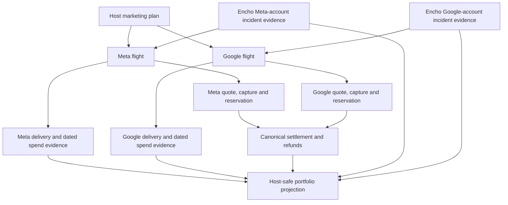

# Boardroom research — Campaign fuel, channel allocation and spend control

**Date:** 29 September 2026  
**Status:** Phase 1 research and architecture proposal. No new financial policy, implementation approval, release acceptance, live-provider test or migration number is implied.  
**Repository inspected:** `/Users/ajit/Documents/EnchoSpaceNew`, HEAD `dd99de66a36657729a016a8a11a8de478bd87a83`, with the existing HARVO/decision/boardroom documentation edits left intact. This is a focused source trace, not a full-codebase certification.  
**Companion:** [Earlier fuel-gauge source review](BOARDROOM_FUEL_GAUGE_REVIEW_2026_09_29.md).

## 1. The product outcome to design for

A host should be able to answer, for each of three or more concurrent campaigns: **What did I authorize? What has Encho charged? What have Meta/Google most recently reported spending? Is the ad actually eligible/delivering? What action have I requested versus what has the network confirmed? What guest outcomes have Encho recorded? What can I safely change now?** The portfolio summary should add up provider flights without hiding partial failures or double-counting one booking.

The control panel should make good decisions easy: pause one failing flight; compare a Meta and Google allocation; continue a proven flight under a new accepted financial contract; and receive a plain-language explanation when Encho's master account, not the host, needs attention. It must not use depletion color or urgency to manufacture a reason to buy more advertising. Because Encho funds ads through master accounts, its internal balance, provider billing exposure and host prepaid obligations must reconcile even if provider reporting is late or corrected.

## 2. External patterns: what to learn and what to reject

| Primary-source pattern | What Encho should borrow | What Encho must not infer |
| --- | --- | --- |
| [Sojern platform](https://www.sojern.com/platform) sells travel-specific cross-channel activation, flexible controls and reporting beyond clicks to booked revenue. Its [reporting taxonomy](https://portalsupport.sojern.com/hc/en-us/articles/27639333288212-Sojern-Reporting-Types) distinguishes campaign performance from post-reconciliation views. | Join channel spend with attributable, fulfilled guest outcomes; give operators a separate reconciliation view. | Vendor claims of “real-time” dashboards do not make provider cost, bookings or invoices instantaneous in Encho. |
| [Evocalize's Meta partner description](https://evocalize.com/partners/meta/) presents one approved plan, managed channel setup, CRM routing and one report; its [enterprise description](https://evocalize.com/) describes headquarters-controlled budgets with local autonomy and confirmation before major changes. | One simple host marketing plan with Encho-owned settings, bounded host choices and a visible record of consequential budget changes. | Its claimed automatic cross-channel budget movement is not authority to transfer Encho host funds between providers or reservations. Its audience/consent model may differ from Encho's. |
| [Vendasta Ads](https://www.vendasta.com/ads/) and its [reporting guide](https://docs.vendasta.com/accounts/reports/executive-report-advertising/) consolidate client spend, provider performance, sales evidence and markup reporting. | Show media, fee and outcomes as different quantities; provide portfolio comparison and drill-down. | Vendasta commonly connects client ad accounts. Encho's master-account custody adds a distinct billing/operational liability and requires different isolation. |
| [Etsy Offsite Ads](https://help.etsy.com/hc/en-us/articles/360000338367-How-Etsy-s-Offsite-Ads-Work) removes seller ad setup and charges only for attributed purchases, while giving sellers limited control over advertised listings. | Frictionless host setup is desirable; clear attribution and fee rules can build trust. | Etsy's purchase-contingent fee model is not Encho's proposed prepaid media-cost-plus-markup contract. Do not present ad spend as success-contingent or copy its limited opt-out policy. |
| [Google Ads budget overview](https://developers.google.com/google-ads/api/docs/campaigns/budgets/overview), [budget creation](https://developers.google.com/google-ads/api/docs/campaigns/budgets/create-budgets) and [assignment](https://developers.google.com/google-ads/api/docs/campaigns/budgets/assign-budgets) distinguish average daily from total budgets, note total-budget eligibility/type immutability, default shareability of daily budgets and warn that replacing an existing budget may cause excess spend because prior spend can be ignored. | Bind every Google flight to a verified unshared budget resource and exact budget kind. For continuation, prefer a supported update of the existing resource after readback; otherwise create a reviewed successor flight. | A host's fixed media authorization is not automatically a provider-enforced lifetime cap for every Google campaign type. “Increase by ₹X” is not always safe or universally supported. |
| [Google Ads data freshness](https://support.google.com/google-ads/answer/2544985?hl=en) says common clicks/impressions/cost have a one-hour freshness objective, conversions can take longer, and reports may later be adjusted. [API production guidance](https://developers.google.com/google-ads/api/docs/productionize/manage-data-efficiently?hl=en) warns about reporting resource consumption. | Display `observedAt`, provider report window and confirmed `dataAsOf` when available; fetch cost at a bounded cadence and show corrections. | Polling a React screen every 30 seconds does not create 30-second-fresh network spend. Do not run one expensive API report per host refresh. |
| [Google billing API overview](https://developers.google.com/google-ads/api/docs/billing/overview) limits programmable billing workflows to accounts configured for monthly invoicing. Meta's official [Marketing API Postman example](https://www.postman.com/meta/facebook-marketing-api/request/u38qbri/get-insight-details-from-an-adaccount-l4) includes `spend` in Insights, separately from payment evidence. | Treat account/payment health, campaign delivery and media spend as separate evidence planes, with an operator path where an API cannot verify payment cause. | A flat Insights line cannot diagnose a card failure, invoice state or account-level restriction. Native billing console parity is not established. |

These are vendor/product descriptions and provider specifications, not independent proof of their conversion performance or compatibility with Encho's account agreement. The distinct transferable pattern is **one business decision on the surface, several explicit provider and finance contracts underneath**.

## 3. Current Encho implementation: precise boundary

- `CampaignStudio.tsx` and `StudioCampaign` bind each campaign to exactly one `META` or `GOOGLE` provider with one `mediaBudgetMinor`. Host pause posts the selected campaign ID/revision; `router.ts` responds 202 and `workflow.ts` queues that campaign's operation. Three simultaneous flights are naturally separate, but the portfolio cards do not yet carry three independent gauges or one grouped channel-allocation workflow.
- `StudioShared.tsx` has a paise-preserving media-usage bar with an unknown fallback and overage warning. It currently validates amount, currency and start date, but not `report.status === AVAILABLE`, a freshness threshold, exact budget-amendment version or final settlement. A previous value can remain visible while the latest refresh failed; surrounding copy warns, but a single card summary could mislead.
- `MetaAdProvider.fetchTelemetrySnapshot()` reads campaign Insights `spend`; `GoogleAdsProvider.fetchTelemetrySnapshot()` reads `metrics.cost_micros`. The worker runs campaign observation about every five minutes; the web workspace polls its own API every 30 seconds. These are delayed provider cost reports, not a live money balance.
- `MetaAdProvider.account()` checks configured identity/status/currency and emits a generic `META_ACCOUNT_UNAVAILABLE` for several causes. `fetchAuthoritativeDeliveryTruth()` may return unknown after failure. Current host delivery projection has no authenticated account-billing incident diagnosis; the inspected marketing server paths do not establish a persistent provider-account health monitor. An account failure can affect multiple Meta flights at once.
- `financeService.ts`, `financeBridge.ts` and `settlementService.ts` preserve immutable quote/capture/reservation/journal and separate refund/settlement boundaries. `MetaAdProvider.updateBudget()` and `GoogleAdsProvider.updateBudget()` exist, but there is no canonical host top-up route and job tying a fresh accepted quote, verified capture, revised authorization, remote amendment and readback together. R5-04 remains planned. The retired legacy Refuel route is blocked by HTTP 410 and is not a shortcut.
- Current `firstPartyOutcomes` is marked `RECORDED_EVENTS_ONLY`; verified attributed bookings differ from provider-attributed conversions and neither alone proves incremental profit. Do not call a campaign a winner because its bar is low or clicks are high.

## 4. Product model: a plan, flights and financial envelopes

Use three nested concepts, without changing accepted historical campaign rows retroactively:

1. **Marketing plan:** host-facing intention for an offer/listing, objective, dates and optional suggested channel mix. It is a grouping/read model, not a fungible wallet or a provider campaign.
2. **Provider flight:** current Encho campaign bound to one provider account, one revision, an approved offer/creative/targeting snapshot, provider budget resource, unique external identities, delivery state and telemetry. Each flight retains an independent pause and settlement.
3. **Funding tranche/amendment:** an immutable accepted incremental quote and actual capture/reservation/authorization for exactly one flight and provider. A later spend-limit change is a new operation with a new cap version; it never edits the old quote or historical report.

Example: A host chooses ₹10,000 **media** for a property, allocating ₹6,000 to Meta and ₹4,000 to Google before quote acceptance. The UI shows a plan total and two child flights. The accepted host charge also itemizes Encho's approved fee and applicable tax; exact policy is still unresolved, so it cannot silently display ₹10,000 as an all-in price. If Meta fails publication but Google succeeds, the Google flight and its spend continue independently while Meta's captured/reserved obligation enters a bounded failure/refund path. There is no silent transfer to Google. If a third Meta flight runs for a different offer, it has its own gauge and pause request even though an Encho master-account incident may affect both Meta flights.

**Host control rule:** before payment, allocation is adjustable within admin/provider/risk limits. After acceptance, channel moves require explicit new quote, consent and settlement; default to no transfer. A “continue this winner” command means either a supported, read-back same-resource budget amendment or a successor flight in the same visual series after refreshed creative/inventory/account checks. No payment alone resumes a paused ad.

The arrows from account incidents mean a shared problem may affect several flights at once; they do **not** imply that an incident changes any flight's historic spend or refunds automatically.

## 5. A trustworthy gauge and status model

The UI must never collapse these values into a single “fuel balance”:

| Value | Authority and wording |
| --- | --- |
| Host charge | Verified payment capture for accepted media + fee + tax lines; show source and payment state. |
| Authorized media | Sum of immutable flight-specific media tranches that have passed finance authorization; distinct from provider's observed budget. |
| Provider configured limit | Last read-back budget resource/kind/value, tied to bound account/campaign/revision. Missing or mismatched is unknown/reconciliation. |
| Reported spend | Latest compatible provider cost report in account currency/window with `observedAt` and any `dataAsOf`; can be revised downward or upward later. This drives **reported utilization**, not refundable cash. |
| Pending exposure | Delayed-report/unbilled interval after the last report or pause; “unknown” unless an independently justified bound can be computed. |
| Settled media/variance | Reviewed invoice/provider corrections and canonical settlement journals; finality needs an explicit policy/window. |
| Refundable amount | Finance-confirmed original-payment entitlement after reservations, settlement, fees and risk; never `authorized media - reported spend`. |

For a successful, compatible provider report, draw `reported utilization = reported spend / authorized media` (integer minor units; cap the graphical fill at 100% while showing any overage numerically). If the report is missing, stale, mismatched, errored, or not bound to the current budget version, show a neutral unknown/stale presentation and the last valid value **as historical**. A provider correction may reduce the current reported numerator; store both observations with reasons/timestamps rather than forcing the bar to increase monotonically. Never estimate “days left” from configured daily budget alone. Date boundaries must use the provider account time zone and an explicit flight window, not browser midnight.

Delivery uses a separate requested-versus-observed state machine: `RUNNING_CONFIRMED`, `PAUSE_REQUESTED`, `PAUSE_SENT`, `PAUSED_CONFIRMED`, `DELIVERY_INTERRUPTED`, `OBSERVATION_STALE`, `OUTCOME_UNKNOWN`, and `CLOSED` are presentation concepts mapped from existing durable workflow/provider evidence—not replacement database enums by assumption. `RUNNING_CONFIRMED` still does not prove impressions at this instant. A pause request does not release funds, stop late-reported exposure, or certify refundability.

## 6. The host experience

**Portfolio:** Cards for each concurrent flight show offer, channel, delivery badge, ₹ reported / ₹ media authorized, report age, recorded inquiries/bookings, a clear “Request pause” control, and an issue badge. Grouped Meta/Google plan totals aggregate only nonduplicated financial tranches; an attributed booking may appear in both flight narratives but counts once in plan totals according to a disclosed attribution rule. Selecting a card opens full evidence and action history. Mobile cards must retain money/source/status labels without reducing them to color alone.

**Creation:** Start with one simple decision: property/offer and acquisition goal. Encho suggests a channel mix with assumptions/confidence, and the host may choose one channel or adjust the media allocation within bounds. A side-by-side confirmation sheet shows per-channel media, provider budget kind, flight dates, fee/tax/total host charge and known uncertainty. Funding failure in either channel must not create invisible spend authority in the other.

**Pause:** Provide an immediate receipt with request ID and time, then display remote confirmation when obtained. While a pause is unresolved, block conflicting budget/activate actions but keep status refresh and admin escalation. If a host pauses one campaign, other campaigns remain unchanged unless an independent shared-account incident or safety rule affects them. Email/push notices should summarize only the host's own state, never master account identities or guest data.

**Top-up/continue:** Show a performance evidence panel first: recent qualified inquiries, fulfilled attributed bookings where actually recorded, inventory, spend cadence and confidence; suggest pause/review when evidence is weak. Then show a fresh incremental itemized quote and explicit provider-flight target. State transitions are `QUOTE_OFFERED → ACCEPTED → CAPTURE_VERIFIED → RESERVED/RISK_CLEAR → PROVIDER_CHANGE_REQUESTED → PROVIDER_READBACK_CONFIRMED`; unknown/rejected outcomes enter reconciliation. If the provider does not support the change for the exact budget resource or dates, offer a new reviewed successor flight; do not reset the old flight's spent amount or replay an ambiguous write.

**Master-account incident:** A billing-restriction diagnosis must come from authenticated provider evidence or operator-verified evidence, with confidence and audit. A generic status failure means `CAUSE_UNKNOWN`. The host banner should say Encho is resolving a delivery interruption and show last reported spend as-of; it must not ask the host to pay more to repair Encho billing. Admin sees provider/account/correlation evidence, affected flights, first detection, pause attempts, financial exposure and recovery actions. Provider account failover is not automatic; policy/commercial approval and exact funding identity must precede any transfer.

## 7. Engineering shape and boundaries

**Read model:** Build a server-owned `CampaignControlProjection` per flight combining workflow state, bound provider budget/readback, report status, finance state and incident membership. Define a Zod-validated host projection with only safe account-health classification. Keep full provider account IDs, payment details, errors and credentials in staff-only records. Never derive finance authority in React.

**Append-only evidence:** Persist provider report observations with account/currency/window/source/observed time, report status, normalized spend and version binding; persist budget-operation request/readback and account-incident transitions separately. Existing mutable workflow telemetry may remain as the latest projection while append-only records support correction and audit. Use explicit tenant/worker RLS grants and non-bypass role tests. Migration numbers must follow reconciliation of the actual applied catalog; do not assume 038–041 or 047 availability.

**Commands and workers:** Reuse the current idempotent per-campaign pause command and job; add a durable, account-scoped health observation lane and alerting without blocking safety pause. A later budget amendment command serializes on flight + budget resource; records accepted financial tranche and expected provider budget version before an external write; checks account/risk/inventory/revision; issues one provider-supported mutation; readbacks the exact resource; on lost response, fences retries and reconciles before another write. Do not hold a database transaction open across provider HTTP. The two-provider plan builder creates separate child flight financial envelopes; first release should use separate accept/payment obligations rather than claim a new atomic cross-provider checkout.

**Capacity/observability:** UI refreshes an internal cached projection; observation workers coalesce report reads by account/flight/window, rate-limit provider calls and prioritize pause/incident jobs over analytics. Instrument `report_age`, `account_health_age`, `pause_request_to_confirmation`, `budget_change_unknown`, `reported_vs_settled_variance`, unmatched invoice rows and host-visible unknown-state duration. Alert operations on account-wide outages and spend after confirmed pause. Logs must carry safe correlation IDs, not credentials or raw billing details.

## 8. Delivery order and release probes

| Order | Deliverable | Dependency/acceptance |
| --- | --- | --- |
| F0 | Fix current meter evidence contract; add explicit report success/freshness/version checks and historical-last-value label; retain one gauge only. | Targeted no-report, stale, correction, currency mismatch, overage and keyboard/mobile tests. No financial migration required. |
| F1 | Provider-account incident observation and Admin desk triage; host-safe affected-flight banner. | Prove account-unavailable vs confirmed billing separation, shared-account fanout, stale evidence, access isolation, audit, alert delivery and safety-pause priority. |
| F2 | Per-flight portfolio cards and one grouped plan read model. | Three/four simultaneous campaigns, one independent pause, accurate per-flight sums, booking deduplication, account-switch isolation and no false live/zero label. |
| F3 | Pre-quote Meta/Google allocation chooser and separate provider-flight obligations. | Accepted itemized costs, one-provider failure, duplicate submit, quote expiry, risk hold and no cross-reservation transfer. Commercial policy must be resolved first. |
| F4 | Canonical incremental funding amendment under R5-04; exact Meta/Google capability matrix and successor fallback. | Disposable PostgreSQL multi-process concurrency, verified capture/replay, lost COMMIT/remote response, provider readback, invoice/refund/chargeback and API/UI security tests. No activation merely on payment. |
| F5 | Outcome-informed continuation guidance and bounded pilot. | Verified consent/attribution, occupancy/offer freshness, no fabricated ROI, measured support load and authenticated paused/provider/billing evidence. |

Do targeted tests during development, but the existing remediation exit rules require full suite/typecheck/lint/isolated build at the P6/R5-04 exit. Run mobile/desktop browser scenarios on the actual built surface. No simulation, source-only assertion or vendor dashboard screenshot can clear real provider/payment/legal gates. Rollback per feature means disable new allocation/amendments while preserving observation, pause, captures, journals, settlements and refunds for existing obligations.

## 9. Decisions to resolve before Phase 2 or money-control launch

1. **Financial contract:** exact cost base, fee markup, applicable taxes/rounding, treatment of Encho-owned provider overdelivery, unspent-fund refund timing and accounting; written legal/tax acceptance is still a gate. Recommended: disclose itemized terms and make Encho absorb undisclosed master-account/budget overages rather than silently bill hosts.
2. **Allocation control:** recommend host-selectable pre-quote channel split within admin-defined minimums/maximums; no automatic post-payment movement during first release. Later reallocation needs separate consent and settlement policy.
3. **Pause promise and support:** define measured provider confirmation/incident response targets rather than promising instant stop; determine when and how staff may manually verify a native billing notice.
4. **Continuation scope:** first safe version may use a successor flight instead of an in-place budget change for a provider/budget kind that cannot be proven safe. Preserve the visible campaign series so hosts do not rebuild their brief.
5. **Outcome language:** decide a documented attribution/deduplication rule and avoid calling campaigns profitable or “winning” until fulfilled-booking economics are available; provider conversions and consented Encho events must remain separate.

**Boardroom recommendation:** Build F0–F2 first. They give immediate host trust and operational visibility without moving money. Gate F3–F4 behind accepted commercial terms, provider-account capability tests and independent finance review. This is a prioritization proposal, not a phase transition.
