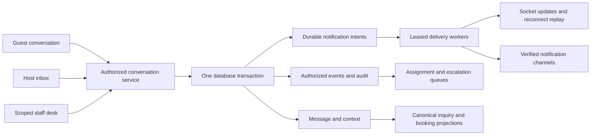

# Encho CRM and Guest Operations — Boardroom Research 037-M

Date: 23 September 2026  
Source baseline: `85b52ba`, with the existing uncommitted Discussion 037 records preserved  
Classification: Documentation, product/architecture research, focused source review  
Phase: **1 — Boardroom. Proposals below are not implemented or approved for execution.**

## 1. Mandate and conclusion

The founder asks to explore the business beyond advertising setup: reliable guest–host messaging, fast host responses, staff-assisted CRM under Admin oversight, and a polished experience across all three sides. Research references are Etsy Offsite Ads, Sojern, Evocalize, Ylopo and BoomTown.

The next strategic gap is the connection between acquisition and hospitality service. An advertisement creates an opportunity; a truthful listing, useful reply, available offer, trustworthy payment and successful stay turn it into a business outcome. More impressions cannot compensate for unanswered inquiries or invented availability.

Recommend an integrated **Guest and Host Service Desk** within the existing Encho application. Guest and Host retain their own inboxes; authorized staff work from assigned queues in the Operations Console. Shared services govern conversations, notifications, case ownership, canonical offer context, access and measurement. Do not build a detached CRM that duplicates identities, booking truth or campaign accounting.

This is a bounded source assessment, not a complete line-by-line audit, production test, or vendor-product evaluation. No database, provider, messaging or deployment operation was performed. Historical test totals and acceptance remain unchanged. `NextO` has not been issued.

## 2. Verified current implementation and gaps

Paths and line anchors describe this source snapshot and may move during subsequent work. Findings establish code behavior and missing contracts, not observed exploitation or customer harm.

| ID / priority | Evidence | Consequence and recommended disposition |
|---|---|---|
| CRM-01 / preserve | `src/lib/marketing/inquiryInbox.ts`: canonical listing ownership, published-listing checks, participant-only reads/writes, advisory-locked creation, bounded message history, stable client UUID replay/conflict checks | Extend this authority boundary rather than replacing it with a generic unauthenticated chat service. Experiences have different publication checks and require a separate review before claiming equivalent support. |
| CRM-02 / preserve | Same service and `031_marketing_inquiry_attribution.sql`: consented inquiry attribution commits with the message; revoked optional measurement does not prevent a legitimate inquiry | Communication must continue when optional marketing measurement is declined. Keep attribution separate from the right to ask for service. |
| CRM-03 / release blocker | `src/lib/leadAlertingCrmService.ts:632`: generates `host_<id>@encho.internal` and synthetic phone destinations; `:711` defaults to logging and then records `DELIVERED` without a transport receipt | Existing outbox-shaped code is not functioning email/SMS delivery. Replace fabricated recipients with verified notification destinations; unavailable transport must produce an explicit unavailable/failed state. No production test message was sent. |
| CRM-04 / release blocker | `server.ts:5016` calls that dispatcher with a pool and no transport; its claim SELECT and UPDATE are separate operations. `server.ts:11086` and legacy `worker.ts` also reference it | `FOR UPDATE SKIP LOCKED` without a transaction spanning the claim does not preserve the intended exclusion. Adopt atomic claims, fencing and real receipts. Verify deployed worker ownership separately; source references do not prove that a particular timer runs in production. |
| CRM-05 / release blocker | `server.ts:14210`: after `InquiryInbox.send()` commits, the handler emits socket message/notification events directly; duplicate retries deliberately skip emits | A process crash after commit and before emit can leave a durable message without its alert. Offline recipients lack durable catch-up from this handler. Persist notification/event intents in the message transaction; sockets accelerate delivery but do not establish delivery truth. |
| CRM-06 / contract defect | The inquiry notification supplies `message` as a string at `server.ts:14217`; `App.tsx:507` reads `notif.message.content` | Toast/browser notification bodies can be undefined. Introduce one typed versioned notification envelope and contract tests covering producer and consumer. |
| CRM-07 / release blocker | `components/InboxPage.tsx:66–136`: canned availability/workspace/noise claims and keyword-based simulated translation | A question or negative sentence containing “available” can be replaced by “Yes, the space is fully available!” in another language. “Noise protection index 92+” has no fact binding here. Remove simulated translation and unsupported reply suggestions from the later released product; use genuine translation with original text and explicit failure, plus fact-bound drafts. |
| CRM-08 / delivery UX defect | `InboxPage.tsx:234`: optimistic message uses `Date.now()`; `queueMutation` returns only success/failure, while socket events use database IDs | The visible optimistic row is not reconciled to the canonical message identity. Duplicate-looking rows, queued failures without clear status, and misleading sent states are possible. Use one client UUID through optimistic rendering, persisted response and replay. |
| CRM-09 / security design gap | `lib/syncService.ts`: one IndexedDB mutation queue persists request headers and retries unsuccessful HTTP responses. Inbox message cache keys omit actor identity. `components/AuthContext.tsx:85` clears localStorage auth but does not purge that queue/cache | Old-session credentials and private message drafts/caches can survive logout; permanent 4xx errors may remain queued. This needs adversarial shared-device testing, actor-scoped cache/queue ownership, fresh authorization at send time, expiration and logout/revocation cleanup. No cross-account production leak is claimed. |
| CRM-10 / staff launch blocker | `server.ts:14466–14534`, `components/AdminInbox.tsx`: broad admin conversation access and direct message DELETE; no assigned-case permission or reasoned access receipt in these handlers | This is a monitoring view, not a safe delegated workforce product. Staff must not receive global admin access. Replace routine deletion with authorized moderation/tombstones and retention controls; immutable attribution FKs may already prevent some deletes, so do not claim that all deletes succeed. |
| CRM-11 / operational UX gap | AdminInbox loads on mount/selection without an operational assignment/escalation workflow. Thread lists are unpaginated. Inquiry history fetch itself marks returned incoming messages read | Add bounded navigation, explicit read acknowledgement, assignment/ownership, timers, search under permission, and separate internal notes. Fetching or staff inspection must not mean that the host read/replied. |
| CRM-12 / AI authority gap | `server.ts:14584`: AI draft uses client-supplied history, title and `isHost`; it does not resolve thread authorization or canonical offer facts in the handler | Current assist is a writing draft, not a verified concierge. Server-resolve participant context and facts; minimize model data; rate-limit; label generated drafts; prevent untrusted message text from becoming instructions. Never invent availability, discounts, policies or confirmed bookings. |
| CRM-13 / guest continuity gap | `ListingDetailsNew.tsx:823` has Message host; `App.tsx:1176` creates/reuses the thread then switches to Messages without consuming returned thread ID | Opening the precise conversation, keeping selected room/date/party context and restoring the intended action after login need explicit contracts. Existing thread uniqueness is property/guest based; it does not distinguish successive trips or offers. |
| CRM-14 / fragmented legacy path | `server.ts:14273`: booking-message endpoint retains separate insert/recipient handling and calls WhatsApp with the sanitized message body | It differs from the newer participant-derived inquiry path and minimal-alert policy. Consolidate through a compatibility adapter; review recipient, privacy, consent and delivery semantics. Do not silently keep two different messaging authorities. |
| CRM-15 / preserve with extension | `src/server/realtime.ts`: signed session/persisted authority, authorized private-room joins, typing checks, periodic revocation and packet bounds | Keep these controls. Durable replay, cross-instance distribution, explicit receipts and scoped staff subscriptions still require design/verification. |
| CRM-16 / preserve with limits | `src/lib/marketing/portfolio/outcomes.ts`: owned-campaign consented visits/inquiries/unread/booking projection; null when authority is unconfigured | Useful conversion foundations exist. A thread can relate to multiple campaigns; portfolio inquiry totals need distinct identities and explicit attribution. A support agent changing a CRM stage must never create a paid booking or provider Purchase. |

Relevant existing tests include `src/test/harvo/inquiry_outcomes.test.ts`, `src/test/harvo/realtime_boundary.test.ts` and `src/test/phase3_6_lead_alerting_crm.test.ts`. Their source includes participant, replay, consent, pagination and mocked-dispatch checks. Tests were **not rerun** for this documentation task. Mock transport tests cannot certify real notification delivery.

## 3. What the external platforms actually contribute

These are public first-party descriptions accessed on 23 September 2026. Vendor performance claims are not independent evidence or Encho forecasts. No private customer console or proprietary vendor implementation was inspected.

| Reference | Observed product pattern | Proposed Encho adaptation | Boundary |
|---|---|---|---|
| [Etsy Offsite Ads](https://help.etsy.com/hc/en-us/articles/360000338367-How-Etsy-s-Offsite-Ads-Work) | Etsy arranges external advertising for sellers, with disclosed attribution and a fee on qualifying attributed sales following an ad click within 30 days | Keep host participation simple; show the exact acquisition source, attribution rule and financial explanation for a result | Encho currently proposes host-funded cost-plus campaigns. Etsy's success-fee/capital model is different. Do not import its fee/window, fund host ads on Encho's balance sheet, or imply a booking guarantee. |
| [Sojern AI Concierge](https://www.sojern.com/solutions/guest-experience/ai-concierge) | Guest request routing, centralized service visibility and assistance across the stay journey | Route a pre-booking question, check-in problem and maintenance request to their appropriate owners; preserve trip context | No assertion that Encho has Sojern's data, integrations or claimed performance. Host operating knowledge must first be verified and maintained. |
| [Evocalize / BoomTown case study](https://evocalize.com/resources/boomtown/) | Embedded advertising blueprints, prefilled property promotion and leads entering the existing nurture workflow | Connect a reviewed room-offer campaign directly to its Encho inquiry and service queue; reuse expert programs with bounded host choices | Keep approved campaign revision/finance authority. Do not copy historical real-estate targeting products or vendor CTR claims into hospitality assumptions. |
| [Ylopo's description of its AI](https://www.ylopo.com/faq/how-ylopo-ai-works) | Behavior-triggered follow-up and human handoff | Use permissioned inquiry/trip events to suggest the next useful response and hand off to a responsible human | Do not import indefinite real-estate drip sequences, covert identity imitation, or automated outreach based on unconsented browsing. An assistant must be labeled. |
| [BoomTown lead matching](https://support.boomtownroi.com/en/articles/8421235-admins-lead-matching), [rotation controls](https://support.boomtownroi.com/en/articles/8421169-admins-editing-lead-rotation-settings) | Ordered routing rules, weighted distribution and staff availability controls | Route eligible Encho support work by skill, shift, language, assigned property and capacity | Rotate Encho staff workload, **not the host who owns a property's inquiry**. Reassigning a support worker must not transfer the guest to a competing property. |

The common lesson is a connected workflow with accountable ownership. Copying five products' feature lists would create five maintenance burdens. Encho needs a smaller complete hospitality workflow, with advertising feeding it.

## 4. Candidate product experience across all roles

### Guest: one conversation with continuity

From a room offer or property page, “Ask about this stay” opens the correct conversation with a small context card: selected room, proposed dates, party size and known conditions. Dates express intent; they are not an inventory hold. The guest can edit context deliberately rather than retyping it into free text.

Preserve the intended destination through sign-in without treating anonymous drafts as authorized messages. Show `Waiting to send`, `Sent to Encho`, `Delivered to a device`, and `Read` only when evidence supports each state. A host reply is a separate outcome. A browser notification is not evidence of any of these states.

The guest sees who is speaking: named Host, property co-host if authorized, named Encho support agent, or labeled automated assistant. Include report/block/help actions and a clear way to escalate an unanswered request. Service access must not depend on paid advertising or agreeing to optional measurement.

When checkout authority is accepted, a host may share a server-generated offer card with expiry and inventory conditions; the guest completes the approved Encho checkout. Until then, show an inquiry action, not a simulated payable quote. Never confirm a reservation from chat text or a staff status change.

For later trips, preserve relationship history but create separate inquiry/trip contexts. One room question must not silently overwrite another room/date request. Confirmed-trip details use their own authorized projection; sensitive access instructions are not public listing facts.

### Host: a manageable work queue

Recommend one Inbox covering organic and campaign inquiries with filters for property, room offer, campaign, trip stage and action owner. Four concurrent campaigns remain four campaign records; their related messages can appear together without collapsing budgets or attribution.

Each queue row answers: who needs a reply, for which stay and dates, how long they have waited, who is responsible, and whether the latest alert succeeded. Avoid a generic “hot” label that conceals why a guest needs attention.

The conversation view includes verified room details, permissioned availability lookup, safe answer templates, AI draft assistance, internal task reminders and “Ask Encho for help.” A host can set staffed hours, notification preferences, availability for support and approved co-hosts. None of those settings grants a co-host access to unrelated listings.

Default assistance is host-owned. Encho staff may prepare a draft or answer within a specifically delegated service scope, visibly as Encho. They do not silently impersonate the host, negotiate prices or promise refunds.

### Staff: a specialist workspace inside Operations

Recommend `/operations/service` as a candidate route, not a separate login system. Reuse the proposed organization membership model from 037-H. Provide “Assigned to me,” “Unassigned,” “Host overdue,” “Arriving soon,” “Safety/dispute,” and “Delivery failures” queues as permitted by role.

Assignment is durable, capacity-aware and atomic. Two staff members claiming the same case get one owner; collaborators can add internal notes. Use assignment versions and send-time checks to warn about a simultaneous host reply. Do not globally lock a host out of their conversation because an agent opened it.

Staff need concise context, a visible next action, handoff summaries, snooze reasons with wake times, and clear distinction between **internal note** and **guest-visible reply**. Private notes must be excluded server-side from guest/host projections according to the approved policy, not merely hidden with CSS.

On offboarding, revoke sessions/subscriptions, purge local staff caches and reassign open work with an audit trail. Do not overwrite one staff identity with a replacement employee.

### Admin: oversee exceptions and outcomes

Admin receives queue health, overdue volume, delivery failures, response distributions, unresolved safety cases and audited quality samples. Default oversight should expose operational metadata before message bodies. Content access requires an appropriate role and documented purpose, with expanded break-glass access separately controlled and audited.

Proposed permission separation:

| Capability | Guest | Host/co-host | Service agent | Service supervisor | Marketing/finance staff |
|---|---|---|---|---|---|
| Read conversation | Own participation | Authorized properties/participation | Assigned cases and allowed history | Scoped team/quality cases | None by default |
| Send public reply | Self | Own identity within property scope | Labeled Encho identity within delegation | Same, with oversight scope | No automatic right |
| Assign/handoff | Request help | Request/revoke bounded assistance | Claim/handoff permitted queue | Manage scoped workload | None by default |
| Internal notes | No | Own team's separate notes if supported | Assigned service notes | Scoped service notes | Separate domain notes |
| Change rates/refund/spend | Existing authorized guest action only | Existing canonical host contracts | No | No implicit privilege | Separate financial/provider authority |
| Export/delete content | Policy-mediated rights request | Policy-mediated rights request | No bulk export/hard delete | Governed review only | No implicit privilege |

Exact access, retention, disclosure and emergency procedures remain a founder/privacy/legal decision. The proposal is transparent support access, not secret unrestricted employee surveillance. Anti-diversion controls must not make emergency assistance or necessary confirmed-stay communication unusable.

## 5. Candidate engineering structure

Keep a modular application and worker deployment first. A fleet of microservices is not needed to fix notification truth. Isolate domain responsibilities within existing TypeScript/PostgreSQL infrastructure and measure load before splitting deployment units.

### Conversation and context authority

Candidate concepts, subject to Phase 2 schema review: conversation, participant membership, inquiry/trip context, message, per-participant read cursor, attachment, support case, assignment event, internal note, notification preference, notification intent/attempt, audited content-access event and AI draft provenance.

Extend/migrate current `threads`/`messages` rather than making a second truth store. Keep legacy IDs and campaign inquiry references intact. Distinguish the long-lived conversation from individual room/date requests. Do not infer a historical room, campaign or consent if none was recorded.

Message create should atomically authorize participants, validate a stable client UUID and payload hash, persist content, advance a per-conversation event sequence, append delivery intents and record applicable inquiry attribution. Use a per-conversation serialization boundary for replay order; a globally allocated serial ID alone can have commit-order gaps and is not sufficient for safe catch-up. A changed payload under the same idempotency key must be rejected.

Read receipts should acknowledge a visible message sequence under the current participant, not mutate state just because a history GET occurred. Staff inspection never advances the host's read cursor. Public replies, internal notes, system events and moderation actions have distinct visibility contracts.

### Reliable transport and truthful status

Socket.IO provides at-most-once delivery by default; its official guidance describes durable IDs, persistence and reconnect offsets for stronger server-to-client delivery. Keep durable storage authoritative and add replay/pagination before claiming reliable realtime delivery. [Socket.IO delivery guarantees](https://socket.io/docs/v4/delivery-guarantees/)

Clients recover through a permission-checked cursor and reconcile by canonical message/client UUID. Handle missed events, restarts, duplicate broadcasts, multiple tabs, changed roles and revoked memberships. When multiple web instances are used, the fan-out adapter and deployment routing must be explicit and tested. Long-lived socket requirements must be checked against the actual hosting topology.

Notification records distinguish `QUEUED`, `CLAIMED`, `PROVIDER_ACCEPTED`, `DELIVERY_CONFIRMED`, `FAILED`, `SUPPRESSED` and `UNKNOWN` where supported. Email acceptance is not recipient reading. Some channels cannot prove device delivery; preserve that limit. Provider timeout is not proof of rejection or permission to flood retries.

Claim intents in one short transaction or atomic statement, then perform network I/O outside database locks. Use lease owner/fence, bounded retries with jitter, dedupe keys, per-recipient throttles, circuit breakers, dead-letter handling and admin diagnostics. Provider-specific idempotency/status lookup governs uncertain sends; do not promise universal exactly-once external delivery.

Resolve verified destinations and channel permission at dispatch. Keep alert content minimal, use the configured canonical Encho origin, and reauthorize the deep link on open. An alert must never be an access token to a conversation. Quiet hours, duty schedules, duplicate suppression and explicit safety escalation replace indiscriminate repeated pings.

For private browser storage, partition by actor and environment, expire content, clear on logout/revocation and never persist bearer headers in a generic retry queue. Classify validation/permission failures separately from retryable network errors. A queued draft must not replay under a different account. Given this complexity, online-only sending with an explicitly saved local draft is an acceptable initial release choice if secure offline replay is not ready.

### Service routing and response clocks

Separate four dimensions: conversation state, current action owner, response deadline, and booking outcome. Candidate conversation states include open, waiting for host, waiting for guest, assisted, resolved and reopened; they never establish financial state.

Record first guest inquiry, notification attempt/receipt, first meaningful human response, current unanswered turn and escalation action. An automated acknowledgement does not stop the human-response clock. A subsequent guest question starts a new response obligation. Timers recheck current sequence, duty hours and ownership before escalating so old jobs do not summon staff after a reply.

A practical pilot hypothesis is immediate in-app acknowledgement, prompt channel dispatch, an early host reminder and staff escalation during declared staffed hours. **The actual minute thresholds, coverage, staffing capacity and customer-facing promises are unresolved.** Measure P50/P95 response times and unanswered rates before publishing a promise such as “replies within five minutes.” Arrival/safety urgency is separate from sales propensity and does not depend on the guest's spend or a model score.

### AI and content safety

Start with human-reviewed drafts and summaries. The server authorizes the thread, selects the minimum necessary history and supplies approved listing facts, scoped policies, checked availability and source timestamps. Guest text is untrusted data; it cannot instruct the model to expose other guests, change prices or invoke operational tools.

AI suggestions show supporting facts and unresolved questions. A host approves the actual text. Automated replies, if later approved, are confined to maintained FAQ facts, explicitly identified, rate limited and immediately handed off on uncertainty, complaint, safety, negotiation or payment issues. The assistant cannot confirm a room hold, authorize money or declare a booking.

Translation preserves original text, language and uncertainty; it must never substitute a canned sales claim. Test negation, dates, money, Malayalam/Hindi/English code-switching and policy wording before adopting a language. On failure, show the original and unavailable status.

Attachments need authorization, size/type checks, malware/quarantine processing, expiring private access and controlled metadata. Support evidence must not silently become a public listing or advertising asset. Content retention and deletion must reconcile user rights, operational evidence and legal holds; do not make all message bodies immutable forever simply because financial receipts are immutable.

### Canonical commerce and measurement

The service desk can consult availability but cannot bypass inventory holds, server quote authority or payment webhooks. M5/M6B legal gates remain. A message expressing interest is an inquiry; a quote opened is not payment; payment captured is not a completed stay.

Use canonical events for inquiry created, meaningful reply, accepted quote/hold when available, confirmed payment, cancellation/refund and fulfilled stay. Keep organic inquiries visible. Consent governs marketing attribution/retargeting, not ordinary service provision. Staff stage edits remain operational annotations.

Do not attribute one booking in full to all four campaigns that a guest encountered. Preserve touchpoint evidence and disclose the chosen attribution model; compute unique property/host portfolio totals from canonical identities. Attribution is a reporting rule, not proof that advertising caused incremental demand. Future holdouts and business experiments require sufficient volume and bounded exposure.

## 6. Premium interaction design with a business purpose

The existing dependency set already includes Motion/Framer Motion. Begin with consistent typography, spacing, loading/error states and restrained transitions. GSAP is optional for a demonstrated editorial need; Three.js is appropriate only for a useful, lazy-loaded spatial experience with a static accessible alternative. Neither is a prerequisite for an excellent inbox.

Proposed presentation:

- **Guest:** calm conversation, offer/date context, clear speaker identity, persistent composer, legible delivery/retry state, help escalation, optional original/translated text.
- **Host:** action-first inbox with property/offer/campaign filters; focused conversation; collapsible facts/availability panel; visible handoff status. Add campaign signals where relevant without burying a guest's question beneath marketing charts.
- **Staff desktop:** queue, conversation and case context in three resizable regions; keyboard navigation and scoped command search; a conspicuous switch between internal note and public reply; ownership conflict warnings.
- **Staff/mobile host:** one primary pane at a time, persistent back navigation, safe-area/keyboard handling, saved drafts and touch-friendly controls. Do not squeeze a desktop operations grid into a phone.
- **Admin:** exception counts and trends that lead to actionable queues, not an unreadable wall of glowing gauges.

Animation must communicate a state transition, never hold the message send path or continually reorder a queue under an operator's pointer. Do not auto-scroll someone reading history; expose “new messages” and let them return. Do not add fake typing indicators, online status, viewer counts or scarcity. Respect reduced-motion and user sound preferences. W3C explains the harm caused by unnecessary motion and supports disabling non-essential interaction animation; its cited criterion is AAA, above the proposed AA baseline. [W3C animation guidance](https://www.w3.org/WAI/WCAG22/Understanding/animation-from-interactions.html)

Proposed acceptance targets, not measured results: WCAG 2.2 AA; complete keyboard and screen-reader journeys; no horizontal overflow at 360px; core composing/retry experience on low-end mobile; message-persist API P95 under 500ms at an agreed pilot load; connected-client update P95 under two seconds in a defined network environment. External notification delivery and human response need separate SLOs. Validate targets against deployment capacity before commitments.

## 7. Other business gaps worth exploring, in dependency order

| Area | Why it matters | Candidate improvement and proof needed |
|---|---|---|
| Supply truth and onboarding | Advertising a misleading room turns acquisition into complaints | Room-specific media, documented policies, operator identity, amenity evidence, content freshness and a readiness checklist. New property facts require guest, host and admin surfaces together. |
| Inventory across sales channels | An Encho-only calendar cannot establish that inventory sold elsewhere is still available | Investigate the host's channel-manager/PMS authority, booking windows and refresh contracts. Show freshness; do not market an unverified sync as instant. No integration capability is assumed. |
| Canonical booking and post-stay operations | A CRM cannot close legally blocked checkout or incomplete refund handling | Complete approved quote/hold/payment/confirmation and manage-trip/support/refund evidence under existing legal gates. Test payment-success/browser-failure and unavailable-room cases. |
| Staff and host operating capacity | Generating demand for an unstaffed property wastes media budget | Duty schedules, backup ownership, queue capacity, reply-quality sampling and disclosed support scope. Any campaign throttle due to service failure needs a released policy and proper command authority. |
| Trust and abuse | Spam, harassment and fraud consume staff and damage guest trust | Rate limits, reporting/blocking, evidence-preserving moderation, safety escalation and appeals. AI flags are review signals, not unappealable verdicts. |
| Financial transparency | Large funded budgets magnify disputes about results and fees | Distinguish authorized media, reported spend, committed costs, markup, booking commission and final settlement. Never sell service success on impressions alone. |
| Retention and repeat demand | Repeated acquisition can be uneconomic | After a fulfilled stay, permissioned review requests, saved preferences and appropriate repeat-stay invitations. No purchased/contact-scraped audience or indefinite nurture by default. |
| Property/offer intelligence | Persistent unanswered questions reveal product and content gaps | Aggregate recurring questions by property without exposing private text; recommend canonical fact updates for host/admin review. Reuse approved answers only after facts are validated. |

Do not launch all of these simultaneously. The next coherent business slice is: truthful room context → guest inquiry → reliably notified responsible host → staff rescue when authorized → evidence-backed response → accepted canonical booking when legally available → measured service cost/outcome.

### Operating economics the founder must see

The approved advertising direction is defined cost `C` plus markup `C × p`, initially intended at 3–5%; it is not a 3–5% net margin guarantee. For illustration only, if `C = ₹10,000` and `p = 4%`, markup is ₹400 before any costs not already included in `C`. Ten inquiries requiring eight staff minutes each consume 80 minutes. At an illustrative fully loaded ₹300/hour, that is another ₹400. Whether this is additional cost or already inside `C` must be defined to avoid double-counting. Booking commission is separate and unearned until its contractual conditions are satisfied.

Therefore measure contact cost, human minutes per inquiry, notification/model cost, qualified-inquiry rate, fulfilled-booking contribution, cancellation/refund cost and repeat-host retention. High-touch selling for every small-budget campaign cannot be promised as “free” until these economics support it. Recommend included bounded service support and a separately evaluated assisted-sales offer; commercial packaging is not yet approved.

## 8. Candidate dependency sequence, impact and acceptance

This is a boardroom sequencing recommendation. Final milestone IDs, migrations, API schemas, staffing promises and rollout authority belong to the Phase 2 blueprint after `NextO`.

| Sequence | Scope | Exit evidence to require later |
|---|---|---|
| A — Trust repair | Remove fake translations/facts/delivery claims; unify event envelopes; specify secure private cache and exact-conversation navigation | Negative/ambiguous language remains truthful; no transport call means no delivered state; sender/recipient and cross-account tests |
| B — Reliable conversations | Canonical contexts and per-participant receipts, message/outbox transaction, real opted-in channel adapter, reconnect replay | Crash after commit, duplicate retry, multi-device and offline/expired-session tests; real channel receipt in an isolated approved environment |
| C — Workforce authority | Scoped staff memberships, assignments, access receipts, notes, handoff and escalation | Host isolation, unauthorized staff denial, concurrent claims, offboarding and reasoned access audit under real non-bypass DB roles |
| D — Integrated experience | Guest continuity, Host work queue, Staff desk, Admin exceptions and mobile/accessibility polish | A guest reaches the exact host/offer; host reply and bounded staff assistance work end to end; no internal-note leakage or lost draft |
| E — Grounded assistance | Fact-based drafts, approved templates, validated translation and explicit human handoff | Hallucination/negation/prompt-injection evaluations; uncertain availability escalates; no autonomous financial authority |
| F — Bounded service pilot | Agreed coverage, active hosts, independent test identities, approved contacts, incident drills and measured costs | Source/DB/runtime/notification evidence, response-time distributions, unresolved-rate/quality review and viable contribution economics |

Proposed impact boundaries:

- **Frontend:** `components/InboxPage.tsx`, `components/AdminInbox.tsx`, `components/ListingDetailsNew.tsx`, `App.tsx`, `components/AuthContext.tsx`, `lib/syncService.ts`; proposed staff service view and shared accessible conversation components. Host/admin listing forms change only when adding canonical property policy/fact fields.
- **Backend:** extract compatible thread/admin/AI routes from `server.ts` into focused messaging/operations modules; extend `InquiryInbox`, reuse safe transaction/realtime patterns, introduce durable notification dispatch with explicit worker ownership.
- **Database:** additive migration of context/membership/receipt/outbox/assignment/audit contracts; preserve current messages and attribution FKs. Use the hardened runner, agreed advisory lock, checksums, FORCE RLS and actual least-privilege runtime tests. No migration number is reserved here.
- **API compatibility:** adapt existing `/api/threads` and booking-message callers to one authority; introduce typed versioned envelopes and cursor contracts without silently breaking clients. Retire duplicate legacy write paths only after compatibility evidence.
- **Security/privacy:** scoped message access, no persisted bearer queue, safe model/attachment boundaries, explicit support disclosure and retention decisions. Existing privileged runtime remains an independent release blocker.
- **Performance:** paginated/indexed queues and participant histories, bounded payloads and model history, aggregation outside render loops, connection/load budgets and explicit multi-instance fan-out.
- **Rollback:** rollout flags by component/channel, immutable migration receipts and compatibility reads. Preserve durable messages/outbox evidence; pausing a worker must not report undelivered notifications as delivered. Do not roll back to fake translations or transport success. Stop new AI/channel actions independently of core messaging.

Minimum adversarial scenarios: own/other host/case access; revoked staff already on a socket; internal note sent through a manipulated guest endpoint; two simultaneous staff claims; client UUID conflict; process death after message commit; uncertain channel acceptance; new message while reading history; guest declining measurement; host/guest switching accounts offline; permanent 403 versus transient 503 replay; old timer after a reply; disputed/retained versus deleted content; canceled booking counted as success; and translated negation turning into a promise.

## 9. Decision register and unresolved inputs

**Founder direction recorded:** extend the platform beyond campaign setup into efficient guest–host communication, reliable notification/reply, delegated Admin/staff CRM management, and excellent interaction design; research named platforms for useful patterns.

**Engineering recommendations, not yet approved:** one integrated service desk; truthful durable delivery; host ownership with disclosed bounded staff assistance; capability-scoped IAM; human-reviewed canonical AI drafts; accessibility/performance-led design; phased domain consolidation before added channels or autonomous nurture.

**Reject:** relabeling console logs as delivery; canned “translation”; hidden staff impersonation; global admin for every employee; automatic confirmed booking from CRM labels; rotating a host's lead to a rival property; claiming 24/7 human service without staffing; buying a library to substitute for product quality; copying Etsy's commercial model without capital/risk analysis.

**Open inputs for later blueprint:** support hours/languages and staffed capacity; whether staff can answer publicly or only draft for hosts; verified notification channels and approved pilot destinations; host/co-host delegation; privacy/retention/emergency rules; included versus paid assisted-sales economics; accepted canonical checkout/quote authority; and actual runtime/provider readiness. No guessed answers to these become production configuration.

**Completion record:** research and living-memory update only. No application code changed, tests rerun, messages sent, deployments performed or milestones accepted. Phase 1 remains open until `NextO`.
