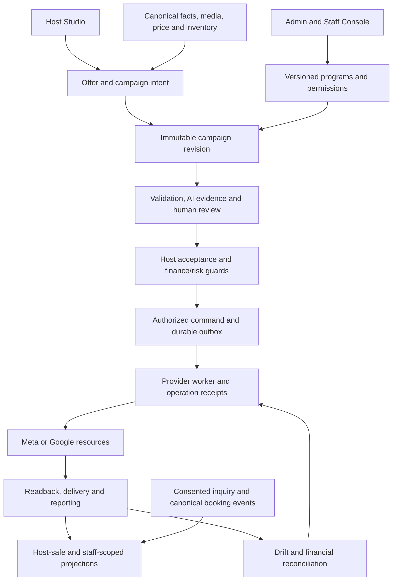

# Encho Marketing Studios — Architecture Research and Boardroom Proposal 037-I

Date: 23 September 2026  
Source baseline inspected: `85b52ba`, plus the existing uncommitted Discussion 037 records  
Status: **Phase 1 research and architecture proposal. Not an approved Phase 2 blueprint, implementation, or production certificate.**  
Controlling discussion: [Boardroom 037](BOARDROOM_DISCUSSION_037.md)  
Phase exit: the founder's exact `NextO` instruction.

## 1. Recommendation and scope

Build one Encho Marketing Operations Console with a deep Meta Studio and Google Studio inside it. Admins and authorized staff should be able to design, preview, release, operate and measure every **explicitly supported hospitality advertising workflow** without rebuilding campaigns in provider consoles. Hosts receive a small, policy-controlled set of choices. The system preserves the evidence connecting the advertised offer, creative, money, provider configuration and guest outcome.

Do not promise an eternal copy of every setting in both native Ads Managers. Native interfaces, public APIs, account eligibility and Encho's verified integration are different authorities. A field existing in a provider schema does not mean Encho may safely enable it for every advertiser. Billing setup, advertiser verification, account disputes and some new/limited provider features may require external action. The console must identify that boundary rather than display a working-looking switch that does nothing.

The founder's latest agreement accepts the direction of delegated staff operation and reusable strategies. It does not settle every role combination, demographic permission, spend threshold, commercial term or provider classification. The detailed proposals below remain subject to discussion. Earlier accepted room-offer tiering, property-discovery boundaries and new host creative requirements remain intact.

Research includes focused source inspection and public primary documentation. It is **not** a repository-wide line-by-line audit, a paid-product trial, a benchmark, an authenticated inspection of the supplied Meta Ads Manager account, or a live provider canary. The authenticated Meta link could not be retrieved by the research browser; several Meta documentation pages also rate-limited requests. Official Meta SDK source supplies structural reference, not proof of v26/account capability.

## 2. What the reference platforms actually contribute

| Reference | Verified public pattern | Encho adaptation | Boundary |
|---|---|---|---|
| Sojern | Travel-specific audiences, traveler intelligence and coordinated campaign/guest marketing | Organize evidence around destination, origin market, stay dates, lead time and completed stays | Encho does not inherit Sojern's proprietary data, partnerships or claimed performance |
| Evocalize | Embedded objective-specific blueprints combining account structure, creative, targeting and business rules; its EXIT case describes listing-price-based spend automation | Versioned program library compiled from canonical offer facts, with locked and delegated controls | Home-sale neighborhood targeting is not automatically the correct hospitality feeder strategy |
| Ylopo Mission Control | Guided client operation and expert-managed operation through a unified dashboard | Recommended host flow plus bounded customization; expert settings remain in staff studios | This is product inspiration, not evidence that every native provider option can be embedded |
| Vendasta | Cross-channel reporting and distinct administrative/fulfillment roles | Shared reporting vocabulary, assigned work, client-safe views and role-specific desks | Advertising Intelligence documentation explicitly says it cannot run ads; it is not Encho's execution blueprint |
| Google/Meta developer surfaces | Provider-native resources and asynchronous controls/reporting | Typed channel adapters with explicit capabilities, identity, readback and error evidence | Provider responses, eligibility and policy outrank a locally valid form |

Sources: [Sojern platform](https://www.sojern.com/why-sojern), [Evocalize EXIT blueprint case](https://evocalize.com/resources/exit-realty/), [Ylopo Mission Control](https://www.ylopo.com/mission-control), [Vendasta Advertising Intelligence scope](https://docs.vendasta.com/es/learn/products/attract/advertising/introduction-to-advertising-intelligence/), [Vendasta account roles](https://docs.vendasta.com/administration/my-account/). Vendor performance claims are not independently validated in this report.

The useful synthesis is Encho-owned listing, offer, inventory and conversion truth combined with repeatable expert programs and accountable operations. Buying prettier controls does not establish profitable acquisition.

## 3. Verified foundation versus missing integration

| Existing source | Verified foundation | Required evolution |
|---|---|---|
| `components/marketing/AdtechWorkspace.tsx`, `AdtechProfileForm.tsx` | Profiles, corridors, research, audits, immutable profile versions, CAS release/rollback and diff display | Provider workspaces, field-level capability feedback, structured diffs, staff permissions and per-campaign operating controls |
| `src/shared/adtech/contracts.ts` | Minor-unit values, tier intervals, Meta/Google configuration, geography, hashes, room-price evidence type | Offer/rate/occupancy/date authority; modular policies; delegated-control contract |
| `src/lib/marketing/adtech/bindings.ts` | Ownership checks, released strategy/corridor selection, constrained radius changes and immutable campaign revision binding | Resolution currently reads `listings.price`; integrate the selected sellable room offer rather than classifying the resort |
| `src/lib/marketing/adtech/capabilities.ts` | Explicit rejection of unsupported Meta objective/conversion and Advantage+ combinations | Per-control, account-aware lifecycle and observed capability evidence; a schema option is not a released feature |
| `src/lib/marketing/adtech/compiler.ts` | Meta coordinates/city radii/exclusions/placements/attribution; Google criteria; readback comparison | Expand only through tested provider contracts and preserve actual versus intended configuration |
| `src/lib/marketing/creativeWorkflow.ts` | Reviewed image derivatives, source authority and immutable review events | Campaign-only uploads, reviewed video lifecycle and reusable creative packages |
| `src/lib/marketing/portfolio/spatialStories.ts`, `src/shared/marketingStory.ts` | Independently reviewed four-card canonical image stories | Extend existing story authority into broader room-bound creative packages |
| `MetaCampaignPlan.ts`, `GoogleSearchPlan.ts` | Meta image-carousel compilation and Google spatial sitelink/image asset compilation exist | General host-authored carousel/video workflows, supported placement variants and account acceptance evidence |
| `src/server/marketing/router.ts`, `src/lib/marketing/database.ts` | Persisted-user lookup and host/admin projection; transaction-local context | Current binary admin authority is too broad for staff delegation; add scoped membership/permission enforcement and audit worker authority |
| `src/server/marketing/worker.ts` | Separate asynchronous maintenance tasks; campaign observations scheduled every five minutes | Priority-aware observation, freshness semantics, coalesced operator refresh and incident escalation |
| `src/lib/providers/ProviderOperationStore.ts` | Durable claims, step evidence and completion/uncertain-failure paths | Extend the existing operation store; do not introduce a second competing publication ledger |

**Correction to 037-G:** “carousel authority is missing” was too broad. The reviewed four-card canonical spatial story pipeline already exists. The gap is new host-originated campaign media, generalized packages, video/placement review and end-to-end production evidence. Likewise, a provider function accepting `VIDEO` is not proof of a complete, safely reviewed host Reel product.

The latest recorded [production rollout](../implementation/ADTECH_PRODUCTION_ROLLOUT.md) reports applied 032–035 migrations but unresolved restricted-runtime/grant and exact-district/provider-canary gates. These are dated receipts, not freshly tested production facts. No application tests or live-system checks were run for this document; document links and formatting were checked locally. Prior local test totals do not certify the proposed studios.

## 4. The product model: offer, campaign purpose and creative are separate

The foundational hierarchy should be:

```text
Host business → property → sellable room/entire-stay offer
                              ↓
                   campaign subject and intent
                              ↓
       offer evidence + creative package + released strategy
                              ↓
          exact campaign revision + accepted financial contract
                              ↓
                 provider resources and observed outcomes
```

Use three campaign subjects already discussed:

1. **Room-offer campaign:** one room type/entire-stay offer, occupancy basis, relevant dates/rate conditions and exact landing context. Resolve BUDGET/COMFORT/PREMIUM from its canonical nightly basis.
2. **Property discovery:** accurately present the resort and available range. An evidenced “Rooms from” claim does not price the pictured presidential suite or classify the whole resort. Use a dedicated discovery policy and disclose its purpose.
3. **Selected-offer portfolio:** later, explicit allocation across selected offers. It needs contribution/budget boundaries, landing selection, per-offer attribution and host consent. This is not the same product as the separately gated pooled destination campaign across hosts.

Creative format is an independent axis: reviewed single image, reviewed video/Reel, or reviewed carousel. Paid distribution and organic posting to Encho's social accounts are also separate authorizations. A Reel need not create a new campaign product, and purchasing ads does not automatically purchase an editorial post on Encho's Instagram.

Illustrative resort, **not production data**:

| Offer | Canonical nightly basis | Economics policy | Plausible content, only if verified |
|---|---:|---|---|
| Garden room | ₹3,200 | BUDGET | Actual room and shared grounds |
| Couples suite | ₹5,800 | COMFORT | Actual suite and documented features |
| Presidential villa | ₹12,000 | PREMIUM | Actual villa and documented private facilities |

A ₹3,200 image ad showing the ₹12,000 villa is a trust failure even if a tiny footnote says “from.” Asset subject and advertised price must agree. Tax, minimum stay, occupancy and eligibility disclosures remain governed by the accepted guest/financial contracts; this proposal does not invent them.

## 5. Strategy composition: reuse expertise without oversimplifying travelers

Retain current immutable releases and evolve their contents into composable, versioned policies:

```text
Offer economics policy
+ verified guest-fit/content intent
+ destination and feeder policy
+ season, booking window and usable inventory
+ supported campaign objective and measurement readiness
+ Meta or Google channel policy
+ creative-format and landing policy
+ host-delegation policy
+ financial, privacy and provider safety constraints
= immutable executable campaign strategy
```

Resolve conflicts by explicit precedence. Platform safety and provider eligibility constrain every policy; the host cannot relax either. Missing or contradictory policy produces a specific blocker. Record which policy contributed each effective value. No silent “last JSON value wins.”

Tier ranges, hypotheses, budget suggestions and discretionary parameters remain in versioned database policy. Security checks, schema validation, currency conversion, API serialization and invariant enforcement remain typed code. “No hardcoded business settings” must not become “admins can submit arbitrary provider JSON.”

Price informs affordability and acquisition economics. It does not prove someone is a honeymooner, family, executive or high-income individual. A hostel and a couple's cabin can share a nightly price band while needing different creative. `GuestFitIntent` describes the offer's verified suitability and messaging; it is not an inferred sensitive personal attribute or a direct promise that Meta can target a relationship category.

Default age brackets and CAC ranges remain hypotheses to test. Do not advertise them as mathematically optimal. A defensible break-even acquisition estimate needs expected stay length, net collected revenue, variable operating cost, commission, cancellations/refunds and contribution margin; nightly price alone is insufficient. Missing inputs must produce limited guidance, not invented profitability.

## 6. What “complete admin control” means operationally

Create a capability contract for each supported control, attached to the adapter release and selected provider account. Candidate evidence fields:

| Field | Purpose |
|---|---|
| Provider/API version, resource and field | Exact native meaning and serialization target |
| Support state | Tested, conditional, read-only, experimental, provider-console-required, unavailable or deprecated |
| Account eligibility evidence and checked-at/expiry | Avoid assuming every account has identical features |
| Dependencies and incompatible combinations | Objective, event, format, placements, policy category, billing and tracking requirements |
| Allowed operation | Create-only, new-revision update, safe operational action or observation-only |
| Permission and resource scope | Which staff may propose, approve or execute it |
| Host delegation bounds | Hidden/visible/read-only/editable with server-enforced limits |
| Compiler and readback contract | How intent becomes a payload and how actual settings are checked |
| Evidence and risk | Documentation reference, tests, canary receipt, warning and rollback/recovery behavior |

Schema introspection can identify provider changes for engineers. It must not automatically enable a new spend-affecting field in production. Changes require contract review, tests, account validation, paused verification and a new release.

The studio should show **Approved → Compiled → Observed** settings. Examples: approved radius 30 km, compiled radius 30 km, observed radius missing; approved manual placements, observed audience expansion enabled. Such differences become actionable drift, not a green “Published” badge.

Meta's official generated [AdSet](https://raw.githubusercontent.com/facebook/facebook-python-business-sdk/main/facebook_business/adobjects/adset.py), [Targeting](https://raw.githubusercontent.com/facebook/facebook-python-business-sdk/main/facebook_business/adobjects/targeting.py) and [AdCreative](https://raw.githubusercontent.com/facebook/facebook-python-business-sdk/main/facebook_business/adobjects/adcreative.py) sources demonstrate distinct configuration, effective status, targeting and creative fields. The inspected `main` branch is structural research; production must pin and validate its exact supported version.

## 7. Meta Studio: expert depth with dependency-aware controls

Use the native **campaign → ad set → ad/creative** hierarchy inside Encho. The expert chooses a released program or drafts a new one. Editing shows the affected resource level, compatibility and risk.

| Studio area | Candidate controls/evidence | Release boundary |
|---|---|---|
| Advertiser and identity | Authorized account, Page, Instagram identity, beneficiary/payor and policy-category evidence | Only mapped and eligible identities; no host credentials |
| Campaign purpose | Supported objective, conversion location and creative program | Current compiler supports website bookings; lead objectives stay blocked until the complete lead path is verified |
| Measurement | Pixel/dataset identity, conversion event, attribution contract and event-health diagnostics | Existing consent and canonical conversion authority required |
| Budget and schedule | Supported campaign/ad-set budget model, lifetime/daily constraints, bidding, dates/timezone | Cannot exceed or reinterpret the accepted host financial contract |
| Geography | Approved cities/radii/coordinates, exact exclusions, provider resolution and overlap visualization | Unresolved mandatory exclusion blocks publication; never silently substitute national targeting |
| Audience | Supported age/gender/interest/custom-audience controls with policy and account eligibility | Unsupported or sensitive targeting is not manufactured from a persona label |
| Placements | Explicit Feed/Stories/Reels; supported automation modes with asset compatibility | Current unsafe/unverified Advantage+ combinations remain unavailable |
| Creative | Exact reviewed images/video, ordered cards, caption, CTA, thumbnail and landing | No edit after approval without a new package/revision |
| Delivery diagnostics | Configured/effective status, review feedback, issues, learning evidence where available | “Enabled” does not imply serving or profitable |
| Experiments | Bounded variant test, defined success metric, cost ceiling and stop rule | New campaign evidence/consent where material; no automatic winner after an arbitrary 24 hours |

Do not display every native option on the initial screen. Provide an expert inspector for relevant supported fields. An ineligible option should say why it is unavailable and what evidence would enable it. Provider limits and combinations remain validated server-side.

Organic Facebook/Instagram publication belongs to a separate editorial queue with platform permissions, media rights, scheduling, approval and immutable post identity. “Use an existing post” may be enabled only when its ownership, content and ad eligibility are established. It must not bypass creative review.

## 8. Google Studio: preserve Search semantics

Use **customer → campaign → ad group → ad/assets/criteria** with native details where needed. Do not translate Meta audiences mechanically into Search keywords.

| Studio area | Candidate controls/evidence | Release boundary |
|---|---|---|
| Advertiser/account | MCC/client mapping, currency/timezone, billing and verification readiness | End-advertiser policy and representation must be satisfied |
| Channel/program | Supported Search programs first; explicit future adapters for other campaign families | PMax, Display, YouTube and Hotel Ads require separate contracts and evidence |
| Keywords | Themes, researched terms, supported match types, negatives and provenance | Search volume/CPC ranges are historical evidence, not booking forecasts |
| Geography/network | Resolved location/proximity criteria, exclusions, presence settings, explicit network settings | No undisclosed broadening or hidden network defaults |
| Bidding/budget | Supported Maximize Conversions/target CPA settings and pacing | Measurement-readiness and financial limits; target CPA is not a guarantee |
| Ads/assets | Responsive Search text, supported sitelinks, images, callouts/snippets | Every claim/asset/anchor requires canonical truth and adapter support |
| Conversion settings | Approved action mapping, attribution evidence and deduplication diagnostics | No unsupported lead-to-purchase relabeling |
| Search quality | Available search-term evidence, asset diagnostics, impressions/clicks/spend and policy status | Do not promise every search query; providers may withhold reporting |
| Portfolio/experiments | Existing overlap evidence, per-host boundaries, bounded experiments | No account splitting to evade policies or uncontrolled cross-host reallocation |

For independent end advertisers, Google's policy requires separate serving accounts. Encho can still centralize operation through its manager account and keep hosts out of Ads Manager. Whether Encho is itself the advertiser of record is a contractual/provider determination, not a frontend choice. Account separation is not permission to double-serve the same business or bypass suspension. [Google third-party policy](https://support.google.com/adspolicy/answer/6086450?hl=en).

Some billing operations cannot be universally reproduced: Google's programmatic billing features require monthly invoicing eligibility. The console should show readiness and route an authorized operator to the provider when necessary. [Google billing API overview](https://developers.google.com/google-ads/api/docs/billing/overview).

## 9. Host control: admin-defined, server-enforced and understandable

The effective host capability is the intersection of platform invariants, provider/account capabilities, released program, delegated-control policy, and the host's owned offer. A staff checkbox cannot grant broader authority than this intersection.

| Input | Recommended host experience | Enforced boundary |
|---|---|---|
| Subject | Choose the room offer or property discovery | Owned, published, eligible and correctly priced |
| Goal | Choose supported plain-language purpose | No unsupported provider objective hidden behind wording |
| Creative | Approved gallery or new image/Reel/carousel package; propose copy/order | Review and fact/rights checks remain mandatory |
| Placement preference | Recommended distribution; optional Feed/Stories/Reels where permitted | Compatible format, adequate asset quality and released provider mapping |
| Audience location | Inspect approved feeders and adjust permitted radii/cities | Exclusions stay locked; unauthorized changes rejected server-side |
| Guest fit | Select verified suitability such as couples/friends/families | Messaging/strategy signal, not arbitrary relationship targeting |
| Age | Default expert setting; possible later bounded preference if explicitly approved | Latest detailed permission remains unsettled; no direct free-form provider override |
| Budget and dates | Clear investment range, fee breakdown and flight/stay-date distinction | Exact minor units, quote expiry, schedule/inventory and loss limits |
| Optimization/attribution/account | Readable explanation, with technical detail optional | Admin/system only |

Two entry paths converge: **Promote my room/property** and **Promote my new content**. The recommended flow should resolve defaults immediately, explain what is being promoted, show the actual ad and audience summary, then obtain exact acceptance. “One click” describes low-friction preparation, not immediate unreviewed activation or a hidden purchase.

For a disputed host choice, distinguish a hard violation from a recommendation. An invented price or removed exclusion is blocked. A permitted but weak feeder choice receives an explanation and evidence. Do not deduct an arbitrary AI score solely because someone disagrees with a stereotype. Material changes return through the required review and consent flow.

## 10. Admin and staff console information architecture

Preserve `/admin/marketing/adtech` as the strategy entry point and evolve surrounding admin navigation; avoid breaking bookmarks. Candidate workspaces:

| Workspace | Primary work | Daily result |
|---|---|---|
| Overview / My Work | Assigned queue, SLA age, spend at risk, data health | Operator knows the next safe action |
| Strategy Library | Economics, Meta/Google programs, corridor and delegation releases | Reusable approved policy |
| Meta Studio | Native hierarchy, expert editor, compatibility, preview | Exact Meta campaign proposal |
| Google Studio | Search hierarchy, keyword/asset/network editor | Exact Google campaign proposal |
| Creative & Policy | Image/video/card preview, claims, rights, AI evidence | Approval/rejection of exact material |
| Campaign Operations | Host intent, blockers, decisions, schedule, readback and recovery | Accountable publication and monitoring |
| Finance & Risk | Captured/reserved/spent/unspent/settled evidence and exceptions | Financial authorization and reconciliation |
| Team & Audit | Invitations, permissions, assignments, access reviews, receipts | Attributable least-privilege operation |

One permission-aware shell is more maintainable than separate applications per employee. Provider studios may expose deep options while task desks expose just the next relevant action.

Desktop structure: portfolio table and saved filters; resource tree; contextual editor; collapsible creative/map preview; evidence drawer; persistent action bar describing the next mutation. Provide compare mode for old/new release and approved/observed settings. Avoid JSON dumps as the primary workflow; keep redacted raw diagnostics behind scoped access.

Mobile prioritizes queue triage, campaign health, exact preview and safety pause. Complex release authoring may remain a guided full-screen flow rather than a squeezed desktop grid. Every map action needs a keyboard/list alternative. Use clear focus, labels, accessible error summaries, touch targets and reduced-motion support. Status must never depend on color alone. Preserve draft state across refresh with optimistic concurrency and visible unsaved/saved state.

Modernity means a staff member can explain a blocker and safely resolve it with little searching. Decorative animation cannot compensate for ambiguous authority or stale metrics.

## 11. Staff identity and separation of duties

Extend unified user identity with internal organization membership; do not promote employees to the existing global `admin` role. Invitations bind verified identity, allowed role/scope, expiry and inviter. Acceptance, step-up enrollment, role changes, suspension and session revocation produce audit evidence. Email matching is not sufficient authority; Google sign-in alone does not prove enforced MFA.

Use resource permissions such as `strategy.draft`, `strategy.publish`, `creative.review`, `campaign.prepare`, `campaign.approve`, `provider.pause`, `provider.activate`, `finance.reconcile` and `workforce.manage`. Evaluate actor, organization, resource assignment, amount/risk limit and current membership both when a command is accepted and when deferred execution occurs.

Keep permissions distinct from job titles. A small team can combine compatible duties. Object-level maker/checker rules prevent someone from editing and independently approving the same sensitive release or creative; permission splitting without distinct actors is not independence. Define explicit escalation when the team cannot supply an independent reviewer.

Candidate operational staffing: one strategy specialist, one campaign/creative operator and an independent reviewer/owner at pilot scale, with finance authority separately controlled. These are functions, not a claim that three hires are affordable or required. Measure workload before hiring.

Do not turn the workflow into ten mandatory manual handoffs per campaign. Funding readiness, policy compilation, provider readback, inventory checks and telemetry can be deterministic automated stages. The founder's human approval requirement remains; human time should focus on exact creative/policy and exceptions.

Emergency pause must be available to appropriately scoped operators without waiting for an approval meeting. Resume, budget increase, account remapping, global strategy release and financial correction require stronger controls. Emergency access is reasoned, expiring and reviewed afterward. RBAC and separation-of-duty reference: [NIST RBAC](https://csrc.nist.gov/Projects/Role-Based-Access-Control/faqs).

## 12. Technical shape: strengthen the current system before splitting it

Retain a modular TypeScript application, PostgreSQL authority, existing durable workers and reviewed object storage. Separate modules and runtime privileges first. Microservices, Kafka and a new analytics warehouse are not prerequisites for the pilot; introduce them only when measured workload or isolation justifies them.



Provider access stays server-side. Secret references, account authorization and API versions are separate from editable business policy. Logs and client responses contain correlation references and redacted evidence, never credentials or unrestricted customer data.

### Candidate service responsibilities

| Module | Owns | Must not own |
|---|---|---|
| Offer authority | Canonical room/rate/occupancy/date/price evidence | Invented marketing price or checkout tax policy |
| Strategy registry/resolver | Released policy composition and immutable resolution | Mutable worker-time defaults |
| Capability catalog | Verified adapter/account support and dependencies | Auto-enabling arbitrary discovered API fields |
| Creative package service | Source, renditions, truth/rights and exact review | Direct upload-to-provider publication |
| Identity/authorization | Staff membership, scopes, conditions and revocation | Trusting roles supplied by the browser |
| Campaign command service | Preflight, CAS, authorization, idempotency and outbox | Network calls inside long SQL transactions |
| Provider adapters | Typed commands, native semantics and normalized evidence | Finance decisions or new host permissions |
| Observation/reconciliation | Effective settings, freshness, unknown outcomes and drift | Fabricating successful delivery or clearing failed history |
| Finance | Existing reservation/ledger/settlement authority | Spending based on a UI gauge or delayed reporting alone |
| Outcome projection | Separate provider and canonical Encho evidence | Summing incompatible attribution totals |

## 13. Data contracts and integrity requirements

Exact migration numbers and schema changes belong to Phase 2 after checking the then-current catalog. Extend existing tables where semantics match; do not duplicate release, ledger, operation or workflow histories.

| Candidate aggregate | Minimum evidence / constraints |
|---|---|
| Internal membership, role grant, invitation | Organization/user FK, resource scope, validity, grantor, revocation, hashed single-use invite token |
| Sellable offer snapshot | Host/property/room identity, canonical rate reference, currency/minor units, occupancy basis, applicable dates, conditions, fact/media versions and expiry |
| Composable program release | Immutable component versions, compatibility/dependency hashes, effective dates, reviewer and CAS parent |
| Delegation policy | Editable field paths, allowed values/ranges, hard locks, warning rules and approval impact |
| Creative package version | Reviewed source/rendition hashes, ordered assets, copy, rights, subject, placements, policy review and expiry |
| Advertiser/account mapping | Legal advertiser reference, provider account/identity references, currency/timezone, eligibility and lifecycle |
| Campaign binding extension | Offer, creative, strategy, delegation, account, compiler/capability versions and accepted financial contract |
| Proposed change / command | Expected revision, exact diff, preview hash/expiry, idempotency key, actor/permission evidence and reason |
| Operation/readback evidence | Provider resource mapping, step receipt, outcome certainty, requested versus observed values and timestamps |
| Staff task | Assignment, allowed action, lease/fencing token, due time, handoff, decision and supersession |
| Outcome/freshness projection | Source/window/currency/timezone, observed/fetched timestamps, quality state, stable canonical event identity |

Use foreign/composite keys to prevent binding another tenant's room, asset or quote. Money uses existing exact numeric/minor-unit contracts; API micros conversions use checked integer arithmetic. Preserve historical decimal room-price authority with explicit conversion rather than silently reinterpreting existing storage.

Every tenant table needs the correct RLS policy and tests under actual non-owner/non-BYPASSRLS runtime roles. Global strategy catalogs require scoped internal write authority and carefully limited host projections. Background workers need narrow privileges and must verify job/campaign/account scope. Application-set database context is not a security boundary against arbitrary SQL execution by a compromised privileged runtime; deployment roles and query isolation remain essential.

Immutable append-only application records are not magically immune to a database superuser. Restrict runtime updates/deletes, record durable audit exports/backups and define independent retention/access controls. Do not label a hash alone as tamper-proof.

## 14. Commands, publication and recovery

Use the existing operation ledger and extend the command contract. A candidate command carries campaign/revision, expected state/version, reviewed preview hash, actor scope, reason and idempotency key. Sensitive identifiers remain server-generated and access-controlled; do not put internal IDs into public attribution URLs.

Proposed sequence:

1. **Preflight:** validate membership, tenant ownership, offer/creative truth, allowed fields, provider capability, inventory, measurement and financial constraints. Return structured blockers and exact planned changes.
2. **Acceptance:** bind host consent and required reviewer decisions to that revision and quote. A material amendment invalidates dependent acceptance.
3. **Atomic command:** recheck state/version/authority, reserve permitted resources and append command/outbox/audit in one transaction. A duplicate key with different content is rejected.
4. **Execution:** claim with a lease and fencing token; recheck revocation, approvals and safety before each spend-affecting step. Never hold a database transaction while waiting for a provider network call.
5. **Paused creation:** create the required native hierarchy in a non-serving state, recording each remote identity. Provider-specific multi-step work is a saga, not a distributed SQL transaction.
6. **Readback:** obtain actual identity, creative, geography, attribution, bidding, budget and status; compare meaningful normalized semantics with the binding. Missing required evidence blocks activation.
7. **Activation:** only after fresh finance/risk/inventory/capability checks and required approvals. Initial paused canaries never enter this stage.
8. **Observation:** poll and consume supported webhooks with deduplication; publish fresh state projections and alert on drift or stale evidence.
9. **Unknown response:** reconcile using operation/resource evidence. Never blindly recreate after a timeout or delete dedupe history to make a retry look clean.
10. **Recovery:** propose bounded, idempotent actions with diagnostic evidence, current authority and an audit receipt. A safety pause stays available even if stricter resume prerequisites fail.

An outbox provides durable at-least-once intent delivery, not guaranteed exactly-once remote side effects. Provider-supported idempotency and resource reconciliation close that gap as far as the API permits; ambiguous cases remain blocked for investigation.

Google partial failures require operation-specific handling. Dependent creation graphs must not be treated like independent batch edits; record per-operation results only where the API supports that semantics. [Google partial-failure guidance](https://developers.google.com/google-ads/api/docs/best-practices/partial-failures).

### Changes made outside Encho

Provider consoles remain an emergency/required escape path for authorized staff. Detect out-of-band edits through available change mechanisms and periodic full relevant-resource readback. Mark the campaign drifted, assess exposure, and reconcile; do not silently overwrite remote changes or silently adopt new spend permissions.

Google change events/status can help detect native/API changes, but they have coverage and query limitations. Persist cursors, replay overlapping windows, deduplicate and reread the resource. They are not a complete instantaneous audit feed. [Change status](https://developers.google.com/google-ads/api/docs/change-status), [change events](https://developers.google.com/google-ads/api/docs/change-event).

## 15. Campaign state and honest live monitoring

Model several dimensions instead of stretching one status enum:

- **Workflow:** draft, assessing, changes requested, review, approved, superseded.
- **Financial:** quoted, captured, reserved, risk hold, settlement pending, reconciled, exception.
- **Desired delivery:** paused, scheduled, running, stopping, stopped.
- **Observed provider:** configured/effective status, review result and readback time.
- **Delivery health:** serving evidence, no reported delivery, restricted, error or unknown.
- **Data freshness:** waiting for first report, fresh within contract, delayed, stale or failed.
- **Inventory/offer:** available, insufficient eligible nights, price/fact changed or withdrawn.

The host sees a plain-language composite, such as “Approved; scheduled to start Wednesday,” “Provider reviewing your ad,” or “Ads enabled; performance data has not arrived.” Do not infer “calibrating” or “learning” merely from an empty dataset. Empty report rows, a confirmed zero and a provider error are distinct states.

Expose independent timestamps for last Encho observation and the provider reporting window. The current five-minute observation schedule is not live provider reporting. Near-real-time Encho inquiry/booking events can update independently; provider performance remains delayed at source.

Candidate delivery approach: durable projection updates with resumable SSE or authenticated polling, selected after deployment/runtime validation. A browser refresh must not fan out to Meta/Google. Operator “refresh” commands are coalesced and rate-limited, show pending/failure status, and never disclose unrestricted raw responses to hosts.

Reserve queue/rate-limit capacity for safety pause, inventory protection and spending controls. Routine analytics, keyword research and AI work cannot exhaust the same unprioritized lane. Backoff/jitter, job deadlines, leases, alerting and DLQs must cover every asynchronous task.

Report provider-attributed conversions and canonical Encho inquiries/bookings separately. Canonical booking metrics distinguish created, paid, cancelled, refunded and fulfilled. Consent/deduplication evidence governs server-side transmission. Adding Meta and Google claimed conversions is not a unique booking count or causal proof.

## 16. Creative and guest-page continuity

Extend the image derivative and spatial story systems, retaining their evidence. New uploads enter quarantine, content-type/size checks, malware scanning and bounded processing. Store media in object storage; do not run transcoding inside an HTTP request or store binary video in PostgreSQL.

Video review needs stable rendition hashes, duration/aspect/resolution checks, frame/OCR/audio/transcript evidence, music/appearance rights and exact thumbnail/copy preview. Scanning is evidence, not proof that no unsafe frame exists. Human approval remains tied to the material actually transmitted.

Place the guest on the advertised property and selected offer context. If a specific room/price becomes unavailable, explain it and provide clearly labeled alternatives; do not silently replace the advertised room with a more expensive one. A discovery campaign may show all verified options with an honest price basis.

For any new offer/media field, update all three required areas: guest `ListingDetailsNew.tsx`/gallery presentation, host listing/edit/creative entry and admin moderation. Campaign-only creative stays separate from canonical gallery media unless separately approved for that use. Listing privacy rules continue to govern maps and exact property coordinates.

## 17. AI: research, explanation and proposals with bounded authority

Use four distinct AI jobs: suggest suitable program/creative from verified facts; assess submissions; explain telemetry anomalies; propose future strategy improvements. Each has a versioned prompt/schema, allowed evidence, rate/cost budget, timeout and retained decision basis.

Uploaded captions, pages and provider text are untrusted input. They cannot become instructions to reveal secrets, approve themselves, alter permissions or call mutation tools. Provider/financial IDs and personal guest data do not belong in open-ended prompts. Structured AI output is validated as an untrusted proposal.

Recommendations should identify source evidence, assumptions, uncertainty and the consequence of acceptance. A provider geo key must come from verified resolution, not a plausible AI string. AI cannot guarantee policy approval, ban prevention, profit or the optimal age band.

Learning across campaigns requires consent-compatible aggregation, minimum cohort thresholds, currency/time/attribution normalization and experiment design. A new learned recommendation becomes a reviewed future program release; it does not mutate already funded campaigns. Global releases need rollback and controlled exposure because a bad shared policy has a platform-wide blast radius.

## 18. Commercial and financial constraints on the UX

Preserve the existing quote, reservation, ledger, escrow, settlement and correction authorities. The admin studio cannot make provider spend exceed a host's accepted contract merely because the provider offers a larger budget control.

A campaign summary separates authorized media, fee/cost components, captured money, currently reserved amount, observed spend, unresolved variance and reconciled unused balance. Report latency and pending settlement limit precision. A budget meter uses these sources; it is not a financial ledger and should not pressure users with manufactured urgency.

Top-up means a new accepted incremental quote/authorization, idempotent funding, risk checks and permitted provider budget amendment, not changing a number and hoping the next webhook fixes the ledger. Refund/wallet treatment remains subject to accepted contract and legal authority; the historical “trap cash forever” aspiration is not permission to withhold funds unlawfully.

At an illustrative recognized campaign cost `C = ₹2,000` and a 5% markup, the target margin is ₹100 before any costs excluded from C. A long manual review, messaging, AI/video processing and incident support can consume that quickly. The still-open definition of C matters. Measure variable operating cost per campaign and per fulfilled booking before promising a low fee supports unlimited concierge service.

Small budgets also cannot support unlimited channel/ad-set/creative fragmentation. Default to a focused released test program; expansion requires sufficient budget, valid signals and disclosed purpose. No invented “best conversion” guarantee or arbitrary statistically proven winner.

## 19. API and code impact proposal

Keep existing marketing v2 contracts working. Introduce explicitly versioned extensions/adapters and reject unsupported fields. Candidate API families, **not new routes implemented by this document**:

| Family | Contract outline |
|---|---|
| Program/capability discovery | Account-scoped supported controls, dependency reasons and current released policies |
| Offer campaign defaults | Exact offer evidence, suggestions, permitted inputs and expiry; no private location/credentials |
| Revision preflight | Typed host/staff intent → blockers, warnings, effective plan and immutable preview reference |
| Creative packages | Owned source upload/selection, rendition state, package revision, exact review |
| Staff campaigns/commands | Scoped lists, expected revision, preview reference, idempotency key and reason; async operation result |
| Strategy releases | Draft/diff/review/CAS publish/rollback-as-new-release using existing registry semantics |
| Membership and assignments | Invite/accept/suspend/revoke, permission grants and task claim/handoff/decision |
| Operations projections | Redacted readback, delivery freshness, correlated incidents and bounded refresh/recovery |

Impact map:

- Split `AdtechWorkspace` presentation into reusable profile/program, provider resource, diff and evidence components while retaining the route and current released-policy logic.
- Extend `CampaignStudio`, `StudioShared`, marketing API hooks and host-safe projections; keep provider operational fields out of ordinary host responses.
- Extend `AdminMarketingWorkspace` with work assignments, exact review and role-aware actions; API authorization remains decisive.
- Add internal membership policy resolution around `router.ts`/adtech routes; migrate database privilege/context usage deliberately, with adversarial tests.
- Evolve `bindings.ts` to canonical offer resolution and versioned composite policy; keep legacy bound revisions readable and executable only through their still-supported contract.
- Extend `creativeWorkflow`, `spatialStories`, provider compilers, operation store and readback contracts rather than replacing proven histories.
- Evolve observation scheduling and projections with bounded account quotas; update guest/host/admin offer surfaces together.
- Reconcile the Constitution's historical marketing/provider language after decisions are accepted and verified. Do not use this proposal to silently clear guest, finance or provider gates.

Rollout compatibility requires typed contract versions, additive migrations under the established held-connection advisory lock, explicit grants and dual-read support where necessary. Do not invent historical offer snapshots for old campaigns. An application rollback may disable new submissions while preserving existing operations and records; rolling back to a worker that ignores new binding authority is unsafe.

## 20. Candidate delivery sequence and exit evidence

This is a dependency-aware proposal for the later blueprint. No phase is activated here, and no completion percentage is assigned.

| Work package | Deliverable | Evidence required to exit |
|---|---|---|
| P0 — Reality and release boundary | Fresh runtime-role/readiness evidence, advertiser/account classification, exact supported geography, contract inventory and reconciled documentation | Actual restricted-login checks; primary-source/account capability evidence; unresolved gates explicitly retained |
| P1 — Offer and permission authority | Canonical room-offer campaign contract and scoped staff membership/permissions | Cross-tenant room/media/quote denial; exact price boundaries; role revocation and maker/checker tests |
| P2 — Programs and capabilities | Composable released policies, delegation schema, per-control capability state and compiler provenance | CAS collisions, precedence conflicts, old-revision determinism and blocked unsupported combinations |
| P3 — Studios, existing safe formats | Unified operations shell, Meta/Google expert editors, diff/evidence views, host recommended flow | Real-component desktop/mobile/keyboard scenarios; permitted controls reach compiler/readback; forbidden API injection fails |
| P4 — New creative packages | Campaign-only image/carousel sources, then separately verified Reel/video processing | Rights/fact binding, malicious upload handling, rendition hashes, exact approval and provider eligibility |
| P5 — Operations and live evidence | Authorized commands, paused hierarchy, priority queues, telemetry, drift and recovery | Duplicate/timeout/out-of-order/fencing tests; stale state UX; actual paused provider receipts when authorized |
| P6 — Commercially bounded pilot | Named eligible offers, clear loss limits, staffing/incident coverage and transparent host acceptance | Guest conversion authority, consent, finance, legal gates; separately authorized spend; reconciled real outcomes |
| P7 — Expansion based on evidence | Additional channels/native controls, experiments and portfolio capabilities | Incremental contract tests, account eligibility, business value and measured support cost |

P1/P2 design can proceed before live pilot clearance; it cannot substitute for P0's production evidence. The first vertical slice should follow one truthful offer, one reviewed creative format and one supported program from host preparation through staff review to paused readback and an honest dashboard. Repeat across both providers, then broaden formats and programs. A huge editor before this slice would make the existing gap harder to diagnose.

Required release testing:

1. Targeted contract/unit tests during development; a bounded full regression pass at integrated release, not every edit.
2. Real disposable PostgreSQL tests for migration rollback, grants, RLS, CAS, conflicting claims and immutable history; later actual target runtime-role checks.
3. Provider contract tests for every exposed writable field, incompatible combinations, serialization units and readback normalization; unknown fields/enums handled explicitly.
4. Adversarial host/staff tests: forged roles, cross-tenant assets, staff scope escalation, self-approval, expired/revoked grants, stale previews and session changes during queued execution.
5. Failure injection: remote timeout after successful creation, partial dependent creation, lost worker lease, concurrent pause/resume, rejected media, empty reports and account restriction.
6. Financial tests: duplicate funding callbacks, changed quotes, budget amendments, delayed/overreported spend, refunds/cancellations and independent settlement authority.
7. Creative/guest tests: false price/room associations, missing anchor/offer, withdrawn inventory, unreviewed rendition and unsafe upload/remote fetch.
8. Browser tests for host/admin/staff projections, keyboard-only operation, error focus, screen-reader labels, reduced motion, slow network and draft recovery.
9. Paused canaries only with named approved accounts/offers and zero activation; paid pilot requires its own explicit budget/authorization and all applicable gates.

Candidate engineering SLOs must be set and load-tested in Phase 2. Measure queue age, observation delay, command acknowledgement, actual provider pause confirmation, page response percentiles, review time and cost. Never claim “instant stop” under provider outage or confuse an accepted pause request with confirmed non-serving state.

## 21. Decisions still needed, and ideas to reject

Open: final advertiser-of-record structure; approved staff combinations and dual-control thresholds; exact host demographic permissions; mandatory district policy when a provider cannot represent it; campaign/channel mix consent; recognition of operational costs in C; support coverage; editorial social entitlements; pilot loss limits and offer/guest checkout readiness.

Reject:

- “All native options forever” as a launch acceptance criterion.
- Granting every hired staff member today's global admin role.
- A whole-resort tier derived from its cheapest room.
- Treating a price tier as proof of personal characteristics or conversion likelihood.
- Silent country-wide fallbacks, guessed provider IDs or removal of mandatory exclusions.
- AI auto-approval, arbitrary score penalties and “ban-proof” claims.
- Deleting failed operation/dedupe records to retry publication.
- New uploads or public social posts bypassing exact media review.
- Reporting active delivery or zero spend solely because metrics are absent.
- Pooling unrelated advertiser identities, bypassing suspension through new accounts or silently moving host funds.
- Building a microservice estate or broad channel catalog before reliable narrow operation is proven.

The architectural goal is an Encho-controlled marketing service with expert depth, simple host intent, truthful guest destinations and traceable operation. Product quality will be demonstrated by safe repeatable execution and host economics, not by the number of settings or a self-awarded “10/10.”
