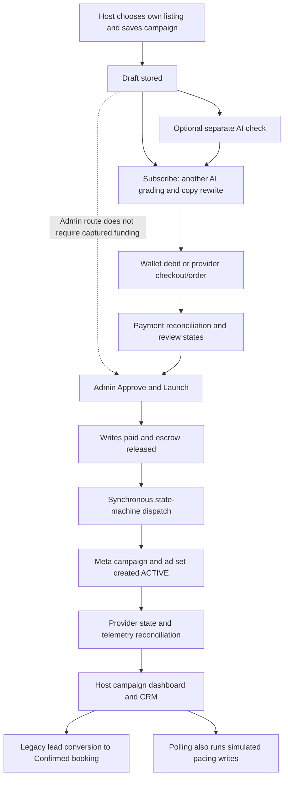

# HARVO — Host dashboard and paid campaign funnel audit

13 September 2026 · Boardroom discussion 007 · Local source snapshot · Documentation only

## Verdict and evidence standard

**The inspected paid marketing system is not ready to accept real advertising budgets. My current production-readiness rating is 2/10.** There is substantial architecture to preserve, but several critical paths manufacture successful payment, delivery or performance states. This is a correctness and trust problem before it is a stress-testing problem.

This rating is an engineering judgment about the inspected local implementation, not a business valuation, code-completion percentage or measured uptime score. It does not assert that deployed customers have been charged incorrectly. No deployed source match, production database, ad account or captured payment was inspected.

The review traced selected critical paths across HostDashboard, HostMarketing, the campaign control center, admin approval, server campaign/payment/publishing handlers, reporting, telemetry, DCO and related tests. It **does not complete a semantic review of every line of the entire project or every UI branch**. See [coverage](REVIEW_COVERAGE.md), [findings](FINDINGS.md), [validation](VALIDATION.md) and the [offline reproduction](PAID_FUNNEL_PROBE.json). The initial cross-project structural inventory is separate evidence.

Rating rubric: 0 = absent; 1–2 = critical correctness failures; 3–4 = substantial but unsafe/inconsistent; 5–6 = coherent partial implementation without adequate integration proof; 7–8 = independently verified staging behavior; 9–10 = demonstrated production operation and recovery. A critical money/trust failure caps the overall score; averaging attractive features cannot cancel it.

| Area | Current rating | Basis |
|---|---:|---|
| Host campaign creation and product coverage | 5/10 | Ownership/schema checks and substantial builder exist; complexity, draft/readiness wording and checkout inconsistencies remain. |
| AI quality and optimization assurance | 2/10 | Real model calls exist, but successful fallback scores, text-only media evaluation and unsupported recommendations undermine assurance. |
| Admin approval boundary | 2/10 | Role check, row lock, hash and audit exist; approval also manufactures paid/released state. |
| Campaign funding and budget safety | 1/10 | Wallet path has an undefined reference; currency heuristics, old fee arithmetic and daily-versus-total authorization mismatch remain. |
| Provider publishing and recovery | 3/10 | Durable publish transactions, recovery states and reconciliation exist; active creation and fail-open verification defeat the intended boundary. |
| Host performance transparency | 1/10 | Simulated persisted analytics, fabricated breakdowns/proof, inconsistent units and incomplete attribution. |
| DCO execution integrity | 3/10 | Statistical comparison and action records exist; multiple implementations and local-before-external success semantics remain. |
| Lead-to-booking integrity | 2/10 | CRM and conversion route exist; route inserts a legacy confirmed booking without canonical capture/hold evidence. |
| Performance and operational proof | 2/10 | Some bounded workers/read models exist; query amplification and failed test setup prevent readiness claims. |

The business idea remains plausible. Its profitability is **unproven**. A marketplace taking host money must earn trust through useful bookings and accurate statements, not convincing animations.

## The funnel the source actually implements

The diagram shows reachable source paths, not a trace of a live campaign. Different legacy/canonical states coexist; not every campaign necessarily traverses every branch.

### Host dashboard and campaign builder

[HostDashboard](../../components/HostDashboard.tsx) combines listings, reservations and earnings. The reviewed analytics sum booking rent for confirmed/completed reservations; that is not a reconciled host payout or profit measure. Payment settlement, fees, refunds and service costs need their own labels. Static verification content and incomplete reservation controls should not be presented as operational guarantees.

[HostMarketing.tsx:1298](../../components/HostMarketing.tsx#L1298) checks required fields, runs a preflight and saves a draft. [server.ts:6117](../../server.ts#L6117) validates the request with a schema and checks listing ownership: useful protections worth preserving. The server stores `draft` regardless of the UI's `draft_saved` request. The UI can announce that all safety gates passed and dispatch is ready while funding/admin prerequisites still belong to later steps. Draft readiness, approval eligibility and launch readiness should be distinct.

The current builder exposes a large operational surface, including provider diagnostics and tracking configuration. The host's primary decisions should be the property, available stay dates, objective, approved content, maximum total charge and optional audience preferences. Provider tokens, account configuration and transport diagnostics belong in restricted operations views. This is a proposal, not an authorized UI change.

### AI analysis and optimization

There are **multiple AI paths**, not one immutable evaluation:

- A separate `ai-check` endpoint calls Gemini, returns scores/checks and can reject low scores. It has a route limiter and ownership checks.
- `subscribe` performs another grading call and may rewrite campaign title/copy as a side effect of starting payment.
- The control-center advisor contains deterministic recommendations and default location/creative assumptions; its text is not evidence that a model or Meta made that decision.
- DCO has statistical routines separate from Gemini and separate server-side selection logic.

In [server.ts:7168](../../server.ts#L7168), the gatekeeper's prompt supplies text and a media count, not the actual image/video content. The listing query does not select the image aliases subsequently used to choose its A/B assets. That handler cannot substantiate its advertised visual quality analysis. A score of 8/10 is also not proof of provider policy compliance or immunity from account restrictions.

The default evaluation is 8.6 and passed. The subscription path starts at 10 when AI is unavailable and uses 8 after an exception, allowing human-review progression without representing an unsuccessful AI execution honestly. Human review is a reasonable fallback; a fabricated successful AI score is not. See H-013/H-040.

Approval hashing and edit invalidation are useful. However, the current hash in [server.ts:8410](../../server.ts#L8410) omits fields such as structured target locations, audience interests and destination URL. The exact payload consumed by each provider must be bound to the reviewed revision. Rewriting copy during funding further complicates which version the host/admin approved.

**Proposed AI contract:** separate deterministic eligibility/policy checks, actual media inspection, advisory creative suggestions and statistically justified optimization. Persist input revision, model/prompt version, execution outcome and structured evidence. An unavailable model is `REVIEW_REQUIRED`, never a passing score. Host/admin approval applies to the final content revision; subsequent material changes require re-review.

### Funding and the approved cost-plus direction

Your decision is preserved: **C = the defined complete campaign cost base; p = admin-selected profit markup on costs; target profit = C × p; charge = C × (1 + p).** The initial intended range is 3–5%. At C = ₹10,000 and p = 5%, target profit is ₹500 and charge ₹10,500. Separate Flex booking commission remains 15%, with approved Growth exceptions unchanged.

Current application code has **not** adopted this direction. [server.ts:11955](../../server.ts#L11955) still splits the supplied amount 15%/85%; financial cards repeat it. This is not merely an admin percentage field change. The budget's meaning, tax/cost specification, wallet reservation, provider media ceiling, invoice, refund/reconciliation and historical contract version must agree.

Additional source defects:

- The wallet branch reads a balance before its transaction, uses a fixed 83.5 FX heuristic and decides which conversion to apply based on the available balance. The amount's currency must never depend on how much money the host has.
- [server.ts:12136](../../server.ts#L12136) references `txRes.rows[0].id` although `txRes` is not defined in that handler. If the preceding ledger operation succeeds, this reference throws and the transaction attempts rollback. This is not a concurrency-only problem.
- Funding amount is selected from the request or campaign fallback, rather than exclusively from a versioned authoritative quote.
- The Razorpay branch returns an order ID with `pending_webhook`. The reviewed campaign checkout handler treats a successful response without `checkoutUrl` as payment success; it does not launch Razorpay checkout for that returned campaign order. A separate wallet-refuel Razorpay flow exists, so this is not a claim that Razorpay is absent throughout the app.
- Some idempotency keys change with a ten-second time bucket, rather than remaining stable for the user's one purchase intent.

The selected local double-entry tests from the earlier review do not prove currency isolation, sufficient-funds invariants or concurrent PostgreSQL behavior. Correct atomic conditional debits and transactional constraints matter; simply naming an isolation level does not establish safety.

**Business challenge:** lowering the fee improves host economics but does not repair a losing campaign. In the earlier illustration, assuming the same ₹10,000 complete ad costs, ₹20,000 booking revenue, ₹3,000 commission and ₹8,000 fulfillment costs, a 5% advertising markup still leaves the host at **−₹1,500**. This is illustrative arithmetic, not a forecast or tax calculation. Cheap acquisition management is useful only if acquisition produces valuable bookings.

Cost-plus also creates an incentive problem: more recognized spend produces more Encho markup. Host-approved ceilings, transparent eligible costs and results-based recommendations must counter that incentive. Do not promise company-level net profit when shared operating expenses are not fully measured or allocated.

### Admin final confirmation

The approval route has genuine safeguards: admin role verification, `FOR UPDATE`, an idempotency record, approval snapshot/hash, state transition and transactional audit entry.

However, [server.ts:12815](../../server.ts#L12815) writes `payment_status='paid'`, `escrow_status='released'`, an immediate release time and `subscription_active=true`. It does not require captured payment/ledger evidence before doing so. The state-machine path for admin approval bypasses the ordinary delayed escrow path. **A human accepting ad copy cannot establish that a bank/payment provider received money.**

Approval then awaits provider dispatch inside the HTTP request. State-machine errors can be swallowed while the response still says the campaign was dispatched live. [AdminDashboard.tsx:662](../../components/AdminDashboard.tsx#L662) repeats this assertion and can optimistically display `active`.

**Proposed admin experience:** one dossier containing the exact creative preview, destination and available dates, AI evidence, policy exceptions, quote revision, captured funding/reservation and risk-release state. Separate content approval, finance/risk clearance and external activation. Every override needs actor, reason and bounded permission. An admin may resolve an exception; they may not manufacture payment evidence or bypass the host's budget ceiling.

### Meta publication, spending ceiling and delivery state

[server.ts:9610](../../server.ts#L9610) contains real publish-transaction machinery: leases, remote IDs, unknown-outcome states, name/ID recovery, traces and recovery checks. Related control/reconciliation services contain useful external hierarchy verification. The architecture is not empty.

But the actual dispatch path creates an `OUTCOME_AWARENESS` campaign and a `REACH`-optimized ad set as **ACTIVE**. It puts the entire authorized media amount into `daily_budget`, without a lifetime/end-time boundary in that payload. Its check that this daily amount does not exceed the total authorization does not protect the total over multiple days. The preview calculates daily budget differently, and another preview describes a traffic objective. [server.ts:9867](../../server.ts#L9867), [server.ts:9886](../../server.ts#L9886), [server.ts:9927](../../server.ts#L9927).

Meta's official SDK exposes distinct daily/lifetime budget and scheduling fields; those are not interchangeable concepts. Current provider/account-specific constraints still require staging validation. [Meta AdSet SDK](https://github.com/facebook/facebook-python-business-sdk/blob/main/facebook_business/adobjects/adset.py).

The final verification defaults to `ACTIVE`. A failed/missing verification response can still produce a current `external_status_verified_at`, successful publication and active child records copied from the campaign's status. Configured active, provider review, effective delivery and observed spend are different facts. The branch also contradicts the Constitution's paused-creation/separate-activation policy. This needs correction even if another worker might reconcile it later.

Retries/recovery are present, but a timeout after a remote create is not proof that nothing was created. Reclaiming an expired lease without a checked ownership epoch can allow stale workers to write. Some creation requests retry before resolving unknown external outcomes. These are source risks requiring crash/replay tests, not evidence that duplicate live billing actually occurred.

The destination fallback uses a legacy `/listings/:id` URL and even a fallback listing ID. The canonical guest route is `/stay/:slug`; the correct production domain and paid destination need explicit verification. This review does not claim every legacy route necessarily returns 404. The objective must also match the offer: cheap reach is not a booking optimization strategy.

### Transparency: the largest trust failure

**The campaign GET path writes simulated analytics.** [server.ts:4954](../../server.ts#L4954) defines `syncCampaignSpend`; [server.ts:5268](../../server.ts#L5268) invokes it when the host fetches campaigns. For eligible active/subscribed rows it calculates ₹0.12/second of spend, 1.5 impressions/second, a sine-derived CTR and estimated conversions, and saves the results in campaign columns. No provider response is needed. No environment guard was found in that function/call path.

An offline execution of the extracted function, with a synthetic active campaign and ten elapsed minutes, produced **₹72 spend, 900 impressions and 20 clicks**, and attempted an SQL update containing those values. All SQL was captured by an in-process stub; no database or ad provider was contacted. See [reproduction output](PAID_FUNNEL_PROBE.json) and [diagnostic source](probe_paid_funnel.mjs). This proves the calculation/write intent, not a production financial debit. Variant snapshots may override some displayed totals, but the simulated legacy columns are still mutated and used as a fallback.

The control-center projection further derives supposed breakdowns without provider breakdown data:

| Display | Source behavior |
|---|---|
| Geography | First location receives 55%; others split 45%; invented location labels if absent. |
| Placements | Reels 45%, Instagram feed/explore 35%, Facebook 20%. |
| Age and gender | Fixed age shares and fixed gender percentages. |
| Devices | iOS 58%, Android 36%, desktop/tablet 6%. |
| Audience affinity | Starts at 95 and decreases by index; fixed high-intent/active labels. |
| Booking funnel | Listing views = clicks; bookings/revenue = zero; provider conversions represented as direct leads. |
| Price sync | Always synchronized, with ₹3,500 fallback when listing price is absent. |
| Authenticity proof | Invented IDs if missing; a string prefixed `SHA256` with no hash verification; always `data_integrity_verified=true`. |

These builders feed host/admin projections and rendered components; they are not confined to a test fixture. [campaignControlCenterService.ts:927](../../src/lib/campaignControlCenterService.ts#L927), [HostMetaProofBadge.tsx:29](../../components/HostMetaProofBadge.tsx#L29). The badge promises cryptographic synchronization with both Meta and Google although the builder constructs a Meta-labelled string. **A string saying “SHA256” is not cryptographic proof.** Even a real checksum of Encho's own payload would not independently prove that Meta reported it.

Further metric defects:

- Canonical CTR is `clicks/impressions`; the performance card appends `%` without multiplying by 100. A ratio of 0.10 can be displayed as 0.10% instead of 10%.
- Generic provider clicks are labelled link clicks. Reach is replaced with impressions in some paths, although they measure different things.
- The variant sync initializes zero metrics, ignores request failures and then persists the zero snapshot as a new fetch. This can erase previous observed totals and make a failed fetch look fresh.
- The manual telemetry route passes `(id, body, viewer, pool)` to a method accepting `(id, options, dbClient)`. Its third argument becomes an object without `query`; the reviewed path fails before a real sync. Fixing the signature alone must not expose client-supplied `forcedInsights` or optional caller-controlled authorization.
- No explicit `profile_visits` metric lineage was found in the inspected host/service/server searches. That is missing implementation evidence, not a claim that every provider/account universally forbids the metric.
- The control center passes an empty array to its direct-inquiries feed (`HostCampaignControlCenter.tsx:447`), so that particular panel is not connected to real inquiries; other HostMarketing CRM views exist.

Sources: [CTR calculation](../../src/lib/campaignControlCenterService.ts#L301), [CTR rendering](../../components/HostCampaignPerformanceCard.tsx#L167), [variant fetch/write](../../src/lib/metaTelemetrySyncEngine.ts#L330), [telemetry route](../../server.ts#L12929).

### What “100% transparent” should mean

Promise **complete disclosure of the data Encho has received, with source and age**, not instantaneous knowledge of every internal provider change. A dashboard polling every 15 seconds cannot make upstream reporting immediate. Separate operational events, periodic performance snapshots and later financial corrections.

| Metric | Proposed authoritative meaning | If missing/late |
|---|---|---|
| Impressions | Provider count for an explicit campaign/date window | Show unavailable/stale, not generated growth. |
| Reach | Provider unique reach at the chosen aggregation level | Never replace with impressions or sum overlapping audiences. |
| Clicks / outbound clicks | Clearly distinguish the selected provider field | Do not label all clicks as site visits. |
| CTR | Explicit click numerator ÷ impressions × 100 | Display the formula's units consistently. |
| Profile visits | Supported account/field with documented scope | Show unsupported/unavailable; do not infer from clicks. |
| Landing views | First-party observed page event with documented deduplication/consent | Not equal to ad clicks. |
| Guest leads | Deduplicated CRM inquiries with campaign lineage | Separate native leads, messages and booking intent. |
| Bookings | Canonical booking/payment state; separate captured, canceled and fulfilled | Do not treat an inquiry or purchase action as a fulfilled stay. |
| Spend | Provider reported media spend, currency, reporting window and correction history | Label provisional data and preserve last successful observation. |
| Host return | Attributed fulfilled booking contribution after defined expenses/fees | Unknown until necessary data exists; no invented ROAS. |

Meta's official Insights model defines distinct click/link/outbound fields; the field contract should be deliberate. This supports the distinction, not a promise that every field is available for every account or objective. [Meta Insights SDK](https://github.com/facebook/facebook-python-business-sdk/blob/main/facebook_business/adobjects/adsinsights.py).

Every metric record should carry provider account/object IDs, currency, window/time zone, attribution definition, fetched-at time, last successful observation and availability/error state. Host access must be limited to their mapped campaigns: using a master account must never reveal another host's leads or balances.

### DCO and AI-powered recommendations

The dedicated [DCO engine](../../src/lib/dcoEngine.ts) includes useful sample, age, freshness and statistical comparison checks. The server has a separate evaluator with different thresholds and CPC/CPL/CPA selection. These are meaningful building blocks, but one decision authority is not yet evident.

The scheduled path calls `DcoEngine.processCampaignDco`. That method inserts loser-pause actions as `PENDING`, marks local variants `PRUNED` and campaign `WINNER_OPTIMIZED` before external action confirmation. The inspected reconciliation worker selects `REQUESTED`/`EXTERNAL_OUTCOME_UNKNOWN`, not `PENDING`. Separate external mutation machinery exists; its existence does not prove this scheduled path reaches it. The exported 80/20 rebalancing helper updates local statuses and returns weights without making a provider budget mutation in that function. [dcoEngine.ts:540](../../src/lib/dcoEngine.ts#L540), [server.ts:11341](../../server.ts#L11341), [server.ts:19562](../../server.ts#L19562).

The legacy no-variant fallback picks the first media URL as winner. Neither choosing the first photo nor displaying a calculated weight proves delivery optimization.

**Proposed decision order:** validate telemetry → establish adequate sample/freshness → choose the agreed business objective → record recommendation and bounded authorization → request remote change → verify external result → label optimized. Preserve a no-winner outcome. Optimizing for cheap clicks alone can select an attractive image that attracts guests who never book.

### Leads, guest conversion and operations

CRM ownership checks and notifications exist, but the earlier webhook review found event identity/routing inconsistencies (H-031), and notification helpers did not establish actual delivery (H-014).

[server.ts:8058](../../server.ts#L8058) checks campaign ownership, then creates a legacy `Confirmed` booking using host-supplied amount/details. It does not use the canonical inventory hold/captured-payment booking authority in that handler. Host assistance should produce a secure booking invitation; the guest's inventory/payment flow should create the confirmed stay. This extends H-010 rather than authorizing a new booking architecture in Phase 1.

The operational queue should prioritize funds at risk, provider rejections, unknown external outcomes, stale metrics, pending refunds and unresponded inquiries. Fast human response is useful only if notifications actually arrive and the host can complete the booking flow.

### Performance and security reality

HostMarketing polls the campaign list every 15 seconds; the open control center separately polls every 20 seconds. The list returns up to 200 campaigns and calls the detailed truth builder per campaign. That builder performs a primary query plus up to 14 subsidiary queries, including unbounded event/action/wallet histories. This can approach **3,000 reads per list refresh**, before pacing writes and other refreshes. Concurrency of five bounds parallel work; it does not remove the work. This is a source-derived query estimate, not a measured latency or load result.

Proposed read architecture: paginated campaign summaries from a bounded projection; detailed history on demand; provider sync owned by workers; UI updates only for changed data; visibility-aware polling or authenticated event delivery. GET requests must not fabricate financial/performance progression.

Previously documented identity, privileged endpoint and socket isolation findings remain release blockers (H-001–H-006). This review also encountered a provider-token-shaped literal fallback in a DCO worker. Its validity is unknown; the value is deliberately not reproduced in HARVO. Restrict configuration to secured provider credentials and review exposure/rotation before release. No credential was used.

## Production direction to debate — not an implementation authorization

Preserve the master-account convenience, rich property media, immutable records, canonical inventory work and useful statistical/reconciliation services. Replace conflicting authority and unsupported claims before expanding channels or visual features.

The proposed lifecycle is:

**Draft revision → AI completed/review required → admin approves exact revision → verified funds reserved and risk cleared → durable publish request → provider entities created paused → provider policy/readiness checked → authorized activation → externally verified state → observed delivery → reconciliation → pause/close/refund according to approved policy.**

Content, finance, provider operation and telemetry need separate state axes. A content approval must not mutate captured payment. A provider request success must not claim delivery. A fetched timestamp must not imply fresh underlying provider data. A local DCO recommendation must not imply applied optimization.

Suggested priorities within a future authorized plan:

| Workstream | Required exit evidence |
|---|---|
| Truth and containment | Remove/gate simulated production reporting; no synthetic proof or successful fallback labels; all host/admin consumers use one defined metric contract. |
| Money and authorization | Versioned cost-plus quote; correct currency/minor units; verified captured funding; atomic reservation; separate total media ceiling; refunds/corrections and markup reconcile. |
| Approval and provider execution | Exact revision binding; paused creation; durable intent/outbox; fenced worker ownership; unknown-outcome recovery; activation verified without fail-open defaults. |
| Telemetry and optimization | Real provider-shaped fixtures, missing-data preservation, corrected CTR/lead/reach semantics, reconciled DCO action lifecycle and outcome-based recommendations. |
| Conversion and operations | Canonical booking handoff, real alerts, available-date/price checks, restricted tenant access, actionable admin exception queue. |
| Production proof | Real isolated PostgreSQL concurrency/crash tests; provider test-account contract tests; negative browser journeys; measured load, recovery and reconciliation evidence. |

No phase switch, numbered execution milestone or deployment is approved by this table. Existing legal/provider gates remain in force.

Useful failure scenarios for later acceptance: duplicate approval/payment webhooks; two concurrent wallet spends; provider creates an entity but response is lost; worker resumes after lease loss; admin edits target/copy after approval; insights call fails for one variant; delayed provider spend correction; campaign reaches its total authorization; property becomes unavailable for advertised dates; guest abandons or payment fails; host A requests host B's campaign through HTTP or sockets. Verify durable outcomes, not only mocked return values.

Proposed product ideas for a controlled pilot:

- **Host outcome statement:** media cost, eligible expenses, Encho markup, inquiries, captured/fulfilled bookings and contribution, with clear attribution limits.
- **One-click pause and a visible total ceiling:** host control is more valuable than a refuel prompt.
- **Explainable optimization journal:** observed evidence, recommendation, expected benefit as an estimate, actual action and verification.
- **Advertise available dates:** campaign/landing alignment around inventory the host wants to sell, with truthful stale-price handling.
- **Admin exception queue:** concentrate scarce operating time on uncertain publication, fraud exposure and unresolved funds.
- **Small destination/cohort pilot:** prove usable supply, guest checkout and host contribution before broad acquisition. Exact cohort and risk caps require founder/provider readiness inputs.

None of these makes success automatic. The most important business question is whether a host willingly buys a second campaign after seeing the complete, honest result of the first.

## Validation observed for this increment

Five selected paid-funnel suites: **44 collected, 22 passed, 22 skipped; three suites failed during setup**. Reactor: 13 passed. Host transparency: 9 passed, but eight are `expect(true).toBe(true)` and the ninth checks a locally constructed object. Canonical truth, host control center and DCO setup fail because mock tables lack `title`/`host_id`. Those are setup failures, not 22 observed behavior failures.

The offline source extraction reproduced simulated pacing/write intent, fixed breakdowns, invented proof and fallback synchronized pricing. Its database is an in-process stub; it establishes none of the transaction/provider guarantees needed for launch.

No production code, schema, provider object, price contract or milestone status was changed. Findings remain open. No live spend, payment or external notification was initiated. No new build was necessary for these documentation/diagnostic additions; the earlier local build result remains separately recorded with its limitations.
