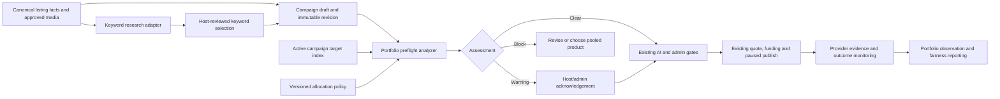

# Encho Marketing Engine Strategic Implementation Report — Search Portfolio and Validated RFC Upgrades

**Date:** 21 September 2026
**Status:** Integrated product direction and SP0–SP7 execution approved by HARVO-031. Detailed contracts and acceptance remain evidence-bound; see the SP0/SP1 blueprint.
**Controlling context:** `docs/ENCHO_ENGINEERING_CONSTITUTION.md`, `HARVO.md`, `docs/harvo/DECISIONS.md`, `docs/implementation/HARVO_MARKETING_EXECUTION_PLAN.md`
**Related review:** HARVO-030 / Discussion 028
**Historical marketing completion:** 5/10 milestones locally verified; production readiness remains blocked

## 1. Executive recommendation

Encho should implement a **Search Portfolio Governance layer** around its existing campaign workflow. The layer will help hosts research keywords, detect overlapping Encho demand before funding, expose understandable allocation consequences, and preserve a fair, auditable commercial contract across many independently owned properties.

This report is also the explicit disposition and implementation crosswalk for `docs/harvo/MARKETING_ENGINE_STRATEGIC_RFC.md`. That RFC was **not rejected wholesale**. Its valid product directions are retained below in revised, evidence-bound form. Unsupported ratings, guarantees, hard-coded targeting assumptions, fictional gallery semantics and policy-sensitive audience controls are not allowed to become architecture merely because they appear in the RFC.

It must not create extra Google Ads accounts to force multiple Encho advertisements into the same auction. It must not manufacture unique property features, divide cities into arbitrary host monopolies, silently redirect one host's budget to another property, or treat historical Keyword Planner estimates as live performance guarantees.

The recommended build has five product capabilities:

1. Provider-backed keyword research with explicit source and freshness.
2. Deterministic campaign overlap analysis before approval and funding.
3. Two explicit commercial modes: property-specific acquisition and opt-in pooled destination acquisition.
4. Canonical multi-asset creative compiled only from approved listing facts and media.
5. Portfolio monitoring that explains eligibility, overlap, provider selection evidence and outcomes without exposing one host's strategy to another.

This work does not replace the existing ledger, immutable campaign revisions, funding reservation, provider-operation claims, approval gates, reconciliation quarantine, inventory safety or settlement controls. It composes with them.

## 2. Why the plan is sequenced behind current release closure

The current repository release gate remains red with 46 failing historical files. Provider status translation, Meta observation diagnostics, pause failure classification, recovery readiness, CI artifact controls and the inventory benchmark still require closure under HARVO-029. The new portfolio feature must not be merged into a release process that cannot yet prove its own authoritative green state.

The order is therefore:

1. Close or explicitly disposition the HARVO-029 release blockers.
2. Establish Search Portfolio contracts and threat model.
3. Add read-only keyword research.
4. Add shadow-mode conflict assessment.
5. Expose admin evidence and host explanations.
6. Introduce policy enforcement only after measured pilot evidence.
7. Add multi-asset provider compilation as a separately gated capability.

## 3. Current implementation baseline

### 3.1 Capabilities already present

- One versioned campaign workflow with immutable revisions and append-only events.
- Host/listing ownership enforcement and approved-media validation.
- Exact and phrase Google Search keywords.
- Provider-resolved Google geo-target and language resources.
- `PRESENCE` and `PRESENCE_OR_INTEREST` Google location modes.
- Google Search-only network settings; Search partners and Display are disabled.
- One configured Google serving customer distinct from its MCC.
- Paused provider creation, explicit activation, operation fingerprints and uncertain-outcome quarantine.
- Country-level Meta targeting from an operator allowlist.
- One approved Meta image or video derivative per current campaign version.
- AI copy guidance with source grounding, rate limiting and human review.
- Inventory-aware safety and immutable financial authorization.

### 3.2 Capabilities absent from the inspected path

- Google Keyword Planner adapter.
- Indexed portfolio overlap detection.
- Versioned portfolio allocation policy.
- Negative-keyword governance.
- Search-term routing/fairness observation.
- Google sitelink or image-asset compilation.
- Meta carousel compilation.
- Explicit pooled destination-demand product.
- Host-facing explanation of internal campaign overlap.

### 3.3 Important correction to the motivating incident

Google documents that eligible keywords targeting the same domain within one account do not bid against each other. Google selects one candidate under its prioritization and Ad Rank rules. Encho's current single-serving-customer design therefore does not create the claimed internal bid war.

The actual defects are commercial and operational:

- Encho does not know before funding that two campaigns substantially overlap.
- Encho cannot explain which campaign Google selected and why.
- Host budgets and learning can be fragmented across similar campaign structures.
- One property may receive most eligible traffic without an Encho fairness contract.
- Generic destination demand may be sold as if it were dedicated property demand.

## 4. Product model

### 4.1 Mode A — Property-specific acquisition

This is a dedicated host-funded campaign whose target intent can be justified by the property's canonical facts.

Examples:

- The verified property name.
- Verified room or accommodation type.
- Verified amenity or spatial feature.
- Verified location and stay type.
- A combination of verified differentiators with a destination.

The final URL remains the property's canonical `/stay/{slug}` page. Another host's campaign does not inherit or consume its funds. Conflicts may produce warnings or require revision where Encho cannot honestly describe the demand as property-specific.

### 4.2 Mode B — Pooled destination acquisition

This is an opt-in marketplace product for generic destination intent such as “luxury villas in Wayanad.”

Required properties:

- Explicit host consent to the pooled product and its allocation policy.
- A destination collection or search landing page that truthfully contains the eligible properties.
- A defined allocation policy based on eligibility and disclosed marketplace rules.
- Separate accounting for pooled contributions and actual provider spend.
- No implied promise that a particular query exclusively belongs to one host.
- Inventory changes may alter eligibility but never rewrite historic allocation evidence.

This mode requires a separate founder-approved commercial decision before implementation. The engineering design must not infer it from the current dedicated-campaign contract.

## 5. Proposed architecture



### 5.1 `KeywordResearchPort`

Purpose: obtain provider-backed keyword ideas and historical metrics without granting publication or spending authority.

Proposed request contract:

```ts
interface KeywordResearchRequest {
  hostId: number;
  listingId: number;
  listingRevisionHash: string;
  seed: {
    canonicalListingUrl?: string;
    keywords?: string[];
  };
  geoTargetConstants: string[];
  languageConstant: string;
  network: 'GOOGLE_SEARCH';
  includeAdultKeywords: false;
}
```

Proposed result contract:

```ts
interface KeywordResearchIdea {
  text: string;
  normalizedText: string;
  averageMonthlySearches: number | null;
  monthlySearchVolumes: Array<{ year: number; month: number; searches: number }>;
  competition: 'LOW' | 'MEDIUM' | 'HIGH' | 'UNKNOWN';
  competitionIndex: number | null;
  lowTopOfPageBidMicros: string | null;
  highTopOfPageBidMicros: string | null;
  metricsMonth: string;
  source: 'GOOGLE_KEYWORD_PLAN_IDEA';
  observedAt: string;
}
```

Controls:

- Only the configured Google serving customer is usable.
- URL seeds are limited to Encho's configured canonical origin and an owned, published listing.
- No arbitrary URL fetch or host-controlled redirect is allowed.
- At least one valid keyword or canonical listing URL seed is required.
- Results are bounded by count and response size.
- Provider errors remain typed; empty results are not manufactured into success.
- One shared distributed quota enforces Google's one-request-per-second-per-customer limit across every web and worker instance.
- Identical request fingerprints coalesce to one provider call.
- Historical results are cached because Google refreshes the data monthly.
- Host and administrator UI always display source month and observation time.
- Keyword research never creates, modifies or activates an advertisement.

### 5.2 `CanonicalMarketingFactProjection`

Purpose: provide the only admissible property facts for AI theme suggestions, creative copy and asset captions.

Inputs:

- Published listing title, description, city and canonical slug.
- Host-defined rooms and their supplied descriptions.
- Structured amenities actually stored for the listing.
- Approved media with stable source identity and host/admin-approved captions or categories.
- Current revision and listing hash.

Explicit exclusions:

- UI component labels.
- Image array position.
- Generic luxury templates.
- Historical default images.
- AI-inferred facilities not explicitly verified.
- Removed `b2cdb50` gallery fiction.

Every generated suggestion must carry fact evidence IDs. Editing the listing or selected media invalidates stale suggestions and assessments through the existing revision/hash model.

### 5.3 `SearchIntentNormalizer`

Purpose: make overlap analysis deterministic while retaining the exact provider keyword.

Normalization may include:

- Unicode normalization.
- Locale-aware case folding.
- Whitespace and punctuation normalization.
- Safe singular/plural or provider-close-variant grouping only where explicitly versioned.
- Destination and property-fact token extraction.
- Exact preservation of original text and match type.

Normalization must not silently rewrite the keyword submitted to Google. It produces an internal comparison key and evidence version. AI embeddings may later assist discovery, but they cannot be the sole source of a financial or publication block.

### 5.4 `SearchPortfolioConflictAnalyzer`

Purpose: assess a candidate campaign revision before approval and funding.

Assessment dimensions:

- Same configured serving customer.
- Normalized intent overlap.
- Exact/phrase match relationship.
- Provider geo-resource intersection.
- Language intersection.
- Campaign flight-window intersection.
- Property location and canonical differentiator evidence.
- Commercial mode.
- Inventory eligibility for an explicitly selected stay window.
- Existing campaign state and fresh provider truth.

Proposed outcomes:

```ts
type PortfolioAssessmentStatus =
  | 'CLEAR'
  | 'INFORMATIONAL_OVERLAP'
  | 'HOST_ACKNOWLEDGEMENT_REQUIRED'
  | 'ADMIN_REVIEW_REQUIRED'
  | 'POOLED_PRODUCT_REQUIRED'
  | 'BLOCKED_INVALID_FACTS'
  | 'EVIDENCE_UNAVAILABLE';
```

The assessment result is immutable and revision-bound. It records the analyzer version, policy version, input fingerprint, public host explanation, restricted administrator evidence, and assessment time.

The first rollout runs in shadow mode and cannot block publication. Hard blocking requires measured false-positive/false-negative evidence and a later approved policy version.

### 5.5 `SearchAllocationPolicy`

Purpose: separate deterministic engineering checks from founder-approved commercial rules.

The policy is versioned, immutable after activation and contains:

- Supported commercial modes.
- Overlap thresholds.
- Required acknowledgements.
- Admin escalation conditions.
- Eligibility inputs.
- Whether a generic intent is reserved for a pooled product.
- Explanation templates.
- Activation and retirement timestamps.
- Author, reviewer and reason.

Policy changes require dual administrator control. They cannot mutate existing funded campaign revisions. A new policy can require a new campaign revision and fresh host/admin review.

### 5.6 Provider compilers

The existing provider plan builders remain the mutation boundary.

Google additions considered later:

- Explicit negative keywords approved in the same revision.
- Sitelink assets with truthful, stable final URLs.
- Image assets derived from approved immutable media.
- Asset and campaign-asset readback.
- Policy/primary-status observation for each attached asset.

Meta additions considered later:

- A bounded carousel manifest.
- Two to four approved cards with stable source asset IDs.
- Host-approved card copy and destinations.
- Aspect-ratio-specific immutable derivatives.
- Complete fingerprint coverage of order, copy, image hashes and landing URLs.
- Readback of campaign, ad set, creative, ad and card/asset status.

Provider compilers do not consume gallery UI state. They consume approved campaign revision data and immutable creative manifests.

## 6. Proposed data model

Exact names and migration numbers remain subject to Phase 2 schema review. The following responsibilities are recommended.

### 6.1 Keyword research requests

`marketing_keyword_research_requests`

- UUID primary key.
- Host, listing and listing-hash binding.
- Configured provider and serving-account binding.
- Provider API version.
- Request fingerprint.
- Seed kind and redacted/hashed seed evidence.
- Exact geo/language/network inputs.
- State: `PENDING`, `SUCCEEDED`, `NO_RESULTS`, `FAILED`, `RATE_LIMITED`.
- Metrics month, observed time and expiration.
- Safe provider request ID and typed error class.
- Unique request fingerprint for coalescing.

`marketing_keyword_research_ideas`

- Parent request ID.
- Original and normalized text.
- Historical metrics as nullable values.
- Provider source and metrics month.
- Stable ordinal.
- No mutable host approval fields.

### 6.2 Campaign search targets

`marketing_campaign_search_targets`

- Campaign, host, listing and revision.
- Original and normalized keyword.
- Match type.
- Source: `HOST`, `PROVIDER_IDEA`, `AI_GROUNDED`.
- Fact-evidence hash where applicable.
- Commercial mode.
- Immutable after the campaign revision is accepted.

`marketing_campaign_search_scopes`

- Campaign and revision.
- Geo target resource.
- Language resource.
- Geo mode.
- Start/end date.
- Provider/customer binding.

Separate scope rows provide indexable intersections without expanding opaque JSON on every portfolio check.

### 6.3 Conflict assessments

`marketing_search_conflict_assessments`

- UUID primary key.
- Campaign/revision/host/listing.
- Analyzer and policy versions.
- Input fingerprint.
- Assessment status.
- Restricted evidence JSON with conflicting internal campaign IDs.
- Public explanation JSON without another host's identity or strategy.
- Created-by actor and created time.
- Immutable receipt trigger.

`marketing_search_conflict_acknowledgements`

- Assessment ID and exact fingerprint.
- Host/admin actor.
- Acknowledgement type, note and time.
- Append-only; cannot rewrite the assessment.

### 6.4 Pooled membership

Mode B product direction is approved by HARVO-031; detailed allocation/accounting contracts remain to be finalized:

`marketing_destination_pools`

- Destination scope and canonical landing page.
- Policy version.
- State and bounded active period.
- Provider/customer binding.

`marketing_destination_pool_memberships`

- Pool, host, listing and campaign revision.
- Explicit consent evidence.
- Contribution ceiling and finance references.
- Eligibility status and reason.
- Effective period.

No pooled table may directly debit a host wallet. Existing quote/capture/reservation services remain the only financial authority.

## 7. API proposal

### 7.1 Host APIs

`POST /api/marketing/v2/targeting/google/keyword-ideas`

- Authenticated host only.
- Verifies listing ownership/publication.
- Uses canonical URL or bounded keyword seeds.
- Returns historical ideas with source/freshness.
- Does not persist campaign edits automatically.

`POST /api/marketing/v2/campaigns/:id/portfolio-assessment`

- Requires exact current revision.
- Idempotent by input fingerprint.
- Returns host-safe status and explanations.
- Conflicting host/property identities remain hidden.

`POST /api/marketing/v2/campaigns/:id/portfolio-acknowledgements`

- Binds exact assessment fingerprint and revision.
- Cannot acknowledge invalid facts or unavailable mandatory evidence.

### 7.2 Admin APIs

`GET /api/marketing/v2/admin/search-portfolio`

- Aggregated overlap groups, assessment status, freshness and campaign states.
- No raw tokens or unbounded provider payloads.

`GET /api/marketing/v2/admin/campaigns/:id/portfolio-evidence`

- Persisted-admin authorization.
- Restricted conflict evidence and policy version.

`POST /api/marketing/v2/admin/campaigns/:id/portfolio-review`

- Exact revision and assessment fingerprint.
- Approve, require revision or require pooled mode.
- Meaningful note and immutable audit event.

Policy-management endpoints are deferred until a dual-control policy service is designed. Editing an environment JSON blob is not an acceptable long-term policy-management interface.

## 8. Host experience

### 8.1 Keyword research panel

The campaign studio will show:

- **Selected search phrases** with match type and remove action.
- **Suggested search phrases** with monthly source period, search range evidence, competition label and bid-range context.
- A clear statement that metrics are historical estimates, not forecasts or guarantees.
- Evidence chips such as “From your listing title,” “Verified amenity,” or “Google suggestion.”
- No raw Google customer IDs or API terminology.

Suggestions never enter the draft until the host selects them. AI-created suggestions require canonical fact evidence and remain visually distinct from provider suggestions.

### 8.2 Portfolio preflight

Before submission/funding, hosts see one of:

- “No material overlap detected in Encho's current campaign portfolio.”
- “Similar Encho campaigns may be eligible for some of the same searches. Google will select one eligible campaign for an auction.”
- “These phrases describe the destination broadly. Choose property-specific phrases or review the pooled destination option.”
- “Portfolio evidence is temporarily unavailable. Funding cannot proceed where policy requires this check.”

The host never sees another host's name, exact keywords, budget or campaign performance.

### 8.3 Post-launch monitoring

The single-pane dashboard should eventually distinguish:

- Eligible provider hierarchy.
- Provider review and delivery evidence.
- Report freshness.
- Search impression/click/spend outcomes.
- Portfolio overlap status.
- Candidate/routing evidence when Google exposes it through supported reporting.
- Canonical Encho leads and attributed bookings.
- Inventory safety state.
- Remaining authorized media allocation versus delayed reported spend.

No visual state may claim live serving based only on configured `ACTIVE`, a historical impression, or an Encho portfolio assessment.

## 9. Administrator experience

The operations workspace will add a Search Portfolio view with:

- Conflict clusters grouped by normalized intent and exact provider scope.
- Campaign/provider state, reporting age and assessment version.
- Dedicated versus pooled commercial mode.
- Canonical listing-fact evidence.
- Host acknowledgement and admin review status.
- Aggregate allocation outcomes without exposing sensitive data to hosts.
- Safe filters for destination, flight period and conflict severity.

Administrator actions remain evidence-bound. There is no “move traffic,” “release keyword lock,” “reset to approved,” or “switch account” shortcut.

## 10. Security and privacy requirements

### 10.1 Tenant isolation

- Force RLS on every new tenant-bearing table.
- Host reads are bound to `host_id` plus owned listing/campaign revision.
- Cross-host conflict details are restricted to persisted administrators and service actors.
- Host-facing projections contain only aggregate overlap classifications.
- PostgreSQL tests use non-superuser, non-BYPASSRLS roles.

### 10.2 Provider and network safety

- Only the configured provider API version and serving customer are valid.
- Keyword research accepts no credentials from callers.
- Canonical URL seeds must pass the existing public-origin and listing ownership checks.
- Redirects are disabled or bounded to the same trusted origin.
- Response byte, page, item and deadline limits are mandatory.
- Provider request IDs may be retained for administrators; secrets and raw authorization headers are never stored.

### 10.3 Abuse prevention

- Shared distributed quota per serving customer.
- Per-host and per-listing request budgets.
- Request coalescing by canonical fingerprint.
- Maximum keyword/seed/location counts.
- Unicode/control-character and payload-shape validation.
- Audit events for research, selection, assessment and acknowledgement.
- No prompt-supplied instructions can override canonical facts or provider constraints.

### 10.4 Financial integrity

- Keyword research and conflict analysis are read-only.
- A portfolio result cannot create a quote, capture funds, mutate a reservation or adjust provider budget.
- Commercial mode becomes part of the immutable campaign revision and semantic provider fingerprint.
- Switching modes after quote or funding requires a new revision and fresh financial/content review.
- Inventory ineligibility pauses or excludes the affected campaign; it never transfers funds to another host.

## 11. Observability

Metrics:

- Keyword-research request rate, cache-hit ratio, coalescing ratio and provider latency.
- Quota/rate-limit, timeout and provider rejection counts by safe error class.
- Assessment counts by status and policy version.
- Conflict false-positive/false-negative review outcomes.
- Percentage of campaigns entering funding without a current required assessment.
- Dedicated versus pooled campaign performance, separately reported.
- Provider candidate/serving observations where officially available.
- Cross-host fairness indicators defined by the commercial policy, never improvised in UI code.

Logs:

- Correlation ID, actor role, request fingerprint, API version and safe provider request ID.
- No OAuth tokens, raw provider responses, full listing descriptions or another host's strategy.
- Structured error class and first failing operation.
- Bounded retention and explicit redaction tests.

Alerts:

- Repeated quota exhaustion.
- Assessment unavailable during a mandatory gate.
- Policy-version mismatch.
- Campaign published with stale/missing required assessment.
- Cross-account/provider-identity mismatch.
- Pooled allocation without active membership/consent.

## 12. Test strategy

### 12.1 Pure contract tests

- Keyword normalization with case, punctuation, Unicode and control characters.
- Exact/phrase overlap matrix.
- Geo/language/date intersections.
- Dedicated versus pooled policy outcomes.
- Canonical fact citations and stale-listing invalidation.
- Host-safe redaction of restricted conflicts.

### 12.2 Provider HTTP contract tests

- Google v25 `GenerateKeywordIdeas` request shape.
- Historical metric nullability and monthly freshness.
- Pagination and bounded result handling.
- 429/`RESOURCE_EXHAUSTED`, authentication, malformed body, timeout and oversized response.
- No automatic mutation or retry that can create spend.
- Google asset and Meta carousel fixtures only when those milestones begin.

### 12.3 PostgreSQL tests

- RLS isolation across two hosts, administrator and service actors.
- Immutable assessment receipts and acknowledgements.
- Concurrent identical research requests produce one provider claim.
- Concurrent assessment of competing revisions remains deterministic.
- Policy activation/review constraints.
- Dump/restore preserves assessments, policy versions and idempotency.
- Migration applies and rollback disables feature behavior without deleting evidence.

### 12.4 API tests

- Ownership, revision and role enforcement.
- Idempotency and stale-assessment rejection.
- Host-safe versus admin evidence projection.
- Rate-limit behavior across sessions and instances.
- No financial or provider mutation from research/preflight endpoints.

### 12.5 UI and accessibility tests

- Keyboard, screen reader and reduced-motion behavior.
- Desktop and mobile keyword selection.
- Historical-data and unavailable-evidence copy.
- Conflict explanations without raw provider IDs or cross-host leakage.
- Admin filters and evidence drawer.
- Stale revision during selection/acknowledgement.

### 12.6 Performance and chaos tests

- Portfolio query latency at expected multi-host scale.
- Indexed overlap queries under concurrent campaign creation.
- Distributed rate limiter under multiple web/worker processes.
- Provider outage and partial response.
- Database failover between claim and result persistence.
- Cache loss without exceeding provider quota.

## 13. Milestone plan

### SP0 — Release prerequisite closure

Deliverables:

- Resolve/disposition the 46-file red gate.
- Complete HARVO-029 provider/recovery/readiness/CI benchmark corrections.
- Establish authoritative green promotion requirements.

Exit criteria:

- Whole-repository required suite green or every excluded historical suite has a founder-approved owner, reason and expiry without weakening current acceptance.
- No production promotion bypasses required checks.

### SP1 — Contracts and threat model

Deliverables:

- Final dedicated-versus-pooled business definitions.
- Threat model and privacy classification.
- Keyword research and assessment TypeScript contracts.
- Versioned policy semantics.
- ADR and migration impact analysis.

Exit criteria:

- Founder accepts the commercial distinction.
- Security review accepts tenant-safe projections.
- No unresolved authority conflict with the existing workflow/ledger.

### SP2 — Read-only keyword research

Deliverables:

- Google v25 transport method.
- Distributed one-QPS limit and request coalescing.
- Durable bounded cache.
- Host endpoint and source/freshness UI.

Exit criteria:

- No provider mutation path.
- Concurrency, quota, RLS, API and browser tests pass.
- Historical metrics are never labeled real-time or guaranteed.

### SP3 — Shadow portfolio assessment

Deliverables:

- Normalized target index.
- Analyzer and immutable assessment receipt.
- Admin-only evidence view.
- Shadow metrics with no blocking authority.

Exit criteria:

- Measured assessment quality on representative fixtures.
- Query latency and tenant isolation meet accepted thresholds.
- No publication/funding behavior changes.

### SP4 — Host preflight and acknowledgement

Deliverables:

- Host-safe explanation panel.
- Revision-bound acknowledgement.
- Admin escalation workflow.
- Existing submission/quote gates integrate current required assessment.

Exit criteria:

- Stale evidence fails closed where mandatory.
- No other-host information leaks.
- Financial/provider fingerprints include the accepted portfolio mode and assessment.

### SP5 — Pooled product foundation, commercial direction approved in HARVO-031

Deliverables:

- Destination pool and membership contracts.
- Canonical collection landing experience across guest, host and admin boundaries.
- Explicit contribution/allocation accounting design.
- Inventory eligibility and disclosure rules.

Exit criteria:

- Commercial, legal/privacy and finance decisions approved.
- No hidden transfer of dedicated funds.
- Independent accounting and fairness review completed.

### SP6 — Canonical multi-asset creative

Deliverables:

- Revision-bound creative manifest.
- Meta carousel compiler and preview.
- Google sitelink/image-asset compiler.
- Full provider hierarchy/status/readback.

Exit criteria:

- Every claim maps to canonical evidence.
- Provider policy acceptance and actual configured storage/CDN evidence.
- Unknown outcomes remain quarantined without duplicate asset creation.

### SP7 — Portfolio observation and bounded pilot

Deliverables:

- Search portfolio observation metrics.
- Dedicated/pooled outcome reporting.
- Runbook, alerts, kill switches and rollback drill.
- Bounded pilot with named properties, approved budget and provider/legal clearance.

Exit criteria:

- Reconciled provider spend and canonical outcomes.
- Host/admin explanations match observed behavior.
- No policy warnings or unexplained tenant allocation.
- Founder reviews expansion evidence; scale-up is a separate decision.

## 14. Feature flags and rollout

Recommended independent flags:

- `keywordResearchEnabled`
- `portfolioShadowAssessmentEnabled`
- `portfolioHostWarningsEnabled`
- `portfolioBlockingEnabled`
- `destinationPoolsEnabled`
- `metaCarouselPublishingEnabled`
- `googleSearchAssetsEnabled`

Rollout order:

1. Local/provider fixtures only.
2. Staging research with provider quota monitoring.
3. Shadow overlap analysis for administrators.
4. Host informational warnings.
5. Required acknowledgements for approved policy cases.
6. Hard blocks only after shadow evidence and founder approval.
7. Separate bounded creative and pooled-product pilots.

Disabling a flag stops new behavior but retains evidence. Rollback never deletes assessment, approval, financial or provider-operation history.

## 15. Rollback strategy

- Keyword research can be disabled independently; existing explicit keyword entry remains.
- Shadow assessment can stop without changing funded campaigns.
- Host warnings can be removed while retaining immutable receipts.
- Blocking policy rollback activates a new policy version; it never rewrites prior decisions.
- Provider asset publishing flags stop new asset creation while existing campaigns remain managed through their exact provider identities.
- Any ambiguous provider mutation remains in reconciliation quarantine.
- Database rollback is forward-safe: stop callers and retain new evidence tables. Do not drop audited history in production.

## 16. Explicit non-goals

- Creating one ad account per host to manipulate auction participation.
- Guaranteeing impressions, CPC, leads, bookings or ROAS.
- Inferring wealth from PIN codes or devices.
- Giving hosts hidden exclusive territories.
- Automatically moving host budget between properties.
- Publishing AI-created amenities or spatial claims.
- Replacing provider algorithms with an Encho bidding engine.
- Treating Keyword Planner data as live telemetry.
- Activating campaigns before existing finance, risk, content, inventory and provider gates.
- Clearing M4–M6, M9 or M10 through source implementation alone.

## 17. Decisions required before Phase 2

The founder must decide:

1. Whether Encho offers only property-specific acquisition or also an opt-in pooled destination product.
2. Whether material overlap is initially informational, acknowledgement-based or blocking after the shadow period.
3. Which canonical listing facts may generate keyword suggestions.
4. Whether Google asset extensions and Meta carousel work belong in the same delivery track or separate milestones.
5. Which administrators may activate portfolio policies and whether dual control is mandatory. Engineering recommends dual control.

HARVO-031 approves both product modes, the integrated asset track and implementation. The remaining policy thresholds, admissible-fact boundaries and policy activation roles are detailed in `docs/implementation/SEARCH_PORTFOLIO_SP0_SP1_BLUEPRINT.md`; they are not silent authorization to block hosts or redistribute funds. The preceding five-item list is retained as the original decision agenda.

## 18. Definition of done

This initiative is complete only when:

- Current release prerequisites are closed.
- Provider research and mutation contracts are version-bound.
- Tenant isolation passes real PostgreSQL tests.
- Historical metrics display honest source/freshness.
- Overlap assessments are deterministic, revision-bound and auditable.
- Hosts understand overlap without seeing another host's confidential strategy.
- Admins can review evidence without unsafe reset/reallocation controls.
- Dedicated and pooled funds cannot cross without explicit authority.
- Canonical facts and immutable assets are the only creative source.
- Provider operations retain idempotency and unknown-outcome containment.
- Browser/accessibility, concurrency, restore, load and chaos checks pass.
- Required CI prevents red promotion.
- Production migrations/grants/readiness are verified.
- A bounded live pilot reconciles provider spend, delivery and canonical Encho outcomes.
- Provider, legal/privacy, accounting and founder acceptance are recorded separately.

No numerical “10/10” claim is permitted before these evidentiary gates are satisfied.

## 19. Disposition of `MARKETING_ENGINE_STRATEGIC_RFC.md`

The original RFC is preserved as a proposal and historical input. It is not the controlling implementation specification because several passages mix valid product direction with unsupported business claims, obsolete source assumptions and provider-policy guesses. The following disposition prevents useful ideas from being lost while preventing unsafe assertions from entering contracts.

| RFC proposal | Disposition | Production interpretation | Delivery home |
|---|---|---|---|
| Walled-garden host marketing from the Encho dashboard | **Accepted** | Hosts create, fund and monitor campaigns in Encho without provider credentials or provider-console dependency. | Existing marketing workflow plus SP4/SP7 host monitoring |
| Canonical property landing URL `/stay/{slug}` | **Accepted** | Every property-specific ad resolves to the configured Encho origin and one canonical published listing. | Existing provider compiler invariant |
| “4.5/10” baseline and “bulletproof” finance | **Rejected as evidence** | Ratings and absolutes are not acceptance criteria. Ledger guarantees remain limited to proven tests, database constraints and operational evidence. | SP0 release closure and existing finance acceptance records |
| Country-only Meta targeting is too coarse | **Accepted problem** | Current V2 Meta publication only compiles enabled country codes. More precise targeting may improve fit, but must be introduced through typed provider capabilities and experiments. | RFC-T1 below |
| One lead image/video underuses approved media | **Accepted problem** | Current V2 Meta publication emits one approved image or video. Multi-asset creative is useful when every card is revision-bound and truthful. | SP6 |
| Hard-coded `b2cdb50` gallery collections as marketing facts | **Rejected** | UI layout, array position and invented room/amenity labels cannot become advertising truth. | `CanonicalMarketingFactProjection` and SP6 |
| AI quality gate at score 8 | **Accepted with existing fail-closed semantics** | Score below 8 rejects; unavailable/ambiguous AI requires documented human review. AI never establishes factual truth or provider approval. | Existing campaign AI reviewer; SP1 evidence contract |
| Fixed ₹7,500 ADR eligibility floor | **Rejected as a universal rule** | Campaign economics require property, margin, channel and conversion evidence. A configurable unit-economics warning may be researched; no fixed profitability guarantee is permitted. | RFC-E1 below |
| Feeder-market targeting | **Accepted as an experiment** | Suggest candidate feeder markets from consented, measured evidence. The host/admin must see the source, freshness and reason. No city is assumed optimal. | RFC-T1 |
| Interactive city/radius map | **Accepted in revised form** | UI selects provider-resolved, policy-valid geo targets. It does not submit arbitrary coordinates or silently transform host intent. | RFC-T1 |
| Automatic local exclusion | **Deferred** | Local demand can be valid. Any exclusion must be explicit, measurable, reversible and property-specific. | RFC-T1 experiment policy |
| Housing special-category and fixed 25 km rule | **Rejected as a standing assumption** | Encho must resolve the correct category and current restrictions for the actual ad use case/API version. Do not hard-code a category merely from this RFC. | Provider-policy review before RFC-T1 publication |
| Named wealth interests and hard-coded provider audience IDs | **Rejected** | IDs and availability change, and wealth-proxy targeting raises policy, fairness and privacy risks. No hard-coded IDs enter the domain contract. | No implementation planned |
| iOS-only “premium” targeting | **Rejected as a default product control** | Device-price stereotypes are not a defensible targeting rule. A later provider capability would require a measured use case and policy/privacy review. | No implementation planned |
| Explicit Feed/Stories/Reels placements | **Already partially implemented** | V2 has an operator allowlist for Facebook/Instagram feed and reels, with media/identity validation. Host-facing controls remain bounded by operator policy. | Existing compiler; SP6 expands assets, not policy authority |
| Meta carousel | **Accepted in revised form** | Build cards from immutable approved campaign manifests and canonical listing facts, with preview/readback. | SP6 |
| Long-weekend and holiday schedule presets | **Accepted as UX convenience** | Presets populate editable, timezone-explicit dates. They do not claim superior performance and never bypass bounded schedule validation. | RFC-X1 below |
| Standard UTM parameters containing campaign/card IDs | **Accepted only after redesign** | Use opaque, signed attribution references or server-issued click/session identifiers. Do not expose sequential internal IDs or accept client-authored attribution authority. | RFC-M1 below |
| First-party booking attribution | **Accepted** | Join consented first-party sessions, inquiries and canonical bookings to immutable campaign/ad/asset identities with clear attribution windows and provenance. | RFC-M1 |
| Meta CAPI/Purchase optimization | **Accepted as a verification track** | The current compiler already uses `OUTCOME_SALES`, `OFFSITE_CONVERSIONS`, a configured pixel and `PURCHASE`; production work must prove consent, event deduplication, provider receipt and booking authority end to end. | RFC-M1 |
| Automatic cross-platform retargeting | **Deferred** | Requires consent, privacy/legal review, purpose limitation, retention, suppression and deletion contracts. It is not implied by attribution. | Separate future decision |
| Guaranteed ROAS/performance-scientist equivalence | **Rejected** | Encho may estimate ranges and report outcomes with freshness; it must not guarantee provider delivery, bookings or profitability. | Explicit non-goal |

### 19.1 What was retained from the RFC

The production plan therefore retains these substantive directions:

1. More precise, provider-resolved audience geography.
2. A truthful multi-asset Meta carousel and Google asset path.
3. Editable flight presets with explicit timezone semantics.
4. First-party attribution from ad interaction through inquiry and booking.
5. Server-side conversion verification after consent and deduplication are proven.
6. Continued fail-closed AI and human review before publication.
7. Strong host/admin monitoring inside Encho.

### 19.2 What was deliberately removed

The production plan removes or withholds:

- Fictional gallery-derived amenities and room labels.
- Fixed profitability and ROAS promises.
- Hard-coded wealth-interest IDs.
- iOS-as-affluence targeting.
- Unproven universal feeder-city or local-exclusion rules.
- An assumed housing classification or radius rule.
- Automatic retargeting without consent and legal authority.
- Raw internal campaign IDs as attribution authority.

## 20. Integrated RFC workstreams

These workstreams supplement SP0–SP7. They do not bypass SP0, reserve migration numbers or authorize provider writes.

### RFC-T1 — Provider-resolved Meta geographic targeting

**Purpose:** move beyond country-only targeting without turning marketing folklore into policy.

Proposed behavior:

- Add a provider capability contract for supported geographic target types.
- Resolve cities, regions or supported radii through the configured Meta API version rather than accepting arbitrary UI payloads.
- Persist provider resource identity, display name, target type, country, resolution timestamp and API version in the campaign revision.
- Keep an operator allowlist and maximum target count.
- Show the host exactly which locations will be sent.
- Default to no silent exclusions.
- Require re-review whenever targeting changes after AI/admin approval.
- Measure outcomes before promoting “feeder market” suggestions.

Required evidence before activation:

- Current provider contract fixtures for each supported target type.
- Policy/legal review of the real property-advertising classification.
- Tenant and revision isolation tests.
- Provider readback proving configured targets match the reviewed revision.
- A rollback that disables precise targeting while preserving country targeting.

### RFC-E1 — Unit-economics preflight

**Purpose:** warn hosts when a campaign is unlikely to be economically sensible without claiming guaranteed returns.

Inputs may include canonical nightly rate and currency, host-selected stay assumptions, Encho commission and approved marketing-fee policy, historical channel ranges with source/freshness, and property-specific conversion evidence when statistically sufficient.

Outputs are ranges and warnings, never provider or booking guarantees. The preflight cannot authorize funding, mutate the quote, or reject a campaign solely because it falls below a hard-coded ADR threshold. Any future hard block needs an approved commercial policy and versioned evidence.

### RFC-X1 — Timezone-safe flight presets

**Purpose:** reduce campaign scheduling friction.

Presets produce editable start/end values in the campaign's declared operating timezone. The server converts and validates them with explicit offsets. Presets are versioned presentation helpers; the stored reviewed revision contains the resulting exact dates and times. “Long weekend” cannot be described as optimal until Encho has measured evidence.

### RFC-M1 — First-party attribution and conversion verification

**Purpose:** let hosts and administrators understand the path from provider delivery to Encho inquiry and canonical booking.

Proposed boundaries:

- Issue an opaque, signed attribution reference per campaign revision and asset/card.
- Bind it to provider, campaign, revision, landing origin and expiry.
- Create a first-party session only after the applicable consent policy allows it.
- Record touchpoints append-only with source, timestamp and evidence version.
- Keep inquiry, booking and payment systems authoritative for their own states.
- Use declared attribution models and windows; never rewrite historical credit silently.
- Deduplicate browser/server conversion events with one stable event identity.
- Send only minimum provider-required data after consent, normalization and approved retention controls.
- Store provider request/receipt evidence without storing secrets in campaign rows or UI payloads.
- Report provider telemetry and Encho conversions as separate metrics with distinct freshness labels.

Before sending live conversion events, this track requires legal/privacy approval, consent enforcement, data minimization, deletion/retention behavior, provider test-event evidence and replay-safe contract tests.

### RFC-C1 — Canonical multi-asset creative

This is implemented by SP6. Its source is the approved campaign manifest, not the old gallery component. Each card or asset carries source media identity and immutable hash, canonical fact citations, approved derivative identity, final URL and opaque attribution reference, revision, reviewer and approval evidence.

### RFC-O1 — Single-pane host and admin operations

This joins SP7 with the existing telemetry/recovery plans. The finished experience distinguishes provider configuration/review, delivery eligibility versus observed delivery, reporting freshness, spend and remaining authorized media budget, first-party inquiries/bookings, asset-level outcomes when supported, and policy/account/billing/reconciliation blockers.

Hosts see plain-language state and actions without provider identifiers. Administrators see correlation IDs, provider evidence, retry classification and audited recovery tools.

## 21. Revised implementation order

The integrated order authorized in HARVO-031 is:

1. **SP0:** close the existing release gate and production-readiness gaps.
2. **SP1:** approve contracts, threat model, canonical facts and policy boundaries.
3. **SP2 + RFC-T1 discovery:** add read-only keyword research and provider geographic capability resolution behind flags.
4. **SP3:** run search-overlap analysis in shadow mode.
5. **RFC-M1 foundation:** establish consented opaque attribution and event deduplication without live provider conversion writes.
6. **SP4 + RFC-E1/RFC-X1:** add host preflight, evidence-based economics guidance and safe schedule presets.
7. **SP5:** build the approved opt-in pooled destination product after its contribution, disclosure, accounting and legal contracts pass their gates.
8. **SP6/RFC-C1:** add canonical multi-asset Meta and Google creative.
9. **RFC-M1 provider verification:** enable conversion API test events only after legal, consent and receipt evidence pass.
10. **SP7/RFC-O1:** run bounded pilots and complete the single-pane host/admin monitoring experience.

The RFC's valid work is therefore present and scheduled. Its unsafe assumptions are explicitly prevented from becoming implementation shortcuts.
