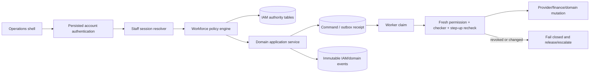
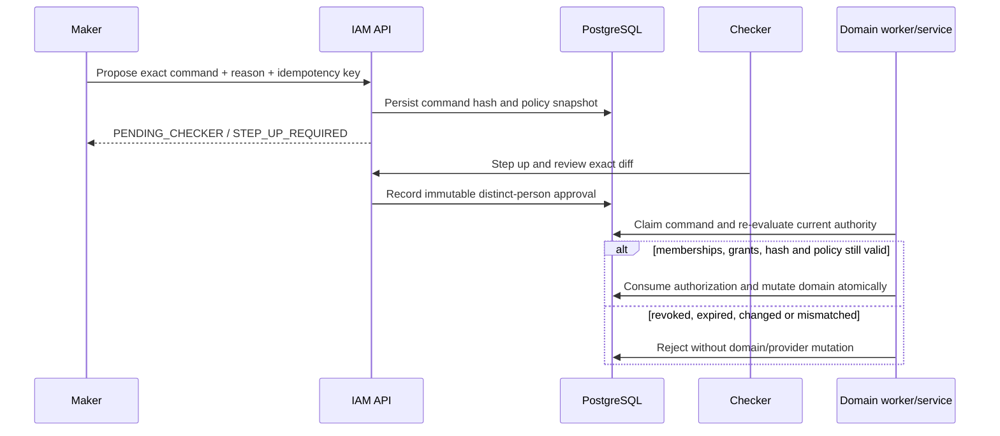

# CR1 Phase P2 — Organization IAM and Operations Shell Technical Design

**Status:** P2 foundation implemented and locally verified; workforce lifecycle/UI and production rollout remain incomplete  
**Track:** Complete Release 1, Phase P2 / Epic E3  
**Date:** 24 September 2026  
**Authority:** Founder CR1 execution directive; `NextO` Phase 2 blueprint; HARVO Discussion 037-H1/L  
**Controlling blueprint:** `docs/blueprints/ENCHO_THREE_SIDED_OPERATING_PLATFORM_BLUEPRINT.md`  
**Implementation dependency:** P1 `PrincipalContext`, command receipt, correlation and transactional outbox primitives  

This document turns the P2 workforce requirement into a database, service, API,
security and rollout contract. Migration 036 and its restricted-runtime readiness
checks are now implemented locally. This does not grant production authority or
settle the open commercial/provider decisions. Section 22 records the exact
verified foundation and the remaining integration boundary.

---

## 1. Decision summary

Encho must retain the existing unified guest/host account and add a separate
internal workforce membership plane. A staff member remains a `users` identity,
but receives operational authority only through an active Encho organization
membership, a current staff session and one or more versioned, scoped role grants.

The implementation uses:

1. **deny-by-default capability authorization**, not UI roles;
2. **organization and resource-scoped grants**, not another value in `users.role`;
3. **database-reloaded authority on every request and queued execution**, not JWT
   permission claims;
4. **single-use action-bound step-up receipts** for critical operations;
5. **object-level maker/checker authorization** for safety-reducing or financially
   material actions;
6. **a fast single-operator safety-pause lane** because requiring a second person
   to stop spend would increase harm;
7. **append-only permission/action evidence** and immediate session revocation;
8. **one permission-aware operations shell** whose navigation is a projection of
   server authority; and
9. **a strangler migration** in which staff never receive the current broad
   `admin` role and existing owner routes remain isolated until replaced.

Migration 036 should create the workforce authority only. It must not also rewrite
marketing, finance, CRM or provider tables. Domain routes integrate with the IAM
policy port in later, focused changes while retaining their current IDs, journals,
provider receipts and audit history.

---

## 2. Verified current state and gaps

The following are verified source findings, not assumptions:

| Finding | Current evidence | P2 consequence |
|---|---|---|
| Persisted user lookup exists | `resolvePersistedSession()` reloads `users.id`, `role` and `email` instead of trusting the JWT role | Preserve the reload principle; staff sessions add selectors, never permission claims |
| Authority is binary | `server.ts` contains many independent `req.user?.role === 'admin'` checks | Staff cannot safely use current admin routes; routes require capability-by-capability migration |
| Admin context is broad | request context sets `bypassRls` for `users.role='admin'`; marketing transactions set `app.marketing_admin` and `app.bypass_rls` for admin/system | P2 staff must never set broad bypass flags; domain RLS must migrate to scoped predicates |
| Marketing actor is too narrow | `Actor` is `host | admin | system`; `requireAdmin()` is a role check | Introduce P1 principal/policy port and a temporary adapter; do not widen `Actor` into an unbounded staff role |
| V2 admin router is all-or-nothing | `createAdtechAdminRouter()` and marketing `admin` middleware check only `actor.role` | Replace each endpoint with an exact permission and resource check |
| Admin UI is monolithic | `AdminDashboard.tsx` contains broad admin functions and many internal workspaces | Add a new shell and deep links; do not rewrite the dashboard in one change |
| Existing RLS is GUC-based | policies use `app.current_user_id`, `app.marketing_admin` and sometimes `app.bypass_rls` | Retain transaction-local actor identity, but treat GUCs as context rather than authentication; the service must reload persisted authority |
| New AdTech tables model strong evidence | migrations 032–035 use advisory locks, FORCE RLS, immutable evidence, hashes and catalog readiness | Reuse those migration/readiness patterns and improve scoped authorization |
| JWTs are not individually revocable | persisted account removal/role changes are observed, but no staff session ID or session row exists | Staff uses short-lived, database-backed sessions with immediate revoke/offboard behavior |
| No workforce lifecycle exists | no organization membership, invitation, assignment, access-review or conflict-of-duty schema was found | Migration 036 supplies the missing canonical authority |

### 2.1 Security gaps P2 must close

- A copied seven-day account token cannot serve as a privileged staff session.
- An email match is not authorization and a Gmail invite is not proof of managed
  workforce identity.
- Hiding a tab or disabled button is not an authorization boundary.
- A queued activation created before suspension must not execute afterward.
- One operator must not prepare and approve the same campaign, publish their own
  strategy release, approve creative they edited, or settle/refund work they
  originated where checker policy applies.
- `system` cannot remain a universal synonym for unrestricted staff authority.
- RLS policies based only on a caller-supplied Boolean such as
  `app.marketing_admin=true` are insufficient for workforce access.

---

## 3. Scope and non-goals

### 3.1 P2 scope

- internal Encho organization and membership lifecycle;
- verified-email invitations and exact acceptance;
- versioned role definitions and SQL-backed permission catalog;
- resource, provider, environment, validity and amount-bounded grants;
- short-lived staff sessions and immediate revocation;
- server policy evaluation and auditable decision receipts;
- step-up challenges and single-use receipts;
- maker/checker action authorization;
- staff work assignment and claim fencing;
- access reviews and offboarding;
- break-glass safety operations;
- role-aware `My Work` operations shell;
- migration of the CR1-sensitive marketing routes from binary admin checks.

### 3.2 Explicit non-goals

- replacing the guest/host authentication model in this phase;
- storing Meta, Google, payment or database credentials in IAM tables or browsers;
- implementing a general customer-facing organization/tenant product;
- giving staff arbitrary SQL, native provider-console or secret-manager access;
- encoding every future HR reporting structure;
- using AI to grant permission, approve an action or resolve a conflict of duty;
- automatic invitation based on an email domain;
- modifying finance/provider evidence to make existing operations look compliant;
- dropping `users.role` before every legacy caller is migrated and observed.

---

## 4. Security invariants

1. **Account identity is not workforce authority.** A valid user token without an
   active staff membership/session receives no staff permission.
2. **The server and database are authoritative.** A token contains selectors
   (`sub`, staff session ID), never an effective permission list.
3. **Authority is fresh.** Membership, session, grant, role release and resource
   assignment are reloaded for every HTTP command and immediately before a worker
   executes a privileged queued command.
4. **Default deny.** Missing, expired, suspended, revoked, unknown or ambiguous
   evidence returns a stable 403/409 and performs no domain mutation.
5. **No broad staff bypass.** Staff requests set `app.current_user_id`,
   `app.organization_id`, `app.membership_id` and `app.staff_session_id`; they do
   not set `app.bypass_rls` or receive a database `BYPASSRLS` role.
6. **One command, one immutable hash.** Checker and step-up receipts bind the exact
   normalized command, resource and revision. A changed command requires new
   authorization.
7. **Revocation wins races.** A worker holding a lease still rechecks authority in
   the same transaction as the protected state transition.
8. **Safety is asymmetric.** `provider.pause` and `incident.pause_global` may run
   with one authorized, stepped-up operator; activation, resume and recovery use
   stricter checker rules.
9. **No self-check.** Maker, checker and reviewer identities must be distinct for
   actions whose catalog policy requires separation.
10. **No deletion of evidence.** Grants are revoked through separate receipts;
    actions, decisions, invitations and events are retained under the approved
    privacy/statutory policy.
11. **No secrets in audit.** Store IDs, hashes, normalized diffs and reason text;
    never tokens, passwords, provider credentials, raw factor data or guest
    message bodies.
12. **RLS is defense in depth.** Every new table enables and forces RLS, revokes
    `PUBLIC`, and is tested through non-owner/non-`BYPASSRLS` app and worker roles.

---

## 5. Target architecture



### 5.1 Principal model

P1 should expose one request-scoped `PrincipalContext`:

```ts
type PrincipalContext = {
  accountId: number;
  actorKind: 'ACCOUNT' | 'STAFF' | 'SERVICE';
  organizationId?: string;
  membershipId?: string;
  sessionId?: string;
  assuranceLevel: 'AAL1' | 'AAL2' | 'PHISHING_RESISTANT';
  authenticatedAt: string;
  correlationId: string;
};
```

Effective permissions are intentionally absent. The policy engine resolves them
from current database state. Host/guest application requests remain `ACCOUNT`.
Workers use registered `SERVICE` identities and operation-specific authorization;
they do not impersonate an administrator.

The standalone contract in `src/shared/iam/contracts.ts` is the proposed shared
schema baseline. Its permission identifiers must match migration 036 exactly; an
IAM readiness check blocks staff routes if code and SQL catalogs drift.

### 5.2 Authorization decision contract

Every decision evaluates:

- principal account, membership and staff session;
- organization status;
- exact permission code;
- exact resource type and canonical internal resource ID;
- role version and active grant;
- scope ancestry resolved by a domain-owned resource resolver;
- environment and provider conditions;
- amount bound where applicable;
- permission catalog risk/checker policy;
- current step-up receipt;
- action authorization and checker decisions;
- immutable command hash; and
- policy snapshot hash.

The result has an opaque decision ID, `allowed`, a stable reason code, policy hash
and evaluation time. Sensitive denials and every allowed mutation emit an audit
event. The client receives no internal role graph or private reason detail.

---

## 6. Migration 036 database design

The final SQL file should be named
`src/migrations/036_internal_organization_iam.sql` after P1 contract names are
settled. It runs in one migration transaction under
`pg_advisory_xact_lock(82749102)` and contains no production user IDs or emails.

### 6.1 Tables

| Table | Core columns | Invariants |
|---|---|---|
| `internal_organizations` | `id uuid`, `organization_key`, `display_name`, `status`, `version`, creator/time | Unique normalized key; `ACTIVE/SUSPENDED`; no hard delete |
| `internal_organization_memberships` | `id uuid`, `organization_id`, `user_id`, `status`, `accepted_at`, `expires_at`, `version`, creator/time | Unique organization/user; `ACTIVE/SUSPENDED/OFFBOARDED`; offboard is terminal; user remains a normal Encho account |
| `internal_organization_invitations` | `id uuid`, org, normalized email, `token_hash`, status, expiry, grant-bundle hash, inviter/reason, acceptance/revocation evidence | Only SHA-256 token digest; one open invitation per org/email; short expiry; accepted account email must be verified and exact |
| `internal_permission_catalog` | `permission_code`, resource type, risk, step-up policy, checker policy, description, active | Migration-owned immutable catalog; identifiers exactly equal the shared TypeScript catalog |
| `internal_role_definitions` | `id uuid`, org, `role_key`, display name, description | Stable role identity; unique org/key |
| `internal_role_versions` | `id uuid`, role, positive version, status, config hash, creator/reason/time | Released versions immutable; a role change creates a new version |
| `internal_role_permissions` | role version, permission code | Immutable released membership; FK to catalog; unique pair |
| `internal_role_current_versions` | role ID, released version ID, expected previous version | CAS pointer; exact role/version FK; no in-place permission editing |
| `internal_invitation_grants` | invitation, role version, scope type/key, provider/environment/amount/expiry conditions | Exact proposed authority is hashed and accepted; no authority broader than invitation |
| `internal_membership_grants` | `id uuid`, membership, role version, scope, bounded conditions, validity, granter/reason/time | Append-only grant; exact current role version; organization consistency trigger |
| `internal_membership_grant_revocations` | grant ID, revoker, reason/time | One immutable revocation per grant; no mutation/deletion of original grant |
| `internal_staff_sessions` | `id uuid`, membership, status, assurance, auth time, expiry, revoked evidence, token/JTI hash | Short-lived; only digest; membership/session must both be active; immediate revoke |
| `internal_step_up_challenges` | `id uuid`, membership, staff session, action hash, required/achieved assurance, status, expiry, provider receipt hash, verified/consumed time | No raw factor secret; action-bound; single-use; expiry after verification |
| `internal_action_authorizations` | `id uuid`, org, permission, resource, command/policy hash, maker, required approvals, status/version/expiry | Exact command; optimistic version; terminal states cannot reopen |
| `internal_action_approvals` | authorization, checker membership, decision, challenge, reason/time | Immutable; checker differs from maker; one decision per checker |
| `internal_work_assignments` | `id uuid`, org, queue key, resource, assignee, state, lease/fence/version, assigner/reason/times | One active assignee per queue/resource; fenced claim; assignment is not permission |
| `internal_access_reviews` | `id uuid`, org, period, status, due time, creator/time | One active review per organization/period |
| `internal_access_review_items` | review, membership/grant, reviewer, decision/reason/time | Reviewer cannot attest their own grant; retain decision evidence |
| `internal_break_glass_events` | `id uuid`, org, requester, scope/action hash, reason, approval/status/expiry, ended/reviewed evidence | Time-bounded; pause/read scope first; recovery/expansion requires a distinct owner |
| `internal_iam_events` | `id uuid`, monotonic sequence, org, actor IDs, event/entity, before/after hashes and bounded JSON, correlation/causation/request hashes, reason/time | Append-only; no secret/message content; immutable trigger |

`internal_membership_grants` replaces a vague generic
`resource_permission_bindings` table. It binds a released role version to a member,
resource scope and explicit conditions in one auditable entity. Roles improve
operator management; permissions remain the enforcement unit.

### 6.2 Required checks and indexes

- UUIDs are application-generated with cryptographically secure randomness.
- `organization_key`, `role_key`, permission and queue keys use bounded lowercase
  identifiers.
- email is `lower(btrim(email))`, max 254 characters, and never used alone as
  authorization.
- token, request, command, policy and config hashes are lowercase 64-character
  SHA-256 hex values.
- `expires_at > created_at/verified_at`; `valid_until > valid_from`.
- `max_amount_minor` is `BIGINT >= 0`; currency policy stays in the finance
  domain rather than IAM.
- organization-scoped grants must have the organization resource ID; narrower
  scopes require a canonical resource key.
- provider conditions use only `META/GOOGLE`; environments use
  `LOCAL/STAGING/PRODUCTION`.
- a partial unique index enforces one open invitation for org/email.
- a partial unique index enforces one active assignment per
  org/queue/resource.
- grant/session/action lookups index membership, status and expiry.
- audit reads index organization and descending sequence/time.
- no evidence table uses `ON DELETE CASCADE` from users/memberships/resources.

### 6.3 Triggers and transition guards

Migration 036 must add small, deterministic trigger functions for:

- immutable permission catalog, released role versions, role permissions,
  grants, revocations, approvals and IAM events;
- membership transition legality (`OFFBOARDED` is terminal);
- invitation transition legality and single acceptance;
- organization consistency across membership, role and grant;
- checker/maker difference;
- step-up single use and action-hash equality;
- action authorization monotonic state transition;
- assignment fence increments and terminal-state preservation; and
- CAS publication of current role versions.

Trigger functions use no dynamic SQL and have their source, security mode and
configuration verified by `iamReadiness` like the existing AdTech catalog check.

### 6.4 RLS design

All migration 036 tables:

```sql
ALTER TABLE ... ENABLE ROW LEVEL SECURITY;
ALTER TABLE ... FORCE ROW LEVEL SECURITY;
REVOKE ALL ON ... FROM PUBLIC;
```

The runtime app/worker database roles remain `NOSUPERUSER NOBYPASSRLS`. Staff
policy must not reuse `app.marketing_admin` or `app.bypass_rls`.

RLS uses four transaction-local selectors populated only after persisted account
and staff-session resolution:

- `app.current_user_id`
- `app.organization_id`
- `app.membership_id`
- `app.staff_session_id`

These values are request context, not authentication. The application must use
parameterized SQL and the policy service must validate their referenced rows.

Because policies need to inspect grants while protecting those same grant tables,
implement one narrow `SECURITY DEFINER` helper such as
`internal_iam_has_permission(...)`. Requirements:

- owner is the migration/security owner, never the app or worker login;
- fixed `search_path = pg_catalog, public` and `row_security = on`;
- explicit SELECT policies for the non-bypass migration owner let these audited
  functions read FORCE-RLS authority without recursion. Two narrowly scoped
  owner UPDATE policies permit action-row locking and atomic factor consumption;
- no dynamic SQL and no generic table/column input;
- validates current user, organization, membership and staff session from the
  GUC selectors;
- reads only the IAM authority tables;
- returns Boolean and discloses no membership/grant data;
- `EXECUTE` revoked from `PUBLIC` and granted only to named runtime roles;
- function owner/security settings, exact policy names/roles, catalog grants,
  critical triggers and source migration checksum included in verification; and
- application service performs the same richer decision and stores the decision
  receipt before a sensitive mutation.

This is a bounded privileged policy helper, not a privileged runtime role. If the
target Neon role cannot safely own/configure it, P2 fails closed; broad
`marketing_admin` is not the fallback.

Policy categories:

| Data | Read | Write |
|---|---|---|
| Own active membership/session | member itself | membership/session service only |
| Organization workforce data | `workforce.member.read` within org | exact `workforce.*` permission and step-up/checker policy |
| Permission catalog/current policy (no staff data) | restricted runtime, including startup readiness | migration/release service only |
| Current role summaries | active org member | migration/release service only |
| Own grants/assignments | member itself | authorized workforce/assignment service |
| Audit/events/access reviews | `audit.read` or exact review participant | append-only service/trigger |
| Privileged actions/approvals | maker/checker plus `audit.read` as scoped | authorization service only |

Read access to a row never implies mutation permission. `internal_work_assignments`
controls queue ownership but never grants the resource capability.

---

## 7. Permission catalog and baseline role templates

### 7.1 Permission groups

The authoritative identifier list is in `src/shared/iam/contracts.ts`. Migration
036 stores, for every code, its resource type, risk class, step-up policy and
checker policy. The initial groups are:

- workforce: member read, invite, grant, suspend, access review;
- work assignment: read, claim, reassign;
- listing: review and publish;
- strategy/corridor: read, draft, publish and rollback;
- creative: read and review;
- campaign: read, prepare and approve;
- provider: read, paused creation, readback, activate, pause, resume and recover;
- finance: read, review, refund and settle;
- service: read, respond, assign and internal note;
- audit: read; and
- incident: read, declare, global pause and recover.

Adding a permission is an additive migration plus shared-contract and readiness
update. An arbitrary string sent by an admin is never a new permission.

### 7.2 Baseline roles

| Role key | Initial authority | Deliberate exclusions |
|---|---|---|
| `platform_owner` | workforce governance, access review, audit, incident declaration/global safety pause | no routine strategy, campaign, provider activation or finance settlement |
| `strategy_architect` | strategy/corridor read and draft | cannot publish own work or operate campaigns |
| `strategy_publisher` | strategy/corridor read and publish/rollback with checker/step-up | cannot draft the release being published |
| `campaign_operator` | assigned campaign read/prepare, creative read, provider read | cannot approve, fund, activate or change released strategy |
| `creative_policy_reviewer` | assigned creative read/review | cannot approve a package they edited or alter campaign finance |
| `campaign_approver` | assigned campaign/creative/strategy read and campaign approval | cannot prepare same revision, settle money or activate provider delivery |
| `provider_operator` | assigned provider read, paused create, readback, pause and bounded recover | activation/resume require separate authorized checker; no charge/strategy editing |
| `finance_risk_reviewer` | finance read/review and assigned refund/settlement proposals | cannot author creative/targeting or activate delivery |
| `incident_commander` | incident read/declare and stepped-up global safety pause | recovery/resume requires checker; no routine editing |
| `support_analyst` | assigned service read/respond/note and sanitized campaign/booking status | no provider mutation, secrets or financial approval |
| `auditor` | immutable scoped audit/read evidence | no mutation permission and cannot combine with a mutation role |

These templates are seed data, not permanent TypeScript business logic. The SQL
role release is versioned. A member may hold compatible grants, but object-level
checker rules still apply.

### 7.3 Initial conflict policy

The only unconditional role-combination prohibition for CR1 is `auditor` plus any
mutation-bearing role. Small-team operators may hold other compatible roles, but
the following same-object actions are prohibited regardless of role combination:

- draft and publish the same strategy/corridor release;
- edit and approve the same creative package version;
- prepare and approve the same campaign revision;
- create paused provider resources and activate/resume the same revision;
- propose and settle/refund the same financial contract where checker policy
  applies;
- create and attest the same high-risk workforce grant;
- request and approve the same break-glass authority; and
- review/retain one's own access grant.

Until a founder-approved monetary threshold exists, **every refund, settlement,
provider activation/resume and high-risk workforce grant uses a distinct checker**.
This conservative default affects staffing speed but avoids inventing a financial
risk threshold.

---

## 8. Maker/checker, step-up and break-glass

### 8.1 Privileged action flow



The authorization does not mean the external provider call succeeded. Provider
operation receipts retain their separate unknown-outcome/reconciliation semantics.

### 8.2 Step-up contract

- A critical action creates a challenge bound to membership, staff session,
  permission, resource and command hash.
- An identity adapter verifies a supported factor and stores only a receipt hash.
- CR1 accepts `AAL2` as the minimum for critical actions. Phishing-resistant
  passkeys are the target; Google OIDC reauthentication can be an interim factor
  only after its exact `auth_time`/MFA evidence is verified.
- Default receipt life is ten minutes and single command use. The value must live
  in a versioned security policy, not a JSX constant.
- A changed request, session, membership, resource revision or policy hash
  invalidates the receipt.
- Recovery codes or support bypasses never create a silent step-up success.

### 8.3 Safety action asymmetry

| Action | Step-up | Checker |
|---|---:|---:|
| Read assigned operational evidence | As session policy requires | No |
| Create provider object in `PAUSED` | AAL2 | Domain approval must already exist; no second provider operator required |
| Pause one campaign | AAL2 for staff | No; safety-increasing |
| Global emergency pause | AAL2 | No; immediate safety action, followed by mandatory review |
| Activate/resume | AAL2 | Yes, distinct from paused-object creator/maker |
| Recover unknown provider write | AAL2 | Yes unless operation can only reduce spend/exposure |
| Publish/rollback strategy | AAL2 | Yes, distinct from relevant drafter |
| Refund/settle | AAL2 | Yes until approved threshold policy says otherwise |
| Grant critical role or break-glass expansion | Phishing-resistant target/AAL2 minimum | Yes |

### 8.4 Break-glass

Break-glass is not a permanent role. Two explicitly bootstrapped Platform Owners
should exist before privileged route cutover. One owner may obtain time-bounded
read and safety-pause authority after step-up and reason entry. Authority that can
increase spend, resume delivery, refund/settle money or expand access requires a
second owner. Every event pages the incident channel, expires automatically and
requires retrospective review. No break-glass flow reveals provider credentials.

---

## 9. Invitation, session and offboarding lifecycle

### 9.1 Invitation

1. `workforce.invite` operator chooses released role versions, scopes, expiry and
   reason.
2. Server generates a 32-byte random token, stores only its SHA-256 digest and
   sends an opaque single-use URL through the configured notification provider.
3. Invitee signs in through an account with a provider-verified email.
4. Server compares exact normalized email and invitation state/expiry.
5. Invitee previews and accepts the exact hashed grant bundle.
6. Membership and append-only grants are created atomically; invitation becomes
   accepted and cannot be reused.
7. High-risk role grants remain inactive until assurance requirements are met.

Proposed CR1 invitation expiry is 24 hours. It is a versioned IAM policy value and
may be shortened. No personal Gmail receives production-critical roles after the
founder-approved managed-identity cutoff.

### 9.2 Staff session

The existing account bearer token authenticates the account. A separate exchange
creates a short-lived staff session only after active membership and identity
assurance are verified. The signed staff token carries `sub` and opaque `sid`;
every request reloads the session/membership. Suggested limits are 30 minutes idle
and eight hours absolute, subject to the P1 session implementation and founder
security policy.

### 9.3 Suspension and offboarding

One transaction:

1. changes membership to `SUSPENDED` or terminal `OFFBOARDED`;
2. revokes active staff sessions and outstanding step-up receipts;
3. revokes/cancels unconsumed action authorizations where that does not erase
   provider/financial evidence;
4. releases or reassigns claimed work with fence increment;
5. prevents queued commands from passing execution recheck; and
6. emits immutable membership, session, assignment and authorization events.

Offboarding never deletes the underlying `users` account or guest/host history.

---

## 10. Service and API design

### 10.1 Backend modules

| Module | Responsibility |
|---|---|
| `src/lib/iam/database.ts` | IAM transaction wrapper; transaction-local selectors; no bypass flag |
| `src/lib/iam/policyEngine.ts` | Resolve current permission, scope, conditions, step-up and checker policy; emit decision receipt |
| `src/lib/iam/principal.ts` | Exchange/resolve staff session from persisted account identity |
| `src/lib/iam/membershipService.ts` | Invite, accept, suspend, offboard and access-review lifecycle |
| `src/lib/iam/roleService.ts` | Versioned role draft/release and grant/revoke operations |
| `src/lib/iam/actionAuthorization.ts` | Maker/checker proposal, decision, consume and policy-change handling |
| `src/lib/iam/stepUpService.ts` | Adapter-neutral action-bound challenge lifecycle |
| `src/lib/iam/assignmentService.ts` | Queue assignment, claim, lease/fence, handoff and completion |
| `src/lib/iam/audit.ts` | Bounded immutable workforce events and redaction |
| `src/server/iam/router.ts` | Strict Zod HTTP contracts, no-store responses and stable errors |
| `src/server/iam/runtime.ts` | Dependency composition and feature gates |
| `src/server/deployment/iamReadiness.ts` | Catalog, RLS, grant, trigger, function and permission-parity proof |

Every mutating API requires `Idempotency-Key`, a meaningful reason and expected
version where state is mutable. P1's shared command receipt owns replay semantics;
P2 does not create a second generic idempotency system.

### 10.2 API surface

All routes are under `/api/internal/v1`, require persisted account authentication,
return `Cache-Control: no-store`, and expose no provider secrets.

| Method and route | Permission / behavior |
|---|---|
| `POST /session` | exchange eligible account identity for a short-lived staff session |
| `DELETE /session/:id` | revoke own session; workforce suspend flow may revoke others |
| `GET /me` | current membership, navigation capabilities and assigned-work counts; not raw role graph |
| `GET /permissions` | active catalog summaries for workforce governance |
| `GET /roles` | released role summaries and versions |
| `POST /roles` | `workforce.grant`; create role draft |
| `POST /roles/:id/releases` | step-up + checker; CAS release |
| `GET /members` | `workforce.member.read` |
| `POST /invitations` | `workforce.invite`; exact bundle, reason, idempotency |
| `POST /invitations/:token/accept` | authenticated exact-email invitee; token rate limited and never logged |
| `POST /invitations/:id/revoke` | inviter or workforce manager; immutable receipt |
| `POST /members/:id/grants` | `workforce.grant`; high-risk grant needs checker |
| `POST /grants/:id/revoke` | `workforce.grant`; safety revocation is immediate |
| `POST /members/:id/suspend` | `workforce.suspend`; revokes sessions/claims atomically |
| `POST /members/:id/offboard` | `workforce.suspend`; terminal and checker-protected for owner membership |
| `GET /work` | `work.assignment.read`; only authorized and scoped resources |
| `POST /work/:id/claim` | `work.assignment.claim`; fenced lease |
| `POST /work/:id/reassign` | `work.assignment.reassign`; reason and expected fence |
| `POST /step-up/challenges` | create action-bound challenge |
| `POST /step-up/challenges/:id/verify` | identity-adapter response; never accepts a client-declared success |
| `POST /actions` | propose exact privileged action |
| `POST /actions/:id/decisions` | distinct checker approval/rejection |
| `GET /access-reviews` | workforce/audit-scoped review list |
| `POST /access-reviews` | create periodic review |
| `POST /access-review-items/:id/attest` | distinct reviewer retain/revoke decision |
| `POST /break-glass` | time-bounded emergency request with paging/audit |
| `GET /audit` | paginated, scoped `audit.read`; no raw secret/PII body |

### 10.3 Stable errors

`STAFF_SESSION_REQUIRED`, `MEMBERSHIP_INACTIVE`, `PERMISSION_DENIED`,
`RESOURCE_OUT_OF_SCOPE`, `ROLE_VERSION_CONFLICT`, `INVITATION_INVALID`,
`INVITATION_EXPIRED`, `INVITATION_IDENTITY_MISMATCH`, `STEP_UP_REQUIRED`,
`STEP_UP_EXPIRED`, `STEP_UP_ACTION_MISMATCH`, `CHECKER_REQUIRED`,
`MAKER_CHECKER_CONFLICT`, `AUTHORIZATION_STALE`, `ASSIGNMENT_CONFLICT` and
`IAM_NOT_READY` are safe client codes. Server logs add correlation/decision IDs,
not token or policy graph content.

---

## 11. Domain integration and strangler order

Staff access is enabled only for routes converted to exact capabilities. A staff
membership never satisfies existing `role === 'admin'` code. Suggested order:

1. **Read-only shell:** `/me`, assigned work, audit-safe summaries and marketing
   workspace reads (`campaign.read`, `provider.read`, `finance.read`).
2. **Creative/listing review:** `creative.review`, `listing.review/publish` with
   exact version/hash and self-edit prohibition.
3. **Campaign preparation/approval:** separate `campaign.prepare` and
   `campaign.approve`; migrate `MarketingWorkflowService.review()` from
   `requireAdmin(actor)` to authorization receipt.
4. **Strategy/corridor:** draft and checker-protected publish/rollback; replace
   `requireAdtechAdmin()` with exact permission checks.
5. **Provider safe lane:** paused creation/readback/pause first; then checker-
   protected activate/resume/recover.
6. **Finance:** read/review before refund/settle; retain independent finance state
   and journal checks.
7. **Incident/workforce:** safety pause and access governance after alerts and
   runbooks pass.
8. **Legacy owner retirement:** remove binary admin access only after caller
   telemetry, route tests and rollback period show no dependency.

At each worker boundary the command stores maker, checker, policy hash and command
hash. The worker resolves the live resource and calls policy evaluation again in
the same transaction that changes local state. Provider calls continue through
existing operation stores and unknown-outcome recovery.

### 11.1 Temporary marketing adapter

Do not change `Actor` to a union of staff job titles. During migration, use an
adapter that converts a permitted staff command to the narrow legacy domain actor
only after a decision receipt is verified. New services take `PrincipalContext`
and `AuthorizationReceipt` directly. Delete the adapter after all CR1 marketing
commands use the policy port.

---

## 12. Operations shell experience

### 12.1 Navigation

The initial shell route is `/admin/operations` with deep links:

- `/my-work`
- `/strategy`
- `/creative-policy`
- `/campaign-flights`
- `/provider-operations`
- `/finance-risk`
- `/service-desk`
- `/incidents`
- `/workforce-audit`

The server returns authorized navigation capabilities; the client does not infer
authority from `user.role`. Direct navigation to an unauthorized desk receives a
403 and a useful explanation, not a hidden blank screen.

### 12.2 `My Work` CR1 requirements

- paginated assigned queue sorted by exposure, SLA/age and safety risk;
- exact resource, owner, current gate, freshness and blocker summary;
- claim/handoff with visible ownership and optimistic fence;
- before/after diff and source evidence for sensitive decisions;
- explicit required permission, step-up and checker state;
- keyboard-first controls, focus return, reduced motion, 200% zoom and 360px
  support;
- no batch approval of critical or heterogeneous commands; and
- no AI-generated mutation. AI may summarize evidence with sources and
  uncertainty.

The existing `AdminDashboard.tsx`, `AdminMarketingWorkspace`,
`AdtechWorkspace`, `SettlementWorkspace` and operations components are embedded
or deep-linked incrementally. They are not copied into new disconnected apps.

---

## 13. Bootstrap and rollout

### 13.1 Safe bootstrap

Migration 036 seeds the Encho organization, permission catalog and released role
templates, but **does not select every `users.role='admin'` row automatically**.
Before deployment, an owner manifest lists exact current user IDs and normalized
verified-email hashes approved for bootstrap. A one-shot operator command runs on
the held migration-owner connection and:

1. verifies the user exists, still has current legacy admin authority and has a
   provider-verified email;
2. creates Platform Owner membership and role grant with reason and manifest hash;
3. records immutable bootstrap events;
4. refuses replay with a different manifest; and
5. prints only IDs/hashes, never email/token data.

At least two owners are recommended before critical-route cutover. If only one
founder identity is available during local implementation, break-glass recovery
cannot be declared production-ready.

### 13.2 Feature flags

- `CR1_WORKFORCE_IAM_ENABLED` — mounts session/membership APIs.
- `CR1_OPERATIONS_SHELL_ENABLED` — exposes the shell to bootstrapped members.
- per-domain flags such as `CR1_IAM_CAMPAIGN_REVIEW` and
  `CR1_IAM_PROVIDER_ACTIVATION` — migrate one route family at a time.

Flags gate adoption, not authorization. A disabled flag never falls back to broad
staff access; only the pre-existing legacy owner can use an unmigrated legacy
route.

### 13.3 Rollout stages

1. disposable PostgreSQL migration/catalog/hostile-role tests;
2. app startup with IAM flags off and previous binary compatibility;
3. explicit local owner bootstrap and staff-session tests;
4. isolated staging with non-owner app/worker logins;
5. read-only shell canary;
6. creative/campaign preparation routes;
7. checker-protected approval and paused provider operations;
8. finance and activation only after domain-specific evidence passes;
9. access review and legacy owner route retirement.

---

## 14. Rollback and recovery

- Migration 036 is additive and has no destructive down migration.
- Rollback disables IAM adoption flags and deploys the prior compatible binary;
  tables/evidence remain.
- Staff accounts are never converted to legacy `admin`, so rollback does not
  accidentally preserve excessive authority.
- A migrated domain route may temporarily revert to the exact bootstrapped
  Platform Owner only; general staff access stays disabled.
- Invitation delivery, step-up provider and operations shell may be disabled
  independently from session revocation and audit reads.
- If role/policy release is faulty, publish a new version/current pointer through
  CAS; never rewrite released history.
- If IAM lookup is unavailable, all privileged mutations fail closed. Safety
  pause has a separately rehearsed owner/SRE runbook and still records evidence.
- Database restore must replay immutable events/command receipts idempotently and
  treat already-submitted provider operations as unknown until reconciled.

---

## 15. Testing and validation

### 15.1 Targeted suites

| Suite | Required evidence |
|---|---|
| `cr1_iam_contracts.test.ts` | strict schemas, known permissions, no permission claims in principal, action-bound receipts |
| `cr1_iam_migration.test.ts` | migration 036 on real disposable PostgreSQL; constraints, indexes, triggers, checksums |
| `cr1_iam_rls.test.ts` | FORCE RLS and hostile non-bypass app/worker roles; self/scoped/foreign rows |
| `cr1_iam_policy_matrix.test.ts` | every permission × baseline role × scope × provider/environment/amount condition |
| `cr1_iam_invitation.test.ts` | token digest, expiry, exact verified email, replay, revocation and no domain inference |
| `cr1_iam_session.test.ts` | stale token, session expiry, suspension/offboard and concurrent revoke/request |
| `cr1_iam_checker.test.ts` | maker cannot check own command; exact hash; multiple checkers; policy/version changes |
| `cr1_iam_step_up.test.ts` | factor failure, expiry, replay, action mismatch, session mismatch and no client-declared success |
| `cr1_iam_assignment.test.ts` | claim fencing, duplicate claim, handoff, revoke-after-claim and worker recheck |
| `cr1_iam_api.test.ts` | strict Zod, idempotency, expected version, no-store, 401/403/409 and redacted errors |
| `cr1_iam_readiness.test.ts` | code/SQL catalog parity, grants, functions, triggers, RLS, non-owner runtime |
| `cr1_iam_operations_shell.test.tsx` | capability navigation, direct-link denial, keyboard/focus/mobile accessibility |

### 15.2 Mandatory adversarial scenarios

- staff changes JWT role/permission payload;
- active account with no membership calls staff route;
- member reads another organization or unassigned private resource;
- suspended member executes a command claimed milliseconds earlier;
- maker uses a second browser session to approve their own command;
- checker approves hash A while worker receives command B;
- role current version changes after approval;
- invitation token leaks into logs/referrer and is replayed;
- invitation email differs by case/Unicode lookalike or is unverified;
- staff attempts to set `app.marketing_admin`/`app.bypass_rls` through an API
  input or SQL-shaped string;
- step-up receipt is replayed for another campaign/action;
- assignment is treated as permission;
- auditor receives a mutation role;
- provider pause waits for a checker during active spend risk;
- break-glass is used to activate/resume or hidden from audit; and
- audit/event deletion or secret insertion is attempted.

### 15.3 Phase-exit validation

At P2 exit run the targeted IAM suites, affected marketing/finance/provider route
contracts, TypeScript, lint, isolated builds and desktop/mobile browser scenarios.
Per the founder testing mandate, the full repository regression sweep is also
required at the P2 milestone exit, with compact output and a saved receipt.

---

## 16. Observability and operations

Metrics:

- authorization allow/deny by permission and safe reason code;
- stale/revoked execution rejections;
- active/suspended/offboarded membership and staff-session counts;
- invitation created/accepted/expired/revoked without email labels;
- step-up success/failure/replay and time to complete;
- pending checker age and self-check rejections;
- assignment queue age, claim conflicts and handoff count;
- break-glass invocation, expiry and retrospective-review completion;
- access-review overdue and excessive-grant findings; and
- legacy-admin route usage during strangler migration.

Alert on repeated critical authorization denial anomalies, suspended-session use,
step-up replay, break-glass, unauthorized catalog drift, failed session revocation,
overdue owner access review and IAM readiness failure. Do not page on ordinary
host/staff 403 mistakes.

Logs use correlation, decision, organization, membership, permission and internal
resource IDs. Email, invitation token, factor material, provider credentials,
guest message content and full IP addresses are excluded; a bounded network
fingerprint may be retained if privacy policy approves it.

---

## 17. Exact impacted files for implementation

### New

- `src/migrations/036_internal_organization_iam.sql`
- `src/shared/iam/contracts.ts` *(created with this design)*
- `src/lib/iam/database.ts`
- `src/lib/iam/principal.ts`
- `src/lib/iam/policyEngine.ts`
- `src/lib/iam/membershipService.ts`
- `src/lib/iam/roleService.ts`
- `src/lib/iam/actionAuthorization.ts`
- `src/lib/iam/stepUpService.ts`
- `src/lib/iam/assignmentService.ts`
- `src/lib/iam/audit.ts`
- `src/server/iam/router.ts`
- `src/server/iam/runtime.ts`
- `src/server/deployment/iamReadiness.ts`
- `scripts/operations/bootstrap-workforce-owner.ts`
- `components/operations/OperationsShell.tsx`
- `components/operations/MyWork.tsx`
- `components/operations/WorkforceAuditDesk.tsx`
- focused `src/test/cr1_iam_*.test.ts` and browser scenarios

### Modified incrementally

- `server.ts` — mount modular router and replace specific binary admin checks;
  do not add IAM domain logic here.
- P1 principal/auth middleware — staff session resolution and transaction context.
- `src/server/deployment/databaseReadiness.ts` — include IAM readiness and tables.
- `src/server/marketing/router.ts` and `adtechRoutes.ts` — exact permission
  middleware per route.
- `src/lib/marketing/domain.ts` — temporary authorization adapter only; preserve
  host/admin/system compatibility while routes migrate.
- `src/lib/marketing/workflow.ts`, AdTech registry/corridor services, provider
  operation authorization, settlement/refund services — accept verified decision
  receipts for their commands.
- `src/server/realtime.ts` — replace `join_admin` with permission-scoped rooms and
  recheck on subscription renewal.
- `components/AuthContext.tsx`, `App.tsx`, `AdminDashboard.tsx` — staff session and
  shell routing; preserve guest/host modes.
- existing Admin Marketing, AdTech, Creative, Settlement and Ops workspaces —
  capability props and assignment context; no duplicated state authority.
- HARVO/Decision/Constitution documents only when migration and route cutovers are
  actually verified.

---

## 18. Risks and mitigations

| Risk | Mitigation |
|---|---|
| IAM complexity locks out operations | flags, read-only canary, two bootstrapped owners, audited safety-pause runbook |
| Generic scope keys permit IDOR | domain resource resolvers verify canonical organization/host/property ownership before policy evaluation |
| Security-definer helper becomes privilege escalation | fixed search path, no dynamic SQL, Boolean-only result, revoke public execute, source/readiness verification, hostile testing |
| Role explosion | stable permission catalog, small released templates, scoped grants and object-level checker policy |
| Staff retains access through old admin routes | never set `users.role=admin`; migrate/flag routes and monitor legacy usage |
| Revoked operator's queued command runs | execution-time recheck inside protected transaction; assignment is never authority |
| Step-up becomes checkbox theater | external factor adapter, action/hash binding, short single-use receipt, no client-declared success |
| Two-person rules block urgent pause | pause/global pause are single-person stepped-up safety actions; resume/recover are stricter |
| Personal Gmail weakens offboarding | temporary invitation only; managed-identity cutoff remains a production decision/gate |
| Audit stores sensitive data | bounded schemas, hashes/IDs, redaction tests and legal retention policy |
| P2 duplicates P1 command/outbox | P2 consumes P1 primitives; it adds only IAM-domain evidence |

---

## 19. Open decisions and safe defaults

| Open decision | Safe CR1 default until decided |
|---|---|
| Exact first owner user IDs | Migration seeds none; explicit bootstrap manifest required |
| Production managed-email cutoff | Critical production grants require verified identity; managed `@encho.co.in` remains go-live gate |
| Spend/risk thresholds | All refund, settlement, activation/resume and critical grants require checker |
| Compatible role combinations | Only Auditor + mutation role is globally forbidden; exact-object self-check rules always enforced |
| Step-up provider/passkey readiness | AAL2 adapter required; no unsupported method is marked verified |
| Invitation/session duration | Proposed invite 24 h; staff session 30 min idle / 8 h absolute; values versioned and reviewed |
| One versus two initial owners | Two required for production checker/break-glass readiness; one may support local development only |
| Platform Owner routine domain work | Excluded by default; separately scoped, expiring grant required |

These defaults minimize authority and financial exposure. They may slow pilot
operations, but changing them materially affects security and must be recorded as
a founder/architecture decision rather than hidden in code.

---

## 20. P2 acceptance criteria

P2 is complete only when all are evidenced:

- [x] migration 036 applies cleanly under the repository advisory lock and exact
      checksum ledger;
- [x] every new table has FORCE RLS, no public grant and least-privilege runtime
      grants proven through actual non-bypass logins;
- [x] TypeScript and SQL permission catalogs match exactly;
- [ ] explicit approved owners are bootstrapped with immutable manifest receipts;
- [ ] staff invitation, acceptance, session, suspension and offboarding pass;
- [ ] one scoped non-admin operator completes an assigned CR1 preparation/review
      task without `users.role='admin'`;
- [ ] another organization/unassigned resource returns 403 at API and RLS layers;
- [ ] revoked-after-claim command cannot execute;
- [ ] maker cannot check their own exact object/action;
- [ ] action-bound step-up expiry/replay/mismatch tests pass;
- [ ] safety pause remains available without checker and emits review evidence;
- [ ] no critical action executes with stale policy, changed hash or unknown result;
- [ ] staff UI supports direct links, keyboard, reduced motion, 200% zoom and 360px;
- [ ] logs/audit contain no invitation, factor, provider or guest secret;
- [ ] route telemetry proves no staff dependence on legacy broad admin endpoints;
- [ ] rollback and two-owner recovery are rehearsed; and
- [ ] targeted tests plus the required P2 full milestone sweep, typecheck, lint and
      build pass with saved receipts.

P2 completion means scoped workforce authority is locally/integratively verified.
It does not certify provider account compliance, legal booking approval, a live
campaign, a commercial pilot or CR1 completion.

---

## 21. Traceability

| Source decision / requirement | Design implementation |
|---|---|
| Discussion 037-H1: scoped delegated staff, not multiple super-admins | Sections 4–7, separate membership plane and baseline roles |
| Boardroom: permissions are verbs over scoped resources | Shared permission catalog, membership grants and policy inputs |
| Boardroom: exact-object maker/checker | Section 8 action authorization and same-object prohibitions |
| Boardroom: step-up, reason, before/after diff, idempotency and audit | Sections 8, 10, 12 and P1 command-receipt dependency |
| Boardroom: staff invitation by email with managed identity target | Section 9 invitation/assurance lifecycle |
| Boardroom: suspension revokes sessions, assignments and provider access | Section 9.3 atomic offboarding and execution recheck |
| Boardroom: one operations shell with specialized desks | Section 12 route/navigation model |
| Blueprint P2: role-aware shell, access reviews and assignments | Migration tables, APIs and shell requirements |
| Blueprint P2: revoked after queue claim must fail | Invariants 3/7, assignment fencing and worker recheck |
| Constitution: strict RLS and immutable audit | Sections 4 and 6.4; real hostile-role acceptance |
| Constitution/blueprint: AI cannot mutate or approve | Non-goals and shell requirements |
| Strangler rule | Section 11 capability-by-capability route migration |
| No speculative rewrite | Existing admin workspaces embedded/deep-linked; no server/dashboard rewrite |


## 22. Verified foundation receipt — 24 September 2026

### Implemented in this slice

- `src/migrations/036_internal_organization_iam.sql`: 21 tables, 42 permission
  codes, 11 initial role templates, immutable evidence, versioned policy, scoped
  grants, maker/checker receipts, staff-session and factor-proof contracts.
- `src/server/deployment/iamReadiness.ts`: exact runtime grant matrix, all-table
  FORCE RLS, no PUBLIC grants, non-owner/non-bypass runtime and function-owner
  checks, fixed function search paths, critical lifecycle/fence triggers,
  immutable-evidence triggers, named policy/role parity and safe seed policy.
- `src/test/harvo/cr1_iam_migration.test.ts`: fresh socket-only local PostgreSQL,
  independently logged-in non-superuser/non-BYPASSRLS migrator and runtime.
- Shared runtime receives SELECT on IAM tables, INSERT only on action requests,
  approvals and IAM events, UPDATE only on action requests and sequence USAGE.
  It cannot create/upgrade its own staff session or factor assurance, change
  policy, create memberships, grant/revoke roles or manage assignments.
- `internal_iam_lock_authority()` obtains transaction-lifetime shared advisory
  fences for current membership and policy. Membership/session/assignment
  changes and grant revocations use matching exclusive fences. A service must
  acquire this fence, reload persisted authority, mutate the domain and append
  audit on the same held transaction/connection.
- Action creation starts PENDING at version 1 and binds the current policy hash.
  Approval/consumption validates current scoped maker/checker authority,
  distinct actors, required approval count, absence of rejection, expiry and
  exact action-bound verified factor evidence. Production approval/consumption
  additionally requires an APPROVED operational policy. Consumption atomically
  consumes factor proofs once. A changed/expired/revoked receipt fails closed.
- Checker insertion locks the action row, serializing late approval/rejection
  against action transitions. Factor proofs bind membership, organization and
  staff-session identity by a composite foreign key; terminal factor evidence
  cannot be revived or have its binding rewritten.
- Correlation/causation columns use the shared bounded trace-ID vocabulary,
  rather than assuming every trace identifier is a UUID.

### Local validation and its limits

The 14-test targeted PostgreSQL suite verifies isolated migration recording and
checksum drift detection, exact restricted-role readiness without a staff
bootstrap, missing/malformed/cross-account identity and legacy-bypass denial, immutable evidence, distinct
checker/hash constraints, blocked self-issued proof, legal state transitions,
action-bound factor consumption, concurrent revocation fencing, pending
production policy denial, runtime-environment separation and the SQL service's
atomic domain/audit commit and rollback. It also exercises critical receipt
consumption through the actual restricted-runtime service adapter.

The fixture records other migration metadata synthetically and executes
036 against a minimal `users` predecessor contract. This is **036 isolation and
compatibility evidence**, not a claim that the entire 001–036 chain or deployed
Neon catalog has been rehearsed. No remote database was used.

### Safe integration contract and remaining P2 work

1. The account authenticator must verify the staff token, token digest, current
   membership/session and assurance before constructing `PrincipalContext`.
   Custom PostgreSQL GUC selectors are trusted server context, not cryptographic
   authentication; arbitrary SQL execution as the runtime principal is not made
   safe merely by setting these selectors.
2. Keep the shared runtime unable to manufacture assurance. Implement a narrow,
   separately credentialed identity/session/factor adapter with audited writes
   and provider-authenticated factor proof before enabling workforce login.
   There is currently no production identity-writer grant helper.
3. A reviewed owner-bootstrap manifest/command remains required. The test fixture
   uses its disposable fixture administrator to seed synthetic staff rows; this
   is not a production bootstrap implementation. The migration does not select
   legacy administrators or grant them workforce permissions.
4. Lifecycle commands (invite/accept, grant/revoke, role release, access review,
   assignment and suspension/offboarding) still need exact command hashing,
   checker/step-up integration, bounded writer interfaces and audit receipts.
   Their tables and policy vocabulary alone do not complete those workflows.
5. The runtime SQL adapter's `check()` is advisory preflight. A protected database
   command must use `runAuthorized()` or an equivalent same-transaction fence,
   recheck, receipt consumption and audit flow. Persist network side effects as
   durable outbox commands; do not hold a transaction across a provider call.
6. Canonical resource/tenant ancestry is resolved by the owning domain. Exact
   target and organization scopes are supported; arbitrary caller-supplied
   parent IDs cannot expand permission. Assignment rechecks stay under the same
   membership fence as the protected command.
7. `verifyIamCatalog().ready` means the catalog/role contract is structurally safe.
   `operationalPolicyApproved` separately reports policy approval. The default
   is false and production commands must remain denied until a reviewed release.
8. No staff APIs, staff operations shell, route cutover, real identity proof,
   full P2 regression/build/browser receipt or production IAM acceptance is
   asserted by this foundation. The remainder of this design remains the target.

## 23. Subsequent bounded P2 integrations — 24 September 2026

Section 22 is the historical foundation receipt. The separately documented
privileged-action, assignment, invitation, owner-bootstrap and member-lifecycle
slices now add bounded commands; their delivery receipts govern what each has
verified. They do not grant production acceptance merely because the tables exist.

Staff sessions now carry an immutable environment. `internal_iam_is_active_session`
requires it to match the server-fixed `app.workforce_environment`; an absent value
defaults to LOCAL, never PRODUCTION. `internal_iam_has_permission` also requires
the requested permission environment to match, and verified factor proofs must
originate in that environment. The authorization, maker/checker, assignment and
member-lifecycle services set this value inside their own transaction from their
constructor configuration. A LOCAL bearer session cannot become production
authority by changing a request body or calling a production service directly.

Organization-wide offboarding is stricter than a single grant mutation. It requires
the production command lane when any unrevoked target grant is production, the
staging lane for staging authority without production, and current operator
membership permissions for every affected lane. The SQL helper consumes exact
approval and revokes the related sessions/factors/assignments atomically. See
`CR1_P2_SESSION_LIFECYCLE_SLICE.md` for the fresh integration contract and limits.
